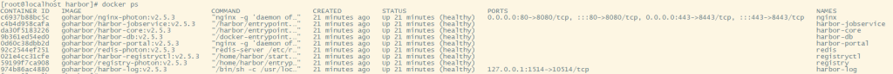
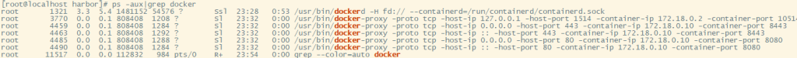
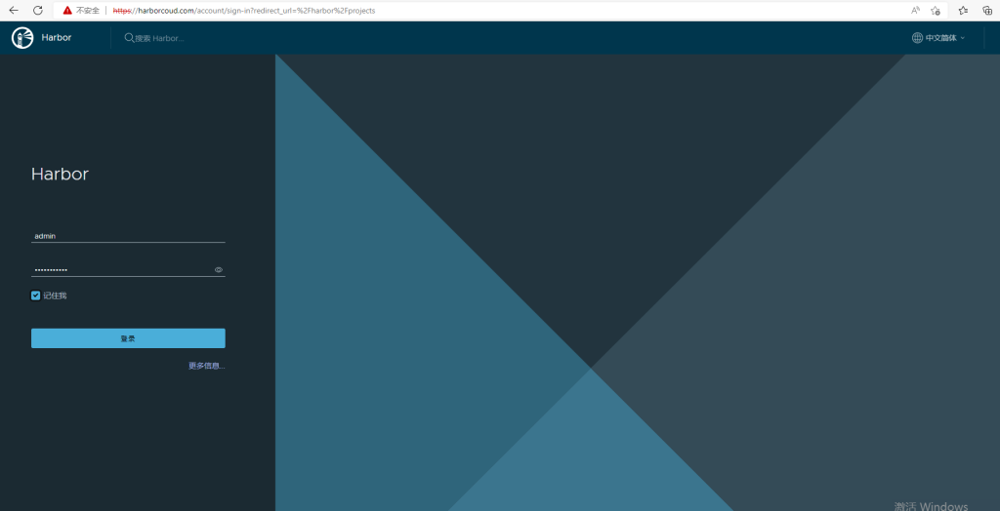
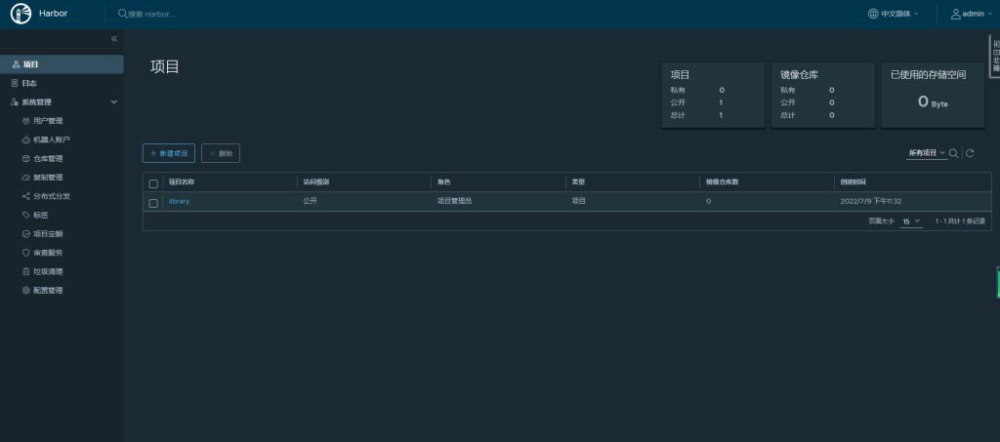

# 一、安装底层需求

- Python应该是 应 2.7或更高版本
- Docker引擎应为 引 1.10或更高版本
- DockerCompose需要为 需 1.6.0或更高版本

Harbor安装组件

| Component           | Version |
| ------------------- | ------- |
| Postgresql          | 13.3.0  |
| Redis               | 6.0.13  |
| Beego               | 1.9.0   |
| Chartmuseum         | 0.9.0   |
| Docker/distribution | 2.7.1   |
| Docker/notary       | 0.6.1   |
| Helm                | 2.9.1   |
| Swagger-ui          | 3.22.1  |

# 二、注意问题

- 因为harbor需要docker引擎的支持，这里必须确定firewalld防火墙是否安装开启，不然会有各种各样的问题

# 三、软件下载

**centos系统**

```
CentOS-7-x86_64-Minimal-1511.iso 

链接：https://pan.baidu.com/s/1jN0q1Kz1krbooSGbjOrIEQ 

提取码：o8up

注意：如果选用此版本，记得安装防火墙 yum install -y firewalld
```

**docker-compose下载**

```
wget -c https://github.com/docker/compose/releases/download/v2.6.1/docker-compose-linux-x86_64
mv docker-compose-linux-x86_64 /usr/local/bin/docker-compose   
chmod +x /usr/local/bin/docker-compose
```

**docker下载更新**

```
rpm -qa | grep docker
# 如果出现docker版本比较低 需要remove旧版本，下面是我虚拟机中的旧版本
yum remove docker-client-1.13.1-209.git7d71120.el7.centos.x86_64 docker-common-1.13.1-209.git7d71120.el7.centos.x86_64
# 通过脚本安装docker
curl -fsSL https://get.docker.com/ | sh
# 开启docker并且开机启动docker
systemctl restart docker && systemctl enable docker
```

**harbor下载**

```
# 下载harbor
wget -c https://github.com/goharbor/harbor/releases/download/v2.5.3/harbor-offline-installer-v2.5.3.tgz
# 解压harbor
tar -zxf harbor-offline-installer-v2.5.3.tgz 
```

# 四、配置https（可选）

[官网配置](https://goharbor.io/docs/2.5.0/install-config/configure-https/)

这里我给配置了一个harborcloud.com的伪域名的 证书

**生成证书颁发机构证书**

```
#生成 CA 证书私钥
openssl genrsa -out ca.key 4096
#生成 CA 证书
openssl req -x509 -new -nodes -sha512 -days 3650 \
 -subj "/C=CN/ST=Beijing/L=Beijing/O=example/OU=Personal/CN=harborcloud.com" \
 -key ca.key \
 -out ca.crt
```

**生成服务器证书**

```
#生成私钥
openssl genrsa -out harborcloud.com.key 4096

#生成证书签名请求 （CSR）
openssl req -sha512 -new \
    -subj "/C=CN/ST=Beijing/L=Beijing/O=example/OU=Personal/CN=harborcloud.com" \
    -key harborcloud.com.key \
    -out harborcloud.com.csr

#生成 x509 v3 扩展名文件
cat > v3.ext <<-EOF
authorityKeyIdentifier=keyid,issuer
basicConstraints=CA:FALSE
keyUsage = digitalSignature, nonRepudiation, keyEncipherment, dataEncipherment
extendedKeyUsage = serverAuth
subjectAltName = @alt_names

[alt_names]
DNS.1=harborcloud.com
DNS.2=harborcloud
DNS.3=hostname
EOF

# 使用该文件为 Harbor 主机生成证书
openssl x509 -req -sha512 -days 3650 \
    -extfile v3.ext \
    -CA ca.crt -CAkey ca.key -CAcreateserial \
    -in harborcloud.com.csr \
    -out harborcloud.com.crt
```

**向 Harbor 和 Docker 提供证书**

```
# 将服务器证书和密钥复制到 Harbor 主机上的证书文件夹中
mkdir -p /data/cert
cp harborcloud.com.crt /data/cert/
cp harborcloud.com.key /data/cert/

# Docker 守护程序将文件解释为 CA 证书，将文件解释为客户端证书。.crt.cert
openssl x509 -inform PEM -in harborcloud.com.crt -out harborcloud.com.cert

#将服务器证书、密钥和 CA 文件复制到 Harbor 主机上的 Docker 证书文件夹中。必须首先创建相应的文件夹。
mkdir -p /etc/docker/certs.d/harborcloud.com/
cp harborcloud.com.cert /etc/docker/certs.d/harborcloud.com/
cp harborcloud.com.key /etc/docker/certs.d/harborcloud.com/
cp ca.crt /etc/docker/certs.d/harborcloud.com/

#重新启动 Docker 引擎
systemctl restart docker
```

# 五 配置文件

```
hostname: harborcloud.com #hostname配置，上面设置的 域名或者ip
# http related config
http:
  # 如果配置了https会重定向到https
  port: 80
# https related config
https:
  # https port for harbor, default is 443
  port: 443
  # nginx配置证书和私钥
  certificate: /data/cert/harborcloud.com.crt
  private_key: /data/cert/harborcloud.com.key
# The initial password of Harbor admin
# It only works in first time to install harbor
# 这里是harbor的默认密码
harbor_admin_password: Harbor12345

# Harbor DB configuration
database:
  # The password for the root user of Harbor DB. Change this before any production use.
  password: root123
  # The maximum number of connections in the idle connection pool. If it <=0, no idle connections are retained.
  max_idle_conns: 100
  # The maximum number of open connections to the database. If it <= 0, then there is no limit on the number of open connections.
  # Note: the default number of connections is 1024 for postgres of harbor.
  max_open_conns: 900

# 默认数据卷
data_volume: /data
```

# 六 安装

**第一次安装**

```
./install.sh
```

**后面更改配置文件操作**

```
# 运行启用
./prepare
#停止并删除现有实例。
docker-compose down -v
# 重新启动港
docker-compose up -d
```

# 七 验证 HTTPS 连接

```
[root@localhost harbor]# docker login harborcloud.com
Username: admin
Password: 
WARNING! Your password will be stored unencrypted in /root/.docker/config.json.
Configure a credential helper to remove this warning. See
https://docs.docker.com/engine/reference/commandline/login/#credentials-store

Login Succeeded
```

# 八 安装情况

**服务器服务启动情况**

docker ps结果图

docker 端口映射

**web控制面板**

web登录界面

主控制面板

# 九、上传镜像与下载镜像

通过nginx做演示如下操作：serverip为harborcoud.com

**测试服务器：**

```
Harbor   10.0.0.5
k8s-master 10.0.0.10
```

**k8s-master:**

1 设置insecure-registries

```
vi /etc/docker/daemon.json
{
  "registry-mirrors": ["https://onozxvpe.mirror.aliyuncs.com"],
  "exec-opts": ["native.cgroupdriver=systemd"],
  "insecure-registries": ["harborcoud.com"]
}
```

2 docker拉取镜像查看版本

地址如下：[https://hub.docker.com](https://hub.docker.com/) 

3 拉去nginx镜像到本地，打标签

```
docker pull nginx
docker tag nginx harborcloud.com/library/myapp
```

这里的harborcloud.com/library需要在harbor界面上获取。

4 登录harbor，push镜像到harbor

```
docker login harborcloud.com
docker push harborcloud.com/library/myapp:latest
```
# 十、docker环境远程管理地址

通过修改/usr/lib/systemd/system/docker.service用 -H 指定docker远程管理地址tcp://0.0.0.0:2375

说明：如果通过jenkins做项目发布部署管理不用在这里指定。

```
ExecStart=/usr/bin/dockerd -H   tcp://0.0.0.0:2375  -H fd:// --containerd=/run/containerd/containerd.sock
```

