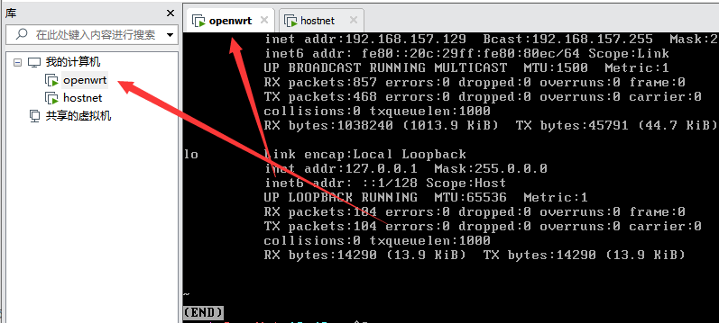

# 一 、需要软件

CentOS-7-x86_64-Minimal-1511.iso 

链接：https://pan.baidu.com/s/1jN0q1Kz1krbooSGbjOrIEQ 
提取码：o8up


openwrt

openwrt：[openwrt-06.18.2022-x86-64-generic-squashfs-combined.img.gz](https://op.supes.top/firmware/x86_64/) 

链接：https://pan.baidu.com/s/1A0x12UJBbR44ZGuO467B_A 
提取码：iqm3

# 二、系统安装

创建名称为openwrt的虚拟机，系统安装配置图如下图，安装完成后执行yum安装必要软件。 

 

```
yum -y install epel-release #安装EPEL源
yum install qemu -y #安装qemu
```

# 三、网络ip设置 

1 对于网卡添加一块仅主机模式和NAT两块网卡，仅主机模式网卡主要做内网，NAT主要做外网访问 。


2 对于hostonly取消ip分配 

 

3 设置本机10.0.0.1/24网段的ip


通过当前系统网络设置设置当前系统的对应网卡的ip为10.0.0.240。  

 

# 四、openwrt文件转换 

上传openwrt文件然后进行转换： 

```
#转换为vmdk格式
qemu-img convert -f raw -O vmdk openwrt-x86-64-generic-squashfs-combined.img openwrt.vmdk 
```

# 五、下载转换后的openwrt的文件openwrt.vmdk

从centos虚拟机下载步骤5生成的openwrt.vmdk，并且替换当前虚拟机系统的vmdk文件 。

主要这里的openwrt.vmdk和当前虚拟机的vmdk名称相同，然后替换系统的vmdk文件，这里最好把centos的vmdk做一个备份 。

 

# 六、登录openwrt web系统 

通过root账号root密码进入web系统，然后通过bypass的服务器节点添加ss或者ssr节点。 


这里我用的是[Openwrt Download Server (supes.top)](https://op.supes.top/firmware/x86_64/) 这个网站的，配置科学上网真蛋疼。用了几个openwrt都不成功，这个可以配置。 

验证配置是否成功 ：

在10.0.0.1的openwrt虚拟机上执行，通过curl google.com得到如下301的重定向结果。

 

# 七 配置ip 10.0.0.2虚拟机 

 

这里选择一块网卡仅主机模式，并且设置ip为10.0.0.2 网关指向上面openwrt的10.0.0.1 。 

 

 