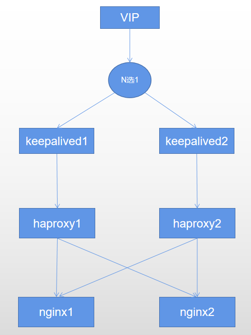

# 一、环境

ip配置(vip最好与A，B同一网段，外网才好访问)

| 服务器                    | Ip         |
| ------------------------- | ---------- |
| A                         | 10.0.0.101 |
| B                         | 10.0.0.102 |
| VIP（虚拟ip存在与A或者B） | 10.0.0.150 |

服务器软件

| 服务器 | 软件                       |
| ------ | -------------------------- |
| A      | keepalived、haproxy、nginx |
| B      | keepalived、haproxy、nginx |

端口配置

| 软件    | 端口 |
| ------- | ---- |
| haproxy | 80   |
| nginx   | 8080 |

# 二、高可用配置

## 软件安装

```
yum install -y keepalived haproxy
```

## 服务器A配置

/etc/keepalived/keepalived.conf

```
! Configuration File for keepalived

global_defs {
   ...
   smtp_server 10.0.0.150
}
vrrp_script chk_haproxy {
    script "killall -0 haproxy"
    interval 2
    weight 2
}
vrrp_instance VI_1 {
    state MASTER
    interface eno16777736
    virtual_router_id 51
    priority 100
    advert_int 1
    authentication {
        auth_type PASS
        auth_pass 1111
    }
    virtual_ipaddress {
        10.0.0.150
    }
    track_script {
        chk_haproxy
    }
}
```

/etc/haproxy/haproxy.cfg

```
frontend  main *:80
    acl url_static       path_beg       -i /static /images /javascript /stylesheets
    acl url_static       path_end       -i .jpg .gif .png .css .js

#    use_backend static          if url_static
    default_backend             app
backend app
    balance     roundrobin
    server  app1 10.0.0.101:8080 check
    server  app2 10.0.0.102:8080 check
```

## 服务器B配置

/etc/keepalived/keepalived.conf

```
! Configuration File for keepalived

global_defs {
   ...
   smtp_server 10.0.0.150
}
vrrp_script chk_haproxy {
    script "killall -0 haproxy"
    interval 2
    weight 2
}
vrrp_instance VI_1 {
    state BACKUP
    interface eno16777736
    virtual_router_id 51
    priority 100
    advert_int 1
    authentication {
        auth_type PASS
        auth_pass 1111
    }
    virtual_ipaddress {
        10.0.0.150
    }
    track_script {
        chk_haproxy
    }
}
```

haproxy和nginx配置与服务器A保持此不变

# 三、高可用测试

根据上面配置可以看出VIP当前在服务器A上面。

```
[root@k8s-master01 nginx]# ip addr
2: eno16777736: <BROADCAST,MULTICAST,UP,LOWER_UP> mtu 1500 qdisc pfifo_fast state UP group default qlen 1000
    link/ether 00:0c:29:53:83:ed brd ff:ff:ff:ff:ff:ff
    inet 10.0.0.101/24 brd 10.0.0.255 scope global noprefixroute eno16777736
       valid_lft forever preferred_lft forever
    inet 10.0.0.150/32 scope global eno16777736
       valid_lft forever preferred_lft forever
    inet6 fd56:a9ae:cb0f::c0f/128 scope global noprefixroute dynamic 
       valid_lft 24195sec preferred_lft 24195sec
    inet6 fd56:a9ae:cb0f:0:20c:29ff:fe53:83ed/64 scope global noprefixroute 
       valid_lft forever preferred_lft forever
    inet6 fe80::20c:29ff:fe53:83ed/64 scope link noprefixroute 
       valid_lft forever preferred_lft forever
```

此时服务器的网卡eno16777736拥有10.0.0.101/24和10.0.0.150/32 两个ip地址。

当在服务器A 关闭keepalived时：

```
[root@k8s-master01 nginx]# systemctl stop keepalived
[root@k8s-master01 nginx]# ip addr
2: eno16777736: <BROADCAST,MULTICAST,UP,LOWER_UP> mtu 1500 qdisc pfifo_fast state UP group default qlen 1000
    link/ether 00:0c:29:53:83:ed brd ff:ff:ff:ff:ff:ff
    inet 10.0.0.101/24 brd 10.0.0.255 scope global noprefixroute eno16777736
       valid_lft forever preferred_lft forever
    inet6 fd56:a9ae:cb0f::c0f/128 scope global noprefixroute dynamic 
       valid_lft 24036sec preferred_lft 24036sec
    inet6 fd56:a9ae:cb0f:0:20c:29ff:fe53:83ed/64 scope global noprefixroute 
       valid_lft forever preferred_lft forever
    inet6 fe80::20c:29ff:fe53:83ed/64 scope link noprefixroute 
       valid_lft forever preferred_lft forever
```

这个时候服务器A网卡eno16777736只剩下一个ip地址10.0.0.101/24

然后查看服务器B的网卡信息：

```
[root@k8s-master02 nginx]# ip addr
2: eno16777736: <BROADCAST,MULTICAST,UP,LOWER_UP> mtu 1500 qdisc pfifo_fast state UP group default qlen 1000
    link/ether 00:0c:29:14:71:94 brd ff:ff:ff:ff:ff:ff
    inet 10.0.0.102/24 brd 10.0.0.255 scope global eno16777736
       valid_lft forever preferred_lft forever
    inet 10.0.0.150/32 scope global eno16777736
       valid_lft forever preferred_lft forever
    inet6 fd56:a9ae:cb0f::d62/128 scope global dynamic 
       valid_lft 23012sec preferred_lft 23012sec
    inet6 fd56:a9ae:cb0f:0:20c:29ff:fe14:7194/64 scope global noprefixroute 
       valid_lft forever preferred_lft forever
    inet6 fe80::20c:29ff:fe14:7194/64 scope link 
       valid_lft forever preferred_lft forever
```

10.0.0.150/32被设置到服务器B 的eno16777736上了

