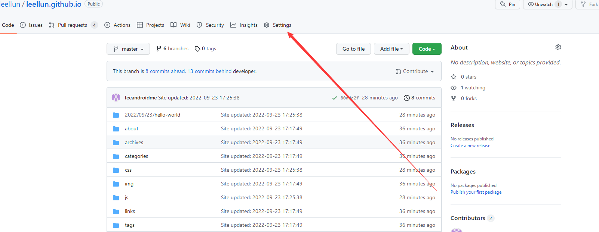
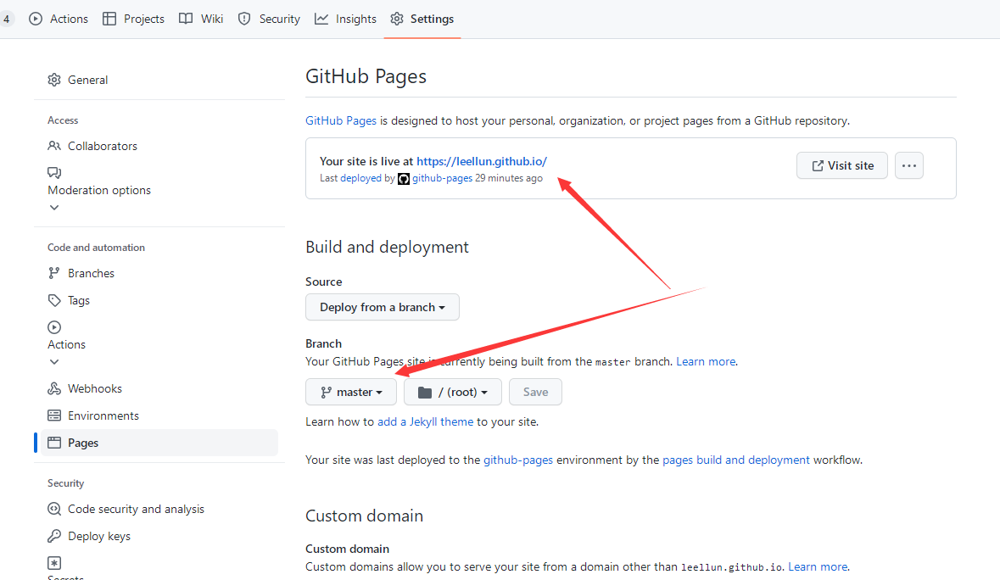

# 一、github仓库创建

在github创建仓库，仓库名称为[username].github.io。


然后选择设置



设置网站的访问host并且制定分支为主分支



配置git免登录认证信息


# 二、hexo使用

## 1.1 安装hexo

全局安装hexo

```
npm install -g hexo
# 发布支持
npm install --save hexo-deployer-git

```

## 1.2 创建hexo项目并且推到github上

```
# 创建文件夹 [username].github.io
mkdir [username].github.io
# 执行hexo初始化操作
hexo init
# 将 github [username].github.io的.git的文件夹放入项目中，指定分支developer或其它分支作为hexo项目源码存放分支

# 构建静态页面
hexo generate

# 发布 到master
hexo deploy
```

## 1.3 hexo 配置修改

```
title: 青叶水间 - 一个IT技术文章分享博客
subtitle: ''
description: ''
keywords:
author: leellun
language: zh-CN
timezone: ''

## 主题配置，我这里用的fluid主题
theme: fluid  

# 发布信息 git，地址是repo配置，分支branch ，需要发布必须配置了git的ssh-gen
# 这里还需要安装了 插件hexo-deployer-git，npm install --save hexo-deployer-git
deploy:
  type: git
  repo: git@github.com:leellun/leellun.github.io.git
  branch: master
```

