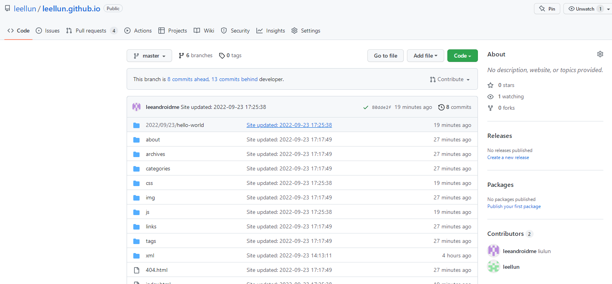
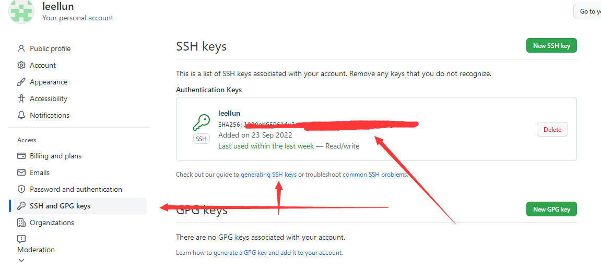

# 一、github仓库创建

在github创建仓库，仓库名称为[username].github.io。



然后选择设置


设置网站的访问host并且制定分支为主分支


配置git免登录认证信息




# 二、hexo使用

## 1.1 安装hexo

全局安装hexo

```
npm install -g hexo
# 发布支持
npm install --save hexo-deployer-git

```

## 1.2 创建hexo项目并且推到github上

```
# 创建文件夹 [username].github.io
mkdir [username].github.io
# 执行hexo初始化操作
hexo init
# 将 github [username].github.io的.git的文件夹放入项目中，指定分支developer或其它分支作为hexo项目源码存放分支

# 构建静态页面
hexo generate

# 发布 到master
hexo deploy
```

## 1.3 hexo 配置修改

```
title: 青叶水间 - 一个IT技术文章分享博客
subtitle: ''
description: ''
keywords:
author: leellun
language: zh-CN
timezone: ''
post_asset_folder: true
## 主题配置，我这里用的fluid主题
theme: fluid  

# 发布信息 git，地址是repo配置，分支branch ，需要发布必须配置了git的ssh-gen
# 这里还需要安装了 插件hexo-deployer-git，npm install --save hexo-deployer-git
deploy:
  type: git
  repo: git@github.com:leellun/leellun.github.io.git
  branch: master
```

## 1.4 markdown图片支持

修改_config.yml

```
post_asset_folder: true
```

安装依赖支持：

```
 npm install hexo-image-link --save
```

## 1.5 主题添加

```
 npm install hexo-theme-fluid --save
```

主题配置：_config.fluid.yml

```
favicon: /img/leaf_icon.png

navbar:
  # 导航栏左侧的标题，为空则按 hexo config 中 `title` 显示
  # The title on the left side of the navigation bar. If empty, it is based on `title` in hexo config
  blog_title: "青叶水间"
index:
  banner_img_height: 60
  banner_img: /img/bg-default.png
  slogan:
    enable: true

    # 为空则按 hexo config.subtitle 显示
    # If empty, text based on `subtitle` in hexo config
    text: "一个Java、SpringBoot、SpringCloud、服务器等文章分享博客网站"
post:
  banner_img_height: 60
  banner_img: /img/bg-default.png
archive:
  banner_img_height: 60
  banner_img: /img/bg-default.png
category:
  banner_img_height: 60
  banner_img: /img/bg-default.png
tag:
  banner_img_height: 60
  banner_img: /img/bg-default.png
about:
  banner_img_height: 60
  banner_img: /img/bg-default.png
page:
  banner_img_height: 60
  banner_img: /img/bg-default.png
page404:
  banner_img: /img/bg-default.png
  banner_img_height: 60
links:
  enable: true
  banner_img: /img/bg-default.png

#---------------------------
# 页脚
# Footer
#---------------------------
footer:
  # 页脚第一行文字的 HTML，建议保留 Fluid 的链接，用于向更多人推广本主题
  # HTML of the first line of the footer, it is recommended to keep the Fluid link to promote this theme to more people
  content: '
    <a href="https://hexo.io" target="_blank" rel="nofollow noopener"><span>Hexo</span></a>
    <i class="iconfont icon-love"></i>
    <a href="https://github.com/leellun" target="_blank" rel="nofollow noopener"><span>我的github</span></a>
```

## 三、页面与文章

创建页面：

```
# 创建about页面
hexo new page about
```

创建文章：

```
hexo new "My New Post"
```

文章头信息：

| Data       | Description                                             |
| ---------- | ------------------------------------------------------- |
| `title`    | 标题                                                    |
| `slug`     | 地址                                                    |
| `layout`   | 布局                                                    |
| `path`     | 路径。Hexo默认情况下基于new_post_path设置构建post路径。 |
| `date`     | 日期 默认当前                                           |
| tags       | 标签                                                    |
| categories | 类别                                                    |
| author     | 作者                                                    |

更多：https://hexo.io/docs/variables.html


当前博客网站源码配置：https://github.com/leellun/leellun.github.io

