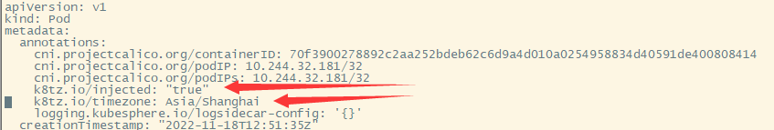
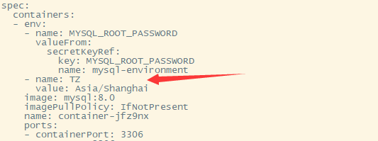
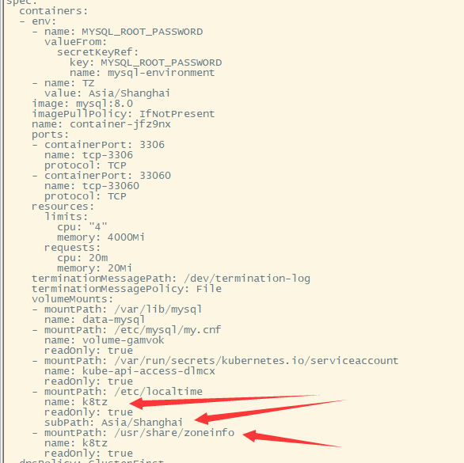
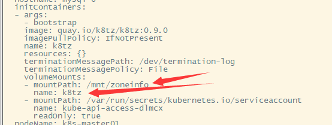

## 1 安装时间同步需要软件

```
yum install -y ntpdate
```

## 2 设置时间

### 2.1 手动设置时间

```
date -s "20190712 18:30:50"
hwclock --systohc
```

### 2.2 在线更新时间

```
ntpdate 0.asia.pool.ntp.org
# 强制把系统时间写入CMOS
clock -w
```

## 3 强制把系统时间写入CMOS

hwclock作用与clock相同 ,同是设置硬件时钟

```
hwclock --systohc
或者
clock -w
```

## 4 通过k8tz统一pod时区

```
helm repo add k8tz https://k8tz.github.io/k8tz/
helm install k8tz k8tz/k8tz --set timezone=Asia/Beijing
```

原理：

k8tz是一个 Kubernetes 准入控制器和一个将时区注入 Pod 的 CLI 工具。可以用作手动工具来自动转换 Deployment 和 Pod 可以作为准入控制器安装并使用注释来完全自动化创建 Pod 的过程。

k8tz 可以使用hostPath的方式，或者将emptyDir 注入initContainer并用 TZif（时区信息格式) 文件填充卷。然后将emptyDir挂载到 Pod 每个容器的 /etc/localtime和 /usr/share/zoneinfo。为了确保所需的时区有效，它向所有容器添加了 TZ环境变量。

### 4.1 annotations设置

`k8tz.io/inject: true/false  是否禁止注入,当注入时区操作和禁止注入同时存在时，注入时区的优先级会高于禁止注入`

`k8tz.io/timezone： Asia/Beijing  注入时区，时区选择根据自己需求`

`k8tz.io/strategy: hostpath/initcontainer 提供了挂载本地文件和init容器两种方式`

### 4.2 initcontainer 设置分析

（1）k8tz的annotation设置



（2）tz环境变量指定时区



（3）挂载时区文件



将k8tz挂载目录子目录的subpath挂载至/etc/localtime目录下。

将k8tz整个目录挂载到/usr/share/zoneinfo目录下

（4）关键步骤initcontainer 



初始化容器将/mnt/zoneinfo挂载定义k8tz，为（3）做准备

