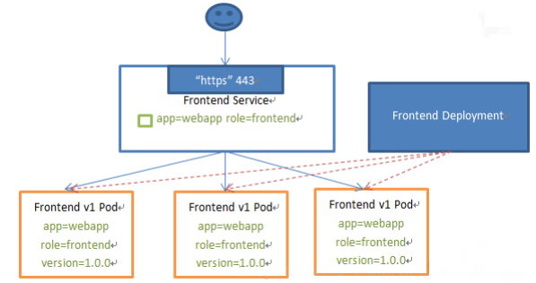
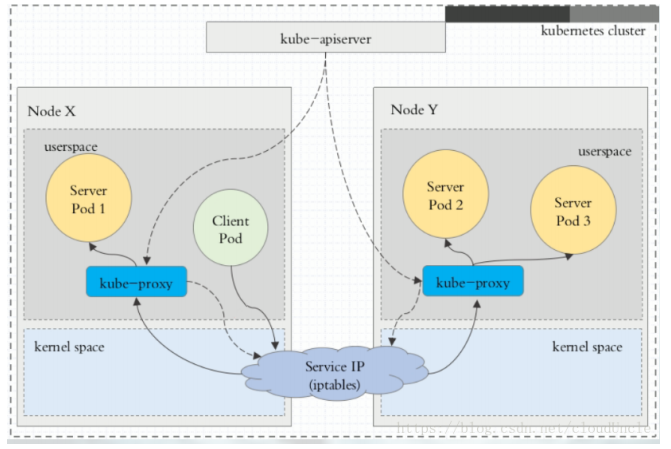
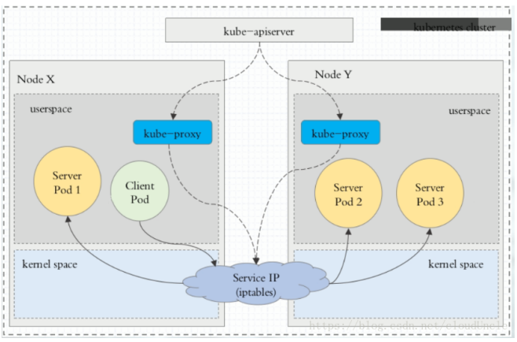
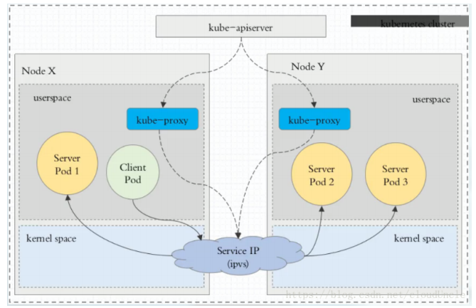
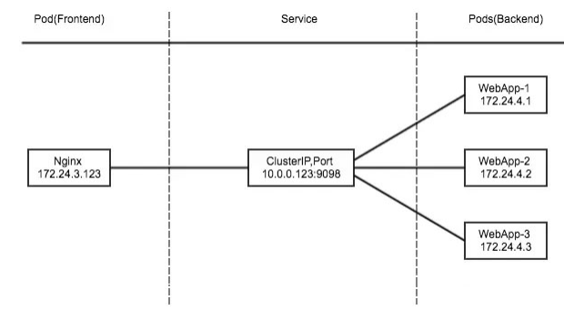
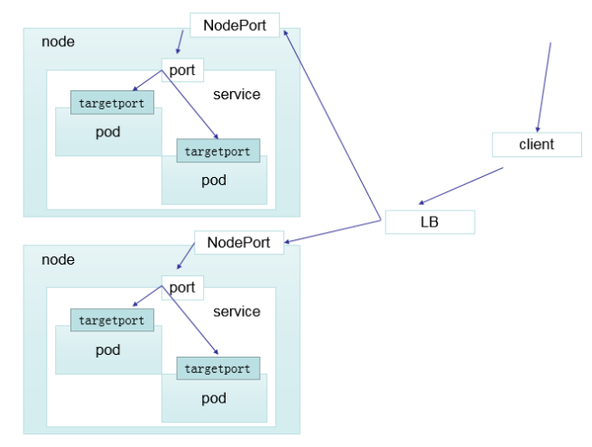

# 一、概述

Kubernete Service 是一个定义了一组Pod的策略的抽象，我们也有时候叫做宏观服务。这些被服务标记的Pod都是（一般）通过label Selector决定的 。

通过创建Service,可以为一组具有相同功能的容器应用提供一个统一的入口地址，并且将请求负载分发到后端的各个容器应用上。

对于Kubernete原生的应用，Kubernete提供了一个简单的Endpoints API，这个Endpoints api的作用就是当一个服务中的pod发生变化时，Endpoints API随之变化，对于哪些不是原生的程序，Kubernetes提供了一个基于虚拟IP的网桥的服务，这个服务会将请求转发到对应的后台pod 。



# 二、代理模式

Service能够提供负载均衡的能力,但是在使用上有以下限制:

只提供4层负载均衡能力,而没有7层功能,但有时我们可能需要更多的匹配规则来转发请求,这点上4层负载均衡是不支持的

VIP和Service代理：

在Kubernetes 集群中,每个Node运行一个 kube-proxy进程。kube-proxy负责为Service实现了一种VIP (虚拟IP)的形式,而不是ExternalName的形式。

- 在Kubernetes v1.0版本,代理完全在userspace.
- 在Kubernetes v1.1版本,新增了 iptables 代理,但并不是默认的运行模式。
- 从Kubemetes v1.2起,默认就是iptables代理。
- 在Kubernetes v1.8.0-beta.0中,添加了ipvs代理
- 在Kubernetes 1.14版本开始默认使用ipvs代理
- 在Kubernetes v1.0版本, Service是4层概念。在Kubernetes v1.1版本，新增了  Ingress API (beta版) ,用来表示“7层（Http）服务

为什么不用DNS?

因为DNS需要在客服端保留记录，存在缓存等干扰，可能导致过期解析。

## 1 userspace代理模式



## 2 iptables代理模式



## 3  ipvs代理模式

这种模式, kube-proxy会监视Kubernetes Service对象和Endpoints,调用netlink接口以相应地创建ipvs规则并定期与Kubernetes Service对象和Endpoints对象同步ipvs规则,以确保ipvs状态与期望一致。访问服务时,流量将被重定向到其中一个后端Pod与iptables 类似, ipvs于netfilter的hook功能,但使用哈希表作为底层数据结构并在内核空间中工作。这意味着ipvs可以更快地重定向流量,并且在同步代理规则时具有更好的性能。此外,ipvs为负载均衡算法提供了更多选项,例如:

- rr:轮询调度
- 1c:最小连接数
- dh:目标哈希
- sh:源哈希
- sed:最短期望延迟
- nq:不排队调度



# 三、Service 的类型

Service 在K8s中有以下四种类型

- Clusterlp:默认类型,自动分配一个仅Cluster内部可以访问的虚拟IP
- NodePort: 在ClusterIP基础上为Service在每台机器上绑定一个端口,这样就可以通过:NodePort来访问该服务
- LoadBalancer: 在NodePort的基础上,借助cloud provider创建一个外部负载均衡器,并将请求转发到: NodePort
- ExternalName:把集群外部的服务引入到集群内部来,在集群内部直接使用。没有任何类型代理被创建,这只有kubernetes 1.7或更高版本的kube-dns才支持

## 1 ClusterIP

clusterIP 主要在每个 node 节点使用iptables,将发向 clusterIP 对应端口的数据,转发到kube-proxy中。然后kube-proxy 自己内部实现有负载均衡的方法,并可以查询到这个 service下对应pod的地址和端口,进而把数据转发给对应的pod的地址和端口



协同工作原理:

- apiserver 用户通过kubectl命令向apiserver发送创建service的命令, apiserver接收到请求后将数据存储到etcd中
- kube-proxy kubernetes的每个节点中都有一个叫做kube-porxy的进程,这个进程负责感知service, pod的变化,并将变化的信息写入本地的iptables规则中
- iptables 使用NAT等技术将virtualIP的流量转至endpoint中

创建myapp-deploy.yaml文件

```yaml
apiVersion: apps/v1
kind: Deployment
metadata:
  name: myapp-deploy
  namespace: default
spec:
  replicas: 3
  selector:
    matchLabels:
      app: myapp
      release: stabel
  template:
    metadata:
      labels:
        app: myapp
        release: stabel
        env: test
    spec:
      containers:
      - name: myapp
        image: harborcloud.com/library/nginx:1.9.1
        imagePullPolicy: IfNotPresent
        ports:
        - name: http
          containerPort: 80
```

创建Service信息，myapp-service.yaml

```yaml
apiVersion: v1
kind: Service
metadata:
  name: myapp
  namespace: default
spec:
  type: ClusterIP
  selector:
    app: myapp
    release: stabel
  ports:
  - name: http
    port: 80
    targetPort: 80
```

## 2 Headless Service

有时不需要或不想要负载均衡,以及单独的Service IP.遇到这种情况,可以通过指定ClusterIP(spec.clusterIP) 的值为"None"来创建Headless Service。这类Service并不会分配Cluster IP，kube-proxy不会处理它们,而且平台也不会为它们进行负载均衡和路由。

```
[root@k8s-master mainfests]# vim myapp-svc-headless.yaml
```

myapp-svc-headless.yaml

```yaml
apiVersion: v1
kind: Service
metadata:
  name: myapp-headless
  namespace: default
spec:
  selector:
    app: myapp
  clusterIP: "None"
  ports:
  - port: 80
    targetPort: 80
```

```
[root@k8s-master01 service]# yum install -y  bind-utils
[root@k8s-master01 service]# dig -t A myapp-headless.default.svc.cluster.local. @10.244.0.12
```

```
[root@k8s-master01 service]# kubectl get pod -n kube-system -o wide
NAME                                   READY   STATUS    RESTARTS        AGE     IP                    NODE           NOMINATED NODE   READINESS GATES
coredns-7f6cbbb7b8-pbv77               1/1     Running   4 (2d20h ago)   5d20h   10.244.0.13           k8s-master01   <none>           <none>
coredns-7f6cbbb7b8-qxw99               1/1     Running   4 (2d20h ago)   5d20h   10.244.0.12           k8s-master01   <none>           <none>
etcd-k8s-master01                      1/1     Running   7 (2d20h ago)   5d20h   10.0.0.10             k8s-master01   <none>           <none>
kube-apiserver-k8s-master01            1/1     Running   7 (2d20h ago)   5d20h   10.0.0.10             k8s-master01   <none>           <none>
kube-controller-manager-k8s-master01   1/1     Running   9 (2d20h ago)   5d20h   10.0.0.10             k8s-master01   <none>           <none>
kube-proxy-ml24c                       1/1     Running   3 (2d20h ago)   3d22h   fd56:a9ae:cb0f::7a1   k8s-node01     <none>           <none>
kube-proxy-mrbsk                       1/1     Running   4 (2d20h ago)   3d22h   10.0.0.10             k8s-master01   <none>           <none>
kube-proxy-tkszd                       1/1     Running   2 (22h ago)     3d22h   fd56:a9ae:cb0f::853   k8s-node02     <none>           <none>
kube-scheduler-k8s-master01            1/1     Running   8 (2d20h ago)   5d20h   10.0.0.10             k8s-master01   <none>           <none>
[root@k8s-master01 service]# dig -t A myapp-headless.default.svc.cluster.local. @10.244.0.12

; <<>> DiG 9.11.4-P2-RedHat-9.11.4-26.P2.el7_9.9 <<>> -t A myapp-headless.default.svc.cluster.local. @10.244.0.12
;; global options: +cmd
;; Got answer:
;; WARNING: .local is reserved for Multicast DNS
;; You are currently testing what happens when an mDNS query is leaked to DNS
;; ->>HEADER<<- opcode: QUERY, status: NOERROR, id: 14989
;; flags: qr aa rd; QUERY: 1, ANSWER: 3, AUTHORITY: 0, ADDITIONAL: 1
;; WARNING: recursion requested but not available

;; OPT PSEUDOSECTION:
; EDNS: version: 0, flags:; udp: 4096
;; QUESTION SECTION:
;myapp-headless.default.svc.cluster.local. IN A

;; ANSWER SECTION:
myapp-headless.default.svc.cluster.local. 30 IN A 10.244.2.109
myapp-headless.default.svc.cluster.local. 30 IN A 10.244.1.165
myapp-headless.default.svc.cluster.local. 30 IN A 10.244.2.108

;; Query time: 2 msec
;; SERVER: 10.244.0.12#53(10.244.0.12)
;; WHEN: 一 7月 18 05:05:52 CST 2022
;; MSG SIZE  rcvd: 237

[root@k8s-master01 service]# kubectl get pod -o wide
NAME                            READY   STATUS    RESTARTS   AGE     IP             NODE         NOMINATED NODE   READINESS GATES
myapp-deploy-85bb565996-2tvcg   1/1     Running   0          2m20s   10.244.2.108   k8s-node02   <none>           <none>
myapp-deploy-85bb565996-dgzgz   1/1     Running   0          2m20s   10.244.2.109   k8s-node02   <none>           <none>
myapp-deploy-85bb565996-mlnh8   1/1     Running   0          2m20s   10.244.1.165   k8s-node01   <none>           <none>
```

通过Headless Service一样可以访问到对应的pod上去

## 3 NodePort

nodePort 的原理在于在node上开了一个端口,将向该端口的流量导入到kube-proxy,然后由kube-proxy进一步到给对应的pod

```
[root@master manifests]# vi myapp-np-service.yaml
```

```yaml
apiVersion: v1
kind: Service
metadata:
  name: myapp
  namespace: default
spec:
  type: NodePort
  selector:
    app: myapp
    release: stabel
  ports:
  - name: http
    port: 80
    targetPort: 80
```

查看结果

```
# 查看service服务暴露端口
[root@k8s-master01 service]# kubectl get svc -o wide
NAME         TYPE        CLUSTER-IP      EXTERNAL-IP   PORT(S)        AGE     SELECTOR
kubernetes   ClusterIP   10.96.0.1       <none>        443/TCP        5d20h   <none>
myapp        NodePort    10.98.226.253   <none>        80:30247/TCP   17s     app=myapp,release=stabel
#查看myapp分布在哪些节点
[root@k8s-master01 service]# kubectl get pod -o wide
NAME                            READY   STATUS    RESTARTS   AGE   IP             NODE         NOMINATED NODE   READINESS GATES
myapp-deploy-85bb565996-dcgzh   1/1     Running   0          54s   10.244.1.167   k8s-node01   <none>           <none>
myapp-deploy-85bb565996-snpfg   1/1     Running   0          54s   10.244.1.166   k8s-node01   <none>           <none>
myapp-deploy-85bb565996-xv2q4   1/1     Running   0          54s   10.244.2.110   k8s-node02   <none>           <none>
#查看所有节点的信息
[root@k8s-master01 service]# kubectl get node -o wide           
NAME           STATUS   ROLES                  AGE     VERSION   INTERNAL-IP           EXTERNAL-IP   OS-IMAGE                KERNEL-VERSION                CONTAINER-RUNTIME
k8s-master01   Ready    control-plane,master   5d20h   v1.22.0   10.0.0.10             <none>        CentOS Linux 7 (Core)   3.10.0-1160.71.1.el7.x86_64   docker://18.6.1
k8s-node01     Ready    <none>                 4d22h   v1.22.0   10.0.0.21             <none>        CentOS Linux 7 (Core)   3.10.0-1160.71.1.el7.x86_64   docker://18.6.1
k8s-node02     Ready    <none>                 4d22h   v1.22.0   10.0.0.22             <none>        CentOS Linux 7 (Core)   3.10.0-1160.71.1.el7.x86_64   docker://18.6.1
```

通过访问10.0.0.10:30247,10.0.0.21:30247,10.0.0.22:30247都可以得到：


查询流程

```
[root@k8s-master01 service]# iptables -t nat -nvL KUBE-NODEPORTS
Chain KUBE-NODEPORTS (0 references)
 pkts bytes target     prot opt in     out     source               destination         
    0     0 KUBE-SVC-2CMXP7HKUVJN7L6M  tcp  --  *      *       0.0.0.0/0            0.0.0.0/0            /* default/nginx */ tcp dpt:30029
```

## 4 LoadBalancer

loadBalancer 和 nodePort其实是同一种方式,区别在于loadBalancer 比 nodePort多了一步,就是可以调用cloud provider 去创建 LB 来向节点导流。



# 5 ExternalName

这种类型的Service通过返回CNAME和它的值,可以将服务映射到externalName字段的内容(例如:hub.atguigu.com). ExternalName Service 是 Service的特例,它没有 selector,也没有定义任何的端口和Endpoint。相反的,对于运行在集群外部的服务,它通过返回该外部服务的别名这种方式来提供服务

```yaml
kind: Service
apiversion: v1
metadata:
  name: my-service-1
  namespace: default
spec:
  type: ExternalName
  externalName: www.qingyeshuijian.com
```

当查询主机 my-service-1.defalut.svc.cluster.local (SVC_NAME.NAMESPACE.svc.cluster.local )时,集群的DNS服务将返回一个值my.database.example.com的CNAME记录。访问这个服务的工作方式和其他的相同,唯一不同的是重定向发生在DNS层,而且不会进行代理或转发。

```
[root@k8s-master01 service]# dig -t A my-service-1.default.svc.cluster.local. @10.244.0.12              

; <<>> DiG 9.11.4-P2-RedHat-9.11.4-26.P2.el7_9.9 <<>> -t A my-service-1.default.svc.cluster.local. @10.244.0.12
;; global options: +cmd
;; Got answer:
;; WARNING: .local is reserved for Multicast DNS
;; You are currently testing what happens when an mDNS query is leaked to DNS
;; ->>HEADER<<- opcode: QUERY, status: NOERROR, id: 3150
;; flags: qr aa rd; QUERY: 1, ANSWER: 2, AUTHORITY: 0, ADDITIONAL: 1
;; WARNING: recursion requested but not available

;; OPT PSEUDOSECTION:
; EDNS: version: 0, flags:; udp: 4096
;; QUESTION SECTION:
;my-service-1.default.svc.cluster.local.        IN A

;; ANSWER SECTION:
my-service-1.default.svc.cluster.local. 30 IN CNAME www.qingyeshuijian.com.
www.qingyeshuijian.com. 30      IN      A       39.107.115.153

;; Query time: 50 msec
;; SERVER: 10.244.0.12#53(10.244.0.12)
;; WHEN: 一 7月 18 05:30:32 CST 2022
;; MSG SIZE  rcvd: 179
```

通过上面的dig查看ExternalName找到cname指向了www.qingyeshuijian.com