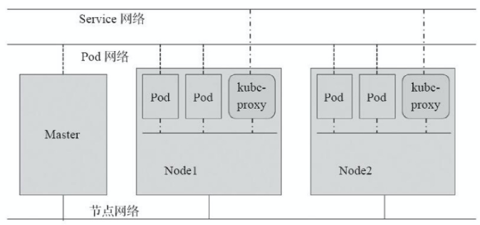
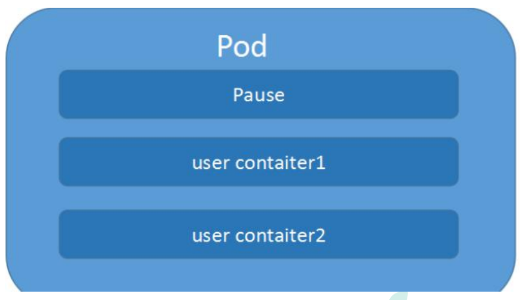
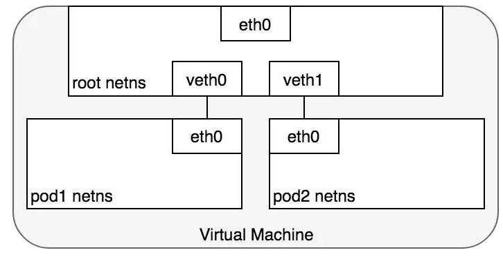
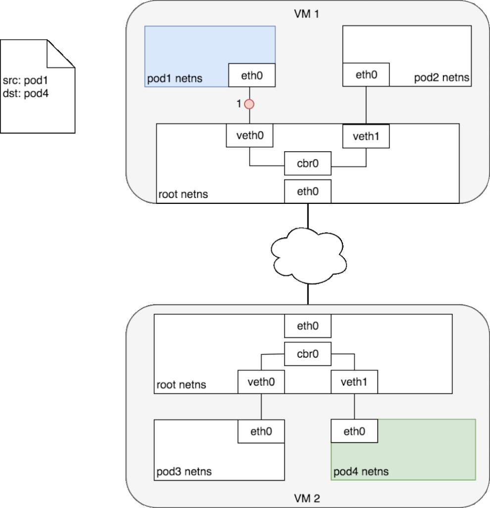
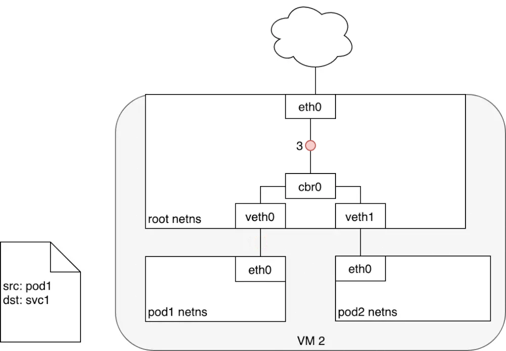
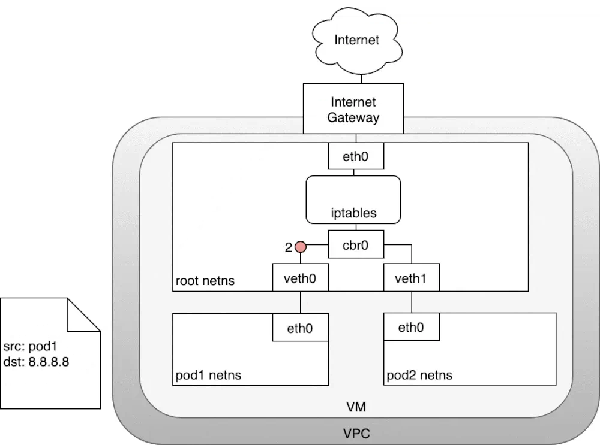
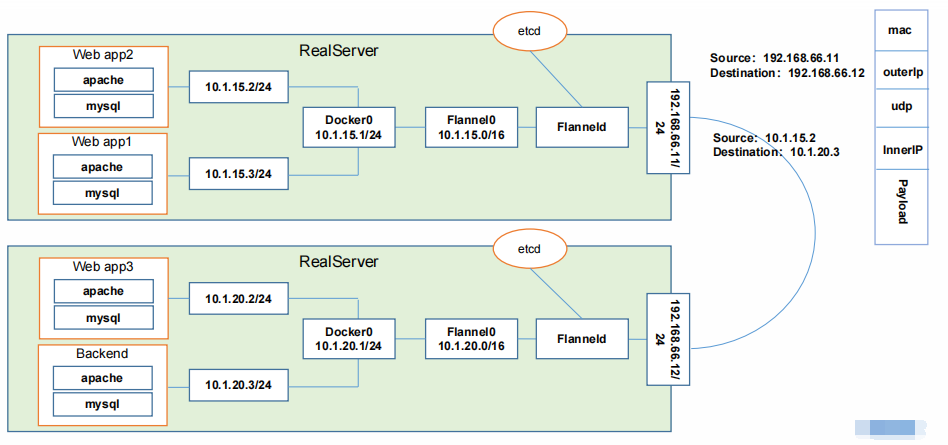

# **k8s组网要求**

- 所有的Pods之间可以在不使用NAT网络地址转换的情况下相互通信。
- 所有的Nodes之间可以在不使用NAT网络地址转换的情况下相互通信。
- 每个Pod自己看到的自己的ip和其他Pod看到的一致。即所有Pod对象都处于同一平面网络中，而且可以使用Pod自身的地址直接通信。

# **k8s网络模型设计基础原则**

- 每个Pod都拥有一个独立的IP地址，假定所有 Pod 都在一个可以直接连通的、扁平的网络空间中 。
- 不管Pod是否运行在同一个 Node中，都要求它们可以直接通过对方的 IP 进行访问。
- 用户不需要额外考虑如何建立 Pod 之间的连接，也不需要考虑将容器端口映射到主机端口等问题。

k8s使用的网络插件必须能为Pod提供满足以上要求的网络，它需要为每个Pod配置至少一个特定的地址，即Pod IP。Pod IP地址实际存在于某个网卡（可以是虚拟设备）上，而service的地址却是一个虚拟IP地址，没有任何网络接口配置此地址，它由kube-proxy借助iptables规则或者IPVS规则重新定向到本地端口，在将其调度至后端Pod对象。Service的IP地址是集群提供服务的接口，也称为ClusterIP。

Pod网络及其IP由k8s的网络插件负责配置和管理，具体使用的网络地址可在管理配置网络插件时指定，如10.244.0.0/16网络。而Cluster网络和IP则是由k8s集群负责管理和配置，如10.96.0.0/12网络。

# k8s集群网络

- 主机之间通信(如master和node)，不归k8s管，管理员自行构建。
- pod资源对象之间通信，是一个虚拟网络。用于为各Pod对象设定IP地址等网络参数，其地址配置于Pod中容器的网络接口上，Pod网络需要借助k8s插件或者CNI插件实现，该插件可独立不属于k8s集群，亦可托管于k8s之上，他需要在构建k8s集群时由管理员定义，而后创建Pod对象时由其自动完成网络参数的动态配置。
- Service资源的对象的网络，也是一个虚拟网络，用于k8s集群之中的Service配置IP地址，但此地址并不配置于任何主机或容器的网络接口之上，而是通过Node之上的kube-proxy配置为iptables或ipvs规则，从而将发往此地址的所有流量调度至其后端的各个Pod对象之上。Service网络在k8s集群创建时予以指定，而各Service的地址则在用户创建Service时予以动态配置。

k8s网络环境

**容器和容器之间的网络**

- 在k8s中每个Pod中管理着一组Docker容器，这些Docker容器共享同一个网络命名空间。
- Pod中的每个Docker容器拥有与Pod相同的IP和port地址空间，并且由于他们在同一个网络命名空间，他们之间可以通过localhost相互访问。

container模式指定新创建的Docker容器和已经存在的一个容器共享一个网络命名空间，而不是和宿主机共享。新创建的Docker容器不会创建自己的网卡，配置自己的 IP，而是和一个指定的容器共享 IP、端口范围等

每个Pod容器有有一个pause容器其有独立的网络命名空间，在Pod内启动Docker容器时候使用 –net=container就可以让当前Docker容器加入到Pod容器拥有的网络命名空间（pause容器），同一个Pod内的多个docker容器相互通信机制。

**Pod与Pod之间的网络**

pod和pod通信

- k8s中，每个Pod拥有一个ip地址，不同的Pod之间可以直接使用ip通讯
- 在同一个Node上，从Pod的视角看，它存在于自己的网络命名空间中，并且需要与该Node上的其他网络命名空间上的Pod进行通信。

原理：

使用linux虚拟以太网设备或者说是由两个虚拟接口组成的veth对使不同的网络命名空间链接起来，这些虚拟接口分布在多个网络命名空间上（这里是指多个Pod上）

为了让多个Pod的网络命名空间链接起来，可以让veth对的一端链接到root网络命名空间（宿主机的），另一端链接到Pod的网络命名空间。这里需要用到一个Linux以太网桥，它是一个虚拟的二层网络设备，目的就是把多个以太网段连接起来，它维护一个转发表，通过查看每个设备mac地址决定转发，还是丢弃数据。

同一台node节点上pod1和pod2通信：

pod1通过自身eth0网卡发送数据，eth0连接着veth0，网桥把veth0和veth1组成了一个以太网，然后数据到达veth0之后，网桥通过转发表，发送给veth1，veth1直接把数据传给pod2的eth0。

每对Veth就像一根接插电缆，连接两侧并允许流量在它们之间流动；这种veth对可以推广到同一个Node上任意多的Pod上，如上图这里展示使用veth对链接每个Pod到虚拟机的root网络命名空间。不同node节点上pod和pod通信：**CIDR**CIDR（无类域间路由选择）它消除了传统的A类、B类和C类地址以及划分子网的概念，因而可以更加有效地分配IPv4的地址空间。它可以将好几个IP网络结合在一起，使用一种无类别的域际路由选择算法，使它们合并成一条路由从而较少路由表中的路由条目减轻Internet路由器的负担。k8s集群中，每个node节点都会被分配一个CIDR块，（把网络前缀都相同的连续地址组成的地址组称为CIDR地址块）用来给node上的pod分配IP地址，另外还需要把pod的ip和所在nodeip进行关联.比如node1上pod1和node2上的pod4进行通信首先pod1上网卡eth0将数据发送给已经管理到root命名空间的veth0上，被虚拟网桥收到，查看自己转发表之后，并没有pod4的mac地址。就会把包转发到默认路由，（root命名空间的eth0上，也就是已经到了node节点的网卡上）通过eth0，发送到网络中。寻址转发后包来到了node2，首先被root命名空间的eth0设备接受，查看目标地址是发往pod4的，交给虚拟网桥路由到veth1，最终传给pod4的eth0上。

不同node节点上

pod和pod通信**pod与service之间的网络**pod的ip地址是不持久的，当集群中pod的规模缩减或者pod故障或者node故障重启后，新的pod的ip就可能与之前的不一样的。所以k8s中衍生出来Service来解决这个问题。Service管理了多个Pods，每个Service有一个虚拟的ip,要访问service管理的Pod上的服务只需要访问你这个虚拟ip就可以了，这个虚拟ip是固定的，当service下的pod规模改变、故障重启、node重启时候，对使用service的用户来说是无感知的，因为他们使用的service的ip没有变。当数据包到达Service虚拟ip后，数据包会被通过k8s给该servcie自动创建的负载均衡器路由到背后的pod容器。在k8s里，iptables规则是由kube-proxy配置，kube-proxy监视APIserver的更改，因为集群中所有service（iptables）更改都会发送到APIServer上，所以每台kubelet-proxy监视APIServer，当对service或pod虚拟IP进行修改时，kube-proxy就会在本地更新，以便正确发送给后端pod.

数据包从pod1的eth0离开，通过veth0传给网桥cbr0，网桥找不到service的ip对应的mac，交给了默认路由，到达了root命名空间的eth0root命名空间的eth0接受数据包之前会经过iptables进行过滤，iptables接受数据包后使用kube-proxy在node上配置的规则响应service，然后数据包的目的ip重写为service后端指定的pod的ip了。service到pod包的流转：收到包的pod会回应数据包到源pod，源ip是发送方ip，目标IP是接收方，数据包进行回复时经过iptables，iptables使用内核机制conntrack记住它之前做的选择，又将数据包源ip重新为service的ip，目标ip不变，然后原路返回至pod1的eth0**Internet与service之间的网络**node到internet包的流转

数据包源自pod1网络命名空间，通过veth对连接到root网络命名空间，紧接着，转发表里没有IP对应的mac，会发送到默认路由，到达root网络命名空间的eth0那么在到达root网络明明空间之前，iptables会修改数据包，现在数据包源ip是pod1的，继续传输会被Internet网关拒绝掉，因为网关NAT仅转发node的ip，解决方案：使iptables执行源NAT更改数据包源ip，让数据包看起来是来自于node而不是podiptables修改完源ip之后，数据包离开node，根据转发规则发给Internet网关，Internet网关执行另一个NAT，内网ip转为公网ip，在Internet上传输。数据包回应时，也是按照：Internet网关需要将公网IP转换为私有ip，到达目标node节点，再通过iptables修改目标ip并且最终传送到pod的eth0虚拟网桥。Internet到k8s的流量：让Internet流量进入k8s集群，这特定于配置的网络，可以在网络堆栈的不同层来实现：（1） NodePort（2）Service LoadBalancer（3）Ingress控制器。**Flannel**Flannel是CoreOS团队针对Kubernetes设计的一个网络规划服务,简单来说,它的功能是让集群中的不同节点主机创建的Docker容器都具有全集群唯一的虚拟IP地址。而且它还能在这些IP地址之间建立一个覆盖网络(Overlay Network),通过这个覆盖网络,将数据包原封不动地传递到目标容器内

ETCD 之Flannel提供说明:

存储管理Flannel可分配的IP地址段资源 监控ETCD中每个Pod的实际地址,并在内存中建立维护Pod节点路由表同一个Pod内部通讯:同一个Pod共享同一个网络命名空间,共享同一个Linux协议栈 **Pod1至Pod2**Pod1与Pod2不在同一台主机,Pod的地址是与docker0在同一个网段的,但docker0网段与宿主机网卡是两个完全不同的IP网段，并且不同Node之间的通信只能通过宿主机的物理网卡进行。将Pod的IP和所在Node的IP关联起来,通过这个关联让Pod可以互相访问Pod1与Pod2在同一台机器,由Docker0网桥直接转发请求至Pod2,不需要经过Flannel**Pod至Service的网络**目前基于性能考虑,全部为iptables维护和转发**Pod到外网**Pod向外网发送请求,查找路由表,转发数据包到宿主机的网卡,宿主网卡完成路由选择后，iptables执行Masquerade，把源IP 更改为宿主网卡的IP,然后向外网服务器发送请求。外网访问PodService

参考文章： 

https://blog.csdn.net/iqifenxia/article/details/121226087

http://t.zoukankan.com/fat-girl-spring-p-14849880.html