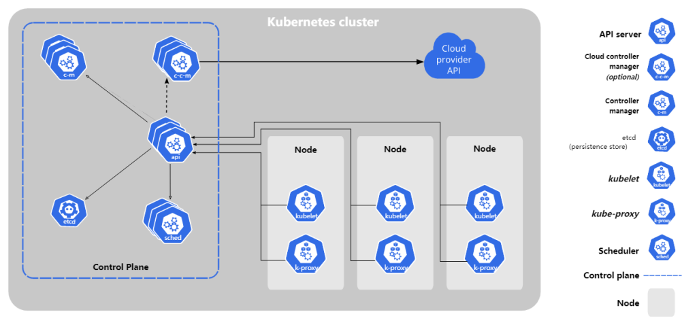

# kubernetes组件

一个 Kubernetes 集群是由一组被称作节点（node）的机器组成， 这些节点上会运行由 Kubernetes 所管理的容器化应用。 且每个集群至少有一个工作节点。

工作节点会托管所谓的 Pods，而 Pod 就是作为应用负载的组件。 控制平面管理集群中的工作节点和 Pods。 为集群提供故障转移和高可用性， 这些控制平面一般跨多主机运行，而集群也会跨多个节点运行。

Kubernetes 集群的组件

**控制平面组件（Control Plane Components）**

控制平面组件会为集群做出全局决策，比如资源的调度。 以及检测和响应集群事件，例如当不满足部署的 `replicas` 字段时， 要启动新的 pod）。

**kube-apiserver**

API 服务器是 Kubernetes 控制平面的组件， 该组件负责公开了 Kubernetes API，负责处理接受请求的工作。 API 服务器是 Kubernetes 控制平面的前端。集群统一入口,以restful方式,交给etcd存储.

**etcd**

`etcd` 是兼顾一致性与高可用性的键值数据库，可以作为保存 Kubernetes 所有集群数据的后台数据库。存储系统,用于保存集群相关的数据。
etcd的官方将它定位成一个可信赖的分布式键值存储服务,它能够为整个分布式集群存储一些关键数据,协助分布式集群的正常运转。[etcd运行原理](http://t.zoukankan.com/liujunjun-p-12186354.html)

**kube-scheduler**

`kube-scheduler` 是控制平面的组件， 负责监视新创建的、未指定运行节点（node）的 Pods， 并选择节点来让 Pod 在上面运行。负责介绍任务，选择合适的节点进行分配任务。

调度决策考虑的因素包括单个 Pod 及 Pods 集合的资源需求、软硬件及策略约束、 亲和性及反亲和性规范、数据位置、工作负载间的干扰及最后时限。

节点调度,选择node节点应用部署。

**kube-controller-manager**

kube-controller-manager 是控制平面的组件， 负责运行控制器进程。

为了降低复杂性，控制器都被编译到同一个可执行文件，并在同一个进程中运行。

控制器：

- 节点控制器（Node Controller）：负责在节点出现故障时进行通知和响应
- 任务控制器（Job Controller）：监测代表一次性任务的 Job 对象，然后创建 Pods 来运行这些任务直至完成
- 端点控制器（Endpoints Controller）：填充端点（Endpoints）对象（即加入 Service 与 Pod）
- 服务帐户和令牌控制器（Service Account & Token Controllers）：为新的命名空间创建默认帐户和 API 访问令牌
- 副本管理器（ReplicationController）：确保特定数量的 Pod 副本处于运⾏状态且总是可用。
- Deployment管理器（DeploymentController）：可以拥有 ReplicaSet 并使⽤声明式⽅式在服务器端完成对 Pods 滚动更新的对象。
- 状态管理器（StatefulSetController）：管理有状态应⽤的⼯作负载 API 对象。
- DaemonSetController：确保全部（或者某些）节点上运⾏⼀个 Pod 的副本。 当有节点加⼊集群时， 也会为他们新增⼀个 Pod 。 当有节点从集群移除时，这些 Pod 也会被回收。删除 DaemonSet 将会删除它创建的所有 Pod。
- JobController：创建一个或者多个Pods,并将继续重试Pods的执行,直到指定数量的Pods成功终止。
- CronJobController：创建基于时隔重复调度的 Jobs。
- TTLController
- EndpointController
- PodGCController
- ResourceQuotaController
- NamespaceController
- ServiceAccountController
- GarbageCollectorController
- HPAController
- DisruptionController
- CSRSigningController
- CSRApprovingController
- TokenController
- NodeController
- ServiceController
- RouteController
- PVBinderController
- AttachDetachController
- BootstrapSignerController
- TokenCleanerController

**cloud-controller-manager**

`cloud-controller-manager` 是指嵌入特定云的控制逻辑之 控制平面组件。 `cloud-controller-manager` 允许你将你的集群连接到云提供商的 API 之上， 并将与该云平台交互的组件同与你的集群交互的组件分离开来。

下面的控制器都包含对云平台驱动的依赖：

- 节点控制器（Node Controller）：用于在节点终止响应后检查云提供商以确定节点是否已被删除
- 路由控制器（Route Controller）：用于在底层云基础架构中设置路由
- 服务控制器（Service Controller）：用于创建、更新和删除云提供商负载均衡器

**Node 组件**

**kubelet**

直接跟容器引擎交互实现容器的生命周期管理。

master排到node节点代表,管理本机容器。

kubelet 会在集群中每个节点（node）上运行。 它保证容器（containers）都运行在 Pod 中。
kubelet 接收一组通过各类机制提供给它的 PodSpecs， 确保这些 PodSpecs 中描述的容器处于运行状态且健康。 kubelet 不会管理不是由 Kubernetes 创建的容器。

**kube-proxy**

负责写入规则至 IPTABLES、IPVS 实现服务映射访问的。

kube-proxy 是集群中每个节点（node）所上运行的网络代理， 实现 Kubernetes 服务（Service） 概念的一部分。
kube-proxy 维护节点上的一些网络规则， 这些网络规则会允许从集群内部或外部的网络会话与 Pod 进行网络通信。
如果操作系统提供了可用的数据包过滤层，则 kube-proxy 会通过它来实现网络规则。 否则，kube-proxy 仅做流量转发。

**k8s核心概念**

Pod

- 最小部署单元
- 一组容器的集合
- 共享网络
- 生命周期是短暂的

controller

- 确保预期的pod副本数量
- 无状态应用部署
- 有状态应用部署
- 确保所有的node运行同一个pod一次性任务和定时任务

Service

- 定义一组pod的访问规则

