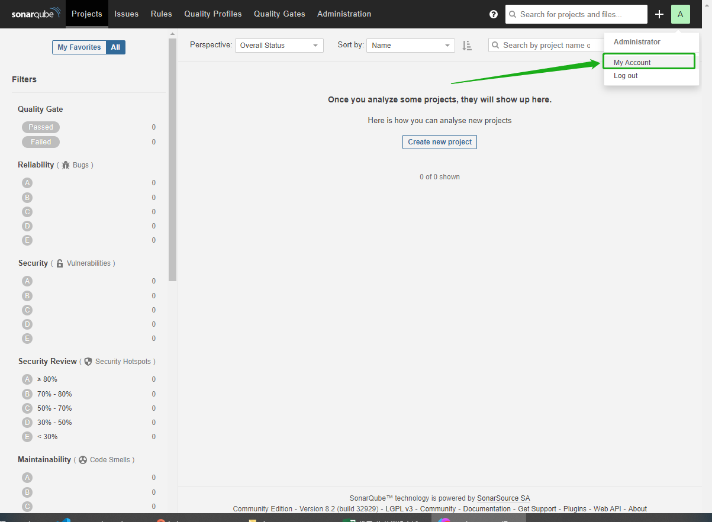

# 一、介绍

SonarQube 是一种主流的代码质量持续检测工具。您可以将其用于代码库的静态和动态分析。SonarQube 集成到 KubeSphere 流水线后，如果在运行的流水线中检测到问题，您可以直接在仪表板上查看常见代码问题，例如 Bug 和漏洞。

需要启用 KubeSphere DevOps 系统。

# 二、安装 SonarQube 服务器

```
helm upgrade --install sonarqube sonarqube --repo https://charts.kubesphere.io/main -n kubesphere-devops-system  --create-namespace --set service.type=NodePort
```

查看：

```
[root@k8s-master01 kubesphere]# kubectl get pod  -n kubesphere-devops-system
NAME                                   READY   STATUS      RESTARTS        AGE
...
sonarqube-postgresql-0                 1/1     Running     0               7m6s
sonarqube-sonarqube-84f6585f85-jnsz6   1/1     Running     1 (2m59s ago)   7m8s
```

获取 SonarQube 控制台地址:

```
export NODE_PORT=$(kubectl get --namespace kubesphere-devops-system -o jsonpath="{.spec.ports[0].nodePort}" services sonarqube-sonarqube)
export NODE_IP=$(kubectl get nodes --namespace kubesphere-devops-system -o jsonpath="{.items[0].status.addresses[0].address}")
echo http://$NODE_IP:$NODE_PORT
```

结果：

```
http://192.168.66.10:30759
```

# 三、配置 SonarQube 服务器

## 3.1 访问 SonarQube 控制台

1. 在浏览器中访问 SonarQube 控制台 `http://<Node IP>:<NodePort>`。
2. 点击右上角的 **Log in**，然后使用默认帐户 `admin/admin` 登录。

## 3.2 创建 SonarQube 管理员令牌 (Token)

1. 点击右上角字母 **A**，然后从菜单中选择 **My Account** 以转到 **Profile** 页面。

   

2. 点击 **Security** 并输入令牌名称，例如 `kubesphere`。得到：68b67a9ac9f2fcfc6e2dd956b3a969a440996cf9 

   

## 3.3 创建 Webhook 服务器

1. 执行以下命令获取 SonarQube Webhook 的地址。

   ```
   export NODE_PORT=$(kubectl get --namespace kubesphere-devops-system -o jsonpath="{.spec.ports[0].nodePort}" services devops-jenkins)
   export NODE_IP=$(kubectl get nodes --namespace kubesphere-devops-system -o jsonpath="{.items[0].status.addresses[0].address}")
   echo http://$NODE_IP:$NODE_PORT/sonarqube-webhook/
   ```

2. 预期输出结果：

   ```
   http://192.168.66.10:30180/sonarqube-webhook/
   ```

3. 依次点击 **Administration**、**Configuration** 和 **Webhooks** 创建一个 Webhook。

   

4. 点击 **Create**。

   

5. 在弹出的对话框中输入 **Name** 和 **Jenkins Console URL**（即 SonarQube Webhook 地址）。点击 **Create** 完成操作。

   

## 3.4 将 SonarQube 配置添加到 ks-installer

1. 执行以下命令编辑 `ks-installer`。

   ```
   kubectl edit cc -n kubesphere-system ks-installer
   ```

2. 搜寻至 `devops`。添加字段 `sonarqube` 并在其下方指定 `externalSonarUrl` 和 `externalSonarToken`。

   ```
   devops:
     enabled: true
     jenkinsJavaOpts_MaxRAM: 2g
     jenkinsJavaOpts_Xms: 512m
     jenkinsJavaOpts_Xmx: 512m
     jenkinsMemoryLim: 2Gi
     jenkinsMemoryReq: 1500Mi
     jenkinsVolumeSize: 8Gi
     sonarqube: # Add this field manually.
       externalSonarUrl: http://192.168.66.10:30759 # The SonarQube IP address.
       externalSonarToken: 68b67a9ac9f2fcfc6e2dd956b3a969a440996cf9  # The SonarQube admin token created above.
   ```

3. 完成操作后保存此文件。

## 3.5 将 SonarQube 服务器添加至 Jenkins

1. 执行以下命令获取 Jenkins 的地址。

   ```
   export NODE_PORT=$(kubectl get --namespace kubesphere-devops-system -o jsonpath="{.spec.ports[0].nodePort}" services devops-jenkins)
   export NODE_IP=$(kubectl get nodes --namespace kubesphere-devops-system -o jsonpath="{.items[0].status.addresses[0].address}")
   echo http://$NODE_IP:$NODE_PORT
   ```

2. 您可以获得以下输出，获取 Jenkins 的端口号。

   ```
   http://192.168.66.10:30180
   ```

3. 可以直接用kubesphere账号登录`admin/P@88w0rd`

   

4. 点击左侧导航栏中的**系统管理**—**系统配置**。搜寻到 **SonarQube servers**，然后点击 **Add SonarQube**。

5. 输入 **Name** 和 **Server URL** (`http://<Node IP>:<NodePort>`)。点击**添加**，选择 **Jenkins**，然后在弹出的对话框中用 SonarQube 管理员令牌创建凭证（如下方第二张截图所示）。创建凭证后，从 **Server authentication token** 旁边的下拉列表中选择该凭证。点击**应用**完成操作。

   

   配置id为sonarqube的密钥：

   

## 3.6 将 sonarqubeURL 添加到 KubeSphere 控制台

您需要指定 `sonarqubeURL`，以便可以直接从 KubeSphere 控制台访问 SonarQube。

1 执行以下命令：

```
kubectl edit  cm -n kubesphere-system  ks-console-config
```
2 搜寻到 `data.client.enableKubeConfig`，在下方添加 `devops` 字段并指定 `sonarqubeURL`。

```
client:
  enableKubeConfig: true
  devops: # 手动添加该字段。
    sonarqubeURL: http://192.168.66.10:30759 # SonarQube IP 地址。
```
3 重启服务

```
kubectl -n kubesphere-devops-system rollout restart deploy devops-apiserver
kubectl -n kubesphere-system rollout restart deploy ks-console
```


## 3.7 为新项目创建 SonarQube Token

您需要一个 SonarQube 令牌，以便您的流水线可以在运行时与 SonarQube 通信。

1. 在 SonarQube 控制台上，点击 **Create new project**。

   

2. 输入项目密钥，例如 `java-demo`，然后点击 **Set Up**。

   

3. 输入项目名称，例如 `java-sample`，然后点击 **Generate**。token：b0aa4ba3f0661297c10640f3e4e1e2c918a7b188

   

4. 创建令牌后，点击 **Continue**。

   

5. 分别选择 **Java** 和 **Maven**。

   ```
   mvn sonar:sonar \
     -Dsonar.projectKey=java-demo \
     -Dsonar.host.url=http://192.168.66.10:30759 \
     -Dsonar.login=b0aa4ba3f0661297c10640f3e4e1e2c918a7b188
   ```

   

 