# 一、KubeSphere 介绍

KubeSphere 是在 Kubernetes 之上构建的面向云原生应用的**分布式操作系统**，完全开源，支持多云与多集群管理，提供全栈的 IT 自动化运维能力，简化企业的 DevOps 工作流。它的架构可以非常方便地使第三方应用与云原生生态组件进行即插即用 (plug-and-play) 的集成。 

功能：

- 多云与多集群管理
- Kubernetes 资源管理
- DevOps
- 应用生命周期管理
- 微服务治理（服务网格）
- 日志查询与收集
- 服务与网络
- 多租户管理
- 监控告警
- 事件与审计查询
- 存储管理
- 访问权限控制
- GPU 支持
- 网络策略
- 镜像仓库管理
- 安全管理等 

# 二、部署 KubeSphere

当卸载重新安装时，执行下面 的脚本全面卸载：

```
https://github.com/kubesphere/ks-installer/edit/master/scripts/kubesphere-delete.sh
```

## 2.1 执行以下命令以开始安装：

```
cat >> default-storage-class.yaml <<-EOF
kind: StorageClass
apiVersion: storage.k8s.io/v1
metadata:
  name: local
  annotations:
    cas.openebs.io/config: |
      - name: StorageType
        value: "hostpath"
      - name: BasePath
        value: "/var/openebs/local/"
    kubectl.kubernetes.io/last-applied-configuration: >
      {"apiVersion":"storage.k8s.io/v1","kind":"StorageClass","metadata":{"annotations":{"cas.openebs.io/config":"-
      name: StorageType\n  value: \"hostpath\"\n- name: BasePath\n  value:
      \"/var/openebs/local/\"\n","openebs.io/cas-type":"local","storageclass.beta.kubernetes.io/is-default-class":"true","storageclass.kubesphere.io/supported-access-modes":"[\"ReadWriteOnce\"]"},"name":"local"},"provisioner":"openebs.io/local","reclaimPolicy":"Delete","volumeBindingMode":"WaitForFirstConsumer"}
    openebs.io/cas-type: local
    storageclass.beta.kubernetes.io/is-default-class: 'true'
    storageclass.kubesphere.io/supported-access-modes: '["ReadWriteOnce"]'
provisioner: openebs.io/local
reclaimPolicy: Delete
volumeBindingMode: WaitForFirstConsumer
EOF
kubectl apply -f default-storage-class.yaml
```


```
kubectl apply -f https://github.com/kubesphere/ks-installer/releases/download/v3.2.1/kubesphere-installer.yaml
kubectl apply -f https://github.com/kubesphere/ks-installer/releases/download/v3.2.1/cluster-configuration.yaml

#默认sc
 kubectl patch sc openebs-hostpath -p '{"metadata": {"annotations": {"storageclass.beta.kubernetes.io/is-default-class": "true"}}}'
```
## 2.2 检查安装

日志查看：

```
kubectl logs -n kubesphere-system $(kubectl get pod -n kubesphere-system -l 'app in (ks-install, ks-installer)' -o jsonpath='{.items[0].metadata.name}') -f

结果：
Collecting installation results ...
#####################################################
###              Welcome to KubeSphere!           ###
#####################################################

Console: http://192.168.66.10:30880
Account: admin
Password: P@88w0rd
```
安装服务查看：

使用 `kubectl get pod --all-namespaces` 查看所有 Pod 在 KubeSphere 相关的命名空间是否正常运行。如果是正常运行，请通过以下命令来检查控制台的端口（默认为 30880，可以通过默认帐户和密码 (`admin/P@88w0rd`) 访问 Web 控制台。）：

```
kubectl get svc/ks-console -n kubesphere-system
```
重置密码：

```
kubectl patch users <USERNAME> -p '{"spec":{"password":"<YOURPASSWORD>"}}' --type='merge' && kubectl annotate users <USERNAME> iam.kubesphere.io/password-encrypted-

kubectl patch users admin -p '{"spec":{"password":"P@88w0rd"}}' --type='merge' && kubectl annotate users admin iam.kubesphere.io/password-encrypted-
```
# 三、示例wordpress部署

这里使用project-regular权限账号进行登录，可以通过admin用户添加指定账号，然后创建空间demo-wordspace，并且创建demo-project项目

## 3.1 密钥创建

选择**类型**为 Opaque（默认）

mysql密钥：

```
名称：mysql-secret
键值：MYSQL_ROOT_PASSWORD=123456
```

创建 WordPress 密钥：

```
名称：wordpress-secret
键值：WORDPRESS_DB_PASSWORD =123456
   
```

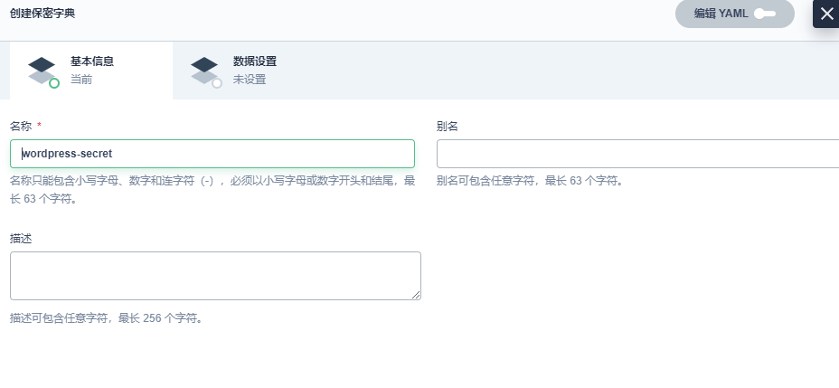

## 3.2 创建持久卷声明

创建持久券：wordpress-pvc ，选择（存储类、访问模式、卷容量）

## 3.3 创建应用程序

### 3.3.1 添加 MySQL 后端组件

（1）创建应用

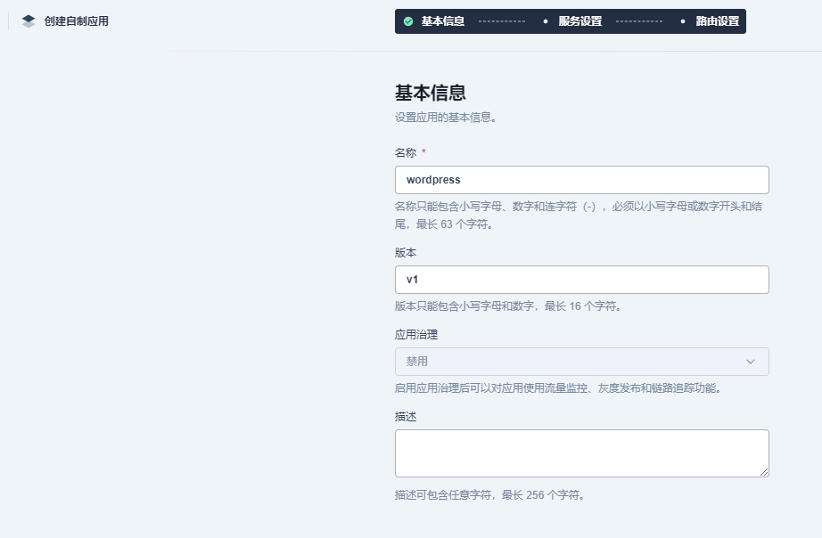

（2）创建mysql服务

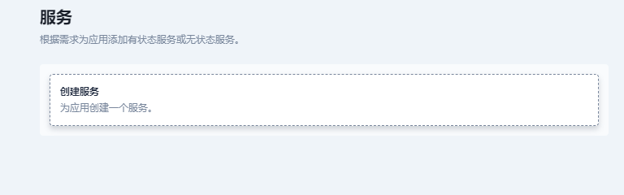

（3）选择有状态服务

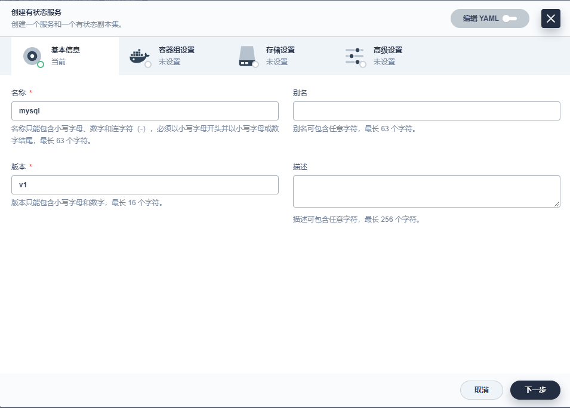

（4）容器配置

在搜索框中输入 `mysql:5.6`，按下**回车键**，然后点击**使用默认端口**。

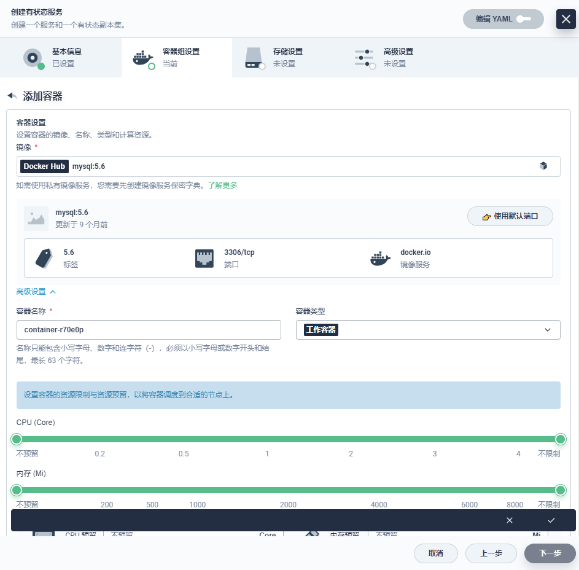

（5）环境变量配置

向下滚动到**环境变量**，点击**来自保密字典**。输入名称 `MYSQL_ROOT_PASSWORD`，然后选择资源 `mysql-secret` 和前面步骤中创建的密钥 `MYSQL_ROOT_PASSWORD`

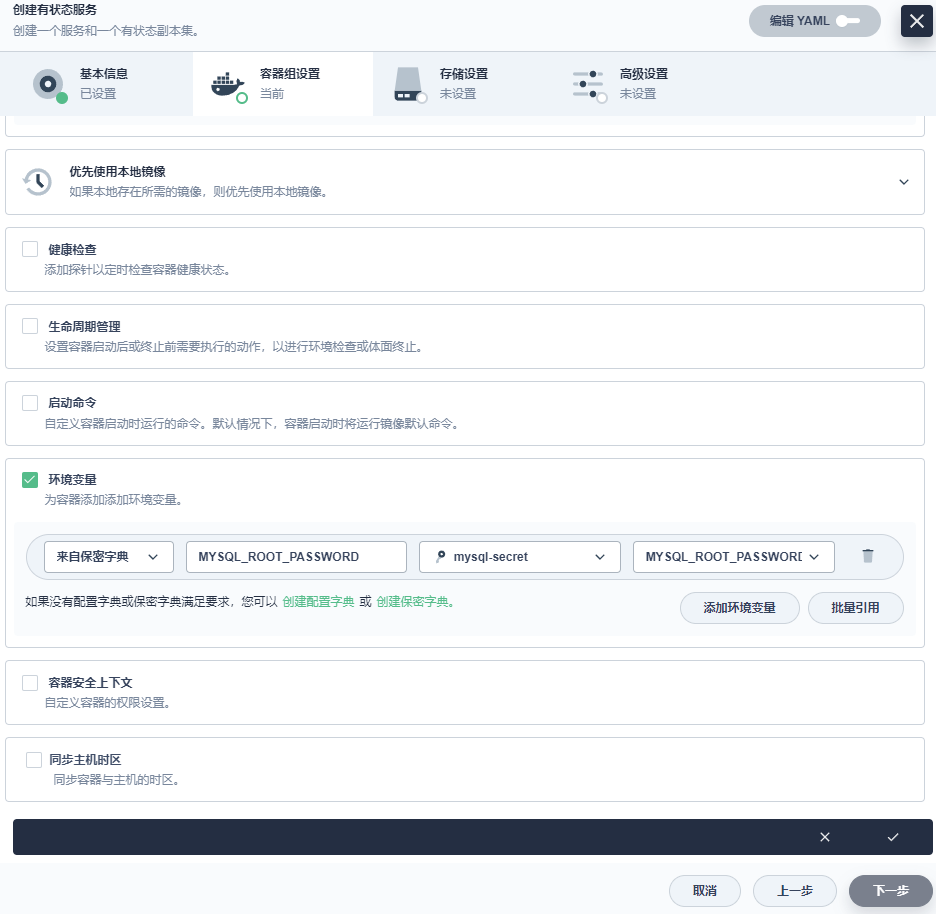

（6）存储设置

选择**存储设置**中的**添加持久卷声明模板**，输入 PVC 名称前缀 (`mysql`) 和**挂载路径**（模式：`读写`，路径：/var/lib/mysql）的值。

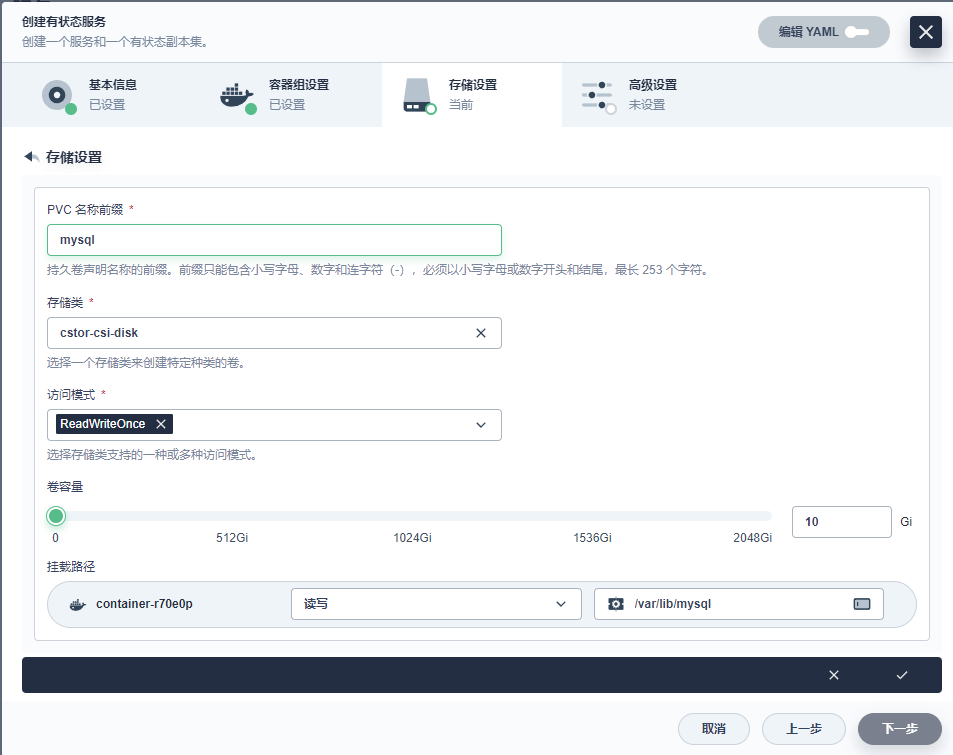


（7）随后直接添加

### 3.3.2 wordpress服务添加

（1）无状态服务添加

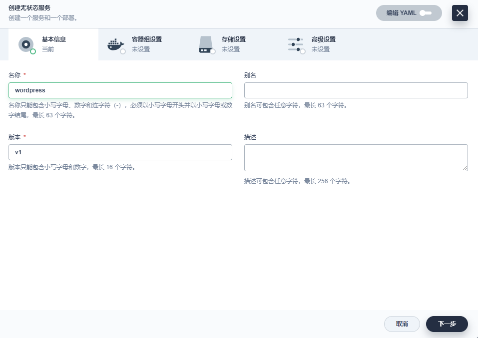

（2）容器配置

在搜索栏中输入 wordpress:4.8-apache 并按下**回车键**，然后点击**使用默认端口**。

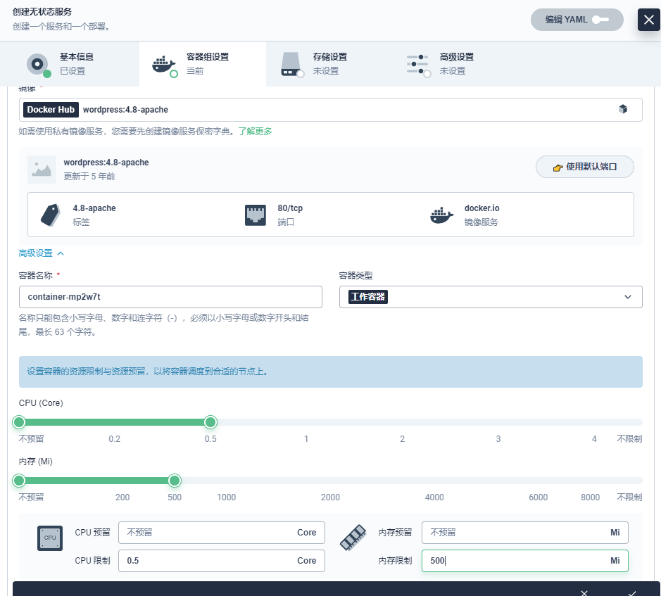


(3) 环境变量

向下滚动到**环境变量**，点击**来自保密字典**。这里需要添加两个环境变量，请输入以下值：

- 对于 `WORDPRESS_DB_PASSWORD`，请选择在步骤 1 中创建的 `wordpress-secret` 和 `WORDPRESS_DB_PASSWORD`。
- 点击**添加环境变量**，分别输入 `WORDPRESS_DB_HOST` 和 `mysql` 作为键 (Key) 和值 (Value)。

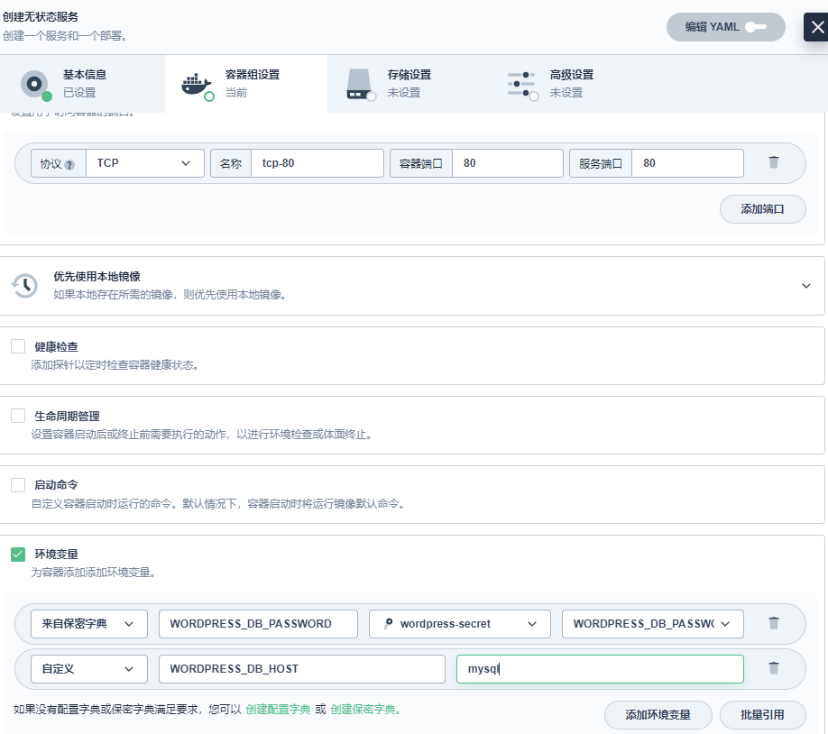

(4) 存储设置

选择上一步创建的 `wordpress-pvc`，将模式设置为`读写`，并输入挂载路径 `/var/www/html`

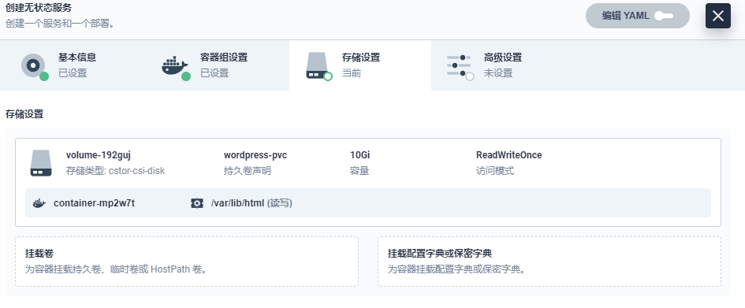

（5）路由设置

**路由设置**中设置路由规则（应用路由 Ingress），也可以直接点击**创建**。创建成功后，应用将显示在应用列表中。

### 3.3.3 验证资源

在**工作负载**中，分别检查**部署**和**有状态副本集**中 `wordpress-v1` 和 `mysql-v1` 的状态。如果它们的运行状态为**运行中**，就意味着 WordPress 已经成功创建。

### 3.3.4 通过 NodePort 访问 WordPress

1. 若要在集群外访问服务，选择左侧导航栏中的**应用负载 > 服务**。点击 `wordpress` 右侧的三个点后，选择**编辑外部访问**。
2. 在**访问方式**中选择 `NodePort`，然后点击**确定**。
3. 点击**服务**进入详情页，可以在**端口**处查看暴露的端口。
4. 通过 `{Node IP}:{NodePort}` 访问此应用程序，可以看到下图：

# 四、查看结果

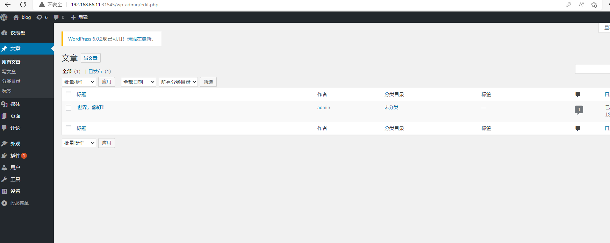