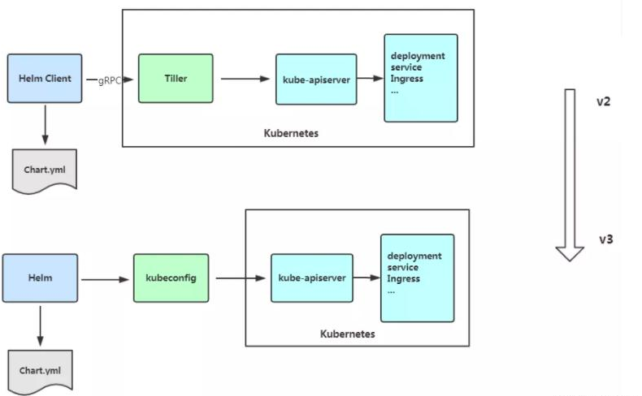

# 一、介绍

Helm 是一个 Kubernetes 的包管理工具，就像 Linux 下的包管理器，如 yum/apt 等，可以很方便的将之前打包好的 yaml 文件部署到 kubernetes 上。 

Helm 有 3 个重要概念： 

（1）helm：一个命令行客户端工具，主要用于 Kubernetes 应用 chart 的创建、打包、发 布和管理。 

（2）Chart：应用描述，一系列用于描述 k8s 资源相关文件的集合。 

（3）Release：基于 Chart 的部署实体，一个 chart 被 Helm 运行后将会生成对应的一个 release；将在 k8s 中创建出真实运行的资源对象。

```
Helm Version	Supported Kubernetes Versions
3.9.x	1.24.x - 1.21.x
3.8.x	1.23.x - 1.20.x
3.7.x	1.22.x - 1.19.x
```

Helm v3 变化：



# 二、安装

```
wget -c https://get.helm.sh/helm-v3.9.2-linux-amd64.tar.gz
tar -xf helm-v3.9.2-linux-amd64.tar.gz
cd linux-amd64/
mv helm /usr/local/bin/
```

## 2.1 配置国内 chart 仓库

微软仓库（http://mirror.azure.cn/kubernetes/charts/）这个仓库推荐，基本上官网有的 chart 这里都有。 

阿里云仓库（https://kubernetes.oss-cn-hangzhou.aliyuncs.com/charts ）

官方仓库（https://hub.kubeapps.com/charts/incubator）官方 chart 仓库，国内有点不好使。

**添加存储库**

```shell
$ helm repo add stable http://mirror.azure.cn/kubernetes/charts 
$ helm repo add aliyun https://kubernetes.oss-cn-hangzhou.aliyuncs.com/charts 
$ helm repo update
```

**查看配置的存储库** 

```shell
$ helm repo list 
$ helm search repo stable
```

**删除存储库**

```shell
helm repo remove aliyun
```

# 三、命令

| 命令       | 说明                                                         |
| ---------- | ------------------------------------------------------------ |
| dependency | 管理 chart 依赖                                              |
| get        | 下载一个 release。可用子命令：all、hooks、manifest、notes、values |
| history    | 获取 release 历史                                            |
| install    | 安装一个 chart                                               |
| list       | 列出 release                                                 |
| package    | 将 chart 目录打包到 chart 存档文件中                         |
| pull       | 从远程仓库中下载 chart 并解压到本地 # helm pull stable/mysql --untar |
| repo       | 添加，列出，移除，更新和索引 chart 仓库。可用子命令：add、index、 |
| rollback   | 从之前版本回滚                                               |
| search     | 根据关键字搜索 chart。可用子命令：hub、repo                  |
| show       | 查看 chart 详细信息。可用子命令：all、chart、readme、values  |
| status     | 显示已命名版本的状态                                         |
| template   | 本地呈现模板                                                 |
| uninstall  | 卸载一个 release                                             |
| upgrade    | 更新一个 release                                             |
| version    | 查看 helm 客户端版本                                         |

## 3.1 添加库

```
添加图表存储库
helm repo add bitnami https://charts.bitnami.com/bitnami
```

## 3.2 列出可以安装的

```
# 列入可以安装的bitnami库
helm search repo bitnami 
```

## 3.3 更新charts

```
helm repo update 
```

## 3.4 安装

```
helm install bitnami/mysql --generate-name
# values配置覆盖安装
helm install -f values.yaml bitnami/wordpress --generate-name
```

## 3.5  列表

```
helm list -n 空间
```

## 3.6 查看chart的基本信息

```
helm show chart bitnami/mysql
```

## 3.7 **卸载**

```
helm uninstall mysql-1612624192
```

## 3.8 **查看该版本的信息**

```
helm status mysql-1612624192
```

## 3.9 **回滚版本**

```
helm rollback version
```

## 3.10 搜索

Helm 搜索使用模糊字符串匹配算法

```
helm search hub wordpress
```

## 3.11 拉取到本地

```
helm pull chartrepo/chartname
```

# 四、 安装前自定义 chart

配置优先级：

1. --set值,优先级更高,覆盖的内容会被被保存在 ConfigMap 中,可以通过 helm get values <release-name> 来查看指定 release 中 --set设置的值
2.  可以通过运行 helm upgrade 并指定 --reset-values 字段来清除 --set 中设置的值。

--set选项使用0或多个 name/value 对。最简单的用法类似于：--set name=value，等价于如下 YAML 格式：

```
name: value
```

多个值使用逗号分割，因此 --set a=b,c=d 的 YAML 表示是：

```
a: b
c: d
```

支持更复杂的表达式。例如，--set outer.inner=value 被转换成了：

```
outer:
  inner: value
```

列表使用花括号（{}）来表示。例如，--set name={a, b, c}被转换成了：

```
name:
  - a
  - b
  - c
```

从 2.5.0 版本开始，可以使用数组下标的语法来访问列表中的元素。例如 `--set servers[0].port=80` 就变成了：

```
servers:
  - port: 80
```

多个值也可以通过这种方式来设置。`--set servers[0].port=80,servers[0].host=example` 变成了：

```
servers:
  - port: 80
    host: example
```

如果需要在 `--set` 中使用特殊字符，你可以使用反斜线来进行转义；`--set name=value1\,value2` 就变成了：

```
name: "value1,value2"
```

类似的，你也可以转义点序列（英文句号）。这可能会在 chart 使用 `toYaml` 函数来解析 annotations，labels，和 node selectors 时派上用场。`--set nodeSelector."kubernetes\.io/role"=master` 语法就变成了：

```
nodeSelector:
  kubernetes.io/role: master
```

# 五、版本控制

```
# 升级
helm upgrade -f panda.yaml happy-panda bitnami/wordpress
# 版本查看
helm history [RELEASE]
# 回滚
helm rollback happy-panda 1
```

# 六、创建你自己的 charts

```
# 创建charts
helm create deis-workflow
# 格式检查
helm lint deis-workflow
# 打包生成deis-workflow-0.1.0.tgz
helm package deis-workflow
# 安装
helm install deis-workflow ./deis-workflow-0.1.0.tgz
# 非安装预览
helm install deis-workflow ./deis-workflow-0.1.0.tgz --dry-run --debug
```
