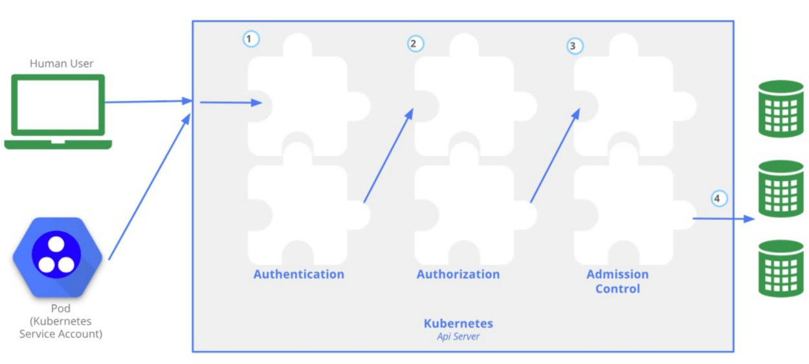
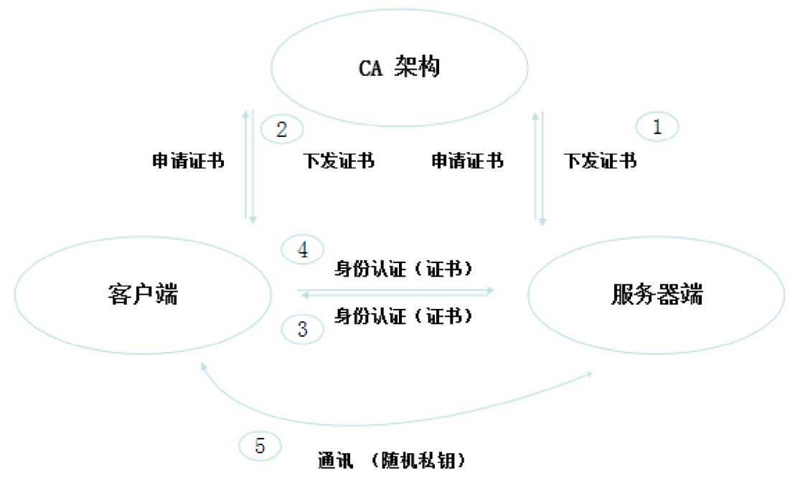
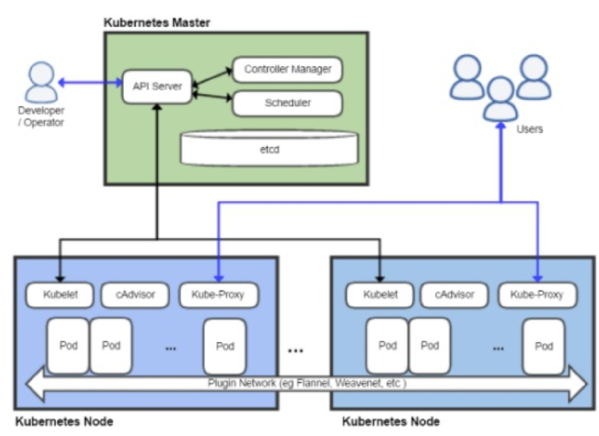
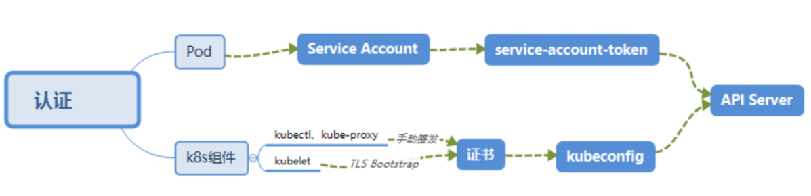
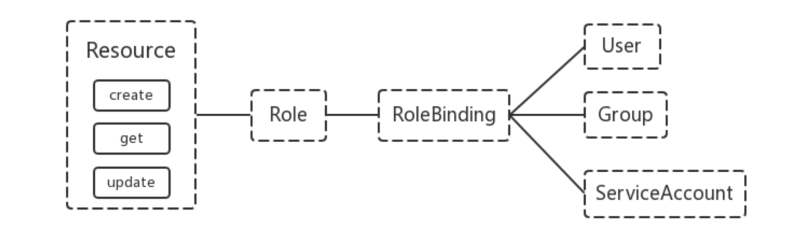

# 机制说明
Kubernetes 作为一个分布式集群的管理工具,保证集群的安全性是其一个重要的任务。API Server是集群内部各个组件通信的中介,也是外部控制的入口。所以Kubernetes的安全机制基本就是围绕保护API Server来设计的。Kubernetes 使用了认证(Authentication) 、鉴权(Authorization)、准入控制(Admission
Control)三步来保证API Server的安全。



# 认证 Authentication

（1）HTTP Token 认证：通过一个 Token来识别合法用户

HTTP Token 的认证是用一个很长的特殊编码方式的并且难以被模仿的字符串-Token来表达客户的一种方式。Token 是一个很长的很复杂的字符串,每一个Token对应一个用户名存储在API Server 能访问的文件中。当客户端发起API调用请求时,需要在HTTP Header 里放入Token

（2）HTTP Base认证：通过 用户名+密码的方式认证
用户名+:+密码用BASE64算法进行编码后的字符串放在HTTP Request中的HeatherAuthorization 域里发送给服务端,服务端收到后进行编码,获取用户名及密码
（3）最严格的HTTPS 证书认证：基于CA根证书签名的客户端身份认证方式

1、HTTPS证书认证:



2 需要认证的节点



两种类型

- Kubenetes 组件 API Server B访: kubectl, Controller Manager, Scheduler, kubelet, kube-proxy
- Kubernetes 管理的Pod 对容器的访问: Pod (dashborad 也是以Pod形式运行)

安全性说明

- Controller Manager, Scheduler 与 API Server 在同一台机器,所以直接使用API Server的非安全端口访问,--insecure-bind-address=127.0.0.1
- kubectl, kubelet, kube-proxy 访问 API Server 就都需要证书进行HTTPS 双向认证

证书须发

- 手动签发:通过k8s集群的跟ca进行签发HTTPS证书
- 自动签发: kubelet首次访问API Server 时,使用token做认证,通过后, Controller Manager 会为kubelet 生成一个证书,以后的访问都是用证书做认证了

3 kubeconfig

kubeconfig文件包含集群参数(CA证书、API Server地址),客户端参数(上面生成的证书和私钥),集群context信息(集群名称、用户名) 。Kubenetes 组件通过启动时指定不同的kubeconfig文件可以切换到不同的集群

4 ServiceAccount

Pod中的容器访问API Server。因为Pod的创建、销毁是动态的,所以要为它手动生成证书就不可行了。Kubenetes使用了Service Account解决Pod 访问API Server的认证问题。

5 Secret 与 SA 的关系

Kubernetes 设计了一种资源对象叫做Secret, 分为两类,一种是用于ServiceAccount 的service-account-token,另一种是用于保存用户自定义保密信息的Opaque, ServiceAccount中用到包含三个部分: Token,ca.crt, namespace

- token是使用 API Server 私钥签名的JWT。用于访问API Server时, Server端认证 
- ca.crt,根证书。用于Client端验证API Server发送的证书
- namespace, 标识这个service-account-token的作用域名空间

```
kubectl get secret --all-namespaces
kubectl describe secret default-token-5gm9r --namespace=kube-system
```

默认情况下,每个namespace 都会有一个 ServiceAccount，如果Pod在创建时没有指定ServiceAccount，就会使用Pod所属的namespace的 ServiceAccount。

## 最终流程



# 授权

上面认证过程,只是确认通信的双方都确认了对方是可信的,可以相互通信。而鉴权是确定请求方有哪些资源的权限。

API Server 目前支持以下几种授权策略(通过API Server的启动参数

- AlwaysDeny:表示拒绝所有的请求,一般用于测试
- AlwaysAllow:允许接收所有请求,如果集群不需要授权流程,则可以采用该策略
- ABAC (Attribute-Based Access Control) :基于属性的访问控制,表示使用用户配置的授权规则对用户请求进行匹配和控制
- Webbook:通过调用外部 REST服务对用户进行授权
- RBAC (Role-Based Access Control) :基于角色的访问控制,现行默认规则

## RBAC授权模式
RBAC (Role-Based Access Control)基于角色的访问控制,在Kubernetes 1.5中引入,现行版本成为默认标准。相对其它访问控制方式,拥有以下优势:

- 对集群中的资源和非资源均拥有完整的覆盖
- 整个RBAC完全由几个API对象完成,同其它API对象一样,可以用kubectl或API进行操作
- 可以在运行时进行调整,无需重启API Server

1、RBAC的API资源对象说明

RBAC 引入了4个新的顶级资源对象: Role, ClusterRole, RoleBinding, ClusterRoleBinding, 4 种对象类型均可以通过kubectl 与API操作。



需要注意的是Kubenetes 并不会提供用户管理,那么User, Group, ServiceAccount指定的用户又是从哪里来的呢? Kubenetes 组件(kubectl, kube-proxy)或是其他自定义的用户在向CA申请证书时,需要提供一个证书请求文件

```json
{
  "CN": "admin",
  "hosts": [],
  "key": {
    "algo": "rsa",
    "size": 2048
  },
  "names":[{
    "C":"CN",
    "ST":"HangZhou",
    "L":"XS",
    "O":"system:masters",
    "OU": "System"
   }
  ]
}
```

API Server会把客户端证书的CN字段作为User,把names.0字段作为Group 

kubelet 使用 TLS Bootstaping 认证H, API Server 可以使用 Bootstrap Tokens 或者 Token authentication file验证=token,无论哪一种, Kubenetes 都会为token绑定一个默认的User 和Group

Pod使用 ServiceAccount 认证时, service-account-token 中的JWT 会保存User信息.有了用户信息,再创建一对角色/角色绑定(集群角色/集群角色绑定)资源对象,就可以完成权限绑定了Role and ClusterRole

在RBAC API中, Role表示一组规则权限,权限只会增加(累加权限),不存在一个资源一开始就有很多权限而通过RBAC对其进行减少的操作; Role可以定义在一个namespace中,如果想要跨namespace则可以创建ClusterRole

```yaml
kind: Role
apiVersion: rbac.authorization.k8s.io/vlbeta1
metadata:
  namespace: default
  name: pod-readen
rules:
- apiGroups: [""] #""indicates the core API group
  resources: ["pods"]
  verbs: ["get","watch","list"]
```

ClusterRole 具有与Role 相同的权限角色控制能力,不同的是ClusterRole是集群级别的, ClusterRole可以用于：

- 集群级别的资源控制(例如node 访问权限)
- 非资源型endpoints(例如/healthz访问)
- 所有命名空间资源控制(例如 pods)

```yaml
kind: ClusterRole
apiVersion: rbac.authorization.k8s.io/v1beta1
metadata:
  name: secret-reader
rules:
- apiGroups: [""] #""indicates the core API group
  resources: ["secrets"]
  verbs: ["get","watch","list"]
```

## RoleBinding and ClusterRoleBinding

RoloBinding 可以将角色中定义的权限授予用户或用户组, RoleBinding包含一组权限列表(subjects),权限列表中包含有不同形式的待授予权限资源类型(users, groups, or service accounts); RoloBinding 同样包含对被Bind 的Role 引用; RoleBinding 适用于某个命名空间内授权,而ClusterRoleBinding适用于集群范围内的授权 

将default 命名空间的{pod-reader Role授予jane 用户,此后jane 用户在default 命名空间中将具有pod-reader的权限

```yaml
kind: RoleBinding
apiVersion: rbac.authorization.k8s.io/vlbeta1
metadata:
  name: read-pods
  namespace: default
subjects:
- kind: User
  name: jane
  apiGroup: rbac.authorization.k8s.io
roleRef:
  kind: Role
  name: pod-reader
  apiGroup: rbac.authorization.k8s.io
```

RoleBinding 同样可以引用 ClusterRole 来对当前 namespace 内用户、用户组或 ServiceAccount进行授权,这种操作允许集群管理员在整个集群内定义一些通用的ClusterRole,然后在不同的namespace中使用RoleBinding 来引用

例如,以下RoleBinding 引用了一个 ClusterRole,这个ClusterRole具有整个集群内对secrets的访问权限;但是其授权用户dave只2能访问 development 空间中的secrets(因为RoleBinding 定义在development命名空间)

```yaml
# This role binding allows \
kind: RoleBinding
apiVersion: rbac.authorization.k8s.io/v1beta1
metadata:
  name: read-secrets
  namespace: development # This only grants permissions within the \
subjects:
- kind: User
  name: dave
  apiGroup: rbac.authorization.k8s.io
roleRef:
  kind: ClusterRole
  name: secret-reader
  apiGroup: rbac.authorization.k8s.io
```

使用ClusterRoleBinding 可以对整个集群中的所有命名空间资源权限进行授权;以下ClusterRoleBinding样例展示了授权manager组内所有用户在全部命名空间中对secrets进行访问

```yaml
# This cluster role binding allows anyone in the \
namespace.
kind: ClusterRoleBinding
apiVersion: rbac.authorization. k8s.io/vlbeta1
metadata:
  name: read-secrets-global
subjects:
- kind: Group
  name: manager
  apiGroup: rbac.authorization.k8s.io
roleRef:
  kind: ClusterRole
  name: secret-reader
  apiGroup: rbac.authorization.k8s.io
```

## Resources
Kubernetes 集群内一些资源一般以其名称字符串来表示,这些字符串一般会在API的URL地址中出现;同时某些资源也会包含子资源,例如logs资源就属于pods 的子资源,API中URL样例如下

```
GET /api/v1/namespaces/{namespace}/pods/{name}/log
```

如果要在RBAC授权模型中控制这些子资源的访问权限,可以通过/分隔符来实现,以下是一个定义pods资资源logs 访问权限的Role定义样例.

```yaml
kind: Role
apiVersion: rbac.authorization.k8s.io/v1beta1
metadata:
namespace: default
name: pod-and-pod-logs-reader
rules:
- apiGroups: [""]
  resources: ["pods/log"]
  verbs: ["get","list"]
```

## to Subjects
RoleBinding 和 ClusterRoleBinding 可以 Role 定到 Subjects; Subjects 可以是 groups, users 或者service accounts

Subjects 中 Users 使用字符串表示,它可以是一个普通的名字字符串,如"alice",也可以是email地址,如“leellun@sina.cn”；甚至是一组字符串形式的数字ID。但是users的前缀system：是系统保留的，集群管理员应该确保普通用户不会使用这个前缀格式。

Groups 书写格式与Users相同,都为一个字符串,并且没有特定的格式要求;同样system:前缀为系统保留

# 准入控制
准入控制是API Server的插件集合,通过添加不同的插件,实现额外的准入控制规则。甚至于API Server的一些主要的功能都需要通过Admission Controllers 实现,比如ServiceAccount官方文档上有一份针对不同版本的准入控制器推荐列表,其中最新的1.14的推荐列表是:

NamespaceLifecycle, LimitRanger, ServiceAccount, DefaultStorageClass,DefaultTolerationSeconds, Mutat
ingAdmissionWebhook, ValidatingAdmissionWebhook, ResourceQuota

列举几个插件的功能:

- NamespaceLifecycle：防止在不存在的 namespace 上创建对象,防止删除系统预置namespace,删除namespace 时,连带删除它的所有资源对象。
- LimitRanger：确保请求的资源不会超过资源所在Namespace 的LimitRange的限制。
- ServiceAccount： 实现了自动化添加 ServiceAccount
- ResourceQuota：确保请求的资源不会超过资源的ResourceQuota限制。