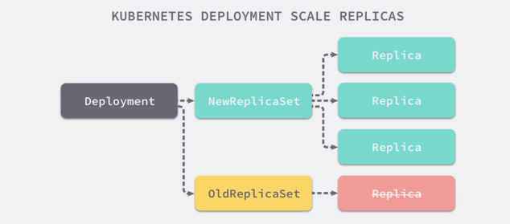

# RC

RC (ReplicationController )主要的作用就是用来确保容器应用的副本数始终保持在用户定义的副本数。即如果有容器异常退出,会自动创建新的Pod来替代:而如果异常多出来的容器也会自动回收

Kubernetes 官方建议使用RS (ReplicaSet)替代RC (ReplicationController)进行部署,RS跟RC没有本质的不同,只是名字不一样,并且RS支持集合式的selector

```yaml
apiVersion: apps/v1
kind: ReplicaSet
metadata:
  name: frontend
spec:
  replicas: 3
  selector:
    matchLabels:
      tier: frontend
  template:
    metadata:
      labels:
        tier: frontend
    spec:
      containers:
      - name: php-redis
        image: gcr.io/google_samples/gb-frontend:v3
        env:
        - name: GET_HOSTS_FROM
          value: dns
        ports:
        - containerPort: 88
```

操作：

```
[root@k8s-master01 data5]# kubectl create -f rs.yaml 
[root@k8s-master01 data5]# kubectl get pod -o wide
NAME             READY   STATUS    RESTARTS   AGE   IP           NODE         NOMINATED NODE   READINESS GATES
frontend-dflfh   1/1     Running   0          11m   10.244.2.6   k8s-node02   <none>           <none>
frontend-vnjfd   1/1     Running   0          11m   10.244.1.9   k8s-node01   <none>           <none>
frontend-x9kfr   1/1     Running   0          11m   10.244.1.8   k8s-node01   <none>           <none>
```

修改label过程

```
[root@k8s-master01 data5]# kubectl get pod --show-labels
NAME             READY   STATUS              RESTARTS   AGE    LABELS
frontend-dflfh   0/1     ContainerCreating   0          109s   tier=frontend
frontend-vnjfd   0/1     ContainerCreating   0          109s   tier=frontend
frontend-x9kfr   0/1     ContainerCreating   0          109s   tier=frontend
[root@k8s-master01 data5]# kubectl label pod frontend-vnjfd tier=frontend1 --overwrite
pod/frontend-vnjfd labeled
[root@k8s-master01 data5]# kubectl get pod --show-labels
NAME             READY   STATUS    RESTARTS   AGE   LABELS
frontend-dflfh   1/1     Running   0          15m   tier=frontend
frontend-vnjfd   1/1     Running   0          15m   tier=frontend1
frontend-x9kfr   1/1     Running   0          15m   tier=frontend
frontend-zqxxj   1/1     Running   0          40s   tier=frontend
```

结论：当label修改为frontend1后，rs将会创建一个新的pod，因为rs通过label控制pod，当其中一个pod的label修改了，rs就会自动创建一个

将pod的label修改回frontend：

```
[root@k8s-master01 data5]# kubectl label pod frontend-vnjfd tier=frontend --overwrite 
pod/frontend-vnjfd labeled
[root@k8s-master01 data5]# kubectl get pod --show-labels                             
NAME             READY   STATUS    RESTARTS   AGE   LABELS
frontend-dflfh   1/1     Running   0          17m   tier=frontend
frontend-vnjfd   1/1     Running   0          17m   tier=frontend
frontend-x9kfr   1/1     Running   0          17m   tier=frontend
```

结论：rs会自动的缩减pod，将上面新增的pod去掉。

# RS 与Deployment 的关联



# Deployment

Deployment为Pod和ReplicaSet提供了一个声明式定义(declarative)方法,用来替代以前的ReplicationController 来方便的管理应用。典型的应用场景包括:

- 定义Deployment来创建Pod和ReplicaSet
- 滚动升级和回滚应用
- 扩容和缩容
- 暂停和继续Deployment

## 1、部署一个简单的Nginx应用

```yaml
apiVersion: apps/v1
kind: Deployment
metadata:
  name: nginx-deployment
spec:
  replicas: 3
  selector:
    matchLabels:
      app: nginx
  template:
    metadata:
      labels:
        app: nginx
    spec:
      containers:
      - name: nginx
        image: harborcloud.com/library/nginx:1.7.9
        ports:
        - containerPort: 88
```

````yaml
kubectl create -f nginx-deployment.yaml -record
# --record参数可以记录命令,我们可以很方便的查看每次revision的变化
````

## 2、扩容

```
[root@k8s-master01 data5]# kubectl scale deployment nginx-deployment --replicas 10
[root@k8s-master01 data5]# kubectl get pod -o wide
NAME                                READY   STATUS    RESTARTS   AGE     IP            NODE         NOMINATED NODE   READINESS GATES
nginx-deployment-56bd657787-4qvb6   1/1     Running   0          17m     10.244.1.11   k8s-node01   <none>           <none>
nginx-deployment-56bd657787-777rm   1/1     Running   0          17m     10.244.1.10   k8s-node01   <none>           <none>
nginx-deployment-56bd657787-78hq6   1/1     Running   0          2m36s   10.244.2.13   k8s-node02   <none>           <none>
nginx-deployment-56bd657787-86wzj   1/1     Running   0          2m36s   10.244.2.11   k8s-node02   <none>           <none>
nginx-deployment-56bd657787-98tn6   1/1     Running   0          2m36s   10.244.1.12   k8s-node01   <none>           <none>
nginx-deployment-56bd657787-9wnvc   1/1     Running   0          2m36s   10.244.1.13   k8s-node01   <none>           <none>
nginx-deployment-56bd657787-n5b9r   1/1     Running   0          2m36s   10.244.2.14   k8s-node02   <none>           <none>
nginx-deployment-56bd657787-phd6z   1/1     Running   0          2m36s   10.244.1.14   k8s-node01   <none>           <none>
nginx-deployment-56bd657787-rdzst   1/1     Running   0          2m36s   10.244.2.12   k8s-node02   <none>           <none>
nginx-deployment-56bd657787-xbfqr   1/1     Running   0          9m4s    10.244.2.10   k8s-node02   <none>           <none>
```

## 3、如果集群支持horizontal pod autoscaling 的话,还可以为Deployment设置自动扩展

```
kubectl autoscale deployment nginx-deployment --min=10 --max=15 --cpu-percent=80
```

## 4、更新镜像也比较简单

```
kubectl set image deployment/nginx-deployment nginx=harborcloud.com/library/nginx:1.9.1
```

## 5、回滚

```
[root@k8s-master01 data5]# kubectl rollout undo deployment/nginx-deployment
deployment.apps/nginx-deployment rolled back
```

## 6、删除deployment

```
kubectl delete -f nginx-deployment.yaml 
```

# 更新Deployment

假如我们现在想要让nginx pod使用nginx:1.9.1的镜像来代替原来的nginx:1.7.9的镜像

```
$ kubectl set image deployment/nginx-deployment nginx=harborcloud.com/library/nginx:1.9.1
```

可以使用 edit 命令来编辑Deployment

```
$ kubectl edit deployment/nginx-deployment
```

查看更新记录

```
[root@k8s-master01 data5]# kubectl rollout history deployment nginx-deployment
deployment.apps/nginx-deployment 
REVISION  CHANGE-CAUSE
1         <none>
2         <none>
```

查看rollout的状态

```
$ kubectl rollout status deployment/nginx-deployment
```

查看历史RS

```
$ kubectl get rs
```

回滚到指定版本 

```
kubectl rollout undo deployment nginx-deployment --to-revision=2
```

```
[root@k8s-master01 data5]# kubectl rollout history deployment nginx-deployment
deployment.apps/nginx-deployment 
REVISION  CHANGE-CAUSE
2         <none>
3         <none>

[root@k8s-master01 data5]# kubectl rollout undo deployment nginx-deployment --to-revision=2
deployment.apps/nginx-deployment rolled back
[root@k8s-master01 data5]# kubectl rollout history deployment nginx-deployment             
deployment.apps/nginx-deployment 
REVISION  CHANGE-CAUSE
3         <none>
4         <none>
```

# Deployment 更新策略

Deployment 可以保证在升级时只有一定数量的Pod 是 down的。默认的,它会确保至少有比期望的Pod数量少一个是up状态(最多一个不可用)

Deployment同时也可以确保只创建出超过期望数量的一定数量的Pod。默认的,它会确保最多比期望的Pod数量多一个的Pod是up的(最多1个surge)
未来的Kuberentes版本中,将从1-1变成25%-25%

```
$ kubectl describe deployments
```

# Rollover (多个rollout并行)

假如您创建了一个有5个niginx:1.7.9 replica的Deployment,但是当还只有3个nginx:1.7.9的replica创建出来的时候您就开始更新含有5个 nginx:1.9.1 replica的Deployment.在这种情况下, Deployment会立即杀掉已创建的3个nginx:1.7.9的Pod,并开始创建nginx:1.9.1的Pod。它不会等到所有的5个nginx:1.7.9的
Pod都创建完成后才开始改变航道

# 回退Deployment

```
kubectl set image deployment/nginx-deployment nginx=harborcloud.com/library/nginx:1.91
kubectl rollout status deployments nginx-deployment ## 回退状态
kubectl get pods
kubectl rollout history deployment/nginx-deployment ## 历史 版本 
kubectl rollout undo deployment/nginx-deployment ##回退版本
kubectl rollout undo deployment/nginx-deployment --to-revision=2 ## 可以使用--revision参数指定某个历史版本
kubectl rollout pause deployment/nginx-deployment## 暂停deployment更新
```

您可以用 kubectl rollout status Deployment 是否完成。如果 rollout 成完成, kubectl rollout status将返回一个0值的Exit Code

```
$ kubectl rollout status deploy/nginx
```

# 清理Policy

您可以通过设置.spec. revisonHistoryLimit项来指定deployment 最多保留多少 revision历史记录。默认的会保留所有的revision;如果将该项设置为0, Deployment就不允许回退了

