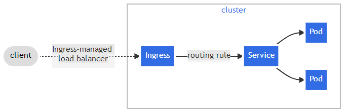
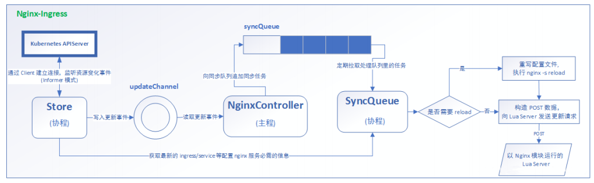

# 一、介绍

Ingress 是对集群中服务的外部访问进行管理的 API 对象，典型的访问方式是 HTTP。

Ingress 可以提供负载均衡、SSL 终结和基于名称的虚拟托管。

Ingress 公开从集群外部到集群内服务的 HTTP 和 HTTPS 路由。 流量路由由 Ingress 资源上定义的规则控制。

Ingress-Nginx github 地址：https://github.com/kubernetes/ingress-nginx

Ingress-Nginx 官方网站：https://kubernetes.github.io/ingress-nginx/

Ingress 可为 Service 提供外部可访问的 URL、负载均衡流量、终止 SSL/TLS，以及基于名称的虚拟托管。 Ingress 控制器 通常负责通过负载均衡器来实现 Ingress，尽管它也可以配置边缘路由器或其他前端来帮助处理流量。

Ingress 不会公开任意端口或协议。 将 HTTP 和 HTTPS 以外的服务公开到 Internet 时，通常使用 Service.Type=NodePort 或 Service.Type=LoadBalancer 类型的 Service。






# 二、快速开始

## 非helm创建 Ingress 控制器

```
kubectl apply -f https://raw.githubusercontent.com/kubernetes/ingress-nginx/controller-v1.3.0/deploy/static/provider/cloud/deploy.yaml
```

## 检查Ingress状态

命名空间中启动：`ingress-nginx` 

```
[root@k8s-master01 ~]# kubectl get pods --namespace=ingress-nginx
NAME                                        READY   STATUS      RESTARTS   AGE
ingress-nginx-admission-create--1-mrp7c     0/1     Completed   0          98m
ingress-nginx-admission-patch--1-bd9ns      0/1     Completed   3          98m
ingress-nginx-controller-787f856bb4-jn7xz   1/1     Running     0          98m
```

以下命令将等待入口控制器 Pod 启动、运行并准备就绪： 

```
[root@k8s-master01 ~]# kubectl wait --namespace ingress-nginx \
>   --for=condition=ready pod \
>   --selector=app.kubernetes.io/component=controller \
>   --timeout=120s
pod/ingress-nginx-controller-787f856bb4-jn7xz condition met
```

## 本地测试

配置自定义域名：

```
[root@k8s-master01 ~]# vi /etc/hosts
127.0.0.1 ingress.site
```

创建一个简单的 Web 服务器和关联的服务： 

```
kubectl create deployment demo --image=httpd --port=80
kubectl expose deployment demo
```

然后创建入口资源。下面的示例使用映射到 的主机：`localhost` 

```
kubectl create ingress demo-localhost --class=nginx \
  --rule="ingress.site/*=demo:80"
```

现在，将本地端口转发到入口控制器： 

```
kubectl port-forward --namespace=ingress-nginx service/ingress-nginx-controller 8080:80
```

### 结果查看

1 本地监听端口查看，可以看出ipv4（127.0.0.1:8080）和ipv6（::1:8080），说明ingress本地端口已经转发设置成功

```
[root@k8s-master01 ~]# netstat -anp|grep 8080
tcp        0      0 127.0.0.1:8080          0.0.0.0:*               LISTEN      101027/kubectl      
tcp        0      0 10.244.0.1:39020        10.244.0.13:8080        TIME_WAIT   -                   
tcp        0      0 10.244.0.1:36236        10.244.0.12:8080        TIME_WAIT   -                   
tcp6       0      0 ::1:8080                :::*                    LISTEN      101027/kubectl 
```

2 查看k8s demo服务，可以看出demo的服务分布在k8s-node02上，demo的serviceip（10.109.72.57）====>podip（10.244.2.112）

```
[root@k8s-master01 ~]# kubectl get deployment,svc,pod -o wide
NAME                   READY   UP-TO-DATE   AVAILABLE   AGE   CONTAINERS   IMAGES   SELECTOR
deployment.apps/demo   1/1     1            1           37m   httpd        httpd    app=demo

NAME                 TYPE        CLUSTER-IP     EXTERNAL-IP   PORT(S)   AGE   SELECTOR
service/demo         ClusterIP   10.109.72.57   <none>        80/TCP    37m   app=demo
service/kubernetes   ClusterIP   10.96.0.1      <none>        443/TCP   6d    <none>

NAME                        READY   STATUS    RESTARTS   AGE   IP             NODE         NOMINATED NODE   READINESS GATES
pod/demo-654c477f6d-gzmrp   1/1     Running   0          37m   10.244.2.112   k8s-node02   <none>           <none>
```

3 查看ingress的服务启动情况，通过namespace=ingress-nginx进行过滤。ingress的serviceip（10.98.62.200）====>podip（10.244.1.170）

```
[root@k8s-master01 ~]# kubectl get deployment,svc,pod -o wide -n=ingress-nginx
NAME                                       READY   UP-TO-DATE   AVAILABLE   AGE    CONTAINERS   IMAGES                                                                                                                    SELECTOR
deployment.apps/ingress-nginx-controller   1/1     1            1           117m   controller   registry.k8s.io/ingress-nginx/controller:v1.3.0@sha256:d1707ca76d3b044ab8a28277a2466a02100ee9f58a86af1535a3edf9323ea1b5   app.kubernetes.io/component=controller,app.kubernetes.io/instance=ingress-nginx,app.kubernetes.io/name=ingress-nginx

NAME                                         TYPE        CLUSTER-IP     EXTERNAL-IP   PORT(S)                      AGE    SELECTOR
service/ingress-nginx-controller             NodePort    10.98.62.200   <none>        80:31069/TCP,443:31940/TCP   117m   app.kubernetes.io/component=controller,app.kubernetes.io/instance=ingress-nginx,app.kubernetes.io/name=ingress-nginx
service/ingress-nginx-controller-admission   ClusterIP   10.97.3.59     <none>        443/TCP                      117m   app.kubernetes.io/component=controller,app.kubernetes.io/instance=ingress-nginx,app.kubernetes.io/name=ingress-nginx

NAME                                            READY   STATUS      RESTARTS   AGE    IP             NODE         NOMINATED NODE   READINESS GATES
pod/ingress-nginx-admission-create--1-mrp7c     0/1     Completed   0          117m   10.244.1.168   k8s-node01   <none>           <none>
pod/ingress-nginx-admission-patch--1-bd9ns      0/1     Completed   3          117m   10.244.2.111   k8s-node02   <none>           <none>
pod/ingress-nginx-controller-787f856bb4-jn7xz   1/1     Running     0          117m   10.244.1.170   k8s-node01   <none>           <none>
```

4 通过ipvsadm查看路由表

```
[root@k8s-master01 ~]# ipvsadm -Ln
IP Virtual Server version 1.2.1 (size=4096)
Prot LocalAddress:Port Scheduler Flags
  -> RemoteAddress:Port           Forward Weight ActiveConn InActConn
...
TCP  10.109.72.57:80 rr
  -> 10.244.2.112:80              Masq    1      0          0         
TCP  10.98.62.200:80 rr
  -> 10.244.1.170:80              Masq    1      0          0         
TCP  10.98.62.200:443 rr
  -> 10.244.1.170:443             Masq    1      0          0   
```

分析：ingress-nginx-controller（10.98.62.200）接收来自localhost端口80、443的流量，当访问ingress.site的时ingress-nginx-controller会把请求路由到demo（10.109.72.57:80），最后demo分配到具体的pod

5 url请求

```
[root@k8s-master01 ~]# wget http://ingress.site:8080/
--2022-07-18 09:14:09--  http://ingress.site:8080/
正在解析主机 ingress.site (ingress.site)... 127.0.0.1
正在连接 ingress.site (ingress.site)|127.0.0.1|:8080... 已连接。
已发出 HTTP 请求，正在等待回应... 200 OK
长度：45 [text/html]
正在保存至: “index.html.1”

100%[===============================================================================================================================================================================================>] 45          --.-K/s 用时 0s      

2022-07-18 09:14:09 (6.75 MB/s) - 已保存 “index.html.1” [45/45])
```

# 三、部署Ingress-Nginx

查看ingress-nginx端口信息：

```
[root@k8s-master01 ingress]# kubectl get svc -n ingress-nginx
NAME                                 TYPE        CLUSTER-IP     EXTERNAL-IP   PORT(S)                      AGE
ingress-nginx-controller             NodePort    10.98.62.200   <none>        80:31069/TCP,443:31940/TCP   23h
ingress-nginx-controller-admission   ClusterIP   10.97.3.59     <none>        443/TCP                      23h
```

## Ingress HTTP 代理访问

deployment, Service, Ingress Yaml 文件

```yaml
apiVersion: apps/v1
kind: Deployment
metadata:
  name: nginx-dm
spec:
  replicas: 2
  selector:
    matchLabels:
      name: nginx
  template:
    metadata:
      labels:
        name: nginx
    spec:
      containers:
      - name: nginx
        image: harborcloud.com/library/nginx:1.7.9
        imagePullPolicy: IfNotPresent
        ports:
        - containerPort: 80
---
apiVersion: v1
kind: Service
metadata:
  name: nginx-svc
spec:
  selector:
    name: nginx
  ports:
  - port: 80
    targetPort: 80
    protocol: TCP
---
apiVersion: networking.k8s.io/v1
kind: Ingress
metadata:
  name: nginx-test
spec:
  ingressClassName: nginx
  rules:
  - host: www1.ingress.site
    http:
      paths:
      - path: /
        backend:
          service:
            name: nginx-svc
            port: 
              number: 80
        pathType: Prefix
```

结果：


## Ingress HTTPS 代理访问

使用以下命令生成自签名证书和私钥： 

```
$ openssl req -x509 -nodes -days 365 -newkey rsa:2048 -keyout ${KEY_FILE} -out ${CERT_FILE} -subj "/CN=${HOST}/O=${HOST}"
```

然后通过以下方式在群集中创建密钥： 

```
kubectl create secret tls ${CERT_NAME} --key ${KEY_FILE} --cert ${CERT_FILE}
```

生成的密钥的类型为 。`kubernetes.io/tls` 

例如：

```
$ openssl req -x509 -nodes -days 365 -newkey rsa:2048 -keyout tls.key -out tls.crt -subj "/CN=nginxsvc/O=nginxsvc"
$ kubectl create secret tls tls-secret --key tls.key --cert tls.crt
```

deployment, Service, Ingress Yaml 文件

```yaml
apiVersion: networking.k8s.io/v1
kind: Ingress
metadata:
  name: nginx-test
spec:
  ingressClassName: nginx
  tls:
  - hosts:
    - www2.ingress.site
    secretName: tls-secret
  rules:
  - host: www2.ingress.site
    http:
      paths:
      - path: /
        backend:
          service:
            name: nginx-svc
            port: 
              number: 80
        pathType: Prefix
```

结果：


## Nginx 进行 BasicAuth

安装httpd

```
[root@k8s-master01 ingress]# yum -y install httpd
```

创建 htpasswd 文件 用户名foo，密码：

```
[root@k8s-master01 ingress]# htpasswd -c auth foo
New password: 
Re-type new password: 
Adding password for user foo
```

htpasswd生成auth文件查看

```
[root@k8s-master01 ingress]# ls
auth  deploy.yaml  ingress-nginx-tls.yaml  ingress-nginx.yaml  tls.crt  tls.key
```

将 htpasswd 转换为机密

```
[root@k8s-master01 ingress]# kubectl create secret generic basic-auth --from-file=auth
secret/basic-auth created
```

检查机密

```
[root@k8s-master01 ingress]# kubectl get secret basic-auth -o yaml
apiVersion: v1
data:
  auth: Zm9vOiRhcHIxJFdyTFg0MWRoJEtxRHlHaDdZNWdtUDgvOGxqd0FOQS4K
kind: Secret
metadata:
  creationTimestamp: "2022-07-18T22:39:56Z"
  name: basic-auth
  namespace: default
  resourceVersion: "873318"
  uid: 45541ee0-4acc-4fd1-869c-2c2a19f59264
type: Opaque
```

使用 kubectl 创建一个绑定到基本身份验证密钥的入口

```yaml
apiVersion: networking.k8s.io/v1
kind: Ingress
metadata:
  name: ingress-with-auth
  annotations:
    # type of authentication
    nginx.ingress.kubernetes.io/auth-type: basic
    # name of the secret that contains the user/password definitions
    nginx.ingress.kubernetes.io/auth-secret: basic-auth
    # message to display with an appropriate context why the authentication is required
    nginx.ingress.kubernetes.io/auth-realm: 'Authentication Required - foo'
spec:
  ingressClassName: nginx
  rules:
  - host: auth.ingress.site
    http:
      paths:
      - path: /
        pathType: Prefix
        backend:
          service: 
            name: nginx-svc
            port: 
              number: 80
```

访问auth.ingress.site:31069


取消则出现：


输入上面设置的用户名和密码进入主界面


## Nginx 进行重写

| 名称                                           | 描述                                                        | 值   |
| ---------------------------------------------- | ----------------------------------------------------------- | ---- |
| nginx.ingress.kubernetes.io/rewrite-target     | 必须重定向流量的目标URI                                     | 串   |
| nginx.ingress.kubernetes.io/ssl-redirect       | 指示位置部分是否仅可访问SSL (当Ingress包含证书时默认为True) | 布尔 |
| nginx.ingress.kubernetes.io/force-ssl-redirect | 即使Ingress未启用TLS,也强制重定向到HTTPS                    | 布尔 |
| nginx.ingress.kubernetes.io/app-root           | 定义Controller必须重定向的应用程序根,如果它在'/'上下文中    | 串   |
| nginx.ingress.kubernetes.io/use-regex          | 指示Ingress上定义的路径是否使用正则表达式                   | 布尔 |

输入rewrite.ingress.site:31069重定向ingress官网

```yaml
apiVersion: networking.k8s.io/v1
kind: Ingress
metadata:
  annotations:
    nginx.ingress.kubernetes.io/rewrite-target: https://kubernetes.github.io/ingress-nginx/
  name: rewrite
  namespace: default
spec:
  ingressClassName: nginx
  rules:
  - host: rewrite.ingress.site
    http:
      paths:
      - path: /
        pathType: Prefix
        backend: #后端
          service:
            name: nginx-svc
            port: 
              number: 80
```

