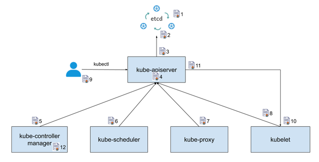
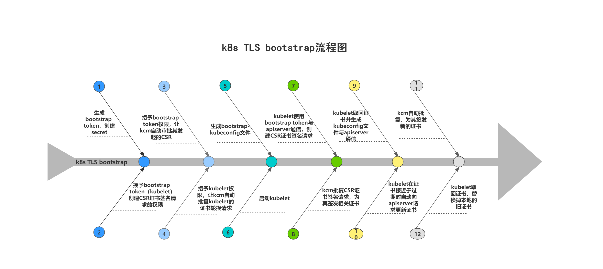

# 一、集群需要哪些证书？

- Kubelet 的客户端证书，用于 API 服务器身份验证
- Kubelet 服务端证书， 用于 API 服务器与 Kubelet 的会话
- API 服务器端点的证书
- 集群管理员的客户端证书，用于 API 服务器身份认证
- API 服务器的客户端证书，用于和 Kubelet 的会话
- API 服务器的客户端证书，用于和 etcd 的会话
- 控制器管理器的客户端证书/kubeconfig，用于和 API 服务器的会话
- 调度器的客户端证书/kubeconfig，用于和 API 服务器的会话
- 前端代理 的客户端及服务端证书



**说明：** 只有当你运行 kube-proxy 并要支持 扩展 API 服务器 时，才需要 `front-proxy` 证书

etcd 还实现了双向 TLS 来对客户端和对其他对等节点进行身份验证。

# 二、证书配置

假如通过 kubeadm 安装 Kubernetes，大多数证书都存储在 `/etc/kubernetes/pki`。 本文档中的所有路径都是相对于该目录的，但用户账户证书除外，kubeadm 将其放在 `/etc/kubernetes` 中。

## 2.1 单根CA

可以创建由管理员控制的单根 CA。该根 CA 可以创建多个中间 CA，并将所有进一步的创建委托给 Kubernetes。

需要这些 CA：

| 路径                   | 默认 CN                   | 描述                   |
| ---------------------- | ------------------------- | ---------------------- |
| ca.crt,key             | kubernetes-ca             | Kubernetes 通用 CA     |
| etcd/ca.crt,key        | etcd-ca                   | 与 etcd 相关的所有功能 |
| front-proxy-ca.crt,key | kubernetes-front-proxy-ca | 用于 前端代理          |

上面的 CA 之外，还需要获取用于服务账户管理的密钥对，也就是 `sa.key` 和 `sa.pub`。

```console
/etc/kubernetes/pki/ca.crt
/etc/kubernetes/pki/ca.key
/etc/kubernetes/pki/etcd/ca.crt
/etc/kubernetes/pki/etcd/ca.key
/etc/kubernetes/pki/front-proxy-ca.crt
/etc/kubernetes/pki/front-proxy-ca.key
```

## 2.2 所有的证书

证书认证： https://kubernetes.io/zh-cn/docs/reference/access-authn-authz/rbac/

如果不想将 CA 的私钥拷贝至你的集群中，你也可以自己生成全部的证书。

| 默认 CN                       | 父级 CA                   | O (位于 Subject 中) | 类型           | 主机 (SAN)                                          |
| ----------------------------- | ------------------------- | ------------------- | -------------- | --------------------------------------------------- |
| kube-etcd                     | etcd-ca                   |                     | server, client | `<hostname>`, `<Host_IP>`, `localhost`, `127.0.0.1` |
| kube-etcd-peer                | etcd-ca                   |                     | server, client | `<hostname>`, `<Host_IP>`, `localhost`, `127.0.0.1` |
| kube-etcd-healthcheck-client  | etcd-ca                   |                     | client         |                                                     |
| kube-apiserver-etcd-client    | etcd-ca                   | system:masters      | client         |                                                     |
| kube-apiserver                | kubernetes-ca             |                     | server         | `<hostname>`, `<Host_IP>`, `<advertise_IP>`, `[1]`  |
| kube-apiserver-kubelet-client | kubernetes-ca             | system:masters      | client         |                                                     |
| front-proxy-client            | kubernetes-front-proxy-ca |                     | client         |                                                     |

用来连接到集群的不同 IP 或 DNS 名 （就像 [kubeadm](https://kubernetes.io/zh-cn/docs/reference/setup-tools/kubeadm/) 为负载均衡所使用的固定 IP 或 DNS 名，`kubernetes`、`kubernetes.default`、`kubernetes.default.svc`、 `kubernetes.default.svc.cluster`、`kubernetes.default.svc.cluster.local`）。

| kind   | 密钥用途                       |
| ------ | ------------------------------ |
| server | 数字签名、密钥加密、服务端认证 |
| client | 数字签名、密钥加密、客户端认证 |

对于 kubeadm 用户：

- 不使用私钥，将证书复制到集群 CA 的方案，在 kubeadm 文档中将这种方案称为外部 CA。
- 如果将以上列表与 kubeadm 生成的 PKI 进行比较，你会注意到，如果使用外部 etcd，则不会生成 `kube-etcd`、`kube-etcd-peer` 和 `kube-etcd-healthcheck-client` 证书。

### 证书路径

| 默认 CN                       | 建议的密钥路径               | 建议的证书路径               | 命令                    | 密钥参数                   | 证书参数                                                     |
| ----------------------------- | ---------------------------- | ---------------------------- | ----------------------- | -------------------------- | ------------------------------------------------------------ |
| etcd-ca                       | etcd/ca.key                  | etcd/ca.crt                  | kube-apiserver          |                            | --etcd-cafile                                                |
| kube-apiserver-etcd-client    | apiserver-etcd-client.key    | apiserver-etcd-client.crt    | kube-apiserver          | --etcd-keyfile             | --etcd-certfile                                              |
| kubernetes-ca                 | ca.key                       | ca.crt                       | kube-apiserver          |                            | --client-ca-file                                             |
| kubernetes-ca                 | ca.key                       | ca.crt                       | kube-controller-manager | --cluster-signing-key-file | --client-ca-file, --root-ca-file, --cluster-signing-cert-file |
| kube-apiserver                | apiserver.key                | apiserver.crt                | kube-apiserver          | --tls-private-key-file     | --tls-cert-file                                              |
| kube-apiserver-kubelet-client | apiserver-kubelet-client.key | apiserver-kubelet-client.crt | kube-apiserver          | --kubelet-client-key       | --kubelet-client-certificate                                 |
| front-proxy-ca                | front-proxy-ca.key           | front-proxy-ca.crt           | kube-apiserver          |                            | --requestheader-client-ca-file                               |
| front-proxy-ca                | front-proxy-ca.key           | front-proxy-ca.crt           | kube-controller-manager |                            | --requestheader-client-ca-file                               |
| front-proxy-client            | front-proxy-client.key       | front-proxy-client.crt       | kube-apiserver          | --proxy-client-key-file    | --proxy-client-cert-file                                     |
| etcd-ca                       | etcd/ca.key                  | etcd/ca.crt                  | etcd                    |                            | --trusted-ca-file, --peer-trusted-ca-file                    |
| kube-etcd                     | etcd/server.key              | etcd/server.crt              | etcd                    | --key-file                 | --cert-file                                                  |
| kube-etcd-peer                | etcd/peer.key                | etcd/peer.crt                | etcd                    | --peer-key-file            | --peer-cert-file                                             |
| etcd-ca                       |                              | etcd/ca.crt                  | etcdctl                 |                            | --cacert                                                     |
| kube-etcd-healthcheck-client  | etcd/healthcheck-client.key  | etcd/healthcheck-client.crt  | etcdctl                 | --key                      | --cert                                                       |

服务帐户密钥对：

| 钥路径 | 公钥路径 | 命令                    | 参数                               |
| ------ | -------- | ----------------------- | ---------------------------------- |
| sa.key |          | kube-controller-manager | --service-account-private-key-file |
|        | sa.pub   | kube-apiserver          | --service-account-key-file         |

```console
/etc/kubernetes/pki/etcd/ca.key
/etc/kubernetes/pki/etcd/ca.crt
/etc/kubernetes/pki/apiserver-etcd-client.key
/etc/kubernetes/pki/apiserver-etcd-client.crt
/etc/kubernetes/pki/ca.key
/etc/kubernetes/pki/ca.crt
/etc/kubernetes/pki/apiserver.key
/etc/kubernetes/pki/apiserver.crt
/etc/kubernetes/pki/apiserver-kubelet-client.key
/etc/kubernetes/pki/apiserver-kubelet-client.crt
/etc/kubernetes/pki/front-proxy-ca.key
/etc/kubernetes/pki/front-proxy-ca.crt
/etc/kubernetes/pki/front-proxy-client.key
/etc/kubernetes/pki/front-proxy-client.crt
/etc/kubernetes/pki/etcd/server.key
/etc/kubernetes/pki/etcd/server.crt
/etc/kubernetes/pki/etcd/peer.key
/etc/kubernetes/pki/etcd/peer.crt
/etc/kubernetes/pki/etcd/healthcheck-client.key
/etc/kubernetes/pki/etcd/healthcheck-client.crt
/etc/kubernetes/pki/sa.key
/etc/kubernetes/pki/sa.pub
```

## 2.3 用户帐户配置证书

| 文件名                  | 凭据名称                   | 默认 CN                               | O (位于 Subject 中) |
| ----------------------- | -------------------------- | ------------------------------------- | ------------------- |
| admin.conf              | default-admin              | kubernetes-admin                      | system:masters      |
| kubelet.conf            | default-auth               | system:node:`<nodeName>` （参阅注释） | system:nodes        |
| controller-manager.conf | default-controller-manager | system:kube-controller-manager        |                     |
| scheduler.conf          | default-scheduler          | system:kube-scheduler                 |                     |

用途

| 文件名                  | 命令                    | 说明                                                       |
| ----------------------- | ----------------------- | ---------------------------------------------------------- |
| admin.conf              | kubectl                 | 配置集群的管理员                                           |
| kubelet.conf            | kubelet                 | 集群中的每个节点都需要一份                                 |
| controller-manager.conf | kube-controller-manager | 必需添加到 `manifests/kube-controller-manager.yaml` 清单中 |
| scheduler.conf          | kube-scheduler          | 必需添加到 `manifests/kube-scheduler.yaml` 清单中          |

```console
/etc/kubernetes/admin.conf
/etc/kubernetes/kubelet.conf
/etc/kubernetes/controller-manager.conf
/etc/kubernetes/scheduler.conf
```

# 三 证书结构

## 1.1 证书JSON配置文件

```
{
  "CN": "kubernetes",
  "key": {
    "algo": "rsa",
    "size": 2048
  },
  "names":[{
    "C": "<country>",
    "ST": "<state>",
    "L": "<city>",
    "O": "<organization>",
    "OU": "<organization unit>"
  }]
}
```

字段说明：

"CN" : Common Name, kube-apiserver 从证书中提取该字段作为请求的用户名 (User Name):浏览器使用该字段验证网站是否合法;
"O": Organization, kube-apiserver 从证书中提取该字段作为请求用户所属的组(Group)

## 2 生成 CA 秘钥文件（`ca-key.pem`）和证书文件（`ca.pem`）

```
cfssl gencert -initca ca-csr.json | cfssljson -bare ca
```

## 3 创建一个 JSON 配置文件，用来为 API 服务器生成秘钥和证书

例如：`server-csr.json`。 确认用你需要的值替换掉尖括号中的值。`MASTER_CLUSTER_IP` 是为 API 服务器 指定的服务集群 IP，就像前面小节描述的那样。 以下示例假定你的默认 DNS 域名为`cluster.local`。 

```
{
  "CN": "kubernetes",
  "hosts": [
    "127.0.0.1",
    "<MASTER_IP>",
    "<MASTER_CLUSTER_IP>",
    "kubernetes",
    "kubernetes.default",
    "kubernetes.default.svc",
    "kubernetes.default.svc.cluster",
    "kubernetes.default.svc.cluster.local"
  ],
  "key": {
    "algo": "rsa",
    "size": 2048
  },
  "names": [{
    "C": "<country>",
    "ST": "<state>",
    "L": "<city>",
    "O": "<organization>",
    "OU": "<organization unit>"
  }]
}
```

## 4 为 API 服务器生成秘钥和证书 

例如：默认会分别存储为`server-key.pem` 和 `server.pem` 两个文件 

```
cfssl gencert -ca=ca.pem -ca-key=ca-key.pem \
     --config=ca-config.json -profile=kubernetes \
     server-csr.json | cfssljson -bare server
```

# 四、 k8s 证书认证

## 4.1 TLS Bootstrapping

启用 TLS Bootstrapping 机制 TLS Bootstraping：Master apiserver 启用 TLS 认证后，Node 节点 kubelet 和 kube- proxy 要与 kube-apiserver 进行通信，必须使用 CA 签发的有效证书才可以，当 Node 节点很多时，这种客户端证书颁发需要大量工作，同样也会增加集群扩展复杂度。为了简化流程，Kubernetes 引入了 TLS bootstraping 机制来自动颁发客户端证书，kubelet 会以一个低权限用户自动向 apiserver 申请证书，kubelet 的证书由 apiserver 动态签署。
所以强烈建议在 Node 上使用这种方式，目前主要用于 kubelet，kube-proxy 还是由我们统一颁发一个证书。

TLS bootstraping 工作流程： 




授权kubelet-bootstrap用户允许请求证书

```
kubectl create clusterrolebinding kubelet-bootstrap \
--clusterrole=system:node-bootstrapper \
--user=kubelet-bootstrap
```

创建上述配置文件中 token 文件： 

```
cat > /opt/kubernetes/cfg/token.csv << EOF 
2883dba522d43d742dd88f3ce07cf52e,kubelet-bootstrap,10001,system:node-bootstrapper
EOF

```

格式：token，用户名，UID，用户组 

token 也可自行生成替换：

```
head -c 16 /dev/urandom | od -An -t x | tr -d ' '
```

# 五、证书签名请求文件

[PKI 证书和要求 | Kubernetes](https://kubernetes.io/zh-cn/docs/setup/best-practices/certificates/)

[手动生成证书 | Kubernetes](https://kubernetes.io/zh-cn/docs/tasks/administer-cluster/certificates/)

[使用 RBAC 鉴权 | Kubernetes](https://kubernetes.io/zh-cn/docs/reference/access-authn-authz/rbac/)

## 5.1 CA证书签名请求文件

```
$ cat > ca-csr.json <<END   
{
  "CN": "kubernetes",
  "key": {      
    "algo": "rsa",     
    "size": 2048
  },             
  "names":[{         
    "C": "CN",     
    "ST": "Beijing",
    "L": "Beijing",          
    "O": "k8s",         
    "OU": "System"     
  }]      
}                        
END
```

## 5.2 证书签发的配置文件

```
$ cat > ca-config.json <<END
{
  "signing": {
    "default": {
      "expiry": "8760h"
    },
    "profiles": {
      "kubernetes": {
        "usages": [
          "signing",
          "key encipherment",
          "server auth",
          "client auth"
        ],
        "expiry": "8760h"
      }
    }
  }
}
END
```

## 5.3 kubernetes证书签发

```
$ cat > server-csr.json << END
{
  "CN": "kubernetes",
  "hosts": [
    "127.0.0.1",
    "10.0.0.1",
    "10.0.0.31",
    "10.0.0.41",
    "10.0.0.42",
    "k8s-master01",
    "k8s-node01",
    "k8s-node02",
    "kubernetes",
    "kubernetes.default",
    "kubernetes.default.svc",
    "kubernetes.default.svc.cluster",
    "kubernetes.default.svc.cluster.local"
  ],
  "key": {
    "algo": "rsa",
    "size": 2048
  },
  "names": [{
    "C": "CN",
    "ST": "Beijing",
    "L": "Beijing",
    "O": "k8s",
    "OU": "System"
  }]
}
END
```

如果hosts字段不为空则需要指定授权使用该证书的IP或域名列表。
master节点的IP都填上,同时还有service网络的首IP。(一般是kube-apiserver指定的service-cluster-ip-range网段的第一个IP, 如10.0.0.1)
三个master,以上物理节点的IP也可以更换为主机名。

### 5.4 admin证书

```
cat > admin-csr.json <<EOF
{
  "CN": "admin",
  "hosts": [],
  "key": {
    "algo": "rsa",
    "size": 2048
  },
  "names": [
    {
      "C": "CN",
      "L": "BeiJing",
      "ST": "BeiJing",
      "O": "system:masters",
      "OU": "System"
    }
  ]
}
EOF
```

- User：admin
-  Group：system:masters

kube-apiserver使用RBAC对客户端(如kubelet, kube-proxy, Pod)请求进行授权。

### 2.5.3 kube-proxy 证书签名请求

```
cat > kube-proxy-csr.json <<EOF
{
  "CN": "system:kube-proxy",
  "hosts": [],
  "key": {
    "algo": "rsa",
    "size": 2048
  },
  "names": [
    {
      "C": "CN",
      "L": "BeiJing",
      "ST": "BeiJing",
      "O": "k8s",
      "OU": "System"
    }
  ]
}
EOF
```

| 默认 ClusterRole    | 默认 ClusterRoleBinding    | 描述                                   |
| ------------------- | -------------------------- | -------------------------------------- |
| system:node-proxier | **system:kube-proxy** 用户 | 允许访问 kube-proxy 组件所需要的资源。 |

kube-apiserver 预定义的 RoleBinding system:node-proxier将User system:kube-proxy与 Role system:node-proxier 绑定,Role 授予了调用 kube-apiserver。

该证书只会被kubectl 当做client证书使用,所以hosts字段为空。

### 2.5.4 创建kube-controller-manager证书

```
cat > kube-controller-manager-csr.json <<EOF
{
  "CN": "system:kube-controller-manager",
  "hosts": [
    "127.0.0.1",
    "10.0.0.31",
    "10.0.0.41",
    "10.0.0.42",
    "k8s-master01",
    "k8s-node01",
    "k8s-node02",
  ],
  "key": {
    "algo": "rsa",
    "size": 2048
  },
  "names": [
    {
      "C": "CN",
      "L": "BeiJing",
      "ST": "BeiJing",
      "O": "system:kube-controller-manager",
      "OU": "System"
    }
  ]
}
EOF
```

hosts 列表包含所有kube-controller-manager 节点IP;
CN 为 system:kube-controller-manager, O system:kube-controller-manager, kubernetes 内置的 ClusterRoleBindings system:kube-controller-manager 授予 kube-controller-manager 工作所需的权限

### 2.5.5 创建kube-scheduler证书

```
cat > kube-scheduler-csr.json <<EOF
{
  "CN": "system:kube-scheduler",
  "hosts": [
    "127.0.0.1",
    "10.0.0.31",
    "10.0.0.41",
    "10.0.0.42",
    "k8s-master01",
    "k8s-node01",
    "k8s-node02",
  ],
  "key": {
    "algo": "rsa",
    "size": 2048
  },
  "names": [
    {
      "C": "CN",
      "L": "BeiJing",
      "ST": "BeiJing",
      "O": "system:kube-scheduler",
      "OU": "System"
    }
  ]
}
EOF
```

hosts 列表包含所有kube-scheduler节点IP;
CN 为 system:kube-scheduler, O为 system:kube-scheduler, kubernetes 内置的 ClusterRoleBindings system:kube-scheduler 将赋予kube-scheduler 工作所需的权限。

# 三、证书操作

## 3.1 检查证书是否过期

```
kubeadm certs check-expiration
```

