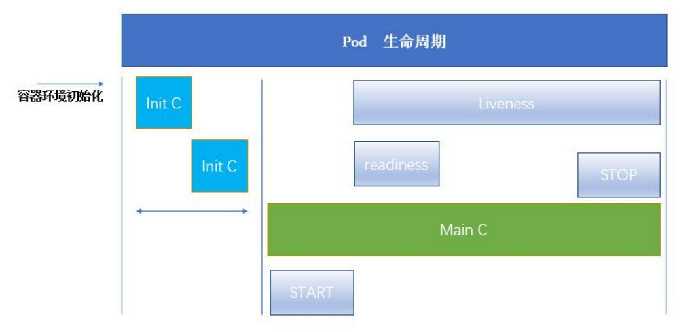

# k8s pod生命周期—Init容器

# pod生命周期



Pod能够具有多个容器,应用运行在容器里面,但是它也可能有一个或多个先于应用容器启动的Init容器。

Init容器与普通的容器非常像,除了如下两点:

- Init 容器总是运行到成功完成为止
- 每个Init容器都必须在下一个Init容器启动之前成功完成

如果Pod的Init容器失败, Kubernetes会不断地重启该Pod,直到Init容器成功为止。然而,如果Pod对应的restartPolicy 为Never,它不会重新启动。

**因为Init容器具有与应用程序容器分离的单独镜像,所以它们的启动相关代码具有如下优势:**

- 它们可以包含并运行实用工具,但是出于安全考虑,是不建议在应用程序容器镜像中包含这些实用工具的。
- 它们可以包含使用工具和定制化代码来安装,但是不能出现在应用程序镜像中。例如,创建镜像没必要FROM另一个镜像,只需要在安装过程中使用类似sed、 awk、 python或dig这样的工具。
- 应用程序镜像可以分离出创建和部署的角色,而没有必要联合它们构建一个单独的镜像。
- Init 容器使用Linux Namespace,所以相对应用程序容器来说具有不同的文件系统视图。因此,它们能够具有访问Secret的权限,而应用程序容器则不能。
- 它们必须在应用程序容器启动之前运行完成,而应用程序容器是并行运行的,所以Init容器能够提供了一种简单的阻塞或延迟应用容器的启动的方法,直到满足了一组先决条件。

在Pod启动过程中,Init容器会按顺序在网络和数据卷初始化之后启动。每个容器必须在下一个容器启动之前成功退出。

如果由于运行时或失败退出,将导致容器启动失败,它会根据Pod的restartPolicy指定的策略进行重试。然而,如果Pod的restartPolicy设置为Always, Init容器失败时会使用RestartPolicy策略。

在所有的Init容器没有成功之前, Pod将不会变成Ready状态。Init容器的端口将不会在Service 中进行聚集。正在初始化中的Pod处于Pending状态,但应该会将Initializing状态设置为true。

如果Pod重启,所有Init容器必须重新执行。

对Init容器spec的修改被限制在容器image字段,修改其他字段都不会生效。更改Init容器的image字段,等价于重启该Pod。(kubectl edit pod myapp-pod)

Init容器具有应用容器的所有字段。除了readinessProbe，因为Init容器无法定义不同于完成(completion)的就绪(readiness)之外的其他状态。这会在验证过程中强制执行。

在Pod中的每个app和Init容器的名称必须唯一；与任何其它容器共享同一个名称,会在验证时抛出错误。

# Init容器

Init模板

```yaml
apiVersion: v1
kind: Pod
metadata:
  name: myapp-pod
  labels:
    app: myapp
spec:
  containers:
  - name: myapp-container
    image: busybox
    command: ['sh', '-c', 'echo The app is running! && sleep 3600']
  initContainers:
  - name: init-myservice
    image: busybox
    command: ['sh', '-c', 'until nslookup myservice; do echo waiting for myservice; sleep 2;done;']
  - name: init-mydb
    image: busybox
    command: ['sh', '-c', 'until nslookup mydb; do echo waiting for mydb; sleep 2; done; ']
```

myservice模板

```yaml
kind: Service
apiVersion: v1
metadata:
  name: myservice
spec:
  ports:
    - protocol: TCP
      port: 80
      targetPort: 9376
```

mydb模板

```yaml
kind: Service
apiVersion: v1
metadata:
  name: mydb
spec:
  ports:
    - protocol: TCP
      port: 80
      targetPort: 9377
```

# Init容器操作查看

## 第一步：之创建init状态检测pod

通过init容器模板创建pod

```
# 先生成init配置清单
[root@k8s-master01 init-container]# vi init.yaml
# 通过init.yaml创建pod
[root@k8s-master01 init-container]# kubectl create -f  init.yaml
# 查看pod的状态
[root@k8s-master01 init-container]# kubectl get pod
NAME        READY   STATUS     RESTARTS   AGE
myapp-pod   0/1     Init:0/2   0          3m8s
```

查看myapp-pod的启动日志

```
[root@k8s-master01 init-container]# kubectl describe pod myapp-pod
Name:         myapp-pod
Namespace:    default
Priority:     0
Node:         k8s-node02/fd56:a9ae:cb0f::853
Start Time:   Sat, 16 Jul 2022 20:56:13 +0800
Labels:       app=myapp
Annotations:  <none>
Status:       Pending
IP:           10.244.2.4
IPs:
  IP:  10.244.2.4
Init Containers:
  init-myservice:
    Container ID:  docker://b4e6898bf71991f1571f0750d7ed58f54aeb511ca175b9dcafbbdf457aac3971
    Image:         busybox
    Image ID:      docker-pullable://busybox@sha256:5acba83a746c7608ed544dc1533b87c737a0b0fb730301639a0179f9344b1678
    Port:          <none>
    Host Port:     <none>
    Command:
      sh
      -c
      until nslookup myservice; do echo waiting for myservice; sleep 2;done;
    State:          Running
      Started:      Sat, 16 Jul 2022 20:56:33 +0800
    Ready:          False
    Restart Count:  0
    Environment:    <none>
    Mounts:
      /var/run/secrets/kubernetes.io/serviceaccount from kube-api-access-4vx22 (ro)
  init-mydb:
    Container ID:  
    Image:         busybox
    Image ID:      
    Port:          <none>
    Host Port:     <none>
    Command:
      sh
      -c
      until nslookup mydb; do echo waiting for mydb; sleep 2; done; 
    State:          Waiting
      Reason:       PodInitializing
    Ready:          False
    Restart Count:  0
    Environment:    <none>
    Mounts:
      /var/run/secrets/kubernetes.io/serviceaccount from kube-api-access-4vx22 (ro)
Containers:
  myapp-container:
    Container ID:  
    Image:         busybox
    Image ID:      
    Port:          <none>
    Host Port:     <none>
    Command:
      sh
      -c
      echo The app is running! && sleep 3600
    State:          Waiting
      Reason:       PodInitializing
    Ready:          False
    Restart Count:  0
    Environment:    <none>
    Mounts:
      /var/run/secrets/kubernetes.io/serviceaccount from kube-api-access-4vx22 (ro)
Conditions:
  Type              Status
  Initialized       False 
  Ready             False 
  ContainersReady   False 
  PodScheduled      True 
Volumes:
  kube-api-access-4vx22:
    Type:                    Projected (a volume that contains injected data from multiple sources)
    TokenExpirationSeconds:  3607
    ConfigMapName:           kube-root-ca.crt
    ConfigMapOptional:       <nil>
    DownwardAPI:             true
QoS Class:                   BestEffort
Node-Selectors:              <none>
Tolerations:                 node.kubernetes.io/not-ready:NoExecute op=Exists for 300s
                             node.kubernetes.io/unreachable:NoExecute op=Exists for 300s
Events:
  Type    Reason     Age    From               Message
  ----    ------     ----   ----               -------
  Normal  Scheduled  4m6s   default-scheduler  Successfully assigned default/myapp-pod to k8s-node02
  Normal  Pulling    2m34s  kubelet            Pulling image "busybox"
  Normal  Pulled     2m16s  kubelet            Successfully pulled image "busybox" in 17.673975295s
  Normal  Created    2m16s  kubelet            Created container init-myservice
  Normal  Started    2m16s  kubelet            Started container init-myservice
```

查看日志

```
[root@k8s-master01 init-container]# kubectl logs myapp-pod -c  init-myservice
waiting for myservice
Server:         10.96.0.10
Address:        10.96.0.10:53

** server can't find myservice.default.svc.cluster.local: NXDOMAIN

*** Can't find myservice.svc.cluster.local: No answer
*** Can't find myservice.cluster.local: No answer
*** Can't find myservice.default.svc.cluster.local: No answer
*** Can't find myservice.svc.cluster.local: No answer
*** Can't find myservice.cluster.local: No answer
```

## 第二步：创建myservice

通过myservice模板创建svc

```
vi myservice.yaml
kubectl create -f myservice.yaml
```

查看pod状态，可以看出status中的显示变成了Init:1/2,说明检测状态中，有一个service已经成功启动。

```
[root@k8s-master01 init-container]# kubectl get pod
NAME        READY   STATUS     RESTARTS   AGE
myapp-pod   0/1     Init:1/2   0          16m
```

## 第三步：创建mydb

通过myservice模板创建svc

```
vi mydb.yaml
kubectl create -f mydb.yaml
```

查看pod状态，可以看出READY显示为1/1,status中的显示变成了Running,说明检测状态中，已经成功启动。

```
[root@k8s-master01 init-container]# kubectl get pod
NAME        READY   STATUS    RESTARTS   AGE
myapp-pod   1/1     Running   0          22m
```


