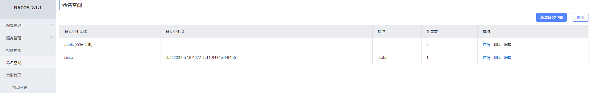
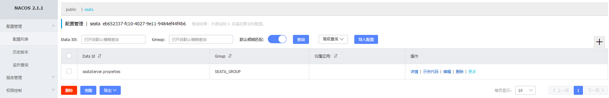
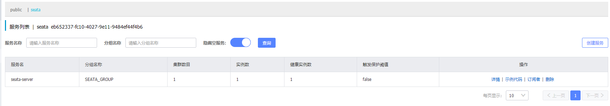

## 1、配置依赖nacos的配置

### 1.1 创建命名空间



### 1.2 创建seata需要配置



前往seata github的仓库中，找到script/config-center/config.txt

修改配置，配置mysql模式：

```
#Transaction storage configuration, only for the server. The file, db, and redis configuration values are optional.
store.mode=db
store.lock.mode=db
store.session.mode=db
#Used for password encryption
store.publicKey=

#These configurations are required if the `store mode` is `db`. If `store.mode,store.lock.mode,store.session.mode` are not equal to `db`, you can remove the configuration block.
store.db.datasource=druid
store.db.dbType=mysql
store.db.driverClassName=com.mysql.cj.jdbc.Driver
store.db.url=jdbc:mysql://mysql-brlm.newland:3306/seata?useUnicode=true&useSSL=true&rewriteBatchedStatements=true
store.db.user=seata
store.db.password=seata
```

## 2 部署seata

### 2.1 构建seata镜像

因为官方镜像的driverClassName不支持com.mysql.cj.jdbc.Driver，所以需要添加mysql8的jar支持。

```
[root@k8s-master01 seata1]# ls
Dockerfile  mysql-connector-java-8.0.30.jar
```

添加mysql8的jar支持，创建新的Dockerfile文件

```
FROM seataio/seata-server:1.5.0
COPY mysql-connector-java-8.0.30.jar /seata-server/libs
```

开始构建镜像

```
[root@k8s-master01 seata1]# nerdctl build -t docker.io/leellun/seata-server:1.5.0 -f ./Dockerfile  .
[root@k8s-master01 seata1]# nerdctl push docker.io/leellun/seata-server:1.5.0
```

### 2.2 k8s yml配置

```
apiVersion: v1
kind: Service
metadata:
  name: seata-server
  namespace: newland
  labels:
    k8s-app: seata-server
spec:
  type: NodePort
  ports:
    - port: 8091
      nodePort: 30091
      protocol: TCP
      name: http
  selector:
    k8s-app: seata-server
---
apiVersion: apps/v1
kind: Deployment
metadata:
  name: seata-server
  namespace: newland
  labels:
    k8s-app: seata-server
spec:
  replicas: 1
  selector:
    matchLabels:
      k8s-app: seata-server
  template:
    metadata:
      labels:
        k8s-app: seata-server
    spec:
      containers:
        - name: seata-server
          image: docker.io/leellun/seata-server:1.5.0
          imagePullPolicy: IfNotPresent
          env:
            - name: spring.config.location
              value: file:/root/seata-config/application-prod.yml
            - name: spring.profiles.active
              value: prod
          ports:
            - name: http
              containerPort: 8091
              protocol: TCP
          volumeMounts:
            - name: seata-config
              mountPath: /root/seata-config
      volumes:
        - name: seata-config
          configMap:
            name: seata-server-config

---
apiVersion: v1
kind: ConfigMap
metadata:
  name: seata-server-config
  namespace: newland
data:
  application-prod.yml: |
    server:
      port: 7091

    spring:
      application:
        name: seata-server
    
    logging:
      config: classpath:logback-spring.xml
      file:
        path: ${user.home}/logs/seata
      extend:
        logstash-appender:
          destination: 127.0.0.1:4560
        kafka-appender:
          bootstrap-servers: 127.0.0.1:9092
          topic: logback_to_logstash
    
    console:
      user:
        username: seata
        password: seata
    seata:
      config:
        # support: nacos 、 consul 、 apollo 、 zk  、 etcd3
        type:     nacos
        nacos:
          server-addr: nacos-hs.newland:8848
          namespace: eb652337-fc10-4027-9e11-9484ef44f4b6
          group: SEATA_GROUP
          username: nacos
          password: nacos
          application: seata-server
          data-id: seataServer.properties
      registry:
        # support: nacos 、 eureka 、 redis 、 zk  、 consul 、 etcd3 、 sofa
        type:     nacos
        nacos:
          application: seata-server
          server-addr: nacos-hs.newland:8848
          group: SEATA_GROUP
          namespace: eb652337-fc10-4027-9e11-9484ef44f4b6
          cluster: default
          username: nacos
          password: nacos
      security:
        secretKey: SeataSecretKey0c382ef121d778043159209298fd40bf3850a017
        tokenValidityInMilliseconds: 1800000
        ignore:
          urls: /,/**/*.css,/**/*.js,/**/*.html,/**/*.map,/**/*.svg,/**/*.png,/**/*.ico,/console-fe/public/**,/api/v1/auth/login
```

### 2.3 开始创建k8s资源

````
kubectl create -f ../../seata.yaml
````

## 3 查看部署情况

