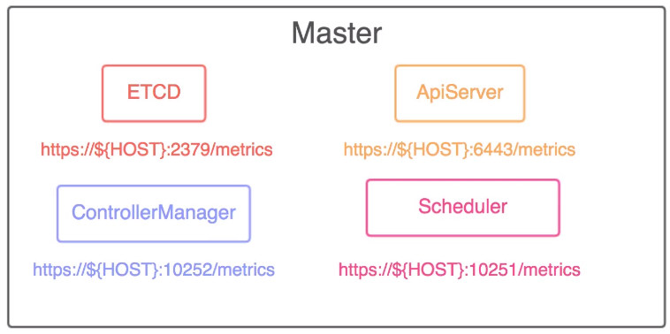
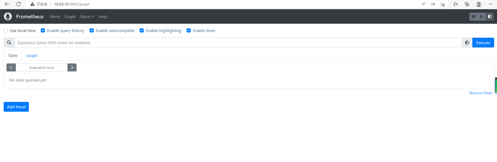
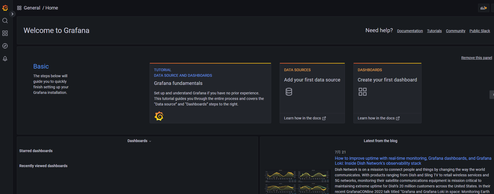
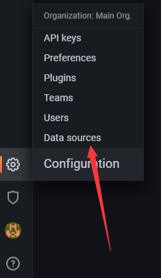
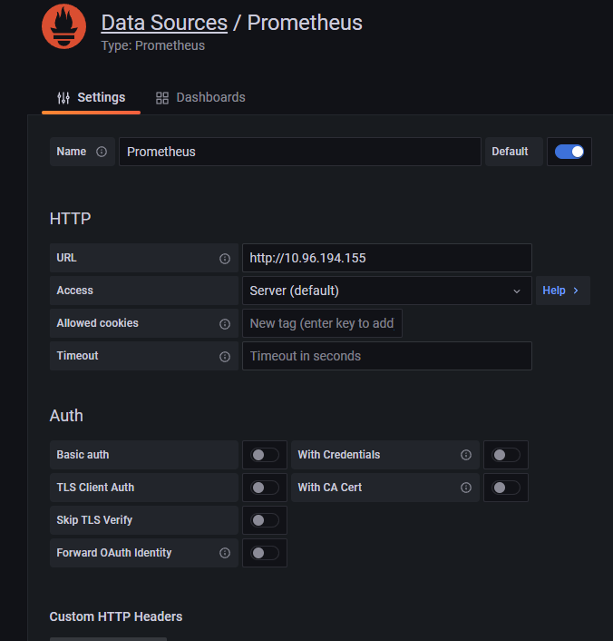
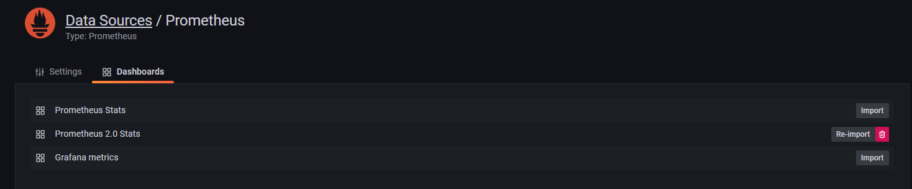
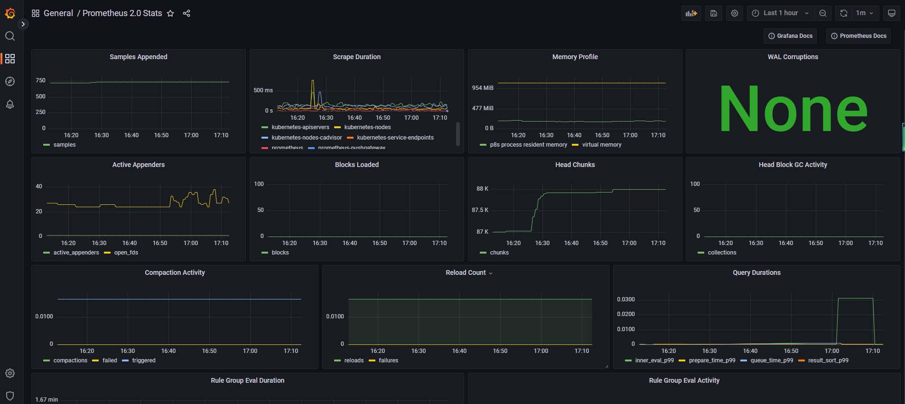

# 一、介绍

Prometheus是一个开源监控解决方案，用于收集和聚合指标作为时间序列数据，内置了PromQL，允许用户实时选择和汇聚时间序列数据。我们可以直接把它当作时序数据库来用。 

- 一系列服务的组合
- 系统和服务的监控报警平台
- 由metric名称和kv标识的多维数据模型
- 灵活的查询语言(PromQL)
- 支持pull、push两种方式添加数据
- 支持基于Kubernetes服务发现的动态配置

 

# 二、数据类型

- Counter

- Gauge
- Histogram && Summary

# 三、数据来源-服务器基础指标



# 四、开始搭建

自动证书：

```
https://cert-manager.io/docs/installation/helm/#option-1-installing-crds-with-kubectl
```

官网：[prometheus 15.10.5 · prometheus/prometheus-community (artifacthub.io)](https://artifacthub.io/packages/helm/prometheus-community/prometheus) 

要求：

- Kubernetes 1.16+
- Helm 3+

仓库设置：

```
helm repo add prometheus-community https://prometheus-community.github.io/helm-charts
helm repo update
```

安装：

```
helm install prometheus prometheus-community/prometheus    
```

prometheus需要两个持久持久卷

```
[root@k8s-master01 pvc]# kubectl get pvc
NAME                      STATUS   VOLUME   CAPACITY   ACCESS MODES   STORAGECLASS   AGE
prometheus-alertmanager   Bound    nfspv2   5Gi        RWO                           23m
prometheus-server         Bound    nfspv    8Gi        RWO                           23m
```

持久卷创建（非官方纯属个人创建方式）:

```
apiVersion: v1
kind: PersistentVolume
metadata:
  name: nfspv
spec:
  capacity:
    storage: 8Gi
  accessModes:
  - ReadWriteOnce
  persistentVolumeReclaimPolicy: Recycle
  storageClassName: ""
  nfs:
    path: /nfsdata
    server: 10.0.0.10
---
apiVersion: v1
kind: PersistentVolume
metadata:
  name: nfspv2
spec:
  capacity:
    storage: 5Gi
  accessModes:
  - ReadWriteOnce
  persistentVolumeReclaimPolicy: Recycle
  storageClassName: ""
  nfs:
    path: /nfsdata
    server: 10.0.0.10
```

开启往往访问端口：

```
[root@k8s-master01 prometheus]# kubectl get svc
NAME                            TYPE        CLUSTER-IP       EXTERNAL-IP   PORT(S)         AGE
prometheus-server               NodePort    10.96.194.155    <none>        80:30092/TCP    79m
```

将svc/prometheus-server的网络类型设置为NodePort



# Grafana  

Grafana 是与Prometheus配合的可视化程序，它提供了强大和优雅的方式去创建、共享、浏览数据。利用它可以创建 不同metric数据源的优美 Dashboard，官方提供了多种成型Dashboard模板供你选择。 

[helm grafana网址](https://artifacthub.io/packages/helm/grafana/grafana)

## 仓库设置

```
helm repo add grafana https://grafana.github.io/helm-charts
helm repo update
```

## 安装

```
[root@k8s-master01 prometheus]# helm repo update
Hang tight while we grab the latest from your chart repositories...
...Successfully got an update from the "metrics-server" chart repository
...Successfully got an update from the "aliyun" chart repository
...Successfully got an update from the "kubernetes-dashboard" chart repository
...Successfully got an update from the "jetstack" chart repository
...Successfully got an update from the "grafana" chart repository
...Successfully got an update from the "prometheus-community" chart repository
...Successfully got an update from the "bitnami" chart repository
...Successfully got an update from the "stable" chart repository
Update Complete. ⎈Happy Helming!⎈
[root@k8s-master01 prometheus]# helm install grafana grafana/grafana   
W0724 16:25:23.104208    7873 warnings.go:70] policy/v1beta1 PodSecurityPolicy is deprecated in v1.21+, unavailable in v1.25+
W0724 16:25:23.106903    7873 warnings.go:70] policy/v1beta1 PodSecurityPolicy is deprecated in v1.21+, unavailable in v1.25+
W0724 16:25:23.302240    7873 warnings.go:70] policy/v1beta1 PodSecurityPolicy is deprecated in v1.21+, unavailable in v1.25+
W0724 16:25:23.302274    7873 warnings.go:70] policy/v1beta1 PodSecurityPolicy is deprecated in v1.21+, unavailable in v1.25+
NAME: grafana
LAST DEPLOYED: Sun Jul 24 16:25:22 2022
NAMESPACE: default
STATUS: deployed
REVISION: 1
NOTES:
1. Get your 'admin' user password by running:

   kubectl get secret --namespace default grafana -o jsonpath="{.data.admin-password}" | base64 --decode ; echo

2. The Grafana server can be accessed via port 80 on the following DNS name from within your cluster:

   grafana.default.svc.cluster.local

   Get the Grafana URL to visit by running these commands in the same shell:

     export POD_NAME=$(kubectl get pods --namespace default -l "app.kubernetes.io/name=grafana,app.kubernetes.io/instance=grafana" -o jsonpath="{.items[0].metadata.name}")
     kubectl --namespace default port-forward $POD_NAME 3000

3. Login with the password from step 1 and the username: admin
#################################################################################
######   WARNING: Persistence is disabled!!! You will lose your data when   #####
######            the Grafana pod is terminated.                            #####
#################################################################################
```

## 暴露grafana外网端口

```
[root@k8s-master01 prometheus]# kubectl edit svc/grafana
service/grafana edited
```

```
spec:
  clusterIP: 10.99.124.40
  clusterIPs:
  - 10.99.124.40
  externalTrafficPolicy: Cluster
  internalTrafficPolicy: Cluster
  ipFamilies:
  - IPv4
  ipFamilyPolicy: SingleStack
  ports:
  - name: service
    nodePort: 31036
    port: 80
    protocol: TCP
    targetPort: 3000
  selector:
    app.kubernetes.io/instance: grafana
    app.kubernetes.io/name: grafana
  sessionAffinity: None
  type: NodePort
```

```
[root@k8s-master01 prometheus]# kubectl get svc         
NAME                            TYPE        CLUSTER-IP       EXTERNAL-IP   PORT(S)         AGE
grafana                         NodePort    10.99.124.40     <none>        80:31036/TCP    4m29s
```

## 获取密码

```
[root@k8s-master01 prometheus]# kubectl get secret --namespace default grafana -o jsonpath="{.data.admin-password}" | base64 --decode ; echo
tRiLK3Z5JEafE5IHsUFy0zfeetLi9scnWLfubXev
```

## 进入界面

通过admin和上面得到的密码进入系统。



## 开始配置

1 左下角的数据源配置



2 配置prometheus

```
[root@k8s-master01 prometheus]# kubectl get svc
NAME                            TYPE        CLUSTER-IP       EXTERNAL-IP   PORT(S)         AGE
grafana                         NodePort    10.99.124.40     <none>        80:31036/TCP    24m
prometheus-server               NodePort    10.96.194.155    <none>        80:30092/TCP    110m
```

得到地址10.96.194.155:80



保存测试后选择dashboards，选择2.0



