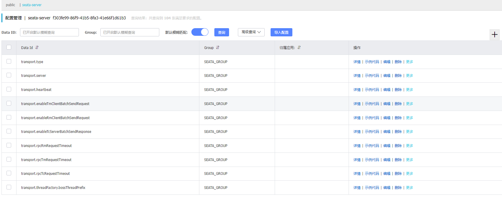

# 一、选择版本

```
seataio/seata-server:1.4.2
```

# 二、参数配置

单配置：

```
MODE: standalone 
JVM_XMS: 2048M
JVM_XMX: 2048M
```

# 三、nacos配置

创建空间seata-server,得到：f303fe99-86f9-41b5-8fa3-41e66f1d61b3

在seata的github得到nacos-config.sh脚本执行如下命令：

```
nacos-config.sh -h 192.168.66.10 -p 31462 -g SEATA_GROUP -t f303fe99-86f9-41b5-8fa3-41e66f1d61b3 -u nacos -w nacos
```



# 四、服务创建

```
apiVersion: v1
kind: Service
metadata:
  name: seata-server
  namespace: gulimall
  labels:
    k8s-app: seata-server
spec:
  type: NodePort
  ports:
    - port: 8091
      nodePort: 30091
      protocol: TCP
      name: http
  selector:
    k8s-app: seata-server
---
apiVersion: apps/v1
kind: Deployment
metadata:
  name: seata-server
  namespace: default
  labels:
    k8s-app: seata-server
spec:
  replicas: 1
  selector:
    matchLabels:
      k8s-app: seata-server
  template:
    metadata:
      labels:
        k8s-app: seata-server
    spec:
      containers:
        - name: seata-server
          image: docker.io/seataio/seata-server:1.5.0
          imagePullPolicy: IfNotPresent
          env:
            - name: SEATA_CONFIG_NAME
              value: file:/root/seata-config/registry
          ports:
            - name: http
              containerPort: 8091
              protocol: TCP
          volumeMounts:
            - name: seata-config
              mountPath: /root/seata-config
      volumes:
        - name: seata-config
          configMap:
            name: seata-server-config

---
apiVersion: v1
kind: ConfigMap
metadata:
  name: seata-server-config
data:
  registry.conf: |
    registry {
        type = "nacos"
        nacos {
            application = "seata-server"
            serverAddr = "nacos-server-arf6.mall"
            group = "SEATA_GROUP"
            namespace = "f303fe99-86f9-41b5-8fa3-41e66f1d61b3"
            cluster = "default"
            username = "nacos"
            password = "nacos"
        }
    }
    config {
      type = "nacos"
      nacos {
        serverAddr = "nacos-server-arf6.mall"
        namespace = "f303fe99-86f9-41b5-8fa3-41e66f1d61b3"
        group = "SEATA_GROUP"
        username = "nacos"
        password = "nacos"
      }
    }
```

# 五、修改配置

```
service.default.grouplist=seata-server.mall

store.mode=db
store.lock.mode=db
store.session.mode=db

store.db.driverClassName=com.mysql.cj.jdbc.Driver
store.db.url=jdbc:mysql://mysql-master-ne5h.gulimall:3306/seata-server?useUnicode=true&rewriteBatchedStatements=true
store.db.user=leellun
store.db.password=liulun666
```


