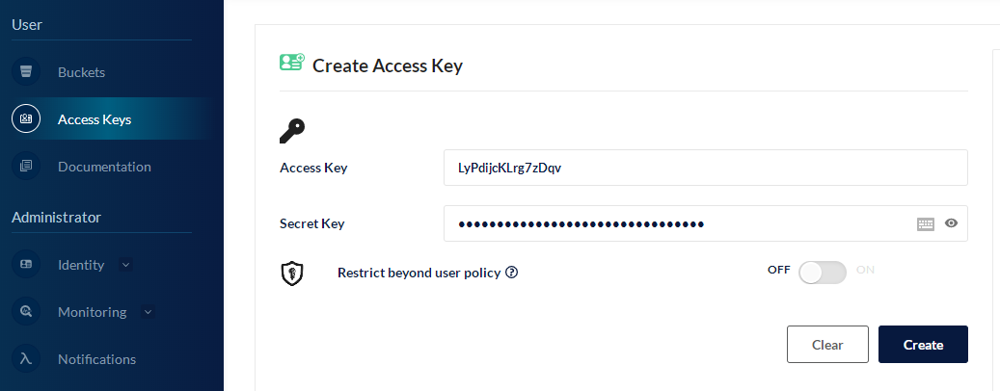
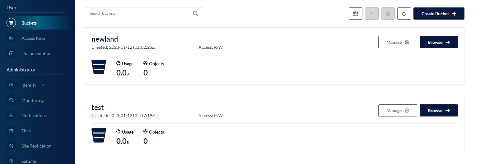
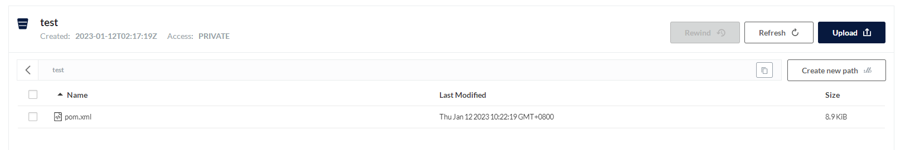

## 1 添加bitnami仓库

```
$ helm repo add bitnami https://charts.bitnami.com/bitnami
```

## 2 下载指定版本minio

```
$ helm pull bitnami/minio --version=11.10.20
$ tar -zxf minio-11.10.20.tgz
```

## 3 修改minio配置

```
global:
# 如果k8s没有设置默认sc，这里需要指定
  storageClass: ""
# 服务名
fullnameOverride: "minio"

# minio 部署模式 (`standalone` or `distributed`)
mode: distributed

# minio 认证账户，web登陆账户
auth:
  rootUser: admin
  # 密码至少6位，设置断了可能报错
  rootPassword: "minio123"

# 创建的默认桶
defaultBuckets: "newland"

# distributed 模式下，服务部署数量，必须大于4个
statefulset:
  # 副本
  replicaCount: 4

# 容器端口 api 端口和 console 端口
containerPorts:
  api: 9000
  console: 9001

# svc 定义
service:
  type: ClusterIP
  ports:
    api: 9000
    console: 9001
    
# console 端口 ingress 定义，web访问 Minio
ingress:
  enabled: false
  ingressClassName: "nginx"
  hostname: minio.newland.com
  path: /
  pathType: ImplementationSpecific
  servicePort: minio-console
  
# api 接口 ingress 定义，代码访问 MInio
apiIngress:
  enabled: true
  ingressClassName: "nginx"
  hostname: minio-api.newland.com
  path: /
  pathType: ImplementationSpecific
  servicePort: minio-api
  
# pvc 定义
persistence:
  enabled: true
  mountPath: /data
  accessModes:
    - ReadWriteOnce
  size: 200Gi
```

## 4 安装

```
helm install minio ../minio -n newland
```

## 5 登录并设置密钥、bucket





## 6 测试代码

```
public class FileUploader {
    public static void main(String[] args) throws NoSuchAlgorithmException, IOException, InvalidKeyException {
        try {
            MinioClient minioClient = MinioClient.builder()
                    .httpClient(getUnsafeOkHttpsClient())
                    .credentials("jGtLBvw6HhnW9Nsc", "BzDmbL3ZCPERFHPxB5jOnf0w7l48DqOu")
                    .endpoint("192.168.100.100", 31582, false)
                    .build();

            // 检查存储桶是否已经存在
            boolean isExist = minioClient.bucketExists(BucketExistsArgs.builder().bucket("test").build());
            if (isExist) {
                System.out.println("Bucket already exists.");
            } else {
                // 创建一个名为asiatrip的存储桶，用于存储照片的zip文件。
                minioClient.makeBucket(MakeBucketArgs.builder().bucket("test").build());
            }
            FileInputStream fis = new FileInputStream("./pom.xml");
            // 使用putObject上传一个文件到存储桶中。
            minioClient.putObject(PutObjectArgs.builder()
                    .bucket("test")
                    .object("pom.xml")
                    .stream(fis, fis.available(), -1)
                    .build());
            System.out.println("pom.xml is successfully uploaded as pom.xml to `test` bucket.");
        } catch (MinioException e) {
            System.out.println("Error occurred: " + e);
        } catch (KeyManagementException e) {
            throw new RuntimeException(e);
        }
    }

    public static OkHttpClient getUnsafeOkHttpsClient() throws KeyManagementException {
        try {
            final TrustManager[] trustAllCerts = new TrustManager[]{
                    new X509TrustManager() {
                        @Override
                        public void checkClientTrusted(X509Certificate[] x509Certificates, String s) throws CertificateException {

                        }

                        @Override
                        public void checkServerTrusted(X509Certificate[] x509Certificates, String s) throws CertificateException {

                        }

                        @Override
                        public X509Certificate[] getAcceptedIssuers() {
                            return new X509Certificate[]{};
                        }
                    }
            };


            final SSLContext sslContext = SSLContext.getInstance("SSL");
            sslContext.init(null, trustAllCerts, new SecureRandom());
            final SSLSocketFactory sslSocketFactory = sslContext.getSocketFactory();
            OkHttpClient.Builder builder = new OkHttpClient.Builder();
            builder.sslSocketFactory(sslSocketFactory,new X509TrustManager() {
                @Override
                public void checkClientTrusted(X509Certificate[] x509Certificates, String s) throws CertificateException {

                }

                @Override
                public void checkServerTrusted(X509Certificate[] x509Certificates, String s) throws CertificateException {

                }

                @Override
                public X509Certificate[] getAcceptedIssuers() {
                    return new X509Certificate[]{};
                }
            });


            builder.hostnameVerifier(new HostnameVerifier() {
                @Override
                public boolean verify(String s, SSLSession sslSession) {
                    return true;
                }
            });
            return builder.build();

        } catch (NoSuchAlgorithmException e) {
            e.printStackTrace();
        }
        return null;
    }
}
```

## 7 查看结果



