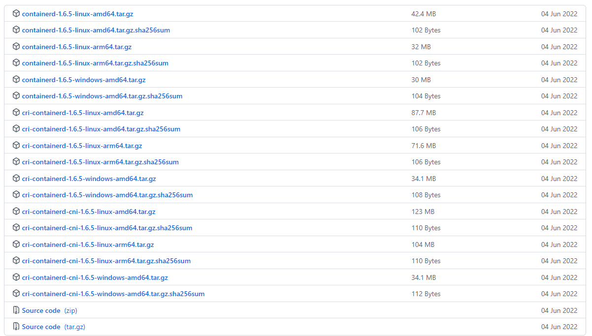

# 一、环境

系统：Centos7

# 二、进制安装

[Release containerd 1.6.5 · containerd/containerd · GitHub](https://github.com/containerd/containerd/releases/tag/v1.6.5) 

github上面提供了带cri、cni和不带的，这里图方便和兼容性就直接选择带cri和cni的吧



下载

```
wget -c https://github.com/containerd/containerd/releases/download/v1.6.5/cri-containerd-cni-1.6.5-linux-amd64.tar.gz
```

安装

```
tar -zxf cri-containerd-cni-1.6.5-linux-amd64.tar.gz  -C /
```

# 三、开启启动服务

```
systemctl enable containerd --now
```

查看服务状态

```
[root@k8s-node02 containerd]# systemctl status containerd
● containerd.service - containerd container runtime
   Loaded: loaded (/etc/systemd/system/containerd.service; disabled; vendor preset: disabled)
   Active: active (running) since 日 2022-07-31 23:01:12 CST; 15min ago
     Docs: https://containerd.io
  Process: 2228 ExecStartPre=/sbin/modprobe overlay (code=exited, status=0/SUCCESS)
 Main PID: 2229 (containerd)
    Tasks: 8
   Memory: 26.2M
   CGroup: /system.slice/containerd.service
           └─2229 /usr/local/bin/containerd

7月 31 23:01:12 k8s-node02 systemd[1]: Started containerd container runtime.
7月 31 23:01:12 k8s-node02 containerd[2229]: time="2022-07-31T23:01:12.449907775+08:00" level=info msg=serving... address=/run/containerd/containerd.sock.ttrpc
7月 31 23:01:12 k8s-node02 containerd[2229]: time="2022-07-31T23:01:12.449946236+08:00" level=info msg=serving... address=/run/containerd/containerd.sock
7月 31 23:01:12 k8s-node02 containerd[2229]: time="2022-07-31T23:01:12.449986296+08:00" level=info msg="containerd successfully booted in 0.042232s"
7月 31 23:01:12 k8s-node02 containerd[2229]: time="2022-07-31T23:01:12.464325017+08:00" level=info msg="Start subscribing containerd event"
7月 31 23:01:12 k8s-node02 containerd[2229]: time="2022-07-31T23:01:12.464892179+08:00" level=info msg="Start recovering state"
7月 31 23:01:12 k8s-node02 containerd[2229]: time="2022-07-31T23:01:12.464983433+08:00" level=info msg="Start event monitor"
7月 31 23:01:12 k8s-node02 containerd[2229]: time="2022-07-31T23:01:12.465003694+08:00" level=info msg="Start snapshots syncer"
7月 31 23:01:12 k8s-node02 containerd[2229]: time="2022-07-31T23:01:12.465015764+08:00" level=info msg="Start cni network conf syncer for default"
7月 31 23:01:12 k8s-node02 containerd[2229]: time="2022-07-31T23:01:12.465024518+08:00" level=info msg="Start streaming server"
```

# 四、查看containerd的状态

查看插件检查状态

从列表中可以看出snapshotter只有一个native可用。

```
$ [root@k8s-node02 k8s-install]# ctr plugin ls
TYPE                                  ID                       PLATFORMS      STATUS    
io.containerd.content.v1              content                  -              ok        
io.containerd.snapshotter.v1          aufs                     linux/amd64    skip      
io.containerd.snapshotter.v1          btrfs                    linux/amd64    skip      
io.containerd.snapshotter.v1          devmapper                linux/amd64    error     
io.containerd.snapshotter.v1          native                   linux/amd64    ok        
io.containerd.snapshotter.v1          overlayfs                linux/amd64    error     
io.containerd.snapshotter.v1          zfs                      linux/amd64    skip      
...      
io.containerd.tracing.processor.v1    otlp                     -              skip      
io.containerd.internal.v1             tracing                  -              ok        
io.containerd.grpc.v1                 cri                      linux/amd64    error
```

这里可以看出cri是error，因为我用的系统是centos7，centos7默认文件系统是XFS，centos6是EXT4，cnetos5是EXT3.    而 默认状态下xfs是不支持overlayfs的。

通过df查看文件系统：

```
[root@k8s-node02 k8s-install]# df -T
文件系统                类型        1K-块    已用     可用 已用% 挂载点
devtmpfs                devtmpfs   485692       0   485692    0% /dev
tmpfs                   tmpfs      497820       0   497820    0% /dev/shm
tmpfs                   tmpfs      497820    7792   490028    2% /run
tmpfs                   tmpfs      497820       0   497820    0% /sys/fs/cgroup
/dev/mapper/centos-root xfs      18307072 5477540 12829532   30% /
/dev/sda1               xfs        508588  187448   321140   37% /boot
tmpfs                   tmpfs       99564       0    99564    0% /run/user/0
/dev/sda3               xfs       5232640   33112  5199528    1% /var/lib/containerd
```

# 五、解决cri error的问题

## 1 将cri的snapshotter设置成native(这种方式不知道有没后续问题)

containerd的默认配置文件在/etc/containerd/config.toml

```
[root@k8s-node02 k8s-install]# mkdir /etc/containerd
[root@k8s-node02 k8s-install]# cd /etc/containerd
[root@k8s-node02 containerd]# containerd config default > config.toml
[root@k8s-node02 containerd]# vi config.toml
```

将默认配置文件的

```
[plugins."io.containerd.grpc.v1.cri".containerd]
      default_runtime_name = "runc"
      disable_snapshot_annotations = true
      discard_unpacked_layers = false
      ignore_rdt_not_enabled_errors = false
      no_pivot = false
      snapshotter = "overlayfs"
```

改为

```
[plugins."io.containerd.grpc.v1.cri".containerd]
      default_runtime_name = "runc"
      disable_snapshot_annotations = true
      discard_unpacked_layers = false
      ignore_rdt_not_enabled_errors = false
      no_pivot = false
      snapshotter = "native"
```

查看插件启动状态

```
[root@k8s-node02 k8s-install]# ctr plugin ls
TYPE                                  ID                       PLATFORMS      STATUS    
io.containerd.grpc.v1                 cri                      linux/amd64    ok 
```

## 2 单独设置一个分区，将ftype=1

格式化xfs分区并且设置ftype=1

```
mkfs.xfs -f -n ftype=1 /dev/sda3
```

挂在分区

```
# 临时挂在
mount /dev/sda3 /var/lib/containerd
# 永久挂在
vi /etc/fstab
```

查看插件启动状态

```
[root@k8s-node02 k8s-install]# ctr plugins ls
TYPE                                  ID                       PLATFORMS      STATUS    
io.containerd.content.v1              content                  -              ok        
io.containerd.snapshotter.v1          aufs                     linux/amd64    skip      
io.containerd.snapshotter.v1          btrfs                    linux/amd64    skip      
io.containerd.snapshotter.v1          devmapper                linux/amd64    error     
io.containerd.snapshotter.v1          native                   linux/amd64    ok        
io.containerd.snapshotter.v1          overlayfs                linux/amd64    ok    
```

# 六、私有云配置

单机命令  ctr image pull 不起作用，crictl pull 起作用。

```
[plugins."io.containerd.grpc.v1.cri".registry]
      config_path = ""

      [plugins."io.containerd.grpc.v1.cri".registry.auths]

      [plugins."io.containerd.grpc.v1.cri".registry.configs]

      [plugins."io.containerd.grpc.v1.cri".registry.headers]

      [plugins."io.containerd.grpc.v1.cri".registry.mirrors]
# 镜像地址
        [plugins."io.contianerd.grpc.v1.cri".registry.mirrors."harborcloud.com"]
          endpoint = ["https://harborcloud.com"]
          # 镜像地址配置
        [plugins."io.containerd.grpc.v1.cri".registry.configs."harborcloud.com".tls]
        #跳过验证
          insecure_skip_verify = true
```

```
crictl pull harborcloud.com/library/nginx:1.9.1
```

# 七、配置文件

配置文件生成

````yaml
[root@k8s-node02 k8s-install]# mkdir /etc/containerd
[root@k8s-node02 k8s-install]# cd /etc/containerd
[root@k8s-node02 containerd]# containerd config default > config.toml
[root@k8s-node02 containerd]# vi config.toml
````

# 八 containerd基础命令

## ctr

CTR是一个不受支持的用于交互的调试和管理客户机使用containerd守护进程。因为它不受支持，命令， 选项和操作不保证向后兼容或在集装箱项目的不同版本之间保持稳定。

```
[root@k8s-node02 k8s-install]# ctr --help
USAGE:
   ctr [global options] command [command options] [arguments...]

COMMANDS:
   plugins, plugin            提供有关容器插件的信息，例如：ctr plugin ls
   version                    版本信息
   containers, c, container   管理容器
   content                    管理内容
   events, event              事件显示容器事件
   images, image, i           管理镜像
   leases                     管理租赁
   namespaces, namespace, ns  管理命名空间
   pprof                      为containerd提供golang Pprof输出
   run                        运行容器
   snapshots, snapshot        管理快照
   tasks, t, task             管理任务
   install                    安装一个新的包
   oci                        OCI tools
   shim                       与shim直接交互
   help, h                    Shows a list of commands or help for one command

GLOBAL OPTIONS:
   --debug                      打开日志的调试输出
   --address value, -a value    containerd的GRPC服务器地址 (default: "/run/containerd/containerd.sock") [$CONTAINERD_ADDRESS]
   --timeout value              CTR命令的总超时时间(默认值:0)
   --connect-timeout value      连接到容器的超时时间(默认值:0)
   --namespace value, -n value  命名空间与命令一起使用 (default: "default") [$CONTAINERD_NAMESPACE]
   --help, -h                   show help
   --version, -v                打印版本
```

查看镜像

```
ctr images list 或  ctr i ls
# 查看指定命名空间下的镜像
ctr -n k8s.io images list
```

命名空间查看

```
ctr namespaces list  或 ctr ns list
```

镜像标记

```
ctr -n k8s.io images tag registry.cn-hangzhou.aliyuncs.com/google_containers/pause:3.2 k8s.gcr.io/pause:3.2
```

删除镜像

```
 ctr -n k8s.io images rm k8s.gcr.io/pause:3.2
```

拉取镜像

```
 ctr images pull docker.io/library/redis:latest
 # 指定命名空间并且检查镜像是否有效
 ctr -n k8s.io images pull -k k8s.gcr.io/pause:3.2
```

导出镜像

```
 ctr -n k8s.io images export pause.tar k8s.gcr.io/pause:3.2
```

导入镜像

不支持 build,commit 镜像

```
ctr -n k8s.io i import pause.tar
```

运行容器

```
ctr -n k8s.io run --null-io --net-host -d –env PASSWORD=$drone_password –mount type=bind,src=/etc,dst=/host-etc,options=rbind:rw –mount type=bind,src=/root/.kube,dst=/root/.kube,options=rbind:rw $image sysreport bash /sysreport/run.sh


–null-io: 将容器内标准输出重定向到/dev/null
–net-host: 主机网络
-d: 当task执行后就进行下一步shell命令,如没有选项,则会等待用户输入,并定向到容器内
```

查看容器

```
ctr containers list 或 ctr c ls
# 指定命名空间
ctr -n k8s.io c ls
```

任务查看

```
ctr -n k8s.io tasks list
```

停止容器

```
kill -a -s 9 {id}
```

创建静态容器

```
 $ ctr container create docker.io/library/nginx:latest nginx 
 $ ctr task ls
TASK    PID    STATUS    
 
```

开启任务

方式一：

```
# 开启任务
[root@k8s-node02 k8s-install]# ctr task start -d nginx
[root@k8s-node02 k8s-install]
# 查看进程列表
[root@k8s-node02 k8s-install]# ctr task list
TASK     PID    STATUS    
nginx    0      RUNNING
#查看指定进程
[root@k8s-node02 k8s-install]# ctr task ps nginx
PID     INFO
3679    -
3718    -
3719    -
# 查看本机对应的进程
[root@k8s-node02 k8s-install]# ps -ef|grep 3679
root       3679   3659  0 15:27 ?        00:00:00 nginx: master process nginx -g daemon off;
101        3718   3679  0 15:27 ?        00:00:00 nginx: worker process
101        3719   3679  0 15:27 ?        00:00:00 nginx: worker process
root       3740   1111  0 15:29 pts/0    00:00:00 grep --color=auto 3679

# ctr task exec 进入容器，id随便写就行，需要将其唯一 
[root@k8s-node02 k8s-install]# ctr task exec --exec-id 1 -t  nginx /bin/sh
```

方式二：（一键开启）

```
[root@localhost runc]# ctr run -d --net-host docker.io/library/nginx:latest nginx
[root@localhost runc]# ctr task exec --exec-id $RANDOM -t nginx /bin/sh
```

## crictl

```
[root@k8s-node02 k8s-install]# crictl  --help
NAME:
   crictl - client for CRI
USAGE:
   crictl [global options] command [command options] [arguments...]
COMMANDS:
   attach              连接到一个运行的容器
   create              创建一个新容器
   exec                在运行的容器中运行命令
   version             显示运行时版本信息
   images, image, img  镜像
   inspect             显示一个或多个容器的状态
   inspecti            返回一个或多个镜像的状态
   imagefsinfo         返回映像文件系统信息
   inspectp            显示一个或多个pod的状态
   logs                获取容器日志
   port-forward        将本地端口转发给pod
   ps                  容器列表
   pull                拉去镜像
   run                 在沙箱中运行一个新容器
   runp                运行一个新pod
   rm                  移除container
   rmi                 移除镜像
   rmp                 移除pod
   pods                pods列表
   start               启动一个或多个已创建的容器
   info                启动一个或多个创建的容器显示容器运行时的信息
   stop                停止一个或多个运行中的容器
   stopp               停止一个或多个运行中的pod
   update              更新一个或多个运行中的容器
   config              Get and set crictl client configuration options
   stats               列出容器资源使用统计信息
   statsp              列出pod资源使用统计信息
   completion          输出shell完成代码
   help, h             Shows a list of commands or help for one command

GLOBAL OPTIONS:
   --config value, -c value            Location of the client config file. If not specified and the default does not exist, the program's directory is searched as well (default: "/etc/crictl.yaml") [$CRI_CONFIG_FILE]
   --debug, -D                         Enable debug mode (default: false)
   --image-endpoint value, -i value    Endpoint of CRI image manager service (default: uses 'runtime-endpoint' setting) [$IMAGE_SERVICE_ENDPOINT]
   --runtime-endpoint value, -r value  Endpoint of CRI container runtime service (default: uses in order the first successful one of [unix:///var/run/dockershim.sock unix:///run/containerd/containerd.sock unix:///run/crio/crio.sock unix:///var/run/cri-dockerd.sock]). Default is now deprecated and the endpoint should be set instead. [$CONTAINER_RUNTIME_ENDPOINT]
   --timeout value, -t value           Timeout of connecting to the server in seconds (e.g. 2s, 20s.). 0 or less is set to default (default: 2s)
   --help, -h                          show help (default: false)
   --version, -v                       print the version (default: false)
```

拉取镜像

```
crictl pull docker.io/library/redis:latest
```

查看运行的容器

```
crictl ps
```

查看运行中的pod

```
crictl pods
```

查看pod详细信息

```
crictl inspectp eea1584366c1d
```

查看容器详细信息

```
crictl inspect 5389d4e04a974
```

查看容器镜像详细信息

```
crictl inspecti 70f5e18fddce8
```

# 九 异常问题

## （1）问题一 

runc: symbol lookup error: runc: undefined symbol: seccomp_notify_respond

### 解决方式一：源码编译runc

```
yum install -y epel-release
yum install -y golang
yum install -y libseccomp-devel
git clone https://github.com/opencontainers/runc
cd runc
make&& make install
```

### 解决方式二：

```
[root@k8s-node02 k8s-install]# ctr task start -d nginx
ctr: failed to create shim task: OCI runtime create failed: unable to retrieve OCI runtime error (open /run/containerd/io.containerd.runtime.v2.task/default/nginx/log.json: no such file or directory): runc did not terminate successfully: exit status 127: unknown

[root@k8s-node02 k8s-install]# runc
runc: symbol lookup error: runc: undefined symbol: seccomp_notify_respond
```

这个是说缺少依赖包`libseccomp`，需要注意的是`centos7`中yum下载的版本是2.3的，版本不满足我们最新containerd的需求，需要下载2.4以上的 

卸载

```
libseccomp-2.3.1-0.el7.x86_64                                                                                                     libseccomp-devel-2.3.1-0.el7.x86_64 
```

重新安装2.5

```
$ wget http://rpmfind.net/linux/centos/8-stream/BaseOS/x86_64/os/Packages/libseccomp-2.5.1-1.el8.x86_64.rpm
$ rpm -ivh libseccomp-2.5.1-1.el8.x86_64.rpm
```

查看结果

```
[root@k8s-node02 k8s-install]# runc
NAME:
   runc - Open Container Initiative runtime

[root@k8s-node02 k8s-install]# ctr task start -d nginx 
```

上面两种方式都会出现还是UNKNOWN，可能需要删除一些数据rm -rf /run/containerd/io.containerd.runtime.v2.task/default/nginx/rootfs/*

```
[root@k8s-node02 k8s-install]# ctr task list
TASK     PID    STATUS    
nginx    0      UNKNOWN
```

修改后

```
[root@k8s-node02 runc]# ctr task list
TASK     PID     STATUS    
nginx    5861    RUNNING
```

## （2）问题二 

ctr: failed to create shim task: OCI runtime create failed: runc create failed: unable to start container process: error during container init: error mounting "/etc/hosts" to rootfs at "/etc/hosts": possibly malicious path detected -- refusing to operate on /etc/hosts: unknown

重启一下


