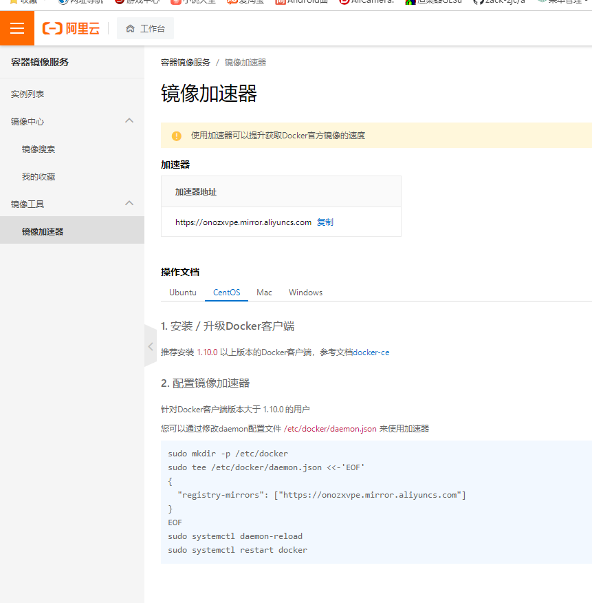
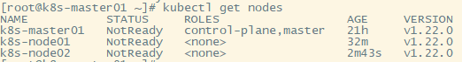
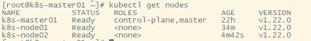

# kubeadm快速部署kubernetes集群

# 1 安装要求

- 一台或多台机器，操作系统 CentOS7.x-86_x64
- 硬件配置：2GB或更多RAM，2个CPU或更多CPU，硬盘30GB或更多(master必须2cpu,node可以不用)
- 可以访问外网，需要拉取镜像，如果服务器不能上网，需要提前下载镜像并导入节点
- 禁止swap分区

[安装 kubeadm | Kubernetes](https://kubernetes.io/zh-cn/docs/setup/production-environment/tools/kubeadm/install-kubeadm/)

# 2 准备环境

| 角色   | IP            |
| ------ | ------------- |
| master | 192.168.66.11 |
| node1  | 192.168.66.21 |
| node2  | 192.168.66.22 |

```
yum update -y
yum install -y firewalld ntpdate net-tools ipvsadm wget
```

## 2.1 关闭防火墙及selinux

所有节点执行一下命令

```
# 关闭防火墙
systemctl stop firewalld
systemctl disable firewalld

# 关闭selinux
# 永久
sed -i 's/enforcing/disabled/' /etc/selinux/config  
# 临时
setenforce 0  
```

## 2.2 关闭swap

所有节点执行一下命令

```
# 关闭swap
# 临时
swapoff -a  
# 永久
sed -ri 's/.*swap.*/#&/' /etc/fstab    
```

## 2.3 根据规划设置主机名及hosts

所有节点执行hostnamectl set-hostname <hostname>命令

```
# k8smaster节点执行
hostnamectl set-hostname k8s-master01
# k8snode1节点执行
hostnamectl set-hostname k8s-node01
# k8snode2节点执行
hostnamectl set-hostname k8s-node02
```

k8smaster主节点执行

```
cat >> /etc/hosts << EOF
192.168.66.11 k8s-master01
192.168.66.21 k8s-node01
192.168.66.22 k8s-node02
EOF
```

## 2.4 将桥接的IPv4流量传递到iptables的链

确保 `br_netfilter` 模块被加载。这一操作可以通过运行 `lsmod | grep br_netfilter` 来完成。若要显式加载该模块，可执行 `sudo modprobe br_netfilter`。 

确保在你的 `sysctl` 配置中将 `net.bridge.bridge-nf-call-iptables` 设置为 1。 

```
cat <<EOF | sudo tee /etc/modules-load.d/k8s.conf
br_netfilter
EOF

#将桥接的IPv4流量传递到iptables的链
cat > /etc/sysctl.d/k8s.conf << EOF
net.bridge.bridge-nf-call-ip6tables = 1
net.bridge.bridge-nf-call-iptables = 1
EOF
# 生效
sysctl --system  
```

## 2.5 时间同步

所有节点执行一下命令

```
yum install ntpdate -y
ntpdate time.windows.com
# 强制把系统时间写入CMOS
clock -w
```

# 3 所有节点安装Docker/kubeadm/kubelet

## 3.1 安装Docker

k8snode1和k8snode2下安装docker

```
wget https://mirrors.aliyun.com/docker-ce/linux/centos/docker-ce.repo -O /etc/yum.repos.d/docker-ce.repo
yum -y install docker-ce-18.06.1.ce-3.el7
systemctl enable docker && systemctl start docker
docker --version
```

## 3.2 配置docker镜像加速



```
cat > /etc/docker/daemon.json << EOF
{
  "registry-mirrors": ["https://onozxvpe.mirror.aliyuncs.com","http://hub-mirror.c.163.com", "https://registry.docker-cn.com"],
  "exec-opts": ["native.cgroupdriver=systemd"]
}
EOF
```

添加镜像加入和本地搭建harbor后：

```
{
  "registry-mirrors": ["https://onozxvpe.mirror.aliyuncs.com"],
  "exec-opts": ["native.cgroupdriver=systemd"],
  "insecure-registries": ["harborcloud.com"]
}
```


## 3.3 添加阿里云YUM软件源

```
cat > /etc/yum.repos.d/kubernetes.repo << EOF
[kubernetes]
name=Kubernetes
baseurl=https://mirrors.aliyun.com/kubernetes/yum/repos/kubernetes-el7-x86_64
enabled=1
gpgcheck=0
repo_gpgcheck=0
gpgkey=https://mirrors.aliyun.com/kubernetes/yum/doc/yum-key.gpg https://mirrors.aliyun.com/kubernetes/yum/doc/rpm-package-key.gpg
EOF
```

## 3.4 安装kubeadm，kubelet和kubectl

```
yum install -y kubeadm-1.22.0 kubectl-1.22.0 kubelet-1.22.0
systemctl enable kubelet
```

# 4 部署Kubernetes Master

https://kubernetes.io/zh-cn/docs/reference/setup-tools/kubeadm/kubeadm-init/

在192.168.66.10（k8smaster）执行。

由于默认拉取镜像地址k8s.gcr.io国内无法访问，这里指定阿里云镜像仓库地址

**–pod-network-cidr**

指定pod网络的IP地址范围。 设置后，控制平面将自动为每个节点分配cidr。

**–service-cidr**

集群内部虚拟网络，Pod统一访问入口

```
kubeadm init \
--apiserver-advertise-address=192.168.66.10 \
--image-repository registry.aliyuncs.com/google_containers \
--kubernetes-version v1.22.0 \
--service-cidr=10.96.0.0/12 \
--pod-network-cidr=10.244.0.0/16
```

执行结果

```
[init] Using Kubernetes version: v1.22.0
[preflight] Running pre-flight checks
[preflight] Pulling images required for setting up a Kubernetes cluster
[preflight] This might take a minute or two, depending on the speed of your internet connection
[preflight] You can also perform this action in beforehand using 'kubeadm config images pull'
[certs] Using certificateDir folder "/etc/kubernetes/pki"
[certs] Generating "ca" certificate and key
[certs] Generating "apiserver" certificate and key
[certs] apiserver serving cert is signed for DNS names [k8s-master01 kubernetes kubernetes.default kubernetes.default.svc kubernetes.default.svc.cluster.local] and IPs [10.96.0.1 192.168.66.11]
[certs] Generating "apiserver-kubelet-client" certificate and key
[certs] Generating "front-proxy-ca" certificate and key
[certs] Generating "front-proxy-client" certificate and key
[certs] Generating "etcd/ca" certificate and key
[certs] Generating "etcd/server" certificate and key
[certs] etcd/server serving cert is signed for DNS names [k8s-master01 localhost] and IPs [192.168.66.11 127.0.0.1 ::1]
[certs] Generating "etcd/peer" certificate and key
[certs] etcd/peer serving cert is signed for DNS names [k8s-master01 localhost] and IPs [192.168.66.11 127.0.0.1 ::1]
[certs] Generating "etcd/healthcheck-client" certificate and key
[certs] Generating "apiserver-etcd-client" certificate and key
[certs] Generating "sa" key and public key
[kubeconfig] Using kubeconfig folder "/etc/kubernetes"
[kubeconfig] Writing "admin.conf" kubeconfig file
[kubeconfig] Writing "kubelet.conf" kubeconfig file
[kubeconfig] Writing "controller-manager.conf" kubeconfig file
[kubeconfig] Writing "scheduler.conf" kubeconfig file
[kubelet-start] Writing kubelet environment file with flags to file "/var/lib/kubelet/kubeadm-flags.env"
[kubelet-start] Writing kubelet configuration to file "/var/lib/kubelet/config.yaml"
[kubelet-start] Starting the kubelet
[control-plane] Using manifest folder "/etc/kubernetes/manifests"
[control-plane] Creating static Pod manifest for "kube-apiserver"
[control-plane] Creating static Pod manifest for "kube-controller-manager"
[control-plane] Creating static Pod manifest for "kube-scheduler"
[etcd] Creating static Pod manifest for local etcd in "/etc/kubernetes/manifests"
[wait-control-plane] Waiting for the kubelet to boot up the control plane as static Pods from directory "/etc/kubernetes/manifests". This can take up to 4m0s
[apiclient] All control plane components are healthy after 12.003757 seconds
[upload-config] Storing the configuration used in ConfigMap "kubeadm-config" in the "kube-system" Namespace
[kubelet] Creating a ConfigMap "kubelet-config-1.22" in namespace kube-system with the configuration for the kubelets in the cluster
[upload-certs] Skipping phase. Please see --upload-certs
[mark-control-plane] Marking the node k8s-master01 as control-plane by adding the labels: [node-role.kubernetes.io/master(deprecated) node-role.kubernetes.io/control-plane node.kubernetes.io/exclude-from-external-load-balancers]
[mark-control-plane] Marking the node k8s-master01 as control-plane by adding the taints [node-role.kubernetes.io/master:NoSchedule]
[bootstrap-token] Using token: ii3pse.bfxj9fqc9tvz6yrr
[bootstrap-token] Configuring bootstrap tokens, cluster-info ConfigMap, RBAC Roles
[bootstrap-token] configured RBAC rules to allow Node Bootstrap tokens to get nodes
[bootstrap-token] configured RBAC rules to allow Node Bootstrap tokens to post CSRs in order for nodes to get long term certificate credentials
[bootstrap-token] configured RBAC rules to allow the csrapprover controller automatically approve CSRs from a Node Bootstrap Token
[bootstrap-token] configured RBAC rules to allow certificate rotation for all node client certificates in the cluster
[bootstrap-token] Creating the "cluster-info" ConfigMap in the "kube-public" namespace
[kubelet-finalize] Updating "/etc/kubernetes/kubelet.conf" to point to a rotatable kubelet client certificate and key
[addons] Applied essential addon: CoreDNS
[addons] Applied essential addon: kube-proxy

Your Kubernetes control-plane has initialized successfully!

To start using your cluster, you need to run the following as a regular user:

  mkdir -p $HOME/.kube
  sudo cp -i /etc/kubernetes/admin.conf $HOME/.kube/config
  sudo chown $(id -u):$(id -g) $HOME/.kube/config

Alternatively, if you are the root user, you can run:

  export KUBECONFIG=/etc/kubernetes/admin.conf

You should now deploy a pod network to the cluster.
Run "kubectl apply -f [podnetwork].yaml" with one of the options listed at:
  https://kubernetes.io/docs/concepts/cluster-administration/addons/

Then you can join any number of worker nodes by running the following on each as root:

kubeadm join 192.168.66.11:6443 --token ii3pse.bfxj9fqc9tvz6yrr \
        --discovery-token-ca-cert-hash sha256:643b48706d97589356e2a4be7294a898ac9a909baa56fecca277b7b4e5634e0e 
```

- preflight，系统前置检查
- certs 各种证书的文件生成
- kubeconfig生成kubeconfig文件，主要是kubenetes的几大组件的配置文件。
- kubelet-start 启动kubelet
- control-plane 生成所有静态pod的manifest文件，这些静态pod组成了kubenetes的控制面板，apiserver，controller，scheduler，生成这个文件后，kubelet会自动依据此文件描述的信息拉起镜像
- etcd 生成etcd的manifest
- upload-config 上传kubeadm和kubelet的配置文件到configmap中
- upload-certs 上传配置证书文件
- mark-control-plane mark一个node作为控制台
- bootstrap-token 生成bootstrap tokens用于把node节点加入到集群。
- kubelet-finalize 更新kubelet的设置
- addon 安装其他的相关组件。主要是网络组件dns和kube-proxy

所有node执行：

注：`kubectl` 在 `$HOME/.kube` 目录中查找一个名为 `config` 的配置文件。 你可以通过设置 KUBECONFIG 环境变量或设置 [`--kubeconfig`](https://kubernetes.io/zh/docs/concepts/configuration/organize-cluster-access-kubeconfig/) 参数来指定其它 [kubeconfig](https://kubernetes.io/zh/docs/concepts/configuration/organize-cluster-access-kubeconfig/) 文件。

```
mkdir -p $HOME/.kube
sudo cp -i /etc/kubernetes/admin.conf $HOME/.kube/config
sudo chown $(id -u):$(id -g) $HOME/.kube/config
$ kubectl get nodes
```

如果出现错误通过一下命令重置

```
kubeadm reset
```

# 5 加入Kubernetes Node

执行上面kubeadm init后显示的信息提示，加入kubernates

```
kubeadm join 192.168.66.11:6443 --token ii3pse.bfxj9fqc9tvz6yrr \
        --discovery-token-ca-cert-hash sha256:643b48706d97589356e2a4be7294a898ac9a909baa56fecca277b7b4e5634e0e
```

默认token有效期为24小时，当过期之后，该token就不可用了。这时就需要重新创建token，操作如下：

```
kubeadm token create --print-join-command
```

# 6 部署CNI网络插件



这里可能需要代理下载，可以先下载下来

```
$ kubectl apply -f https://raw.githubusercontent.com/coreos/flannel/master/Documentation/kube-flannel.yml
$ kubectl get pods -n kube-system
NAME                          READY   STATUS    RESTARTS   AGE
kube-flannel-ds-amd64-2pc95   1/1     Running   0          72s
```



**Flannel工作原理**

k8s网络通讯方式：[k8s网络通讯方式 – 青叶水间 (youhang.site)](http://jishu.youhang.site/25.html)

每个主机配置一个ip段和子网个数。 例如，可以配置一个覆盖网络使用 10.244.0.0/16段，每个主机/24个子网。因此主机a可以接受10.244.1.0/24，主机B可以接受10.244.2.0/24的包。flannel使用etcd来维护分配的子网到实际的ip地址之间的映射。

master IP信息：

```
[root@k8s-master01 ~]# ip addr
1: lo: <LOOPBACK,UP,LOWER_UP> mtu 65536 qdisc noqueue state UNKNOWN group default qlen 1000
    link/loopback 00:00:00:00:00:00 brd 00:00:00:00:00:00
    inet 127.0.0.1/8 scope host lo
       valid_lft forever preferred_lft forever
    inet6 ::1/128 scope host 
       valid_lft forever preferred_lft forever
2: eno16777736: <BROADCAST,MULTICAST,UP,LOWER_UP> mtu 1500 qdisc pfifo_fast state UP group default qlen 1000
    link/ether 00:0c:29:6b:de:b6 brd ff:ff:ff:ff:ff:ff
    inet 192.168.66.11/24 brd 10.0.0.255 scope global noprefixroute eno16777736
       valid_lft forever preferred_lft forever
    inet6 fd56:a9ae:cb0f::a49/128 scope global noprefixroute dynamic 
       valid_lft 29570sec preferred_lft 29570sec
    inet6 fd56:a9ae:cb0f:0:20c:29ff:fe6b:deb6/64 scope global noprefixroute 
       valid_lft forever preferred_lft forever
    inet6 fe80::20c:29ff:fe6b:deb6/64 scope link noprefixroute 
       valid_lft forever preferred_lft forever
3: docker0: <NO-CARRIER,BROADCAST,MULTICAST,UP> mtu 1500 qdisc noqueue state DOWN group default 
    link/ether 02:42:f0:df:d5:af brd ff:ff:ff:ff:ff:ff
    inet 172.17.0.1/16 brd 172.17.255.255 scope global docker0
       valid_lft forever preferred_lft forever
4: flannel.1: <BROADCAST,MULTICAST,UP,LOWER_UP> mtu 1450 qdisc noqueue state UNKNOWN group default 
    link/ether 8e:53:a8:6d:99:1e brd ff:ff:ff:ff:ff:ff
    inet 10.244.0.0/32 scope global flannel.1
       valid_lft forever preferred_lft forever
    inet6 fe80::8c53:a8ff:fe6d:991e/64 scope link 
       valid_lft forever preferred_lft forever
5: cni0: <BROADCAST,MULTICAST,UP,LOWER_UP> mtu 1450 qdisc noqueue state UP group default qlen 1000
    link/ether 7a:33:a2:1a:15:65 brd ff:ff:ff:ff:ff:ff
    inet 10.244.0.1/24 brd 10.244.0.255 scope global cni0
       valid_lft forever preferred_lft forever
    inet6 fe80::7833:a2ff:fe1a:1565/64 scope link 
       valid_lft forever preferred_lft forever
6: vethefc85590@if3: <BROADCAST,MULTICAST,UP,LOWER_UP> mtu 1450 qdisc noqueue master cni0 state UP group default 
    link/ether 5a:3e:58:6a:8c:d2 brd ff:ff:ff:ff:ff:ff link-netnsid 0
    inet6 fe80::583e:58ff:fe6a:8cd2/64 scope link 
       valid_lft forever preferred_lft forever
7: veth991a2bde@if3: <BROADCAST,MULTICAST,UP,LOWER_UP> mtu 1450 qdisc noqueue master cni0 state UP group default 
    link/ether fe:6f:eb:91:71:71 brd ff:ff:ff:ff:ff:ff link-netnsid 1
    inet6 fe80::fc6f:ebff:fe91:7171/64 scope link 
       valid_lft forever preferred_lft forever
```

**lo**

本地环回接口

**eno16777736**

真实网卡

**docker0**

docker ip信息，默认IP 172.17.0.1/16

可修改 /etc/docker/daemon.json, 指定ip地址，例如：

```
vi /etc/docker/daemon.json
{
 "bip": "172.18.0.1/24",
}
service docker restart
```

**flannel.1**

docker集群跨主机通讯的覆盖网络 10.244.0.0/32

**cni0**

pod分配 网络 10.244.0.1/24

node1 IP信息：

```
1: lo: <LOOPBACK,UP,LOWER_UP> mtu 65536 qdisc noqueue state UNKNOWN group default qlen 1000
    link/loopback 00:00:00:00:00:00 brd 00:00:00:00:00:00
    inet 127.0.0.1/8 scope host lo
       valid_lft forever preferred_lft forever
    inet6 ::1/128 scope host 
       valid_lft forever preferred_lft forever
2: eno16777736: <BROADCAST,MULTICAST,UP,LOWER_UP> mtu 1500 qdisc pfifo_fast state UP group default qlen 1000
    link/ether 00:0c:29:1a:1c:d4 brd ff:ff:ff:ff:ff:ff
    inet 10.0.0.21/24 brd 10.0.0.255 scope global noprefixroute eno16777736
       valid_lft forever preferred_lft forever
    inet6 fd56:a9ae:cb0f::7a1/128 scope global noprefixroute dynamic 
       valid_lft 29510sec preferred_lft 29510sec
    inet6 fd56:a9ae:cb0f:0:20c:29ff:fe1a:1cd4/64 scope global noprefixroute 
       valid_lft forever preferred_lft forever
    inet6 fe80::20c:29ff:fe1a:1cd4/64 scope link noprefixroute 
       valid_lft forever preferred_lft forever
3: docker0: <NO-CARRIER,BROADCAST,MULTICAST,UP> mtu 1500 qdisc noqueue state DOWN group default 
    link/ether 02:42:b8:ae:c9:24 brd ff:ff:ff:ff:ff:ff
    inet 172.17.0.1/16 brd 172.17.255.255 scope global docker0
       valid_lft forever preferred_lft forever
4: flannel.1: <BROADCAST,MULTICAST,UP,LOWER_UP> mtu 1450 qdisc noqueue state UNKNOWN group default 
    link/ether 1e:6d:47:69:f7:6a brd ff:ff:ff:ff:ff:ff
    inet 10.244.1.0/32 scope global flannel.1
       valid_lft forever preferred_lft forever
    inet6 fe80::1c6d:47ff:fe69:f76a/64 scope link 
       valid_lft forever preferred_lft forever
```

node2 IP信息

```
1: lo: <LOOPBACK,UP,LOWER_UP> mtu 65536 qdisc noqueue state UNKNOWN group default qlen 1000
    link/loopback 00:00:00:00:00:00 brd 00:00:00:00:00:00
    inet 127.0.0.1/8 scope host lo
       valid_lft forever preferred_lft forever
    inet6 ::1/128 scope host 
       valid_lft forever preferred_lft forever
2: eno16777736: <BROADCAST,MULTICAST,UP,LOWER_UP> mtu 1500 qdisc pfifo_fast state UP group default qlen 1000
    link/ether 00:0c:29:67:c3:4a brd ff:ff:ff:ff:ff:ff
    inet 10.0.0.22/24 brd 10.0.0.255 scope global noprefixroute eno16777736
       valid_lft forever preferred_lft forever
    inet6 fd56:a9ae:cb0f::853/128 scope global noprefixroute dynamic 
       valid_lft 29262sec preferred_lft 29262sec
    inet6 fd56:a9ae:cb0f:0:20c:29ff:fe67:c34a/64 scope global noprefixroute 
       valid_lft forever preferred_lft forever
    inet6 fe80::20c:29ff:fe67:c34a/64 scope link noprefixroute 
       valid_lft forever preferred_lft forever
3: docker0: <NO-CARRIER,BROADCAST,MULTICAST,UP> mtu 1500 qdisc noqueue state DOWN group default 
    link/ether 02:42:b2:7e:58:1f brd ff:ff:ff:ff:ff:ff
    inet 172.17.0.1/16 brd 172.17.255.255 scope global docker0
       valid_lft forever preferred_lft forever
4: flannel.1: <BROADCAST,MULTICAST,UP,LOWER_UP> mtu 1450 qdisc noqueue state UNKNOWN group default 
    link/ether 66:5b:e2:87:5c:22 brd ff:ff:ff:ff:ff:ff
    inet 10.244.2.0/32 scope global flannel.1
       valid_lft forever preferred_lft forever
    inet6 fe80::645b:e2ff:fe87:5c22/64 scope link 
       valid_lft forever preferred_lft forever
```

7 测试kubernetes集群

在Kubernetes集群中创建一个pod，验证是否正常运行：

```
[root@k8s-master01 ~]# kubectl create deployment nginx --image=nginx
deployment.apps/nginx created
[root@k8s-master01 ~]# kubectl expose deployment nginx --port=80 --type=NodePort
service/nginx exposed
[root@k8s-master01 ~]# kubectl get pod,svc
NAME                         READY   STATUS              RESTARTS   AGE
pod/nginx-6799fc88d8-zzsw7   0/1     ContainerCreating   0          31s

NAME                 TYPE        CLUSTER-IP      EXTERNAL-IP   PORT(S)        AGE
service/kubernetes   ClusterIP   10.96.0.1       <none>        443/TCP        24h
service/nginx        NodePort    10.103.32.138   <none>        80:30029/TCP   13s
```

访问地址：[http://NodeIP:Port](http://nodeip:Port/)

可以通过 [http://10.0.0.21:31263](http://10.0.0.21:31263/) 和 [http://10.0.0.22:31263](http://10.0.0.22:31263/) 访问

# 8 **错误排查**

启动日志获取

```
#查看启动日志
journalctl -f -u kubelet.service
```

配置加载与重启服务

```
systemctl daemon-reload && systemctl restart kubelet
```

# 9 ipvs修改

```
kubectl edit configmap kube-proxy -n kube-system
...
43   mode: "ipvs"
   ...
```

**删除pod,会自动拉起**

```
kubectl delete pod kube-proxy-btz4p -n kube-system  
```

**查看是否启用ipvs**

```
kubectl logs kube-proxy-wwqbh -n kube-system        
```

**注：**

```
1、 kube-proxy配置文件以configmap方式存储
2、 如果让所有节点生效，需要重建所有节点kube-proxy pod
```

# 10 **问题及解决**

1 failed to find subsystem mount for required subsystem: pids failed to find subsystem mount for required subsystem: pids

解决方法：

```
vi /usr/lib/systemd/system/kubelet.service.d/10-kubeadm.conf
#发现ExecStart=后面添加参数
ExecStart="--feature-gates SupportPodPidsLimit=false --feature-gates SupportNodePidsLimit=false"
#或者更改引用变量$KUBELET_EXTRA_ARGS
vi /etc/sysconfig/kubelet
KUBELET_EXTRA_ARGS=--feature-gates SupportPodPidsLimit=false --feature-gates SupportNodePidsLimit=false
```

2 kubelet cgroup driver: \“systemd\“ is different from docker cgroup driver: \“cgroupfs\“

docker的驱动查看是否有systemd

```
docker info |grep Cgroup
```

解决方案步骤如下：

(1)、先修改docker的Cgroup Driver，修改/etc/docker/daemon.json文件

```
{
  "exec-opts": ["native.cgroupdriver=systemd"]
}
```

重启docker

```
systemctl daemon-reload
systemctl restart docker
```

(2)、然后修改kubelet的Cgroup Driver
修改 “/usr/lib/systemd/system/kubelet.service.d/10-kubeadm.conf ” 文件，增加（或修改成）“–cgroup-driver=systemd” (官方推荐用systemd)

```
Environment="KUBELET_KUBECONFIG_ARGS=--bootstrap-kubeconfig=/etc/kubernetes/bootstrap-kubelet.conf --kubeconfig=/etc/kubernetes/kubelet.conf --cgroup-driver=systemd"
```

修改 “/var/lib/kubelet/kubeadm-flags.env ”文件，增加（或修改成）“-–cgroup-driver=systemd”

```
KUBELET_KUBEADM_ARGS="--cgroup-driver=systemd --network-plugin=cni --pod-infra-container-image=registry.aliyuncs.com/google_containers/pause:3.2"
```

重启：

```
systemctl daemon-reload
systemctl restart kubelet
```
3 missing required cgroups: cpu

修改`/etc/default/grub`

添加一行`GRUB_CMDLINE_LINUX="cgroup_enable=cpu"`

运行 `update-grub2`

重启机器 `reboot`

4  Failed to start CRI Interface for Docker Application Container Engine Defined-By: systemd

```
7月 29 20:35:14 k8s-master02 systemd[1]: cri-docker.service: main process exited, code=exited, status=203/EXEC
7月 29 20:35:14 k8s-master02 systemd[1]: Failed to start CRI Interface for Docker Application Container Engine.
-- Subject: Unit cri-docker.service has failed
-- Defined-By: systemd
-- Support: http://lists.freedesktop.org/mailman/listinfo/systemd-devel
-- 
-- Unit cri-docker.service has failed.
-- 
-- The result is failed.
7月 29 20:35:14 k8s-master02 systemd[1]: Unit cri-docker.service entered failed state.
7月 29 20:35:14 k8s-master02 systemd[1]: cri-docker.service failed.
```

修改 docker 控制组

```
vi /etc/docker/daemon.json 
{
  "exec-opts": ["native.cgroupdriver=systemd"]
}
```

从重启服务

```
systemctl daemon-reload
systemctl restart docker
systemctl restart cri-docker
```

5  error execution phase preflight: couldn't validate the identity of the API Server: Get "https://10.0.0.150:16443/api/v1/namespaces/kube-public/configmaps/cluster-info?timeout=10s": x509: certificate has expired or is not yet valid: current time 2022-07-30T16:12:40+08:00 is before 2022-07-30T13:31:36Z

```
yum install ntpdate -y
ntpdate time.windows.com
# 强制把系统时间写入CMOS
clock -w
```

