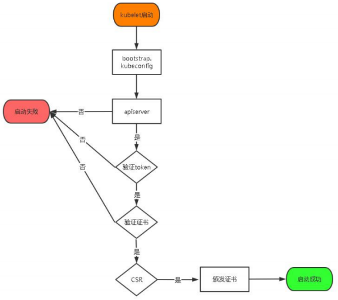

# 二进制部署kubernetes集群

# 一、系统环境

## 1.1 环境准备

| 角色           | IP            | 服务                                       |
| ------------ | ------------- | ---------------------------------------- |
| k8s-master01 | 192.168.66.6  | etcd、containerd、kube-apiserver、kube-scheduler、kube-controller-manager、kubele、kube-proxy |
| k8s-node01   | 192.168.66.41 | etcd、containerd、kubele、kube-proxy        |
| k8s-node02   | 192.168.66.42 | etcd、containerd、kubele、kube-proxy        |

## 1.2 环境初始化

```
#关闭防火墙和selinux
systemctl stop firewalld
systemctl disable firewalld
sed -i 's/enforcing/disabled/' /etc/selinux/config  
setenforce 0 

#关闭swap
swapoff -a  
sed -ri 's/.*swap.*/#&/' /etc/fstab

#将桥接的IPv4流量传递到iptables的链，lsmod | grep br_netfilter可以查看，sudo modprobe显示加载
sudo modprobe br_netfilter
cat <<EOF | sudo tee /etc/modules-load.d/k8s.conf
br_netfilter
EOF

#将桥接的IPv4流量传递到iptables的链
cat > /etc/sysctl.d/k8s.conf << EOF
net.bridge.bridge-nf-call-ip6tables = 1
net.bridge.bridge-nf-call-iptables = 1
EOF
sysctl --system 

#时间同步
yum install ntpdate -y
ntpdate time.windows.com
clock -w

#安装ipvs
yum install ipset ipvsadm -y 
```

## 1.3 文件夹初始化

准备文件夹

```
mkdir -p /usr/local/k8s-install
mkdir -p /usr/local/k8s-install/cert
mkdir -p /usr/local/k8s-install/tools
```

环境文件夹

```
mkdir -p /opt/kubernetes/{bin,ssl,cfg,kubeconfig,logs}
mkdir -p /opt/etcd/{bin,ssl,cfg,data,wal}
```

# 二、证书软件下载

```
curl -L https://github.com/cloudflare/cfssl/releases/download/v1.5.0/cfssl_1.5.0_linux_amd64 -o cfssl
chmod +x cfssl
curl -L https://github.com/cloudflare/cfssl/releases/download/v1.5.0/cfssljson_1.5.0_linux_amd64 -o cfssljson
chmod +x cfssljson
curl -L https://github.com/cloudflare/cfssl/releases/download/v1.5.0/cfssl-certinfo_1.5.0_linux_amd64 -o cfssl-certinfo
chmod +x cfssl-certinfo
mv {cfssl,cfssljson,cfssl-certinfo} /usr/local/bin
```

containerd安装

```
wget -c https://github.com/containerd/containerd/releases/download/v1.6.5/cri-containerd-cni-1.6.5-linux-amd64.tar.gz
```

etcd安装

```
wget -c https://github.com/etcd-io/etcd/releases/download/v3.5.0/etcd-v3.5.0-linux-amd64.tar.gz
```

k8s二进制包下载

```
wget -c https://dl.k8s.io/v1.24.0/kubernetes-server-linux-amd64.tar.gz

tar -zxf kubernetes-server-linux-amd64.tar.gz
cd /kubernetes/server
/opt/kubernetes/bin
cp {kube-apiserver,kube-controller-manager,kube-scheduler,kubelet,kube-proxy,kubectl} /opt/kubernetes/bin
```

# 三、生成证书

## 3.1 证书签发的配置文件

```
cat > /usr/local/k8s-install/cert/ca-config.json <<END
{
  "signing": {
    "default": {
      "expiry": "876000h"
    },
    "profiles": {
      "kubernetes": {
        "usages": [
          "signing",
          "key encipherment",
          "server auth",
          "client auth"
        ],
        "expiry": "876000h"
      },
      "etcd": {
        "usages": [
          "signing",
          "key encipherment",
          "server auth",
          "client auth"
        ],
        "expiry": "876000h"
      }
    }
  }
}
END
```

## 3.2 etcd CA证书

```
rm -rf /usr/local/k8s-install/cert/etcd/
mkdir /usr/local/k8s-install/cert/etcd/
cd /usr/local/k8s-install/cert/etcd/
cat > etcd-ca-csr.json <<END
{
  "CN": "etcd",
  "key": {
    "algo": "rsa",
    "size": 2048
  },
  "names": [
    {
      "C": "CN",
      "ST": "Beijing",
      "L": "Beijing",
      "O": "etcd",
      "OU": "etcd"
    }
  ],
  "ca": {
    "expiry": "87600h"
  }
}
cfssl gencert -initca etcd-ca-csr.json | cfssljson -bare ca -

cp {ca.pem} /opt/etcd/ssl/
```

## 3.3 etcd 证书签发

```
cd /usr/local/k8s-install/cert/etcd
cat > etcd-csr.json<< EOF
{
    "CN":"etcd",
    "hosts":[
    	"127.0.0.1",
        "k8s-master01",
        "192.168.66.6"
    ],
    "key":{
        "algo":"rsa",
        "size":2048
    },
    "names":[
        {
            "C":"CN",
            "L":"BeiJing",
            "ST":"BeiJing",
            "O": "Kubernetes",
            "OU": "etcd"
        }
    ]
}
EOF

cfssl gencert -ca=/usr/local/k8s-install/cert/etcd/ca.pem -ca-key=/usr/local/k8s-install/cert/etcd/ca-key.pem -config=/usr/local/k8s-install/cert/ca-config.json -profile=etcd etcd-csr.json | cfssljson -bare etcd

cp {etcd-key.pem,etcd.pem} /opt/etcd/ssl/
```

## 3.4 k8s CA证书

```
cat > /usr/local/k8s-install/cert/ca-csr.json <<END   
{
  "CN": "kubernetes",
  "key": {      
    "algo": "rsa",     
    "size": 2048
  },             
  "names":[{         
    "C": "CN",     
    "ST": "Beijing",
    "L": "Beijing",          
    "O": "Kubernetes",         
    "OU": "Kubernetes"     
  }]      
}                        
END

cd /usr/local/k8s-install/cert
cfssl gencert -initca ca-csr.json | cfssljson -bare ca
cp {ca.pem,ca-key.pem} /opt/kubernetes/ssl
```

## 3.5 apiserver证书签发

```
rm -rf /usr/local/k8s-install/cert/apiserver
mkdir /usr/local/k8s-install/cert/apiserver
cd /usr/local/k8s-install/cert/apiserver

cat > server-csr.json << END
{
  "CN": "kubernetes",
  "hosts": [
    "127.0.0.1",
    "10.0.0.1",
    "192.168.66.6",
    "k8s-master01",
    "kubernetes",
    "kubernetes.default",
    "kubernetes.default.svc",
    "kubernetes.default.svc.cluster",
    "kubernetes.default.svc.cluster.local"
  ],
  "key": {
    "algo": "rsa",
    "size": 2048
  },
  "names": [{
    "C": "CN",
    "ST": "Beijing",
    "L": "Beijing",
    "O": "Kubernetes",
    "OU": "Kubernetes"
  }]
}
END

cfssl gencert -ca=/usr/local/k8s-install/cert/ca.pem -ca-key=/usr/local/k8s-install/cert/ca-key.pem  --config=/usr/local/k8s-install/cert/ca-config.json -profile=kubernetes  server-csr.json | cfssljson -bare server

cp -r {/usr/local/k8s-install/cert/ca.pem,server.pem,server-key.pem} /opt/kubernetes/ssl
```

## 3.6 front-proxy证书签发

**官方文档：配置聚合层 | Kubernetes**

ca证书生成：

```
rm -rf /usr/local/k8s-install/cert/font-proxy
mkdir /usr/local/k8s-install/cert/font-proxy
cd /usr/local/k8s-install/cert/font-proxy
cat > front-proxy-ca-csr.json  << EOF 
{
  "CN": "kubernetes",
  "key": {
     "algo": "rsa",
     "size": 2048
  }
}
EOF

cfssl gencert   -initca front-proxy-ca-csr.json | cfssljson -bare front-proxy-ca 
```

证书签发

```
cat > front-proxy-client-csr.json  << EOF 
{
  "CN": "front-proxy-client",
  "key": {
     "algo": "rsa",
     "size": 2048
  }
}
EOF

cfssl gencert   -ca=front-proxy-ca.pem   -ca-key=front-proxy-ca-key.pem   -config=/usr/local/k8s-install/cert/ca-config.json   -profile=kubernetes   front-proxy-client-csr.json | cfssljson -bare front-proxy-client

cp {front-proxy-ca.pem,front-proxy-client-key.pem,front-proxy-client.pem} /opt/kubernetes/ssl/
```

## 3.7 kube-controller-manager证书签发

```
rm -rf /usr/local/k8s-install/cert/kube-controller-manager
mkdir /usr/local/k8s-install/cert/kube-controller-manager
cd /usr/local/k8s-install/cert/kube-controller-manager
cat > kube-controller-manager-csr.json << EOF
{
  "CN": "system:kube-controller-manager",
  "key": {
    "algo": "rsa",
    "size": 2048
  },
  "names": [
    {
      "C": "CN",
      "L": "BeiJing", 
      "ST": "BeiJing",
      "O": "system:masters",
      "OU": "Kubernetes"
    }
  ]
}
EOF

cfssl gencert -ca=/usr/local/k8s-install/cert/ca.pem -ca-key=/usr/local/k8s-install/cert/ca-key.pem -config=/usr/local/k8s-install/cert/ca-config.json -profile=kubernetes kube-controller-manager-csr.json | cfssljson -bare kube-controller-manager
cp {kube-controller-manager.pem,kube-controller-manager-key.pem} /opt/kubernetes/ssl
```

## 3.8 scheduler证书签发

```
rm -rf /usr/local/k8s-install/cert/kube-scheduler
mkdir /usr/local/k8s-install/cert/kube-scheduler
cd /usr/local/k8s-install/cert/kube-scheduler
cat > kube-scheduler-csr.json << EOF
{
  "CN": "system:kube-scheduler",
  "key": {
    "algo": "rsa",
    "size": 2048
  },
  "names": [
    {
      "C": "CN",
      "L": "BeiJing",
      "ST": "BeiJing",
      "O": "system:kube-scheduler",
      "OU": "Kubernetes"
    }
  ]
}
EOF

cfssl gencert -ca=/usr/local/k8s-install/cert/ca.pem -ca-key=/usr/local/k8s-install/cert/ca-key.pem -config=/usr/local/k8s-install/cert/ca-config.json -profile=kubernetes kube-scheduler-csr.json | cfssljson -bare kube-scheduler
cp {kube-scheduler.pem,kube-scheduler-key.pem} /opt/kubernetes/ssl
```

## 3.9 admin证书签发

```
rm -rf /usr/local/k8s-install/cert/admin
mkdir /usr/local/k8s-install/cert/admin
cd /usr/local/k8s-install/cert/admin
cat > admin-csr.json <<EOF
{
  "CN": "admin",
  "key": {
    "algo": "rsa",
    "size": 2048
  },
  "names": [
    {
      "C": "CN",
      "L": "BeiJing",
      "ST": "BeiJing",
      "O": "system:masters",
      "OU": "Kubernetes"
    }
  ]
}
EOF

cfssl gencert -ca=/usr/local/k8s-install/cert/ca.pem -ca-key=/usr/local/k8s-install/cert/ca-key.pem -config=/usr/local/k8s-install/cert/ca-config.json -profile=kubernetes admin-csr.json | cfssljson -bare admin
```

## 3.10 ServiceAccount Key生成

k8s每创建一个ServiceAccount，都会分配一个Secret，而Secret里面的秘钥就是sa生成的。

```
mkdir /usr/local/k8s-install/cert/sa
cd /usr/local/k8s-install/cert/sa
openssl genrsa -out sa.key 2048
openssl rsa -in sa.key -pubout -out sa.pub
cp {sa.key,sa.pub} /opt/kubernetes/ssl/
```

# 四、部署containerd

```
#安装containerd
wget -c https://github.com/containerd/containerd/releases/download/v1.6.5/cri-containerd-cni-1.6.5-linux-amd64.tar.gz
tar -zxf cri-containerd-cni-1.6.5-linux-amd64.tar.gz  -C /

#安装libseccomp
wget http://rpmfind.net/linux/centos/8-stream/BaseOS/x86_64/os/Packages/libseccomp-2.5.1-1.el8.x86_64.rpm
rpm -ivh libseccomp-2.5.1-1.el8.x86_64.rpm

#开机启动
systemctl enable containerd --now
```

# 五、部署etcd

## 5.1 安装

```
wget -c https://github.com/etcd-io/etcd/releases/download/v3.5.0/etcd-v3.5.0-linux-amd64.tar.gz
tar -zxf etcd-v3.5.0-linux-amd64.tar.gz
cd etcd-v3.5.0-linux-amd64
mv {etcd,etcdctl,etcdutl} /opt/etcd/bin/

#环境变量
echo "PATH=\$PATH:/opt/etcd/bin" >> /etc/profile
source /etc/profile
```

## 5.2 证书准备

证书文件在3.3已经准备了

## 5.3 配置文件

/opt/etcd/cfg/etcd.yaml 配置文件：[etcd/etcd.conf.yml.sample at main · etcd-io/etcd · GitHub](https://github.com/etcd-io/etcd/blob/main/etcd.conf.yml.sample) 

192.168.66.6

```yaml
name: "etcd-1"
data-dir: "/opt/etcd/data"
wal-dir: "/opt/etcd/wal"
# 用于侦听对等流量的逗号分隔的url列表。
listen-peer-urls: https://192.168.66.6:2380
# 用于侦听客户机通信的逗号分隔的url列表。
listen-client-urls: https://192.168.66.6:2379
# 这个成员的对等url的列表，以通告给集群的其他成员。url需要是逗号分隔的列表。
initial-advertise-peer-urls: https://192.168.66.6:2380
#这个成员的对等url的列表，以通告给集群的其他成员。url需要是逗号分隔的列表。
advertise-client-urls: https://192.168.66.6:2379
# Initial cluster configuration for bootstrapping.
initial-cluster: 'etcd-1=https://192.168.66.6:2380,etcd-2=https://192.168.66.41:2380,etcd-3=https://192.168.66.42:2380'
# Initial cluster token for the etcd cluster during bootstrap.
initial-cluster-token: 'etcd-cluster'
# Initial cluster state ('new' or 'existing').
initial-cluster-state: 'new'
client-transport-security:
  # Path to the client server TLS cert file.
  cert-file: /opt/etcd/ssl/etcd.pem

  # Path to the client server TLS key file.
  key-file: /opt/etcd/ssl/etcd-key.pem
  # Path to the client server TLS trusted CA cert file.
  trusted-ca-file: /opt/etcd/ssl/ca.pem
peer-transport-security:
  # Path to the peer server TLS cert file.
  cert-file: /opt/etcd/ssl/etcd.pem

  # Path to the peer server TLS key file.
  key-file: /opt/etcd/ssl/etcd-key.pem

  # Path to the peer server TLS trusted CA cert file.
  trusted-ca-file: /opt/etcd/ssl/ca.pem
```

192.168.66.41

```yaml
name: "etcd-2"
listen-peer-urls: https://192.168.66.41:2380
# 用于侦听客户机通信的逗号分隔的url列表。
listen-client-urls: https://192.168.66.41:2379
# 这个成员的对等url的列表，以通告给集群的其他成员。url需要是逗号分隔的列表。
initial-advertise-peer-urls: https://192.168.66.41:2380
#这个成员的对等url的列表，以通告给集群的其他成员。url需要是逗号分隔的列表。
advertise-client-urls: https://192.168.66.41:2379
```

192.168.66.42

```yaml
name: "etcd-2"
listen-peer-urls: https://192.168.66.42:2380
# 用于侦听客户机通信的逗号分隔的url列表。
listen-client-urls: https://192.168.66.42:2379
# 这个成员的对等url的列表，以通告给集群的其他成员。url需要是逗号分隔的列表。
initial-advertise-peer-urls: https://192.168.66.42:2380
#这个成员的对等url的列表，以通告给集群的其他成员。url需要是逗号分隔的列表。
advertise-client-urls: https://192.168.66.42:2379
```

## 5.4 服务配置

```
cat > /usr/lib/systemd/system/etcd.service << EOF 
[Unit] 
Description=Etcd Server 
After=network.target 
After=network-online.target 
Wants=network-online.target 
[Service] 
Type=notify 
ExecStart=/opt/etcd/bin/etcd  --config-file /opt/etcd/cfg/etcd.yml 
Restart=on-failure 
LimitNOFILE=65536 
[Install] 
WantedBy=multi-user.target 
EOF

```

## 5.5 启动服务

```
systemctl enable etcd --now
```

## 5.6 集群状态查看

```
[root@k8s-master01 k8s]# etcdctl --cacert=/opt/etcd/ssl/ca.pem --cert=/opt/etcd/ssl/etcd.pem --key=/opt/etcd/ssl/etcd-key.pem --endpoints="https://192.168.66.6:2379,https://192.168.66.41:2379,https://192.168.66.42:2379" endpoint status --write-out=table
+------------------------+------------------+---------+---------+-----------+------------+-----------+------------+--------------------+--------+
|        ENDPOINT        |        ID        | VERSION | DB SIZE | IS LEADER | IS LEARNER | RAFT TERM | RAFT INDEX | RAFT APPLIED INDEX | ERRORS |
+------------------------+------------------+---------+---------+-----------+------------+-----------+------------+--------------------+--------+
| https://192.168.66.6:2379 | 1f46bee47a4f04aa |   3.5.0 |   20 kB |     false |      false |        15 |         68 |                 68 |        |
| https://192.168.66.41:2379 |   b3e5838df5f510 |   3.5.0 |   20 kB |     false |      false |        15 |         68 |                 68 |        |
| https://192.168.66.42:2379 | a437554da4f2a14c |   3.5.0 |   25 kB |      true |      false |        15 |         68 |                 68 |        |
+------------------------+------------------+---------+---------+-----------+------------+-----------+------------+--------------------+--------+

```

# 六、用户环境配置

```
rm -rf /root/.kube
mkdir /root/.kube
KUBE_CONFIG="/root/.kube/config"
KUBE_APISERVER="https://192.168.66.6:6443"

#设置集群参数
kubectl config set-cluster kubernetes \
  --certificate-authority=/opt/kubernetes/ssl/ca.pem \
  --embed-certs=true \
  --server=${KUBE_APISERVER} \
  --kubeconfig=${KUBE_CONFIG}
#设置客户端认证参数
kubectl config set-credentials kubernetes-admin \
  --client-certificate=/usr/local/k8s-install/cert/admin/admin.pem \
  --client-key=/usr/local/k8s-install/cert/admin/admin-key.pem \
  --embed-certs=true \
  --kubeconfig=${KUBE_CONFIG}
#设置上下文参数
kubectl config set-context kubernetes-admin@kubernetes \
  --cluster=kubernetes \
  --user=kubernetes-admin \
  --kubeconfig=${KUBE_CONFIG}
#设置默认上下文
kubectl config use-context kubernetes-admin@kubernetes --kubeconfig=${KUBE_CONFIG}
```

# 七、部署kube-apiserver

## 7.1 TLS Bootstrapping配置

```
cat > /opt/kubernetes/kubeconfig/token.csv << EOF 
2883dba522d43d742dd88f3ce07cf52e,kubelet-bootstrap,10001,system:node-bootstrapper
EOF
```

**TLS Bootstrapping**

启用 TLS Bootstrapping 机制 TLS Bootstraping：Master apiserver 启用 TLS 认证后，Node 节点 kubelet 和 kube- proxy 要与 kube-apiserver 进行通信，必须使用 CA 签发的有效证书才可以，当 Node 节点很多时，这种客户端证书颁发需要大量工作，同样也会增加集群扩展复杂度。为了简化流程，Kubernetes 引入了 TLS bootstraping 机制来自动颁发客户端证书，kubelet 会以一个低权限用户自动向 apiserver 申请证书，kubelet 的证书由 apiserver 动态签署。
所以强烈建议在 Node 上使用这种方式，目前主要用于 kubelet，kube-proxy 还是由我们统一颁发一个证书。

TLS bootstraping 工作流程： 



授权kubelet-bootstrap用户允许请求证书

```
kubectl create clusterrolebinding kubelet-bootstrap \
--clusterrole=system:node-bootstrapper \
--user=kubelet-bootstrap
```

创建上述配置文件中 token 文件： 

```
cat > /opt/kubernetes/kubeconfig/token.csv << EOF 
2883dba522d43d742dd88f3ce07cf52e,kubelet-bootstrap,10001,system:node-bootstrapper
EOF
```

格式：token，用户名，UID，用户组 

token 也可自行生成替换：

```
head -c 16 /dev/urandom | od -An -t x | tr -d ' '
```

## 7.2 配置文件

```
cat > /opt/kubernetes/cfg/kube-apiserver.conf <<END
KUBE_APISERVER_OPTS="--advertise-address=192.168.66.6 \
--bind-address=192.168.66.6 \
--token-auth-file=/opt/kubernetes/kubeconfig/token.csv  \
--service-node-port-range=30000-32767  \
--allow-privileged=true  \
--authorization-mode=RBAC,Node  \
--client-ca-file=/opt/kubernetes/ssl/ca.pem  \
--enable-admission-plugins=NamespaceLifecycle,LimitRanger,ServiceAccount,ResourceQuota,NodeRestriction  \
--enable-bootstrap-token-auth=true  \
--etcd-cafile=/opt/etcd/ssl/ca.pem  \
--etcd-certfile=/opt/etcd/ssl/etcd.pem  \
--etcd-keyfile=/opt/etcd/ssl/etcd-key.pem  \
--etcd-servers=https://192.168.66.6:12379,https://192.168.66.6:22379,https://192.168.66.6:32379 \
--kubelet-client-certificate=/opt/kubernetes/ssl/server.pem  \
--kubelet-client-key=/opt/kubernetes/ssl/server-key.pem  \
--kubelet-preferred-address-types=InternalIP,ExternalIP,Hostname \
--proxy-client-cert-file=/opt/kubernetes/ssl/front-proxy-client.pem \
--proxy-client-key-file=/opt/kubernetes/ssl/front-proxy-client-key.pem \
--requestheader-allowed-names=kube-proxy \
--requestheader-client-ca-file=/opt/kubernetes/ssl/front-proxy-ca.pem \
--requestheader-extra-headers-prefix=X-Remote-Extra- \
--requestheader-group-headers=X-Remote-Group \
--requestheader-username-headers=X-Remote-User \
--secure-port=6443  \
--service-account-issuer=https://kubernetes.default.svc.cluster.local \
--service-account-signing-key-file=/opt/kubernetes/ssl/sa.key \
--service-account-key-file=/opt/kubernetes/ssl/sa.pub  \
--service-cluster-ip-range=10.0.0.0/24  \
--tls-cert-file=/opt/kubernetes/ssl/server.pem  \
--tls-private-key-file=/opt/kubernetes/ssl/server-key.pem"
END

```

说明：

```
-logtostderr：启用日志 
-v：日志等级 
–log-dir：日志目录 
–etcd-servers：etcd 集群地址 
–bind-address：监听地址 
–secure-port：https 安全端口 
–advertise-address：集群通告地址 
–allow-privileged：启用授权 
–service-cluster-ip-range：Service 虚拟 IP 地址段 
–enable-admission-plugins：准入控制模块 
–authorization-mode：认证授权，启用 RBAC 授权和节点自管理 
–enable-bootstrap-token-auth：启用 TLS bootstrap 机制 
–token-auth-file：bootstrap token 文件 
--service-account-issuer 此参数可作为服务账户令牌发放者的身份标识
–service-node-port-range：Service nodeport 类型默认分配端口范围 
–kubelet-client-xxx：apiserver 访问 kubelet 客户端证书 
–tls-xxx-file：apiserver https 证书 
--enable-aggregator-routing=true如果你未在运行 API 服务器的主机上运行 kube-proxy，则必须确保使用以下 kube-apiserver 标志启用系统
–etcd-xxxfile：连接 Etcd 集群证书 
–audit-log-xxx：审计日志 
```

如果你未在运行 API 服务器的主机上运行 kube-proxy，则必须确保使用以下 `kube-apiserver` 标志启用系统：

```
--enable-aggregator-routing=true
```

## 7.3 kube-apiserver 服务配置

```
cat > /usr/lib/systemd/system/kube-apiserver.service << EOF 
[Unit] 
Description=Kubernetes API Server 
Documentation=https://github.com/kubernetes/kubernetes 
[Service] 
EnvironmentFile=/opt/kubernetes/cfg/kube-apiserver.conf 
ExecStart=/opt/kubernetes/bin/kube-apiserver \$KUBE_APISERVER_OPTS 
Restart=on-failure 
[Install] 
WantedBy=multi-user.target 
EOF
```

## 7.4 设置开机启动

```
systemctl daemon-reload 
systemctl enable kube-apiserver --now
```

## 7.5 授权 kubelet-bootstrap 用户允许请求证书

```
kubectl create clusterrolebinding kubelet-bootstrap \
--clusterrole=system:node-bootstrapper \
--user=kubelet-bootstrap
```

# 八、部署kube-scheduler

## 8.1 kubeconfig配置

```
rm -rf /opt/kubernetes/kubeconfig/kube-scheduler.kubeconfig
KUBE_CONFIG="/opt/kubernetes/kubeconfig/kube-scheduler.kubeconfig"
KUBE_APISERVER="https://192.168.66.6:6443"

kubectl config set-cluster kubernetes \
  --certificate-authority=/opt/kubernetes/ssl/ca.pem \
  --embed-certs=true \
  --server=${KUBE_APISERVER} \
  --kubeconfig=${KUBE_CONFIG}
kubectl config set-credentials system:kube-scheduler \
  --client-certificate=/opt/kubernetes/ssl/kube-scheduler.pem \
  --client-key=/opt/kubernetes/ssl/kube-scheduler-key.pem \
  --embed-certs=true \
  --kubeconfig=${KUBE_CONFIG}
kubectl config set-context system:kube-scheduler@kubernetes \
  --cluster=kubernetes \
  --user=system:kube-scheduler \
  --kubeconfig=${KUBE_CONFIG}
kubectl config use-context system:kube-scheduler@kubernetes --kubeconfig=${KUBE_CONFIG}
```

## 8.2 启动配置文件

```
cat > /opt/kubernetes/cfg/kube-scheduler.conf << END
KUBE_SCHEDULER_OPTS="--authentication-kubeconfig=/opt/kubernetes/kubeconfig/kube-scheduler.kubeconfig \
--authorization-kubeconfig=/opt/kubernetes/kubeconfig/kube-scheduler.kubeconfig \
--kubeconfig=/opt/kubernetes/kubeconfig/kube-scheduler.kubeconfig \
--log-dir=/opt/kubernetes/logs \
--leader-elect=true \
--bind-address=127.0.0.1"
END
```

–master：通过本地非安全本地端口 8080 连接 apiserver。 

–leader-elect：当该组件启动多个时，自动选举（HA） 

## 8.3 服务配置

```
cat > /usr/lib/systemd/system/kube-scheduler.service  << END
[Unit] 
Description=Kubernetes Scheduler 
Documentation=https://github.com/kubernetes/kubernetes
[Service] 
EnvironmentFile=/opt/kubernetes/cfg/kube-scheduler.conf 
ExecStart=/opt/kubernetes/bin/kube-scheduler \$KUBE_SCHEDULER_OPTS 
Restart=on-failure 
[Install] 
WantedBy=multi-user.target 
END
```

## 8.4 启动并设置开机启动

```
systemctl daemon-reload 
systemctl enable kube-scheduler --now
```

# 九 kube-controller-manager

## 9.1 kubeconfig配置

```
rm -rf /opt/kubernetes/kubeconfig/kube-controller-manager.kubeconfig
KUBE_CONFIG="/opt/kubernetes/kubeconfig/kube-controller-manager.kubeconfig"
KUBE_APISERVER="https://192.168.66.6:6443"

# 设置一个集群项
kubectl config set-cluster kubernetes \
  --certificate-authority=/opt/kubernetes/ssl/ca.pem \
  --embed-certs=true \
  --server=${KUBE_APISERVER} \
  --kubeconfig=${KUBE_CONFIG}
# 设置一个环境项，一个上下文
kubectl config set-context system:kube-controller-manager@kubernetes \
    --cluster=kubernetes \
    --user=system:kube-controller-manager \
    --kubeconfig=${KUBE_CONFIG}
# 设置一个证书
kubectl config set-credentials system:kube-controller-manager \
  --client-certificate=/usr/local/k8s-install/cert/kube-controller-manager/kube-controller-manager.pem \
  --client-key=/usr/local/k8s-install/cert/kube-controller-manager/kube-controller-manager-key.pem \
  --embed-certs=true \
  --kubeconfig=${KUBE_CONFIG}

kubectl config use-context system:kube-controller-manager@kubernetes --kubeconfig=${KUBE_CONFIG}
```

## 9.2 启动配置文件

```
cat > /opt/kubernetes/cfg/kube-controller-manager.conf <<END
KUBE_CONTROLLER_MANAGER_OPTS="--allocate-node-cidrs=true \
--authentication-kubeconfig=/opt/kubernetes/kubeconfig/kube-controller-manager.kubeconfig \
--authorization-kubeconfig=/opt/kubernetes/kubeconfig/kube-controller-manager.kubeconfig \
--kubeconfig=/opt/kubernetes/kubeconfig/kube-controller-manager.kubeconfig \
--bind-address=127.0.0.1   \
--client-ca-file=/opt/kubernetes/ssl/ca.pem \
--cluster-cidr=10.244.0.0/16   \
--cluster-name=kubernetes  \
--cluster-signing-cert-file=/opt/kubernetes/ssl/ca.pem   \
--cluster-signing-key-file=/opt/kubernetes/ssl/ca-key.pem  \
--controllers=*,bootstrapsigner,tokencleaner  \
--leader-elect=true  \
--log-dir=/opt/kubernetes/logs  \
--requestheader-client-ca-file=/opt/kubernetes/ssl/front-proxy-ca.pem \
--root-ca-file=/opt/kubernetes/ssl/ca.pem \
--service-cluster-ip-range=10.0.0.0/24   \
--allocate-node-cidrs=true   \
--service-account-private-key-file=/opt/kubernetes/ssl/sa.key  \
--root-ca-file=/opt/kubernetes/ssl/ca.pem  \
--cluster-signing-duration=87600h0m0s"
END
```

| 参数                                       | 说明                                       |
| ---------------------------------------- | ---------------------------------------- |
| --cluster-cidr string                    | 集群中 Pod 的 CIDR 范围。要求 `--allocate-node-cidrs` 标志为 true。 |
| --service-cluster-ip-range               | 集群中 Service 对象的 CIDR 范围。要求 `--allocate-node-cidrs` 标志为 true。 |
| -v, --v int                              | 日志级别详细程度取值。                              |
| --kubeconfig                             | Kubernetes 认证文件                          |
| --leader-elect                           | 当该组件启动多个时，自动选举（HA）                       |
| --cluster-signing-cert-file --cluster-signing-key-file | 自动为 kubelet 颁发证书的 CA，与 apiserver 保持一致    |

## 9.3 启动服务配置

```
cat > /usr/lib/systemd/system/kube-controller-manager.service << END
[Unit] 
Description=Kubernetes Controller Manager 
Documentation=https://github.com/kubernetes/kubernetes 
[Service] 
EnvironmentFile=/opt/kubernetes/cfg/kube-controller-manager.conf 
ExecStart=/opt/kubernetes/bin/kube-controller-manager  \$KUBE_CONTROLLER_MANAGER_OPTS 
Restart=on-failure 
[Install] 
WantedBy=multi-user.target
END
```

## 9.4 启动并设置开机启动

```
systemctl daemon-reload 
systemctl enable kube-controller-manager --now
```

# 十、部署kubelet

## 10.1 bootstrap.kubeconfig配置

```
rm -rf /opt/kubernetes/kubeconfig/bootstrap.kubeconfig
KUBE_CONFIG="/opt/kubernetes/kubeconfig/bootstrap.kubeconfig"
KUBE_APISERVER="https://192.168.66.6:6443"
TOKEN="2883dba522d43d742dd88f3ce07cf52e"

kubectl config set-cluster kubernetes \
  --certificate-authority=/opt/kubernetes/ssl/ca.pem \
  --embed-certs=true \
  --server=${KUBE_APISERVER} \
  --kubeconfig=${KUBE_CONFIG}
kubectl config set-credentials kubelet-bootstrap \
  --token=${TOKEN} \
  --kubeconfig=${KUBE_CONFIG}
kubectl config set-context kubelet-bootstrap@kubernetes \
  --cluster=kubernetes \
  --user=kubelet-bootstrap \
  --kubeconfig=${KUBE_CONFIG}
kubectl config use-context kubelet-bootstrap@kubernetes --kubeconfig=${KUBE_CONFIG}
```

## 10.2 配置yml文件

```yaml
cat > /opt/kubernetes/cfg/kubelet-config.yml <<END
kind: KubeletConfiguration
apiVersion: kubelet.config.k8s.io/v1beta1
address: 0.0.0.0
port: 10250
serializeImagePulls: false
readOnlyPort: 10255
cgroupDriver: systemd
clusterDNS:
- 10.0.0.2
clusterDomain: cluster.local 
failSwapOn: false
authentication:
  anonymous:
    enabled: false
  webhook:
    cacheTTL: 2m0s
    enabled: true
  x509:
    clientCAFile: /opt/kubernetes/ssl/ca.pem 
authorization:
  mode: Webhook
  webhook:
    cacheAuthorizedTTL: 5m0s
    cacheUnauthorizedTTL: 30s
evictionHard:
  imagefs.available: 15%
  memory.available: 100Mi
  nodefs.available: 10%
  nodefs.inodesFree: 5%
maxOpenFiles: 1000000
maxPods: 110
runtimeRequestTimeout: 15m0s
END
```

## 10.3 启动配置文件

```
cat > /opt/kubernetes/cfg/kubelet.conf  << END
KUBELET_OPTS="--v=2 \
--hostname-override=k8s-master01 \
--kubeconfig=/opt/kubernetes/kubeconfig/kubelet.kubeconfig \
--bootstrap-kubeconfig=/opt/kubernetes/kubeconfig/bootstrap.kubeconfig \
--config=/opt/kubernetes/cfg/kubelet-config.yml \
--cert-dir=/opt/kubernetes/ssl \
--container-runtime-endpoint=unix:///run/containerd/containerd.sock  \
--node-labels=node.kubernetes.io/node='master'"
END
```

–hostname-override：显示名称，集群中唯一 

–network-plugin：启用 CNI 

–kubeconfig：空路径，会自动生成，后面用于连接 apiserver 

–bootstrap-kubeconfig：首次启动向 apiserver 申请证书 

–config：配置参数文件 

–cert-dir：kubelet 证书生成目录

## 10.4 服务配置

```
cat > /usr/lib/systemd/system/kubelet.service <<END
[Unit] 
Description=Kubernetes Kubelet 
After=docker.service 
[Service] 
EnvironmentFile=/opt/kubernetes/cfg/kubelet.conf
ExecStart=/opt/kubernetes/bin/kubelet \$KUBELET_OPTS 
Restart=on-failure 
LimitNOFILE=65536 
[Install] 
WantedBy=multi-user.target
END
```

## 10.5 启动服务及开机设置

```
systemctl daemon-reload 
systemctl enable kubelet --now
```

## 10.6 批准 kubelet 证书申请并加入集群

```
# 查看 kubelet 证书请求 
[root@k8s-master01 k8s-install]# kubectl get csr
NAME                                                   AGE     SIGNERNAME                                    REQUESTOR           REQUESTEDDURATION   CONDITION
node-csr-NrSNw-Gx8kR7VerABxUgHoM1mu71VbB8x598UXWOwM0   4m12s   kubernetes.io/kube-apiserver-client-kubelet   kubelet-bootstrap   <none>              Pending
# 批准申请 
[root@k8s-master01 k8s-install]# kubectl certificate approve node-csr-NrSNw-Gx8kR7VerABxUgHoM1mu71VbB8x598UXWOwM0
certificatesigningrequest.certificates.k8s.io/node-csr-NrSNw-Gx8kR7VerABxUgHoM1mu71VbB8x598UXWOwM0 approved
# 查看节点 
[root@k8s-master01 k8s-install]# kubectl get node
NAME     STATUS   ROLES    AGE   VERSION
node01   Ready    <none>   19s   v1.24.0
```

# 十一、部署kube-proxy

## 11.1 kubeconfig配置

```
rm -rf /opt/kubernetes/kubeconfig/kube-proxy.kubeconfig
KUBE_CONFIG="/opt/kubernetes/kubeconfig/kube-proxy.kubeconfig"
KUBE_APISERVER="https://192.168.66.6:6443"

kubectl config set-cluster kubernetes \
  --certificate-authority=/opt/kubernetes/ssl/ca.pem \
  --embed-certs=true \
  --server=${KUBE_APISERVER} \
  --kubeconfig=${KUBE_CONFIG}
kubectl config set-credentials kube-proxy \
  --client-certificate=/usr/local/k8s-install/cert/kube-proxy/kube-proxy.pem \
  --client-key=/usr/local/k8s-install/cert/kube-proxy/kube-proxy-key.pem \
  --embed-certs=true \
  --kubeconfig=${KUBE_CONFIG}
kubectl config set-context kube-proxy@kubernetes \
  --cluster=kubernetes \
  --user=kube-proxy \
  --kubeconfig=${KUBE_CONFIG}
kubectl config use-context kube-proxy@kubernetes --kubeconfig=${KUBE_CONFIG}
```

## 11.2 配置参数文件

```yaml
cat > /opt/kubernetes/cfg/kube-proxy-config.yml <<END
kind: KubeProxyConfiguration
apiVersion: kubeproxy.config.k8s.io/v1alpha1
bindAddress: 0.0.0.0
metricsBindAddress: 0.0.0.0:10249
clientConnection:
  kubeconfig: /opt/kubernetes/kubeconfig/kube-proxy.kubeconfig
hostnameOverride: k8s-master01
clusterCIDR: 10.244.0.0/16
mode: ipvs
ipvs:
  scheduler: "rr"
iptables:
  masqueradeAll: true
END
```

## 11.3 服务配置

```
cat > /usr/lib/systemd/system/kube-proxy.service <<END
[Unit] 
Description=Kubernetes Proxy 
After=network.target 
[Service] 
ExecStart=/opt/kubernetes/bin/kube-proxy --v=2  --config=/opt/kubernetes/cfg/kube-proxy-config.yml 
Restart=on-failure 
LimitNOFILE=65536 
[Install] 
WantedBy=multi-user.target
END


```

## 11.4 启动并设置开机启动

```
systemctl daemon-reload 
systemctl enable kube-proxy --now
```

# 十二、部署 CNI 网络

## 12.1 安装ipvs

```
yum install ipset ipvsadm -y 

cat >> /etc/sysconfig/modules/ipvs.modules << EOF
#!/bin/bash
modprobe -- ip_vs
modprobe -- ip_vs_sh
modprobe -- ip_vs_rr
modprobe -- ip_vs_wrr
modprobe -- nf_conntrack_ipv4
EOF

chmod +x /etc/sysconfig/modules/ipvs.modules
```

## 12.2 部署calico

```
cd /usr/local/k8s-install/yaml
wget https://docs.projectcalico.org/manifests/calico.yaml --no-check-certificate
# 修改CALICO_IPV4POOL_CIDR  10.244.0.0/16
kubectl apply -f calico.yaml 
kubectl get pods -n kube-system 
kubectl get node 
```

## 12.3 授权apiserver访问kubelet

```
cat > apiserver-to-kubelet-rbac.yaml << EOF
apiVersion: rbac.authorization.k8s.io/v1
kind: ClusterRole
metadata:
  annotations:
    rbac.authorization.kubernetes.io/autoupdate: "true"
  labels:
    kubernetes.io/bootstrapping: rbac-defaults
  name: system:kube-apiserver-to-kubelet
rules:
  - apiGroups:
      - ""
    resources:
      - nodes/proxy
      - nodes/stats
      - nodes/log
      - nodes/spec
      - nodes/metrics
      - pods/log
    verbs:
      - "*"
---
apiVersion: rbac.authorization.k8s.io/v1
kind: ClusterRoleBinding
metadata:
  name: system:kube-apiserver
  namespace: ""
roleRef:
  apiGroup: rbac.authorization.k8s.io
  kind: ClusterRole
  name: system:kube-apiserver-to-kubelet
subjects:
  - apiGroup: rbac.authorization.k8s.io
    kind: User
    name: kubernetes
EOF

kubectl apply -f apiserver-to-kubelet-rbac.yaml
```

## 12.4 部署nginx查看状态

```
kubectl create deploy nginx --image=harborcloud.com/library/nginx:1.7.9
cat >nginx-svc.yaml<<END
apiVersion: v1
kind: Service
metadata:
  name: web
  labels:
    name: nginx
spec:
  type: NodePort
  ports:
  - port: 8088
    targetPort: 80
    nodePort: 30500
  selector:
    app: nginx
END

kubectl create -f nginx-svc.yaml
```

网络转发规则查看：

```
[root@k8s-master01 k8s-install]# kubectl get pod,svc
NAME                         READY   STATUS    RESTARTS   AGE
pod/nginx-7d45769d94-x4hsz   1/1     Running   0          10m

NAME                 TYPE        CLUSTER-IP   EXTERNAL-IP   PORT(S)          AGE
service/kubernetes   ClusterIP   10.0.0.1     <none>        443/TCP          16m
service/web          NodePort    10.0.0.38    <none>        8088:30500/TCP   3m13s
[root@k8s-master01 k8s-install]# ipvsadm -Ln
IP Virtual Server version 1.2.1 (size=4096)
Prot LocalAddress:Port Scheduler Flags
  -> RemoteAddress:Port           Forward Weight ActiveConn InActConn
TCP  192.168.66.6:30500 rr
  -> 10.244.196.130:80            Masq    1      0          0         
TCP  10.0.0.1:443 rr
  -> 192.168.66.6:6443           Masq    1      5          0         
TCP  10.0.0.38:8088 rr
  -> 10.244.196.130:80            Masq    1      0          0         
TCP  10.88.0.1:30500 rr
  -> 10.244.196.130:80            Masq    1      0          0         
TCP  10.244.196.128:30500 rr
  -> 10.244.196.130:80            Masq    1      0          0  
```

# 十三、部署CoreDNS

/opt/kubernetes/cfg/kube-apiserver.conf:

```
--service-cluster-ip-range=10.0.0.0/24
```

因为在kubelet-config.yml中指定

```
clusterDNS:
- 10.0.0.2
clusterDomain: cluster.local
```

安装

```
#jq支持
yum install -y epel-release
yum install -y jq

git clone https://github.com/coredns/deployment.git
cd deployment/kubernetes
./deploy.sh -r 10.0.0.0/24 -i 10.0.0.2 -d cluster.local  >  coredns.yaml
kubectl create -f coredns.yaml
```

测试

```
kubectl create deployment nginx --image=nginx
kubectl expose deployment nginx --port=80 --type=NodePort
```

# 十四、新增加 Worker Node

## 1 拷贝已部署好的 Node 相关文件到新节点

```
# 二进制文件
scp {kube-proxy,kubelet} root@192.168.66.41:/opt/kubernetes/bin/
scp {kube-proxy,kubelet} root@192.168.66.42:/opt/kubernetes/bin/

# CA证书
scp ca.pem root@192.168.66.41:/opt/kubernetes/ssl/
scp ca.pem root@192.168.66.42:/opt/kubernetes/ssl/

# 配置文件
scp {kube-proxy.conf,kube-proxy.kubeconfig,kube-proxy-config.yml,kubelet.conf,kubelet-config.yml,bootstrap.kubeconfig} root@192.168.66.41:/opt/kubernetes/cfg/
scp {kube-proxy.conf,kube-proxy.kubeconfig,kube-proxy-config.yml,kubelet.conf,kubelet-config.yml,bootstrap.kubeconfig} root@192.168.66.42:/opt/kubernetes/cfg/

#服务文件
scp {kube-proxy.service,kubelet.service} root@192.168.66.41:/usr/lib/systemd/system/
scp {kube-proxy.service,kubelet.service} root@192.168.66.42:/usr/lib/systemd/system/
```

## 2 修改主机名

k8s-node01:

```
# 修改 --hostname-override=k8s-node01
vi /opt/kubernetes/cfg/kubelet.conf 
# 修改 hostnameOverride: k8s-node01
vi /opt/kubernetes/cfg/kube-proxy-config.yml 
```

k8s-node02:

```
# 修改 --hostname-override=k8s-node02
vi /opt/kubernetes/cfg/kubelet.conf 
# 修改 hostnameOverride: k8s-node02
vi /opt/kubernetes/cfg/kube-proxy-config.yml 
```

## 3 ipvs开启

```
yum install ipset ipvsadm -y 

cat >> /etc/sysconfig/modules/ipvs.modules << EOF
#!/bin/bash
modprobe -- ip_vs
modprobe -- ip_vs_sh
modprobe -- ip_vs_rr
modprobe -- ip_vs_wrr
modprobe -- nf_conntrack_ipv4
EOF

chmod +x /etc/sysconfig/modules/ipvs.modules
```

## 4 开启服务

```
systemctl daemon-reload
systemctl enable kubelet --now
systemctl enable kube-proxy --now
```

## 5 在 Master 上批准新 Node kubelet 证书申请

```
kubectl get csr
kubectl certificate approve node-csr-4zTjsaVSrhuyhIGqsefxzVoZDCNKei-aE2jyTP81Uro
```

推荐文章：

https://cby-chen.github.io/2022/06/15/2022-06-15-%E4%BA%8C%E8%BF%9B%E5%88%B6%E5%AE%89%E8%A3%85Kubernetes%EF%BC%88k8s%EF%BC%89_v1.23.7_IPv4_IPv6%E5%8F%8C%E6%A0%88/

https://zhuanlan.zhihu.com/p/547498632

[PKI 证书和要求 | Kubernetes](https://kubernetes.io/zh-cn/docs/setup/best-practices/certificates/)