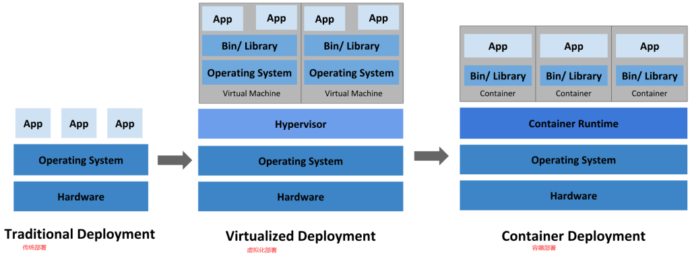

## **kubernetes发展史**

CNCF(云计算基金会) Borg google内部使用borg，后来发现dockerswarm使用广泛，所以让go开发工程师重写brog，成了k8s，1.0版本的时候捐给了CNCF。

> 一开始docker和另外一家coreos公司，技术基本是共享的，docker火起来后，coreos也研发了一个类似docker的技术，最后coreos加入k8s生态构建，etcd就是coreos提供的捐赠给CNCF的

## 其它容器管理引擎：

- podman 红帽RedHat开发的容器管理引擎
- docker docker公司研发的docker，另外他还研发了container捐给CNCF
- CNCF container，docker公司研发捐给CNCF的

## **docker和contaniner的关系：**

- docker用到的运行接口是CRI，CRI是一种容器运行时的标准，可以把CRI想象成一个数据线接口，Python等调用docker是需要调用这个接口，遵循这个规范，这个规范就是CRI
- container用到的接口是O-CRI，他是CRI做了些改动，O即OPEN

> k8s加入CNCF后，kubectl用的是O-CRI接口，无法直接调用docker的CRI接口，CNCF是国际公司，不可能直接去迁就docker，所以在中间加了个垫片，类似于螺丝与螺母之间的垫片，后来k8s壮大超过docker后，不再迁就docker，在1.19版本中，移除了垫片。k8s调用docker的O-CRI接口，如果没有就不调了，docker忍气吞声发了声明，说支持O_CRI，反过来支持k8s。

## **k8s基本介绍**

kubernetes，简称K8s。k8s 这个缩写是因为 k 和 s 之间有八个字符的关系。 Google 在 2014 年开源了 Kubernetes 项目。

Kubernetes 建立在Google 大规模运行生产工作负载十几年经验的基础上， 结合了社区中最优秀的想法和实践。

是一个可移植的，可扩展的开源平台，用于管理云平台中多个主机上的容器化的应用，Kubernetes 的目标是让部署容器化的应用简单并且高效（powerful）,Kubernetes 提供了应用部署，规划，更新，维护的一种机制。

Kubernetes 是Google 开源的一个**容器编排引擎**，它支持**自动化部署、大规模可伸缩、应用容器化管理**。

在Kubernetes 中，可以创建多个容器，每个容器里面运行一个应用实例，然后通过内置的负载均衡策略，实现对这一组应用实例的管理、发现、访问，而这些细节都不需要人为的手工配置和处理。

## **应用部署发展**

**传统部署**

各个组织机构在物理服务器上运行应用程序。无法为物理服务器中的应用程序定义资源边界，这会导致资源分配问题。

**虚拟化部署时代**

允许在单个物理服务器的 CPU 上运行多个虚拟机（VM）。 虚拟化允许应用程序在 VM 之间隔离，并提供一定程度的安全，因为一个应用程序的信息 不能被另一应用程序随意访问。

**容器部署时代**

轻量级，容器类似于 VM，但是它们具有被放宽的隔离属性，可以在应用程序之间共享操作系统（OS）。 与 VM 类似，具有自己的文件系统、CPU、内存、进程空间等。 由于与基础架构分离，因此可以跨云和 OS 发行版本进行移植。

*好处：*

- 敏捷应用程序的创建和部署
- 持续开发、集成和部署
- 关注开发与运维的分离
- 可观察性
- 跨开发、测试和生产的环境一致性
- 跨云和操作系统发行版本的可移植性
- 以应用程序为中心的管理
- 松散耦合、分布式、弹性、解放的微服务
- 资源隔离
- 资源利用

## **k8s的优势**

- 开源
- 轻量级
- 弹性伸缩
- 负载均衡

## **K8s 功能**

**自动装箱**

基于容器对应用运行环境的资源配置要求自动部署应用容器

**自我修复(自愈能力)**

当容器失败时，会对容器进行重启当所部署的Node 节点有问题时，会对容器进行重新部署和重新调度当容器未通过监控检查时，会关闭此容器直到容器正常运行时，才会对外提供服务

**水平扩展**

通过简单的命令、用户UI 界面或基于CPU 等资源使用情况，对应用容器进行规模扩大或规模剪裁

**服务发现和负载均衡**

Kubernetes 可以使用 DNS 名称或自己的 IP 地址公开容器，如果进入容器的流量很大， Kubernetes 可以负载均衡并分配网络流量，从而使部署稳定。

**滚动更新**

可以根据应用的变化，对应用容器运行的应用，进行一次性或批量式更新

**版本回退**

可以根据应用部署情况，对应用容器运行的应用，进行历史版本即时回退

**密钥和配置管理**

在不需要重新构建镜像的情况下，可以部署和更新密钥和应用配置，类似热部署。

**存储编排**

自动实现存储系统挂载及应用，特别对有状态应用实现数据持久化非常重要存储系统可以来自于本地目录、网络存储(NFS、Gluster、Ceph 等)、公共云存储服务

**批处理**

提供一次性任务，定时任务；满足批量数据处理和分析的场景