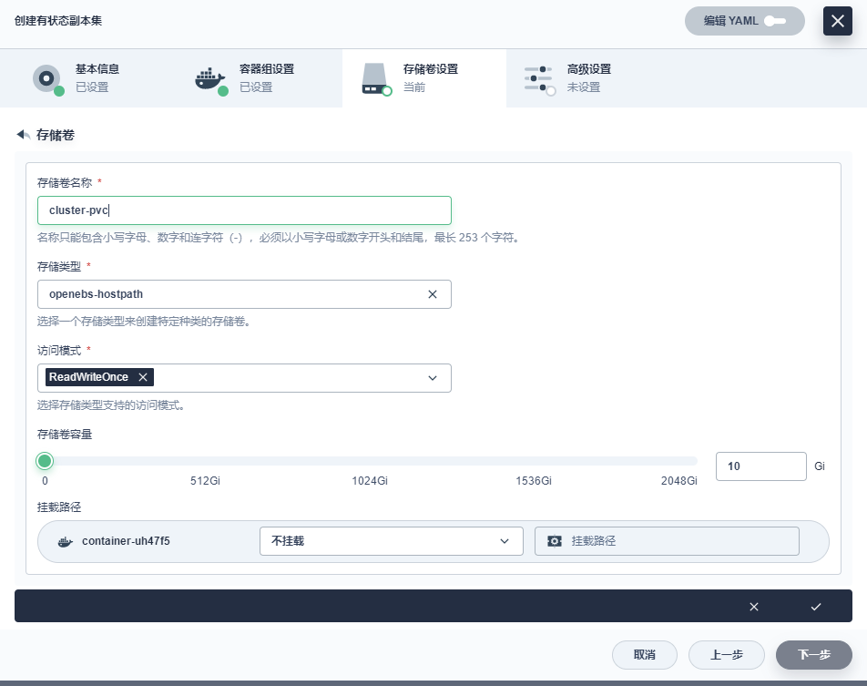
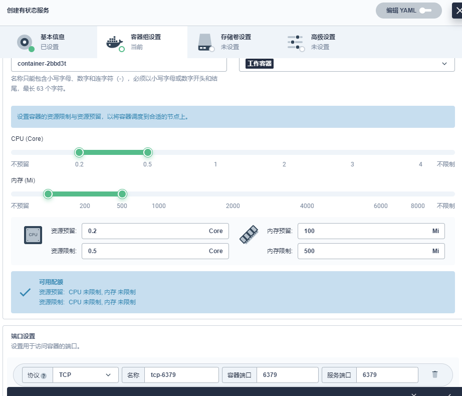

# 一、配置文件创建

redis-conf：redis.conf

```
cluster-enabled yes #开启集群
cluster-config-file nodes.conf #集群node
cluster-node-timeout 5000 # 集群延迟
appendonly yes # aof文件开启
masterauth 123456 # 密码
requirepass 123456 # 认证密码
```

# 二、redis有状态服务副本集创建

存储卷模板：



redis 容器设置即启动命令配置

```
redis-server /etc/redis/redis.conf
```



```
[root@k8s-master01 kubesphere]# kubectl get pod,pvc -n gulimall
NAME                    READY   STATUS    RESTARTS   AGE
pod/mysql-master-v1-0   1/1     Running   0          13h
pod/redis-cluster-0     1/1     Running   0          30m
pod/redis-cluster-1     1/1     Running   0          26m
pod/redis-cluster-2     1/1     Running   0          26m
pod/redis-cluster-3     1/1     Running   0          26m
pod/redis-cluster-4     1/1     Running   0          26m
pod/redis-cluster-5     1/1     Running   0          26m

NAME                                              STATUS   VOLUME                                     CAPACITY   ACCESS MODES   STORAGECLASS       AGE
persistentvolumeclaim/mysql-pvc                   Bound    pvc-c912ac48-fce5-4ced-9763-2b4c31687fab   30Gi       RWO            openebs-hostpath   14h
persistentvolumeclaim/pvc-redis-redis-cluster-0   Bound    pvc-9638569c-0095-4022-9a10-31b50602ad6d   10Gi       RWO            openebs-hostpath   30m
persistentvolumeclaim/pvc-redis-redis-cluster-1   Bound    pvc-b2f190ed-720b-491b-8d09-7350854c3f46   10Gi       RWO            openebs-hostpath   26m
persistentvolumeclaim/pvc-redis-redis-cluster-2   Bound    pvc-36a96ab2-7dc1-4cfd-8c7d-7f733d37e817   10Gi       RWO            openebs-hostpath   26m
persistentvolumeclaim/pvc-redis-redis-cluster-3   Bound    pvc-0a37fdd9-4b74-4fc0-b009-a5ed06ecac9c   10Gi       RWO            openebs-hostpath   26m
persistentvolumeclaim/pvc-redis-redis-cluster-4   Bound    pvc-ff8a3d3b-2ec2-4132-9d09-498a25dcc506   10Gi       RWO            openebs-hostpath   26m
persistentvolumeclaim/pvc-redis-redis-cluster-5   Bound    pvc-20635271-fb88-4904-af26-77754bd64385   10Gi       RWO            openebs-hostpath   26m
```

# 三、查看ip

```
[root@k8s-master01 kubesphere]# kubectl get pods -l app=redis-cluster -n gulimall -o jsonpath='{range.items[*]}{.status.podIP}:6379 '      
10.244.0.79:6379 10.244.0.81:6379 10.244.0.83:6379 10.244.0.85:6379 10.244.0.87:6379 10.244.0.89:6379
```

# 四、集群

这里通过ip集群，最好通过pod.svc。例如：redis-cluster-0.redis-cluster-85pg,redis-cluster-1.redis-cluster-85pg,redis-cluster-2.redis-cluster-85pg,redis-cluster-3.redis-cluster-85pg,redis-cluster-4.redis-cluster-85pg,redis-cluster-5.redis-cluster-85pg

```
kubectl exec -it redis-cluster-0 -n gulimall -- redis-cli --cluster create --cluster-replicas 1 $(kubectl get pods -l app=redis-cluster -n gulimall -o jsonpath='{range.items[*]}{.status.podIP}:6379 ') -a 123456
```

结果打印：

```
Warning: Using a password with '-a' or '-u' option on the command line interface may not be safe.
>>> Performing hash slots allocation on 6 nodes...
Master[0] -> Slots 0 - 5460
Master[1] -> Slots 5461 - 10922
Master[2] -> Slots 10923 - 16383
Adding replica 10.244.0.87:6379 to 10.244.0.79:6379
Adding replica 10.244.0.89:6379 to 10.244.0.81:6379
Adding replica 10.244.0.85:6379 to 10.244.0.83:6379
M: 6a8be8e3baaff7e6569484b68173f9ae929687a4 10.244.0.79:6379
   slots:[0-5460] (5461 slots) master
M: c902a47a859884e9d8e9e98463c998bafa8c456b 10.244.0.81:6379
   slots:[5461-10922] (5462 slots) master
M: edbddb2005e23a357f371fed804fc490bcabbdc0 10.244.0.83:6379
   slots:[10923-16383] (5461 slots) master
S: 6255f444e9f53ba7d4e0c3714111820347f60ab8 10.244.0.85:6379
   replicates edbddb2005e23a357f371fed804fc490bcabbdc0
S: 4563856b15f4a6325c9f22dcc4f3b49b5867adc4 10.244.0.87:6379
   replicates 6a8be8e3baaff7e6569484b68173f9ae929687a4
S: db1d355eb2cf0ffa12240658aceadf737e00cfd3 10.244.0.89:6379
   replicates c902a47a859884e9d8e9e98463c998bafa8c456b
Can I set the above configuration? (type 'yes' to accept): yes
>>> Nodes configuration updated
>>> Assign a different config epoch to each node
>>> Sending CLUSTER MEET messages to join the cluster
Waiting for the cluster to join
.
>>> Performing Cluster Check (using node 10.244.0.79:6379)
M: 6a8be8e3baaff7e6569484b68173f9ae929687a4 10.244.0.79:6379
   slots:[0-5460] (5461 slots) master
   1 additional replica(s)
S: db1d355eb2cf0ffa12240658aceadf737e00cfd3 10.244.0.89:6379
   slots: (0 slots) slave
   replicates c902a47a859884e9d8e9e98463c998bafa8c456b
S: 6255f444e9f53ba7d4e0c3714111820347f60ab8 10.244.0.85:6379
   slots: (0 slots) slave
   replicates edbddb2005e23a357f371fed804fc490bcabbdc0
S: 4563856b15f4a6325c9f22dcc4f3b49b5867adc4 10.244.0.87:6379
   slots: (0 slots) slave
   replicates 6a8be8e3baaff7e6569484b68173f9ae929687a4
M: c902a47a859884e9d8e9e98463c998bafa8c456b 10.244.0.81:6379
   slots:[5461-10922] (5462 slots) master
   1 additional replica(s)
M: edbddb2005e23a357f371fed804fc490bcabbdc0 10.244.0.83:6379
   slots:[10923-16383] (5461 slots) master
   1 additional replica(s)
[OK] All nodes agree about slots configuration.
>>> Check for open slots...
>>> Check slots coverage...
[OK] All 16384 slots covered.
```

验证集群：

```
kubectl exec -it redis-cluster-0 -n gulimall -- redis-cli cluster info 
```

角色查看：

```
[root@k8s-master01 src]# for x in $(seq 0 5); do echo "redis-cluster-$x"; kubectl exec redis-cluster-$x -n gulimall -- redis-cli -a 123456 role; echo; done 
redis-cluster-0
Warning: Using a password with '-a' or '-u' option on the command line interface may not be safe.
master
2215
10.244.0.87
6379
2215

redis-cluster-1
master
2156
10.244.0.89
6379
2156
Warning: Using a password with '-a' or '-u' option on the command line interface may not be safe.

redis-cluster-2
Warning: Using a password with '-a' or '-u' option on the command line interface may not be safe.
master
2156
10.244.0.85
6379
2156

redis-cluster-3
Warning: Using a password with '-a' or '-u' option on the command line interface may not be safe.
slave
10.244.0.83
6379
connected
2156

redis-cluster-4
Warning: Using a password with '-a' or '-u' option on the command line interface may not be safe.
slave
10.244.0.79
6379
connected
2229

redis-cluster-5
slave
10.244.0.81
6379
connected
2156
Warning: Using a password with '-a' or '-u' option on the command line interface may not be safe.
```

启动集群：

```
kubectl exec -it redis-cluster-0 -n gulimall -- redis-cli redis-cli -c -p 6379
```

测试：

```
[root@k8s-master01 src]# kubectl exec redis-cluster-3 -n gulimall -it -- /bin/sh
# redis-cli -c -a 123456
Warning: Using a password with '-a' or '-u' option on the command line interface may not be safe.
127.0.0.1:6379> get aa
-> Redirected to slot [1180] located at 10.244.0.79:6379
"234234"
```

# 五、整理操作

软件版本：redis:5.0

配置文件：redis-conf：redis.conf

```
cluster-enabled yes #开启集群
cluster-config-file nodes.conf #集群node
cluster-node-timeout 5000 # 集群延迟
appendonly yes # aof文件开启
masterauth 123456 # 密码
requirepass 123456 # 认证密码
```

配置文件挂载：/etc/redis/redis.conf

数据挂载：/data

启动命令：

```
redis-server /etc/redis/redis.conf
```

集群：

```
kubectl exec -it redis-cluster-0 -n gulimall -- redis-cli --cluster create --cluster-replicas 1 redis-cluster-0.redis-cluster.gulimall,redis-cluster-1.redis-cluster.gulimall,redis-cluster-2.redis-cluster.gulimall,redis-cluster-3.redis-cluster.gulimall,redis-cluster-4.redis-cluster.gulimall,redis-cluster-5.redis-cluster.gulimall -a 123456
```

验证集群：

```
kubectl exec -it redis-cluster-0 -n gulimall -- redis-cli cluster info 
```

角色查看：

```
for x in $(seq 0 5); do echo "redis-cluster-$x"; kubectl exec redis-cluster-$x -n gulimall -- redis-cli -a 123456 role; echo; done 
```

启动集群：

```
kubectl exec -it redis-cluster-0 -n gulimall -- redis-cli redis-cli -c -p 6379
```

