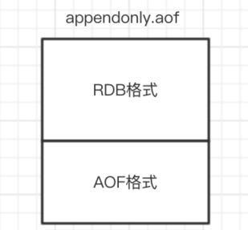

# 一、Redis持久化方式

## 1.1 RDB快照（snapshot） 

```properties
###################################SNAPSHOTTING快照###################################
# RDB是整个内存的压缩过的Snapshot快照配置
# 注释掉“save”这一行配置项就可以让保存数据库功能失效
# 设置sedis进行数据库镜像的频率。
# 900秒（15分钟）内至少1个key值改变（则进行数据库保存--持久化） 
# 300秒（5分钟）内至少10个key值改变（则进行数据库保存--持久化） 
# 60秒（1分钟）内至少10000个key值改变（则进行数据库保存--持久化）
# 如果想禁用RDB持久化的策略，只要不设置任何save指令，或者给save传入一个空字符串参数也可以
# 配置自动生成rdb文件后台使用的是bgsave方式。
save 900 1
save 300 10
save 60 10000

#当RDB持久化出现错误后，是否依然进行继续进行工作，yes：不能进行工作，no：可以继续进行工作，可以通过info中的rdb_last_bgsave_status了解RDB持久化是否有错误
stop-writes-on-bgsave-error yes
# 对于存储到磁盘中的快照，可以设置是否进行压缩存储。如果是的话，redis会采用LZF算法进行压缩。如果你不想消耗CPU来进行压缩的话，可以设置为关闭此功能
rdbcompression yes
#是否校验rdb文件。从rdb格式的第五个版本开始，在rdb文件的末尾会带上CRC64的校验和。这跟有利于文件的容错性，但是在保存rdb文件的时候，会有大概10%的性能损耗，所以如果你追求高性能，可以关闭该配置。
rdbchecksum yes
#rdb文件的名称
dbfilename dump.rdb
#数据目录，数据库的写入会在这个目录。rdb、aof文件也会写在这个目录
dir /var/lib/redis
```

在默认情况下， Redis 将内存数据库快照保存在名字为 dump.rdb 的二进制文件中。 

还可以手动执行命令生成RDB快照，进入redis客户端执行命令**save**或**bgsave**可以生成dump.rdb文件， 

每次命令执行都会将所有redis内存快照到一个新的rdb文件里，并覆盖原有rdb快照文件。 

**bgsave的写时复制(COW)机制** 

Redis 借助操作系统提供的写时复制技术（Copy-On-Write, COW），在生成快照的同时，依然可以正常处理写命令。简单来说，bgsave 子进程是由主线程 fork 生成的，可以共享主线程的所有内存数据。 

bgsave 子进程运行后，开始读取主线程的内存数据，并把它们写入 RDB 文件。此时，如果主线程对这些数据也都是读操作，那么，主线程和 bgsave 子进程相互不影响。但是，如果主线程要修改一块数据，那么，这块数据就会被复制一份，生成该数据的副本。然后，bgsave 子进程会把这个副本数据写入 RDB 文件，而在这个过程中，主线程仍然可以直接修改原来的数据。 

**save与bgsave对比：** 

| 类型                  | save             | bgsave                                         |
| --------------------- | ---------------- | ---------------------------------------------- |
| io                    | 同步             | 一异步                                         |
| 是否阻塞redis其它命令 | 是               | 否(在生成子进程执行调用fork函数时会有短暂阻塞) |
| 复杂度                | O(n)             | O(n)                                           |
| 优点                  | 不会消耗额外内存 | 不阻塞客户端命令                               |
| 缺点                  | 阻塞客户端命令   | 需要fork子进程，消耗内存                       |

## 1.2 AOF（append-only file） 

快照功能并不是非常耐久（durable）： 如果 Redis 因为某些原因而造成故障停机， 那么服务器将丢失最近写入、且仍未保存到快照中的那些数据。从 1.1 版本开始， Redis 增加了一种完全耐久的持久化方式： AOF 持久化，将修改的每一条指令记录进文件appendonly.aof中(先写入os cache，每隔一段时间fsync到磁盘) 

```
set zhuge 666
```

这是一种resp协议格式数据，星号后面的数字代表命令有多少个参数，$号后面的数字代表这个参数有几个字符

```
*3
$3
set
$5
zhuge
$3
666
```

注意，如果执行带过期时间的set命令，aof文件里记录的是并不是执行的原始命令，而是记录key过期的时间戳。

例如:

```
set tuling 888 ex 1000
```

 记录(实际执行了两条指令)：

```
*3 
$3 
set 
$6 
tuling 
$3 
888 
*3 
$9 
PEXPIREAT 
$6 
tuling 
$13 
1604249786301 
```

打开aof功能：

```
############################## APPEND ONLY MODE ###############################
#默认redis使用的是rdb方式持久化，这种方式在许多应用中已经足够用了。但是redis如果中途宕机，会导致可能有几分钟的数据丢失，根据save来策略进行持久化，Append Only File是另一种持久化方式，可以提供更好的持久化特性。Redis会把每次写入的数据在接收后都写入 appendonly.aof 文件，每次启动时Redis都会先把这个文件的数据读入内存里，先忽略RDB文件。
appendonly yes
#aof文件名
appendfilename "appendonly.aof"

#aof持久化策略的配置
#no表示不执行fsync，由操作系统保证数据同步到磁盘，速度最快。
#always表示每次写入都执行fsync，以保证数据同步到磁盘。
#everysec表示每秒执行一次fsync，可能会导致丢失这1s数据。
appendfsync everysec
# 重写时是否可以运用Appendfsync，用默认no即可，保证数据安全性。
no-appendfsync-on-rewrite no
```

**AOF重写** 

AOF文件里可能有太多没用指令，所以AOF会定期根据**内存的最新数据**生成aof文件 

例如，执行了如下几条命令： 

```
127.0.0.1:6379> incr readcount 
(integer) 1
127.0.0.1:6379> incr readcount 
(integer) 2
127.0.0.1:6379> incr readcount 
(integer) 3
127.0.0.1:6379> incr readcount 
(integer) 4
127.0.0.1:6379> incr readcount 
(integer) 5
```

重写后AOF文件里变成 

```
*3 
$3 
SET 
$2 
readcount 
$1 
5 
```

如下两个配置可以控制AOF自动重写频率 

```
#设置允许重写的最小aof文件大小，避免了达到约定百分比但尺寸仍然很小的情况还要重写
auto-aof-rewrite-min-size 64mb
#aof自动重写配置。当目前aof文件大小超过上一次重写的aof文件大小的百分之多少进行重写，即当aof文件增长到一定大小的时候Redis能够调用bgrewriteaof对日志文件进行重写。当前AOF文件大小是上次日志重写得到AOF文件大小的二倍（设置为100）时，自动启动新的日志重写过程。
auto-aof-rewrite-percentage 100
```

RDB 和 AOF ，我应该用哪一个？

| 命令       | RDB        | AOF          |
| ---------- | ---------- | ------------ |
| 启动优先级 | 低         | 高           |
| 体积       | 小         | 大           |
| 恢复速度   | 快         | 慢           |
| 数据安全性 | 容易丢数据 | 根据策略决定 |

生产环境可以都启用，redis启动时如果既有rdb文件又有aof文件则优先选择aof文件恢复数据，因为aof 一般来说数据更全一点。 

**Redis 4.0 混合持久化** 

重启 Redis 时，我们很少使用 RDB来恢复内存状态，因为会丢失大量数据。我们通常使用 AOF 日志重放，但是重放 AOF 日志性能相对 RDB来说要慢很多，这样在 Redis 实例很大的情况下，启动需要花费很长的时间。 Redis 4.0 为了解决这个问题，带来了一个新的持久化选项——混合持久化。 

通过如下配置可以开启混合持久化(必须先开启aof)： 

1 aof‐use‐rdb‐preamble yes

如果开启了混合持久化，AOF在重写时，不再是单纯将内存数据转换为RESP命令写入AOF文件，而是将重写这一刻之前的内存做RDB快照处理，并且将RDB快照内容和增量的AOF修改内存数据的命令存在一起，都写入新的AOF文件，新的文件一开始不叫appendonly.aof，等到重写完新的AOF文件才会进行改名，覆盖原有的AOF文件，完成新旧两个AOF文件的替换。 

于是在 Redis 重启的时候，可以先加载 RDB 的内容，然后再重放增量 AOF 日志就可以完全替代之前的AOF 全量文件重放，因此重启效率大幅得到提升。 

混合持久化AOF文件结构如下 



Redis数据备份策略：

1. 写crontab定时调度脚本，每小时都copy一份rdb或aof的备份到一个目录中去，仅仅保留最近48 小时的备份 

2. 每天都保留一份当日的数据备份到一个目录中去，可以保留最近1个月的备份 

3. 每次copy备份的时候，都把太旧的备份给删了 

4. 每天晚上将当前机器上的备份复制一份到其他机器上，以防机器损坏 