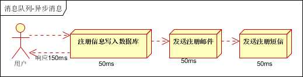
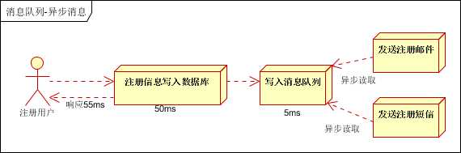
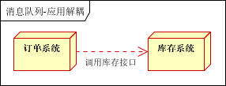

## 1 异步处理

**传统的处理方式有两种**

串行处理：注册信息入库——发送注册邮件——发送注册短信，3个任务完成后在返回客户端。

1 用户提交注册信息

2 发送注册邮件

3 发送注册短信

并行处理：注册信息入库——发送注册邮件同时发送注册短信，3个任务完成后返回客户端。区别：并行可以提交时间。

1 用户提交注册信息

2 发送注册邮件同时发送注册短信

注：传统方式应该这种方式用的稍多

**异步解耦** 

1. 用户提交注册信息。
2. 发送消息至mq，响应注册成功，随后可以立即登录（这里相当于把邮件和短信排除主流程，是否成功不影响注册业务）
3. 邮件和短信通知系统订阅消息队列的此类注册请求消息，即可向用户发送邮件和短信通知，完成所有的注册流程。

## 2 应用解耦  

场景说明：用户下单后，订单系统需要通知库存系统。传统的做法是，订单系统调用库存系统的接口。 

 

推荐文章：

https://m.sohu.com/a/126178315_487514

