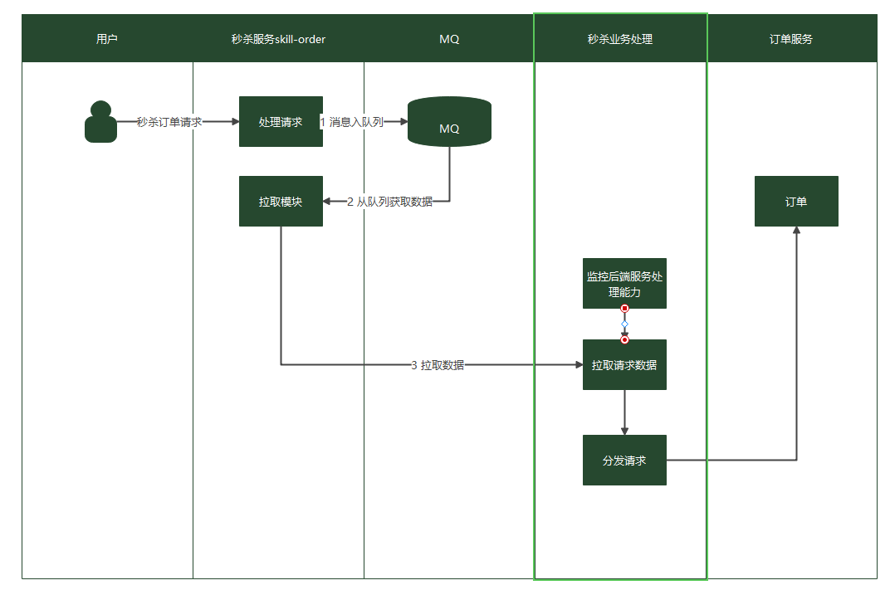

# 一、介绍

RabbitMQ作为一款热门的消息队列中间件，具备高效可靠的消息异步传递机制，主要用于不同系统间的数据交流和传递，在企业解决方案、金融支付、电信、电子商务、社交、即时通信、视频、物联网、车联网等众多领域都有广泛应用。 

# 二、使用方向

## 2.1 异步通信

将业务中属于非核心或不重要的流程部分，使用消息异步通知的方式发给目标系统，这样主业务流程无需同步等待其他系统的处理结果，从而达到系统快速响应的目的。 

如网站的用户注册场景，在用户注册成功后，还需要发送注册邮件与注册短信，这两个流程使用RabbitMQ消息服务通知邮件发送系统与短信发送系统，从而提升注册流程的响应速度。 

例如：

串行操作：

```
用    ——>    注册信    ——>  发送  ——>    发送
户    <——    息发送    <——  邮件  <——    短信
```

消息队列异步操作

```
用    ——>    注册信    ——>  消息  <——    发送
户    <——    息发送         队列  <——    短信
```

## 2.2 错峰流控与流量削峰

在电子商务系统或大型网站中，上下游系统处理能力存在差异，处理能力高的上游系统的突发流量可能会对处理能力低的某些下游系统造成冲击，需要提高系统的可用性的同时降低系统实现的复杂性。电商大促销等流量洪流突然来袭时，可以通过队列服务堆积缓存订单等信息，在下游系统有能力处理消息的时候再处理，避免下游订阅系统因突发流量崩溃。消息队列提供亿级消息堆积能力，3天的默认保留时长，消息消费系统可以错峰进行消息处理。

另外，在商品秒杀、抢购等流量短时间内暴增场景中，为了防止后端应用被压垮，可在前后端系统间使用RabbitMQ消息队列传递请求。

```
用户（秒杀订单发起）         ——>    消      <——    订单处理（根据消息进行处理）
用户（秒杀订单发起）         ——>    息      
用户（秒杀订单发起）         ——>    队      
用户（订单已满，秒杀失败）    ——>    列      
```



## 2.3 系统解耦

以电商秒杀、抢购等流量短时间内暴增场景为例，传统做法是，用户下单后，订单系统发送查询请求到库存系统，等待库存系统返回请求结果给订单系统。如果库存系统发生故障，订单系统获取不到数据，订单失败。这种情况下，订单系统和库存系统两个子系统高耦合。 

```
订单系统   —--查询—>   库存系统
```

引入RabbitMQ消息队列，当用户下单后，将消息写入到RabbitMQ消息队列中，然后返回用户下单成功。

库存系统订阅下单的消息，消费下单消息，然后进行库操作。即使库存系统出现故障，也不影响用户下单。

```
订单系统（库存消息发送）——>    消息队列    <——    库存系统（根据消息进行处理） 
```

## 2.4 高可用

镜像队列是开源RabbitMQ 2.6.0版本新增的一个功能，允许集群将队列镜像到其他代理上，当集群某一代理宕机后，队列能自动切换到镜像中的其他代理，保证服务的可用性。这就是消息队列的高可用性，不会因为宕机出现消息的丢失。

普通队列，由于队列以及队列内容仅存储在单代理上，当该代理故障后，对应的队列不可用。

## 2.5 解耦刷新缓存

当然我们直接在商品后台更新完商品数据后，同步操作操作memcache也是可以的，但是不推荐这么做，理由如下：

> 操作缓存的应用,最好是离缓存最近的应用,如上面的C端商品服务,像后台服务、定时任务等,最好不要直接操作C端缓存,需要做解耦操作,将刷缓存的逻辑收拢到同一个地方。

如果时存储数据后可以借助canal+kafka这种方式，监听mysql的数据，并且通过kafka发送消息，然后更新redis的缓存数据

# 三、使用场景

## 3.1 订单支付成功后消息

当订单api收到支付成功的消息后，将订单状态扭转为已支付后，需要发布一条订单已成功支付的消息，有两个应用需要订阅这条消息，一个是pms营销系统，一个是大数据。pms需要订阅订单支付成功的消息的理由有好几个，例如：

> 用户下了一个拼团订单,当订单支付成功后,需要更新团的状态以及已参团人数;
>
> 用户的订单可能还用了优惠券,订单支付成功后,需要将用户的优惠券状态扭转为已使用:

而大数据侧则可以利用这条消息做一个实时的已支付订单dashboard。当然像WMS侧也足需要感知已支付订单的.用于扣减仓库的库存。

## 3.2 用户注册时发送短信验证码

注册时，用户会先点击发送验证码，将消息发送到消息队列，同时保存验证码到redis(后续校验验证码)，此时接口应快速返回验证码已发送。 

## 3.3 在对商品增删改查的时候发送消息

1、 新增/修改商品后台数据库信息
 2、数据库修改后，发送商品id消息到消息队列
 3、第三方微服务（前台显示微服务，商品搜索微服务）接受消息，更新对于微服务的商品数据。（商品搜索微服务逻辑—先去查询商品后台的数据，获得最新的商品数据，生产搜索dto,保存到搜索数据库中（es/solr））

 canal+kafka+es的架构模式

## 3.4 电子邮件 

将发送的电子邮件放到消息队列，然后邮件服务在队列中获取邮件并发送给收件人

## 3.5 消费指定routing key的消息 

 如在商品库存中增加了1台iphone12，iphone12促销活动消费者指定routing key为iphone12，只有此促销活动会接收到消息，其它促销活动不关心也不会消费此routing key的消息 

## 3.6 钱包扣款 

对于消息可靠性要求较高，比如钱包扣款 

## 3.7 订单定时取消

更多方案：https://mp.weixin.qq.com/s/J6jb_Dt3C49CIjYBTrN4gQ

会用到死信队列：

- RabbitMQ可以针对Queue和Message设置 x-message-tt，来控制消息的生存时间，如果超时，则消息变为dead letter
- lRabbitMQ的Queue可以配置x-dead-letter-exchange 和x-dead-letter-routing-key（可选）两个参数，用来控制队列内出现了deadletter，则按照这两个参数重新路由。

# 四、死信队列

`DLX ，全称为 Dead-Letter-Exchange` ，可以称之为死信交换机。当消息在一个队列中变成死信（ dead message ）之后，它能被重新被发送到另一个交换器中，这个交换器就是 DLX ，**绑定 DLX 的队列就称之为死信队列**。

消息变成死信一般是由于以下几种情况造成的：

- 1、消息过期，也就是笔者在上篇提到的 TTL。消息在队列的存活时间超过所设置的 TTL 时间。
- 2、消息被拒绝，调用了 `channel.basicNack` 或 `channel.basicReject`方法，井且设置 `requeue` 参数为`false`。
- 3、队列的消息达到最大长度。

DLX 也是一个正常的交换器，和一般的交换器没有区别，它能在任何的队列上被指定，实际上就是设置某个队列的属性。当这个队列中存在死信时 `RabbitMQ` 就会自动地将这个消息新发布到设置的 DLX 上去，进而被路由到另一个队列，即死信队列。可以监听这个队列中的消息、以进行相应的处理。

 在 `channel.queueDeclare` 方法中设置 `x-dead-letter-exchange` 参数来为这个队列添加 DLX。下面就第一种和第二种情况来介绍一下死信队列的配置与使用。 

参考文章：

https://juejin.cn/post/6976778266472366087

https://developer.aliyun.com/article/938794

 

 

 

 

 