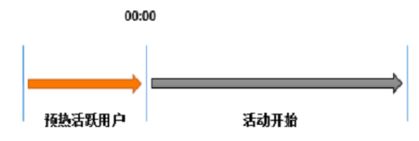
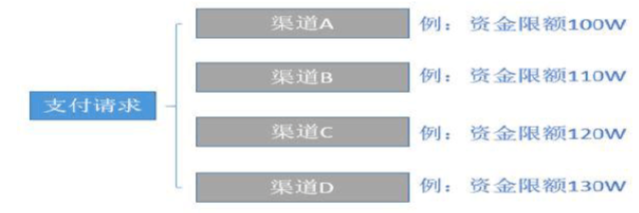

## 1、数据缓存

```java
@Bean
@SuppressWarnings("all")
public RedisTemplate<String, Object> redisTemplate(RedisConnectionFactory factory) {
    RedisTemplate<String, Object> template = new RedisTemplate<String, Object>();
    template.setConnectionFactory(factory);
    Jackson2JsonRedisSerializer jackson2JsonRedisSerializer = new Jackson2JsonRedisSerializer(Object.class);
    ObjectMapper om = new ObjectMapper();
    om.setVisibility(PropertyAccessor.ALL, JsonAutoDetect.Visibility.ANY);
    om.enableDefaultTyping(ObjectMapper.DefaultTyping.NON_FINAL);
    jackson2JsonRedisSerializer.setObjectMapper(om);
    StringRedisSerializer stringRedisSerializer = new StringRedisSerializer();

    // key采用String的序列化方式
    template.setKeySerializer(stringRedisSerializer);

    // hash的key也采用String的序列化方式
    template.setHashKeySerializer(stringRedisSerializer);

    // value序列化方式采用jackson
    template.setValueSerializer(jackson2JsonRedisSerializer);

    // hash的value序列化方式采用jackson
    template.setHashValueSerializer(jackson2JsonRedisSerializer);

    template.afterPropertiesSet();
    return template;
}
```

设置序列化和反序列化，通过对key和value进行序列化存储和反序列化给应用程序。

## 2、共享session

String 类型，因为 Redis 是分布式的独立服务，可以在多个应用之间共享

```
<dependency> 
 <groupId>org.springframework.session</groupId> 
 <artifactId>spring-session-data-redis</artifactId> 
</dependency>#通过在启动类开启redissession支持
```

```
@SpringBootApplication
@EnableRedisHttpSession(maxInactiveIntervalInSeconds = 1800, flushMode = FlushMode.IMMEDIATE,redisNamespace = "mall")
public class AuthServerApplication {
    public static void main(String[] args) {
        SpringApplication.run(AuthServerApplication.class, args);
    }
}
```

配置redissession类

```
@Configuration
public class GulimallSessionConfig {
    //配置一个默认的序列化处理器
    @Bean
    public RedisSerializer<Object> springSessionDefaultRedisSerializer() {
        return new GenericJackson2JsonRedisSerializer();
    }
    //设置cookiename MALLSESSIONID，domain mall.com
    @Bean
    public CookieSerializer cookieSerializer() {
        DefaultCookieSerializer serializer = new DefaultCookieSerializer();
        serializer.setCookieName("MALLSESSIONID");
        serializer.setDomainName("mall.com");
        return serializer;
    }
}
```

注意：上面的依赖配置在每一个需要启动的服务都需要

## 3、分布式锁

分布式锁有多种方式实现：

mysql方式

需要一个mysql表作为锁表，利用mysql的键的唯一性及insert的原子性，得到同一时刻，只会有一个线程插入相同的记录

zk方式

采取zk的临时路径，推荐curator-framework

redis方式

这个redisson主要思想：通过setnx创建一个30s的key，并且创建一个守护线程10s续命分布式锁执行一次setnx，放置key因为过期造成其它线程进入访问引起业务数据异常。比较注意的是，redession加入pub/sub 消息发布订阅机制，当客户端释放锁时会pub一个消息，其它客户端收到消息，又会去竞争锁。这里运用的思想还是AQS。

非常重要：通过分布式锁，再一次说明了AQS的重要性。

## 4、全局ID

int类型，incrby，利用原子性

```
incrby userid 1000
```

分库分表的场景，一次性拿一段

## 5、计数器

int类型，incr方法

例如：文章的阅读量、微博点赞数、允许一定的延迟，先写入Redis再定时同步到数据库。

在 Redis 的数据结构中，`string`、`hash`和`sorted set`都提供了`incr`方法用于原子性的自增操作。

- 如果应用需要显示每天的注册用户数，便可以使用string作为计数器，设定一个名为REGISTERED_COUNT_TODAY的 key，并在初始化时给它设置一个到凌晨 0 点的过期时间，每当用户注册成功后便使用incr命令使该 key 增长 1，同时当每天凌晨 0 点后，这个计数器都会因为 key 过期使值清零。
- 每条微博都有点赞数、评论数、转发数和浏览数四条属性，这时用hash进行计数会更好，将该计数器的 key 设为weibo:weibo_id，hash的 field 为like_number、comment_number、forward_number和view_number，在对应操作后通过hincrby使hash 中的 field 自增。
- 如果应用有一个发帖排行榜的功能，便选择sorted set吧，将集合的 key 设为POST_RANK。当用户发帖后，使用zincrby将该用户 id 的 score 增长 1。sorted set会重新进行排序，用户所在排行榜的位置也就会得到实时的更新。

## 6、限流

incr访问次数，当超过次数false

## 7、位统计（在线用户）

String类型的bitcount

**setbit**

`setbit key offset value`：给对应的位设置值

**getbit**

`getbit key offset` 获取指定位的值

**bitcount**

`bitcount key [start] [end]` 获取指定范围为1的个数

例如：

```
//设置用户id为3的用户在2022-5-17登录
$ setbit user:view:2022-5-17 3 1
//查看用户id为3的用户在2022-5-17是否登录
$ getbit user:view:2022-5-17 3
//查看2022-5-17有多少人登录
$ bitcount user:view:2022-5-17
```

**Bitmaps间的操作**：不过生产环境很难用上，生产环境现在大多都是集群，所以交集并集之类的用不上

```
bitop op destkey key [key ...]
```

`bitop`命令可以对多个bitmaps做交集（and)、并集（or）、非（not）、异或（xor），并将操作结果存放在`destkey`中。

```
// 将17、18、19集合结果放到three:and上
$ bitop and three:and user:view:2022-5-17 user:view:2022-5-18 user:view:2022-5-19
$ bitcount three:and
```

## 8、时间轴（Timeline）

list为双向链表。

如果将list用作时间轴，用户通过lpush发完消息，可以通过lrange拉取最新的消息。lrange可以指定需要多少length。

例如：微博消息发布后，通过lrange获取最新微博。

## 9. 消息队列

有序消息队列：Redis 中list的数据结构实现是双向链表，消息的生产者只需要通过lpush将消息放入 list，消费者便可以通过rpop取出该消息，并且可以保证消息的有序性。

优先级消息队列：带有优先级的消息队列也可以选择sorted set。

pub/sub用作发布者 / 订阅者模型的消息，不需要担心由于服务器故障导致消息丢失的情况，Redis 拥有持久化功能。

Redis 中list的数据结构实现是双向链表，所以可以非常便捷的应用于消息队列（生产者 / 消费者模型）。消息的生产者只需要通过lpush将消息放入 list，消费者便可以通过rpop取出该消息，并且可以保证消息的有序性。如果需要实现带有优先级的消息队列也可以选择sorted set。而pub/sub功能也可以用作发布者 / 订阅者模型的消息。无论使用何种方式，由于 Redis 拥有持久化功能，也不需要担心由于服务器故障导致消息丢失的情况。

List提供了两个阻塞的弹出操作：blpop/brpop，可以设置超时时间：

- blpop：blpop key1 timeout 移除并获取列表的第一个元素，如果列表没有元素会阻塞列表直到等待超时或发现可弹出元素为止。
- brpop：brpop key1 timeout 移除并获取列表的最后一个元素，如果列表没有元素会阻塞列表直到等待超时或发现可弹出元素为止。

队列：先进先除：rpush blpop，左头右尾，右边进入队列，左边出队列
栈：先进后出：rpush brpop

## 10、抽奖

利用set结构的无序性,通过 Spop（ Redis Spop 命令用于移除集合中的指定 key 的一个或多个随机元素，移除后会返回移除的元素。 ） 随机获得值。

```
> smembers key1
1) "1"
2) "2"
3) "3"
4) "4"
5) "5"
6) "7"
7) "8"
> spop key1
"8"
> spop key1
"3"
```

## 11、点赞、签到、打卡

```
假如上面的微博ID是t1001，用户ID是u3001

用 like:t1001 来维护 t1001 这条微博的所有点赞用户

点赞了这条微博：sadd like:t1001 u3001
取消点赞：srem like:t1001 u3001
是否点赞：sismember like:t1001 u3001
点赞的所有用户：smembers like:t1001
点赞数：scard like:t1001
```

## 12 商品标签

```
sadd tags:i5001 画面清晰细腻
sadd tags:i5001 真彩清晰显示屏
sadd tags:i5001 流程至极
```

## 13、好友关系、用户关注、推荐模型

```
A:follow：存放 A 所有关注的用户 id

A:follower：存放 A 所有粉丝的用户 id

那么通过sinter命令便可以根据A:follow和A:follower的交集得到与 A 互相关注的用户。当 A 进入另一个用户 B 的主页后，A:follow和B:follow的交集便是 A 和 B 的共同专注，A:follow和B:follower的交集便是 A 关注的人也关注了 B。
```

例如：

```
相互关注：

sadd 1:follow 2
sadd 1:follower 2
sadd 2:follower 1
sadd 2:follow 1
1关注的人也关注了他(取交集)：

交集：sinter 1:follow 2:follower

用户1可能认识的人(差集)：sdiff 2:follow 1:follow
用户2可能认识的人：sdiff 1:follow 2:follow
```

## 14 .排行榜

id 为6001 的新闻点击数加1：

```
zincrby hotNews:20190926 1 n6001
```

获取今天点击最多的15条：

```
zrevrange hotNews:20190926 0 15 withscores
```

## 15 .倒排索引

可以通过分词器把对应的分词 设置set key id，然后通过id找到对应的数据。一般用es

## 16、电商实际应用场景

### 16.1 商品维度和用户维度计数

商品（喜欢数，评论数，鉴定数，浏览数,etc） 采用Redis 的类型: `Hash`. 

```
//喜欢数=5
$ HSET product:10001 favor 5
//喜欢数+1
$ HINCRBY product:10001 favor 1
//获取hashkey value
$ HGETALL product:10001
1) "favor"
2) "6"
```

用户维度计数（动态数、关注数、粉丝数、喜欢商品数、发帖数 等）采用 `Hash`  

```
//关注=5
$ HSET user:10001 follow 5
//关注+1
$ HINCRBY user:10001 favor 1
//获取hashkey value
$ HGETALL user:10001
1) "follow"
2) "6"
```

### 16.2 存储社交关系

将用戶的好友/粉丝/关注，可以存在一个`sorted set`中，score可以是timestamp，这样求两个人的共同好友的操作，可能就只需要用求交集命令即可。 

```
//score 为timestamp
redis> ZADD user:100000:follow 61307510400000 "100001" 
redis> ZADD user:100000:follow 61307510402300 "100002"
redis> ZADD user:100000:follow 61307510405600 "100003"
redis> ZADD user:200000:follow 61307510400000 "100001"
redis> ZADD user:200000:follow 61307510402300 "100005"
redis> ZADD user:200000:follow 61307510405600 "100004"
//交集命令，获得共同关注
redis> ZINTERSTORE out:100000:200000 1 user:100000:follow user:200000:follow 
//输出所有的共同关注 -1表示无右边界
redis> ZRANGE out:100000:200000 0 -1
```

### 16.3 用作缓存

代替memcached（商品列表，评论列表，@提示列表，etc）相对memcached，redis数据结构（list,set,sorted set,hash, etc）可以更方便cache各种业务数据，性能也不亚于memcached。

### 16.4 反spam系统

评论，发布商品，论坛发贴，etc

将会有各种spam攻击 ，垃圾评论、发布垃圾商品、广告、刷自家商品排名等。针对这些spam制定一系列anti-spam规则，其中有些规则可以利用redis做实时分析， 1分钟评论不得超过2次、5分钟评论少于5次等（更多机制/规则需要结合drools ） 

采用sorted set将最近一天用户操作记录起来（全部操作记录到log，后续利用hadoop进行更全面分析统计），通过

```
//获取大于61307510405600的评论    -inf等同于负无穷大  +inf等同于正无穷大  “61307510405600 +inf” 则表示>=61307510405600
ZRANGEBYSCORE user:200000:operation:comment 61307510405600 +inf
```

 获得1分钟内的操作记录。

```
ZADD user:200000:operation:comment 61307510402300
```

更复杂一点的实时计算可以采用Storm。

### 16.5 用户Timeline/Feeds

在逛 有个类似微博的栏目我关注，里面包括关注的人、主题、品牌的动态。redis在这边主要当作cache使用。 注意设置过期时间。

```
ZADD user:100000:feed:topic  61307510400000 <feedId>
```

### 16.6 最新列表&排行榜（用户刚刚喜欢的商品，etc）

这里采用Redis的`List`数据结构或`sorted set` 结构, 方便实现最新列表or排行榜 等业务场景。 

### 16.7 消息通知

其实这业务场景也可以算在计数上，也是采用`Hash`。如下：

```
redis> HSET user:<userId>:message:ur system 1//1条未读系统消息
redis> HINCRBY user:<userId>:message:ur system 1 //未读系统消息+1
redis> HINCRBY user:<userId>:message:ur comment 1 //未读评论消息+1
redis> HSET user:<userId>:message:ur system 0//设为系统消息已读
redis> HGETALL user:<userId>:message:ur //获取这key hashkey 和value
1) "system"
2) "0"
3) "comment"
4) "1"
```

### 16.8. 将Redis用作消息队列

当在集群环境时候，java `ConcurrentLinkedQueue` 就无法满足需求时，可以采用Redis的List数据结构实现分布式的消息队列。

## 17 Redis 在金融系统的应用场景

### 17.1 session共享

### 17.2 活动抢券

需要解决问题：

- 系统的高并发压力
- 大量用户抢同一张优惠券带来数据一致性问题
- 券不能超发、重复发
- 由于券涉及到资金,也带资金安全的问题

场景主要的技术挑战是高并发、高响应、一致性、安全性等。

解决方案：

(1)提前把访问量蓄水,预热活跃用户,降低活动开始后的登录和风控压力。



(2)对Redis进行全局数据化处理,基于Redis内存高读写高QPS的特性,解决热点数据的高并发问题。热点数据均存储在内存中,采取Redis CLUSTER 特性,进行多分片部署，通过高并发读写特性，提升系统吞吐量。下图为热数据的结构和场景描述。

| 存储数据   | 数据结构 | 场景描述                                                 |
| ---------- | -------- | -------------------------------------------------------- |
| 卷数量     | STRING   | 热数据初始化卷数量，抢卷时通过DECR扣减                   |
| 抢卷资格   | HASH     | 抢卷时判断计数器进行资格校验拦截不符合资格               |
| 卷类型     | LIST     | 按顺序从LIST获取卷类型                                   |
| 卷基本信息 | HASH     | 抢卷时初始化卷总数、总类型等信息                         |
| 卷分布式锁 | STRING   | 抢卷时加锁，抢完后删除锁，一个用户只允许有一个线程在抢卷 |
| 抢卷记录   | STRING   | 判断用户是否抢卷，抢卷后新增抢卷记录信息                 |

（3）分布式锁的应用

问题：在抢卷时，可能出现多个用户同时在抢同一张卷，或同一用户抢多张卷的问题。当用户点击过快时，可能同一用户的两个线程同时通过了抢卷资格的校验，这种情况下该用户可以同时抢两张卷。

针对上面问题可以通过对抢卷号码、用户账号两个维度进行加分布式锁来解决。

### 17.3 支付渠道限额

本场景是支付路由场景下支付渠道限额的设计,是为了通过执行渠道路由支付时,避免资金不足时缺乏渠道控制,造成大量交易失败,导致处理异常。以下为路由示例图。



| 命令                 | 说明                           | 备注           |
| -------------------- | ------------------------------ | -------------- |
| INCR KEY             | 在原字段上加1                  | 只能对整数操作 |
| INCRBY KEY INCREMENT | 在原字段上加上整数(INCREMENT)  | 只能对整数操作 |
| DECR KEY             | 在原字段上减1                  | 只能对整数操作 |
| DECRBY KEY DECREMENT | 在原字段上减去 整数(DECREMENT) | 只能对整数操作 |


    二、活动抢券是互联网金融公司最常用的营销手段,对于互联网金融公司来说,本业务场景带来了几个需要解决的问题,;;;。由此可见,本
    我们引用了电力行业的一种措施“削峰填谷”,顾名思义,就是在流量洪峰到来之前在系统负载较低的时候进行冷热数据的交换,和券数据的预热,用来分担领券活动后的高并发流量。而领券销售活动的业务特点是定时的洪峰流量对关联系统造成的巨大的并发访问的冲击。在此,从业务场景来说,如下图所示。


参考文章：

https://blog.csdn.net/agonie201218/article/details/123640871