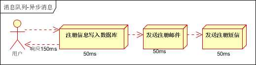
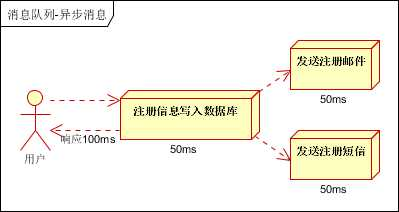
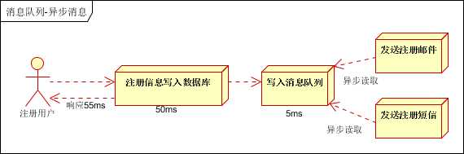

# 一、介绍

向项目应用场景中，了解rocketmq的功能，以便更好地判断如何在业务中使用消息队列RocketMQ版。

例如，对于互联网电商项目，业务涉及注册、订单、库存、物流等；同时，也会涉及许多业务峰值时刻，如秒杀活动、周年庆、定期特惠等。这些活动都对分布性系统中的各项微服务应用的处理性能带来很大的挑战。

消息队列RocketMQ版作为分布式系统中的重要组件，可用于应对这些挑战，例如解决应用的异步解耦。

例如：用户注册中消息队列RocketMQ版如何实现以下功能：

- 异步解耦
- 分布式事务的数据一致性
- 消息的顺序收发

最后，再以电商的秒杀场景和价格同步场景分别说明消息队列RocketMQ版所实现的削峰填谷和大规模机器的缓存同步。

# 二、功能介绍

## 2.1 异步解耦

异步解耦是消息队列RocketMQ版的主要特点，主要目的是减少请求响应时间和解耦。主要的适用场景就是将比较耗时而且不需要即时（同步）返回结果的操作作为消息放入消息队列。同时，由于使用了消息队列RocketMQ版，只要保证消息格式不变，消息的发送方和接收方并不需要彼此联系，也不需要受对方的影响，即解耦。 

**传统处理** 

串行处理：

   

流程：

1. 用户填写账号和密码并提交注册信息。
2. 注册信息写入注册系统成功后，再发送请求至邮件通知系统。邮件通知系统收到请求后向用户发送邮件通知。
3. 邮件通知系统接收注册系统请求后再向下游的短信通知系统发送请求。短信通知系统收到请求后向用户发送短信通知。

以上三个任务全部完成后，才返回注册结果到客户端，用户才能使用账号登录。

假设每个任务耗时分别为50 ms，则用户需要在注册页面等待总共150 ms才能登录。

并行方式 ：

 

流程：

1. 用户在注册页面填写账号和密码并提交注册信息。
2. 注册信息写入注册系统成功后，再同时发送请求至邮件和短信通知系统。邮件和短信通知系统收到请求后分别向用户发送邮件和短信通知。

以上两个任务全部完成后，才返回注册结果到客户端，用户才能使用账号登录。

假设每个任务耗时分别为50 ms，其中，邮件和短信通知并行完成，则用户需要在注册页面等待总共100 ms才能登录。 

**异步解耦** 

  

流程：

1. 用户提交注册信息。
2. 注册信息写入注册系统成功后，再发送消息至消息队列RocketMQ版。消息队列RocketMQ版会马上返回响应给注册系统，注册完成。用户可立即登录。
3. 下游的邮件和短信通知系统订阅消息队列RocketMQ版的此类注册请求消息，即可向用户发送邮件和短信通知，完成所有的注册流程。

用户只需在注册页面等待注册数据写入注册系统和消息队列RocketMQ版的时间，即等待55 ms即可登录。 

## 2.2 分布式事务的数据一致性

例如上面的注册流程，网页注册系统通知邮件系统，两个系统之间的数据需要保持最终一致。

 **普通消息处理** 

 

流程：

1 注册系统发起注册
2 注册系统向消息队列RocketMQ版发送注册消息成功与否的消息。
	2.1 消息发送成功，进入3。

​	2.2 消息发送失败，导致邮件通知系统未收到消息队列RocketMQ版发送的注册成功与否的消息，而无法发送邮件，最终邮件通知系统和注册系统之间的状态			数据不一致，流程结束。

3 邮件通知系统收到消息队列RocketMQ版的注册成功消息。
4 邮件通知系统发送注册成功邮件给用户。

这里注册系统虽然与邮件系统实现了解耦，通过rocketmq发送消息通知，但是邮件并未发送成功，上游注册系统并不关系下游邮件通知系统，但是数据最终状态不一致。

**事务消息处理** 

此时，需要利用消息队列RocketMQ版所提供的事务消息来实现系统间的状态数据一致性。 

 

流程：

1 注册系统向消息队列RocketMQ版发送半事务消息。

1.1 半事务消息发送成功，进入2。

1.2 半事务消息发送失败，注册系统不进行注册，流程结束。

2 注册系统开始注册。
2.1 注册成功，进入3.1。

2.2 注册失败，进入3.2。

3 注册系统向消息队列RocketMQ版发送半消息状态。
3.1 提交半事务消息，产生注册成功消息，进入4。

3.2 回滚半事务消息，未产生注册成功消息，流程结束。

4 邮件通知系统接收消息队列RocketMQ版的注册成功消息。

5 邮件通知系统发送注册成功邮件。

## 2.3 消息的顺序收发

全局顺序：对于指定的一个Topic，所有消息将按照严格的先入先出（FIFO）的顺序，进行顺序发布和顺序消费。
分区顺序：对于指定的一个Topic，所有消息根据Sharding Key进行区块分区，同一个分区内的消息将按照严格的FIFO的顺序，进行顺序发布和顺序消费，可以保证一个消息被一个进程消费。
在注册场景中，可使用用户ID作为Sharding Key来进行分区，同一个分区下的新建、更新或删除注册信息的消息必须按照FIFO的顺序发布和消费。

## 2.4 削峰填谷

在秒杀或团队抢购活动中，由于用户请求量较大，导致流量暴增，秒杀的应用在处理如此大量的访问流量后，下游的通知系统无法承载海量的调用量，甚至会导致系统崩溃等问题而发生漏通知的情况。 

流程：

1. 用户发起海量秒杀请求到秒杀业务处理系统。
2. 秒杀处理系统按照秒杀处理逻辑将满足秒杀条件的请求发送至消息队列RocketMQ版。
3. 下游的通知系统订阅消息队列RocketMQ版的秒杀相关消息，再将秒杀成功的消息发送到相应用户。
4. 用户收到秒杀成功的通知。 

## 2.5 大规模机器的缓存同步

双十一大促时，各个分会场会有琳琅满目的商品，每件商品的价格都会实时变化。使用缓存技术也无法满足对商品价格的访问需求，缓存服务器网卡满载。访问较多次商品价格查询影响会场页面的打开速度。 

广播消费模式，那么这条消息会被所有节点消费一次，相当于把价格信息同步到需要的每台机器上，取代缓存的作用。 

