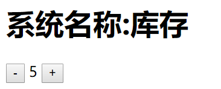

# Vue介绍 

## vue

vue是前端开发框架，用于降低UI复杂度

完整学习vue：html+css、JavaScript、css3、HTML5、第三方库、网络通信、ES6+、webpack、模块化、包管理器、css预编译期

## vue特点


* 渐进式

* 响应式

* 组件化

  

## vue开发工具及常用插件

开发工具：[Visual Studio Code](https://code.visualstudio.com/)

常用插件

Auto Rename Tag：自动改变结束标签

Live Server：自动搭建本地服务器

Prettier-Code formatter：代码美化

Vetur：vue组件格式化支持

vscode-icons：美化文件图标

## ES6知识补充

* 速写属性

* 速写方法

  ```js
  var person={name:"zhangsan",age:18}
  //传统字符串拼接
  var str1="name is "+person.name+"\n age is "+person.age;
  //es6字符串拼接
  var str2=`name is ${person.name}
   age is ${person.age}`
  ```

* 箭头函数

## 注入

配置对象中的部分内容会被提取到vue实例中：data、methods

该过程称为注入

注入的目的两个：

（1）完成数据响应式

vue2.0通过Object.defineProperty方法完成了数据响应式，vue3.0通过Class Proxy完成的数据响应式

（2）绑定this

## vue实例

通过new Vue({...})创建头像

配置对象中的部分内容会被提取到vue实例中：

* data

* props

* methods

* computed

## 模板内容

* 静态内容

* 差值 {{JS表达式}} ，mustache语法

* 指令

  v-html:绑定元素的innerHTML

  v-bind：属性名：绑定属性

  v-on:事件名：绑定事件

  v-if 判断是否需要渲染

  v-show 判断袁术是否需要显示

  v-for 循环生成元素

  v-bind:key 重新渲染时元素的对比，通常与v-for配合使用

  v-model 双向绑定

## 配置对象

1 data：对象

2 template：字符串，配置模板

3 el：配置挂载区域

4 methods 配置方法

5 computed 配置计算属性

计算属性和方法的区别：

1计算属性使用时，是当成属性使用，而方法是需要调用的

2 计算属性会进行缓存，如果依赖不变，直接使用缓存结果，不会重新计算

3 计算属性可以当成属性赋值


箭头函数

任何可以书写匿名函数的位置均可以书写箭头函数

箭头函数将会绑定this为函数书写位置的this值

模块化

没有模块化的世界：全局变量污染、难以管理的依赖

常见的模块化标准：commonjs、ES6 Module、AMD、CMD、UMD

## 组件概念

常见模块化标准：ES6 Module、 CommonJS

将一个页面中区域功能细分，而一个区域成为以个组件，每个组件包含：

* 功能（JS代码）

* 内容（模板代码）

* 样式（CSS代码）


### 组件开发

组件是根据一个普通的配置对象创建的，所以要开发一个组件，只需要写一个配置对象即可：

```js
var myComp={
    data(){
        return {
            
        }
    },
    computed:{
        
    },
    methods:{
        
    },
    template:
}
```

## 脚手框架

淘宝源：npm config set registry http://registry.npm.taobao.org

安装vue-cli：npm install -g @vue/cli

vue-cli的使用：

在终端中进入某个目录，通过

```
vue create 工程名
```

创建工程

安装依赖：

```
cd 工程名
npm i
```

vue-cli继承前端技术：

webpack

babel 兼容性

eslint

http-proxy-middleware

typescript

css pre-prosessor

css module..

## 插件安装

live server

vetur

可以快速生成 <template><script><css>

### vue-router

构建单页应用程序

路由模式：

* hash：路径来自于地址栏中#后面的值
* history：路径来自于真实的地址，就浏览器依然不兼容
* abstract：路径来自于内存

main.js:
```js
import Vue from 'vue'
import App from './App.vue'
import router from './routers'

new Vue({
  render: h => h(App),
  router:router
}).$mount('#app')
```

App.vue:

```xml
<template>
  <div id="app">
    <HelloWorld msg="Welcome to Your Vue.js App"/>
    <div class="container">
      <router-view></router-view>
    </div>
  </div>
</template>
<script>
import HelloWorld from './components/HelloWorld.vue'

export default {
  name: 'App',
  components: {
    HelloWorld
  }
}
</script>
```

routers/index.js:

```js
import Vue from "vue";
import VueRouter from "vue-router";
import config from "./config"
Vue.use(VueRouter);
var router=new VueRouter(config);
export default router;
```

config.js:

```js
export default {
  mode: "history",
  routes: [
    {
      path: "/",
      name: "Home",
      component: () => import("@/views/Home"),
    },
    {
      path: "/login",
      name: "Login",
      component: () => import("@/views/Login"),
    },
  ],
};
```

```xml
<li><router-link to="/" rel="noopener">babel</router-link></li>
      <li><router-link :to="{name:'Login',params:{id:'234234'}}"  rel="noopener">eslint</router-link></li>
```

```js
router.beforeEach(function(to,from,next){
    //to 目的 from 来源 
    next({name:'Login'});
})
```


### vue+vue router +vuex

vue:UI复杂度的问题，使用响应式，组件化开发

vue router：根据地址切换显示不同的组件

vuex:处理共享数据

谷歌浏览器插件vue devtools

**vuex核心概念**

数据的改动必须要提交一个mutation，在vuex中，提交mutation是数据变化的唯一原因，并且在mutation中不能出现副作用操作

main.js:

```js
import Vue from 'vue'
import App from './App.vue'
import router from './routers'
import store from './store'

new Vue({
  render: h => h(App),
  router:router,
  store
}).$mount('#app')
```

store/index.js

```js
import Vue from "vue";
import vuex from "vuex";
import channels from "./channels";
import loginUser from "./loginUser";
Vue.use(vuex);
var store = new vuex.Store({
  modules: {
    channels,
    loginUser,
  },
});
export default store;
```

store/channels.js

```js
export default {
  namespaced:true,
  state: {
    data: [],
    isLoading: false,
  },
  mutations:{
      //state:原来的状态 payload：负荷(欲改变值)
      setIsLoading(state,payload){
          state.isLoading=payload;
      },
      setData(state,payload){
          state.data=payload;
      }
  },
  actions:{
      async fetchDatas(context){
        context.commit("setIsLoading",true);
        //加载数据
        context.commit("setIsLoading",false);
      }
  }
};
```

```js
this.$store.dispatch("channels/fetchDatas");//通知获取数据
```

```json
watch:{//监听数据变化
    data:{
        immediate:true,//立即执行
        handler(){
            if(this.data.length>0){
               //执行相关操作
            }
        }
    }
}
```

# Vue 开发

## 手动搭建

1 新建helloworld文件夹，并将vue.min.js放置其中，并创建index.html网页文件

helloworld
​  |
  |--vue.min.js
  |--index.html

2 index.html编写

```html
<div id="app">
        <!--界面模板-->
        <h1>系统名称:{{title}}</h1>
        <div>
            <button @click="changeNum(product,product.num-1)">-</button>
            <span>{{product.num}}</span>
            <button @click="product.num++">+</button>
        </div>
    </div>
    <script src="vue.min.js"></script>
    <script>
        var vue = new Vue({//配置
            el: "#app",//css选择器
            data: {//和界面相关的数据
                title: "产品",
                product: {
                    num: 10//数量
                }
            },
            methods: {
                changeNum(product, newValue) {//当商品数量减少时判断是否小于0
                    if (newValue < 0) {
                        newValue = 0;
                    }
                    product.num = newValue;
                }
            }
        })
    </script>
```

3 启动查看

点击+-按钮可以动态修改数量


4 调试修改

进入调试模式手动修改值

```
vue.product.num=5
```



## 手动搭建2

index.html:

```html
<!DOCTYPE html>
<html lang="en">
<head>
    <meta charset="UTF-8">
    <meta name="viewport" content="width=device-width, initial-scale=1.0">
    <title>Document</title>
</head>
<body>
    <div id="app"></div>
    <script src="src/lib/vue.js"></script>
    <script src="src/main.js" type="module"></script>
</body>
</html>
```

main.js

```
import App from "./App.js"

new Vue({
    el:"#app",
    render(createElement){
        return createElement(App);
    }
});
```

App.js:

```
import UserInfo from "./components/UserInfo.js";

var template = `
<div id="app">
<UserInfo v-for="item in users" :name="item.name" :age="item.age"/>
</div>
`;

export default {
  template,
  components: {
    UserInfo,
  },
  data() {
    return {
      users: [
        { name: "张三", age: 18 },
        { name: "李四", age: 19 },
      ],
    };
  },
};
```

/components/UserInfo.js

```
var template=`
<div>
    <p>姓名：{{name}}</p>
    <p>年龄：{{age}}</p>
</div>
`
export default {
    props:["name","age"],
    template
}
```

## 脚手框架

手动：

```
安装依赖 npm install或者cnpm install
初始化：npm init -f 或者 cnpm init -f
安装组件，并查看安装后的内容

npm i vue-router --save-dev
npm i vue-router -D
```

 # 注意：

Babel 是一个 JavaScript 编译器 

eslint 提供一个插件化的javascript代码检测工具。 

babel-core 的作用是把 js 代码分析成 ast ，方便各个插件分析语法进行相应的处理。有些新语法在低版本 js 中是不存在的，如箭头函数，rest 参数，函数默认值等，这种语言层面的不兼容只能通过将代码转为 ast，分析其语法后再转为低版本 js。 

*babel-eslint*允许您使用奇妙的eslint来链接所有有效的babel代码 

VScode eslint-plugin-vue 自动修复eslint报错

clean-webpack-plugin是来清除文件的。一般这个插件是配合 webpack -p 这条命令来使用，就是说在为生产环境编译文件的时候，先把 build或dist (就是放生产环境用的文件) 目录里的文件先清除干净，再生成新的。

compression-webpack-plugin  压缩插件

qiniu-webpack-plugin 把Webpack 打包出来的 assets 传到 七牛云存储上 

webpack-bundle-analyzer 意识到你的文件打包压缩后中真正的内容

“webpack-cli用于在命令行中运行webpack,cli即命令行接口 

moment 格式化时间

zip-webpack-plugin zip压缩
