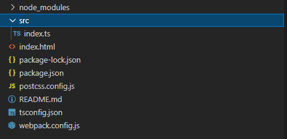

# 1 项目初始化

[官网文档配置文档说明](https://webpack.docschina.org/configuration/)

```
# 创建目录进入目录
mkdir webpack-demo && cd webpack-demo
# 项目初始化
npx webpack-cli init
# 接下来根据提示选择自己需要的插件包
...
```

选择TypeScript而不是es6理由——[官网说明](https://webpack.docschina.org/guides/typescript/#root)：TypeScript 是 JavaScript 的超集，为其增加了类型系统，可以编译为普通 JavaScript 代码。

选择PostCSS理由——[Github文档说明](https://github.com/postcss/postcss/blob/main/docs/README-cn.md),功能很强大

**初始化完成,下面是我选择的依赖包**

```
+ sass-loader@12.4.0
+ html-webpack-plugin@5.5.0
+ webpack-dev-server@4.7.3
+ css-loader@6.5.1
+ sass@1.48.0
+ webpack-cli@4.9.1
+ style-loader@3.3.1
+ ts-loader@9.2.6
+ typescript@4.5.4
+ postcss@8.4.5
+ prettier@2.5.1
+ autoprefixer@10.4.2
+ webpack@5.66.0
+ postcss-loader@6.2.1
added 336 packages from 263 contributors, removed 281 packages, updated 3 packages and moved 19 packages in 44.959s
```

**初始化后项目结构图**



**初始化后package.js**
```
{
  "version": "1.0.0",
  "description": "My webpack project",
  "name": "my-webpack-project",
  "scripts": {
    "build": "webpack --mode=production --node-env=production",
    "build:dev": "webpack --mode=development",
    "build:prod": "webpack --mode=production --node-env=production",
    "watch": "webpack --watch",
    "serve": "webpack serve"
  },
  "devDependencies": {
    "autoprefixer": "^10.4.2",
    "css-loader": "^6.5.1",
    "html-webpack-plugin": "^5.5.0",
    "postcss": "^8.4.5",
    "postcss-loader": "^6.2.1",
    "prettier": "^2.5.1",
    "sass": "^1.48.0",
    "sass-loader": "^12.4.0",
    "style-loader": "^3.3.1",
    "ts-loader": "^9.2.6",
    "typescript": "^4.5.4",
    "webpack": "^5.66.0",
    "webpack-cli": "^4.9.1",
    "webpack-dev-server": "^4.7.3"
  }
}
```

**初始化自动得到配置文件**
[官方配置文档](https://webpack.docschina.org/configuration/)

```json

// Generated using webpack-cli https://github.com/webpack/webpack-cli
//path模块 路径处理工具
const path = require("path");
//简化了HTML创建 该插件将为你生成一个 HTML5 文件， 在 body 中使用 script 标签引入所有 webpack 生成的 bundle。
const HtmlWebpackPlugin = require("html-webpack-plugin");

//process.env.NODE_ENV 对应上面--node-env=production
const isProduction = process.env.NODE_ENV == "production";

const stylesHandler = "style-loader";

const config = {
  entry: "./src/index.ts",//入口文件
  output: {//编译后输出目录 及通常npm run build后
    path: path.resolve(__dirname, "dist"),
  },
  devServer: {//web服务配置
    open: true,
    host: "localhost",
  },
  plugins: [//插件配置
    new HtmlWebpackPlugin({
      template: "index.html",
    }),

    // Add your plugins here
    // Learn more about plugins from https://webpack.js.org/configuration/plugins/
  ],
  module: {// 模块配置相关
    rules: [// 模块规则（配置 loader、解析器等选项）
      {
        test: /\.(ts|tsx)$/i,
        loader: "ts-loader",
        exclude: ["/node_modules/"],
      },
      {
        test: /\.s[ac]ss$/i,
        use: [stylesHandler, "css-loader", "postcss-loader", "sass-loader"],
      },
      {
        test: /\.css$/i,
        use: [stylesHandler, "css-loader", "postcss-loader"],
      },
      {
        test: /\.(eot|svg|ttf|woff|woff2|png|jpg|gif)$/i,
        type: "asset",
      },

      // Add your rules for custom modules here
      // Learn more about loaders from https://webpack.js.org/loaders/
    ],
  },
  resolve: {
        extensions: ['.ts', '.vue', '.json', ".js", '.png', ".sass",".css"],
        alias: {
                '@': resolve('src')
        }
    },
};

module.exports = () => {
  if (isProduction) {
    config.mode = "production";
  } else {
    config.mode = "development";
  }
  return config;
};

```

# 2 安装js工具库

Lodash 是一个一致性、模块化、高性能的 JavaScript 实用工具库 查看各个构件版本的区别并选择一个适合你的版本。功能强大，兼容性强。
[官网说明](https://www.lodashjs.com/)

```
npm install --save lodash
```
# 3 对配置文件进行开发配置

webpack.config.js

##### output 配置

```
 output: {
     filename: '[name].bundle.js',//name对应多入口
     path: path.resolve(__dirname, 'dist'),
    clean: true,//每次构建时清空之前的dist输出目录
   }
```
##### 设置title

```
plugins: [
     new HtmlWebpackPlugin({
       title: '网页显示title',//filename title不能同时配置
     }),
   ]
```
##### 开发环境
```
const config = {
     mode: 'development',
     ...
}
```
##### source map 定位错误

```
const config = {
     devtool: 'inline-source-map',
     ...
}
```

##### 配置引入文件@
```
resolve: {
        extensions: ['.ts', '.vue', '.json', ".js", '.png', ".sass",".css"],
        alias: {
            '@': path.join(__dirname, '.', 'src')//'.'根据当前配置webpack.config.js而定
        }
    }
```
##### 将 CSS 提取到单独的文件中，为每个包含 CSS 的 JS 文件创建一个 CSS 文件

```
# 安装后的版本总是配置不成功，这里我是把它的版本号改为2.4.5
npm install --save-dev mini-css-extract-plugin
```
配置
```
const MiniCssExtractPlugin = require("mini-css-extract-plugin");

module.exports = {
  plugins: [new MiniCssExtractPlugin()],
  module: {
    rules: [
      {
        test: /\.css$/,
        use: [MiniCssExtractPlugin.loader, "css-loader"],
      },
    ],
  },
}
```
##### 优化和压缩 CSS。
[官网文档](https://webpack.docschina.org/plugins/css-minimizer-webpack-plugin/#root
```
npm install css-minimizer-webpack-plugin --save-dev
```
```
const MiniCssExtractPlugin = require("mini-css-extract-plugin");
const CssMinimizerPlugin = require("css-minimizer-webpack-plugin");

module.exports = {
  module: {
    rules: [
      {
        test: /.s?css$/,
        use: [MiniCssExtractPlugin.loader, "css-loader", "sass-loader"],
      },
    ],
  },
  optimization: {
    minimizer: [
      // 在 webpack@5 中，你可以使用 `...` 语法来扩展现有的 minimizer（即 `terser-webpack-plugin`），将下一行取消注释
      // `...`,
      new CssMinimizerPlugin(),
    ],
  },
  plugins: [new MiniCssExtractPlugin()],
};
```
##### 生产环境下默认使用 TerserPlugin ，并且也是代码压缩方面比较好的选择
安装
```
npm install --save-dev closure-webpack-plugin google-closure-compiler
```
配置
```
const ClosurePlugin = require('closure-webpack-plugin');

module.exports = {
  optimization: {
    minimizer: [
      new ClosurePlugin({mode: 'STANDARD'}, {
        // compiler flags here
        //
        // for debugging help, try these:
        //
        // formatting: 'PRETTY_PRINT'
        // debug: true,
        // renaming: false
      })
    ]
  }
};
```

##### 4 安装vue开发需要包

vue 相关 qs请求转化 加密解密 请求相关

```
npm install vue vuex vue-router qs crypto-js axios
```
开发环境依赖包
```
    npm install  vue-loader vue-template-compiler --save-dev
```
##### 5 配置vue环境
(1) webpack.config.js
```
// Generated using webpack-cli https://github.com/webpack/webpack-cli
const HtmlWebpackPlugin = require("html-webpack-plugin");
const { VueLoaderPlugin } = require('vue-loader');
...
const config = {
...
    resolve: {//加入.vue解析
        extensions: ['.ts', '.vue', '.json', ".js", '.png', ".sass", ".css"],
        alias: {
            '@': path.join(__dirname, '.', 'src')
        }
    },
    plugins: [
    ...
        new HtmlWebpackPlugin({
            filename: "index.html",
            template: "index.html" //指定模板文件加入 <div id="app"></div>
        }),
        new VueLoaderPlugin(),//vue加载插件
    ],
    module: {
    ...
        rules: [
            {//vue规则
                exclude: /node_modules/,
                test: /\.vue$/,
                loader: 'vue-loader',
            },
        ],
    },
 
};

```
(2) index.html
```
<!DOCTYPE html>
<html>
    <head>
        <meta charset="utf-8" />
        <title>Webpack App</title>
    </head>
    <body>
        <h1>Hello world!</h1>
        <h2>Tip: Check your console</h2>
        <div id="app"></div>
    </body>
    
</html>
```
(3) 将入口文件index.js内容修改,这里如果习惯之前的vue构建项目可以修改为main.js 把入口文件名称修改下就行
```
import Vue from 'vue'
import App from './App.vue'
Vue.directive('title', {
    inserted: function (el, binding) {
        document.title = el.dataset.title
    }
})

Vue.config.productionTip = false

new Vue({
    el: '#app',
    render: h => h(App)
})
```
(4) App.vue
```
<template>
  <div id="app">
      <hello-world/>
  </div>
</template>

<script>
import HelloWorld from '@/components/HelloWorld'
export default {
  name: 'App',
  components:{
    HelloWorld
  }
}
</script>

<style lang='scss'>
#app {
    height: 100%;
    > div {
        height: 100%;
    }
}
</style>
```
(5) HelloWorld.vue
```
<template>
    <p>helloworld</p>
</template>
<script lang="ts">

export default {
    name:"HelloWorld"
}
</script>
<style scoped>

</style>
```
##### 6 快速开发

```
npx webpack-cli init
npm install --save lodash vue vuex vue-router qs crypto-js axios
npm install --save-dev mini-css-extract-plugin  vue-loader vue-template-compiler css-minimizer-webpack-plugin
#svg处理插件
npm install svg-sprite-loader -D
# 图片处理
npm install url-loader image-webpack-loader --save-dev
```

安装依赖
读取svg信息，去除svg中的无用标签，精简结构

```
npm install svgo svgo-loader --save-dev
```

SVG Sprite插件

```
npm install svg-sprite-loader --save-dev
```

##### 7 开发问题

vue webpack之vue-router 使用history模式报错Cannot GET /xxx

```
在webpack.config.js中的devServer内添加属性historyApiFallback
historyApiFallback: {
    index: '/index.html'//该路径为打包后的首页路径及dist目录下的index.html页面
  },

```

8 按需加载

ts-loader label-loader

```
https://juejin.cn/post/6844904052094926855
```


····