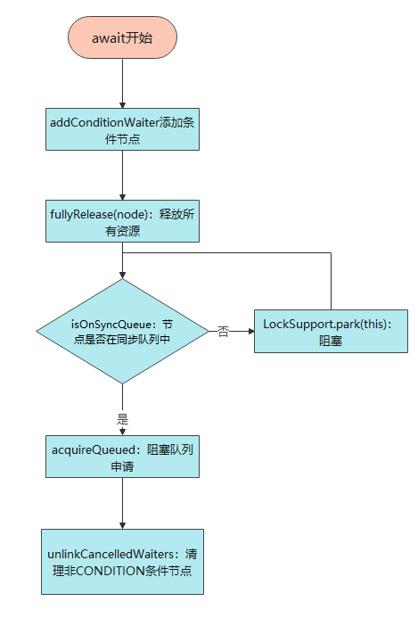

##  一、介绍

Object的监视器方法

在使用synchronized获取到锁的前提下，通过Object的wait、notify、notifyAll可以在多线程场景下做到并发控制

```java
public void testWaitNotify() throws InterruptedException {
        Object object1 = new Object();
        Thread thread1 = new Thread(() -> {
            while (true) {
                    try {
                    //这里之所以会停留500ms，方便等thread2进入wait
                        Thread.sleep(500);
                    } catch (InterruptedException e) {
                        throw new RuntimeException(e);
                    }
                    synchronized (object1) {
                        System.out.println("线程1打印信息");
                        object1.notify();
                    }
            }
        });
        Thread thread2 = new Thread(() -> {
            while (true) {
                synchronized (object1){
                    try {
                        object1.wait();
                        System.out.println("线程2打印信息");
                    } catch (InterruptedException e) {
                        throw new RuntimeException(e);
                    }
                }
            }
        });

        thread1.start();
        thread2.start();
    }
```

Condition的使用

相对于Object的监视器方法，在Lock获取到锁的前提下，可以用await、signal、signalAll可以替代Object的那套监视器方法，并且更加灵活更加好控制。

因为方法到共享状态信息发生在不同的线程中，需要对其进行保护，所以需要锁来进行保护。

基本使用方法：

```java
public void testAwaitSignal() throws InterruptedException {
        ReentrantLock reentrantLock=new ReentrantLock();
        Condition condition= reentrantLock.newCondition();
        Thread thread1 = new Thread(() -> {
            while (true) {
                try {
                    Thread.sleep(1500); 
                    reentrantLock.lock();
                    System.out.println("线程1打印信息");
                    condition.signal();
                } catch (InterruptedException e) {
                    throw new RuntimeException(e);
                }finally {
                    reentrantLock.unlock();
                }
            }
        });
        Thread thread2 = new Thread(() -> {
            while (true) {
                try {
                    reentrantLock.lock();
                    condition.await();//在调用signal()前必须先获得锁
                    System.out.println("线程2打印信息");
                } catch (InterruptedException e) {
                    throw new RuntimeException(e);
                }finally {
                    condition.signal();
                }
            }
        });

        thread1.start();
        thread2.start();
    }
```

ConditionObject数据结构

```java
public class ConditionObject implements Condition, java.io.Serializable {
        private transient Node firstWaiter;
        /**
         * 最后一个等待节点
         */
        private transient Node lastWaiter;
}
```

## 二、await源码

简图：部分逻辑（不包含打断之类的判断）



```java
public final void await() throws InterruptedException {
    if (Thread.interrupted())
        throw new InterruptedException();
    Node node = addConditionWaiter();
    int savedState = fullyRelease(node);
    int interruptMode = 0;
    while (!isOnSyncQueue(node)) {
        LockSupport.park(this);
        if ((interruptMode = checkInterruptWhileWaiting(node)) != 0)
            break;
    }
    if (acquireQueued(node, savedState) && interruptMode != THROW_IE)
        interruptMode = REINTERRUPT;
    if (node.nextWaiter != null) // clean up if cancelled
        unlinkCancelledWaiters();
    if (interruptMode != 0)
        reportInterruptAfterWait(interruptMode);
}
/**
 * 向等待队列中添加一个新的node。
 */
private Node addConditionWaiter() {
    Node t = lastWaiter;
    // If lastWaiter is cancelled, clean out.
    if (t != null && t.waitStatus != Node.CONDITION) {
        unlinkCancelledWaiters();
        t = lastWaiter;
    }
    Node node = new Node(Thread.currentThread(), Node.CONDITION);
    if (t == null)
        firstWaiter = node;
    else
        t.nextWaiter = node;
    lastWaiter = node;
    return node;
}
/**
 * 从条件队列中取消链接已取消的侍者节点。
 */
private void unlinkCancelledWaiters() {
    Node t = firstWaiter;
    //状态condition的第一个节点
    Node trail = null;
    while (t != null) {
        Node next = t.nextWaiter;
        if (t.waitStatus != Node.CONDITION) {
            //已经加入队列的节点做gc处理
            t.nextWaiter = null;
            if (trail == null)
                firstWaiter = next;
            else
                trail.nextWaiter = next;
            if (next == null)
                //signal执行后，lastWaiter到最后可能为空
                lastWaiter = trail;
        } else
            trail = t;
        t = next;
    }
}
    /**
     * 调用带有当前状态值的release;返回保存的状态。
     * 取消节点并在失败时抛出异常。
     *
     * @param node the condition node for this wait
     * @return previous sync state
     */
    final int fullyRelease(Node node) {
        boolean failed = true;
        try {
            int savedState = getState();
            if (release(savedState)) {
                failed = false;
                return savedState;
            } else {
                throw new IllegalMonitorStateException();
            }
        } finally {
            if (failed)
                node.waitStatus = Node.CANCELLED;
        }
    }
/**
     * 是否在同步队列中
     *
     * @param node the node
     * @return true if is reacquiring
     */
final boolean isOnSyncQueue(Node node) {
    //判断节点的状态，如果状态是CONDITION，说明节点肯定不在同步队列中，同时哪怕同步队列是刚刚初始化的，也会有一个冗余的头节点存在，所以节点的前驱节点如果为null，那么节点也肯定不在同步队列中，返回fasle
    if (node.waitStatus == Node.CONDITION || node.prev == null)
        return false;
    //节点的后继节点不为null，说明节点肯定在队列中，返回true，这里很重要的一点要明白，prev和next都是针对同步队列的节点
    if (node.next != null) // If has successor, it must be on queue
        return true;
    return findNodeFromTail(node);
}
private int checkInterruptWhileWaiting(Node node) {
    return Thread.interrupted() ?
        (transferAfterCancelledWait(node) ? THROW_IE : REINTERRUPT) :
    0;
}
/**
     * 通过tail节点反向查找node是否在同步队列中
     */
private boolean findNodeFromTail(Node node) {
    //取得同步队列的队尾元素
    Node t = tail;
    //无限循环，从队尾元素一直往前找，找到相等的节点就说明节点在队列中，node为null了，说明前面已经没有节点可以找了，那就返回false
    for (; ; ) {
        if (t == node)
            return true;
        if (t == null)
            return false;
        t = t.prev;
    }
}
/**
     * 如果需要，在取消等待后将节点转移到同步队列。
     * 如果线程在发出信号前被取消，则返回true。
     */
final boolean transferAfterCancelledWait(Node node) {
    //将node的状态设置为0，即准备加入阻塞队列的准备状态
    if (compareAndSetWaitStatus(node, Node.CONDITION, 0)) {
        enq(node);
        return true;
    }
    //自旋保证node在同步队列
    while (!isOnSyncQueue(node))
        Thread.yield();
    return false;
}

/**
     * 在队列中的节点通过此方法获取锁，对中断不敏感。
     */
final boolean acquireQueued(final Node node, int arg) {
    boolean failed = true;
    try {
        boolean interrupted = false;
        for (; ; ) {
            final Node p = node.predecessor();
            /*
                 * 检测当前节点前驱是否head，这是试获取锁的资格。
                 * 如果是的话，则调用tryAcquire尝试获取锁,
                 * 成功，则将head置为当前节点。
                 */
            if (p == head && tryAcquire(arg)) {
                setHead(node);
                p.next = null; // help GC
                failed = false;
                return interrupted;
            }
            /*
                 * 如果未成功获取锁则根据前驱节点判断是否要阻塞。
                 * 如果阻塞过程中被中断，则置interrupted标志位为true。
                 * shouldParkAfterFailedAcquire方法在前驱状态不为SIGNAL的情况下都会循环重试获取锁。
                 */
            if (shouldParkAfterFailedAcquire(p, node) &&
                parkAndCheckInterrupt())
                interrupted = true;
        }
    } finally {
        if (failed)
            cancelAcquire(node);
    }
}
```

## 三、signal

```java
/**
         * 通知await
         */
public final void signal() {
    if (!isHeldExclusively())
        throw new IllegalMonitorStateException();
    Node first = firstWaiter;
    if (first != null)
        doSignal(first);
}
/**
         * 删除并传输节点，直到命中未取消的一个或空。
         */
private void doSignal(Node first) {
    do {
        if ((firstWaiter = first.nextWaiter) == null)
            lastWaiter = null;
        first.nextWaiter = null;
    } while (!transferForSignal(first) &&
             (first = firstWaiter) != null);
}
/**
     * 将节点从条件队列转移到同步队列。
     */
final boolean transferForSignal(Node node) {
    //如果不能更改waitStatus，则表示该节点已被取消。
    if (!compareAndSetWaitStatus(node, Node.CONDITION, 0))
        return false;
    //加入阻塞队列
    Node p = enq(node);
    int ws = p.waitStatus;
    //设置节点的状态为SIGNAL，通知后续节点
    if (ws > 0 || !compareAndSetWaitStatus(p, ws, Node.SIGNAL))
        //唤醒
        LockSupport.unpark(node.thread);
    return true;
}
```

## 四、signalAll

```java
        /**
         * 通知所有
         */
        public final void signalAll() {
            if (!isHeldExclusively())
                throw new IllegalMonitorStateException();
            Node first = firstWaiter;
            if (first != null)
                doSignalAll(first);
        }
                /**
         * 移除所有条件节点
         *
         * @param first (non-null) the first node on condition queue
         */
        private void doSignalAll(Node first) {
            lastWaiter = firstWaiter = null;
            do {
                Node next = first.nextWaiter;
                first.nextWaiter = null;
                transferForSignal(first);
                first = next;
            } while (first != null);
        }
```

