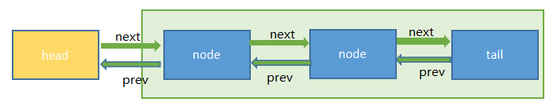
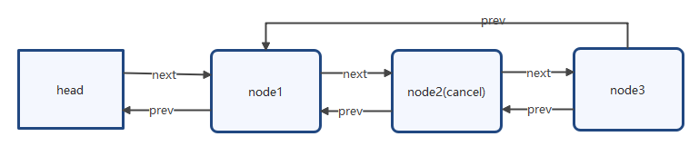
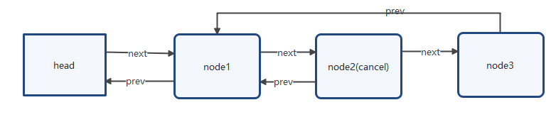

# 一、介绍

提供实现依赖先进先出(FIFO)等待队列的阻塞锁和相关同步器(信号量、事件等)的框架。AbstractQueuedSynchronizer被设计为大多数类型的同步器的使用基础。aqs是实现 ReentrantLock、CountDownLatch、Semaphore、FutureTask 等类的基础。对于互联网运用高并发的童鞋来说，redisson分布式锁应该都用过，这里面也用aqs来做分布式的一个线程同步处理，只是这里的通知已经不是通过LockSupport.unpack()，而是采用的redis的订阅/通知来做的。

aqs的源码虽然多，但是综合下来主要分为独占锁、共享锁、以及通知等待，后面我将一一做源码分析。

aqs主要内容：

- 独占锁（公平锁、非公平锁）
- 共享锁
- 通知等待

# 二、源码分析

## aqs节点结构

```
static final class Node {
        /**
         * 等待状态
         * SIGNAL:     {@link Node#SIGNAL}
         * CANCELLED:  {@link Node#CANCELLED}
         * CONDITION:  {@link Node#CONDITION}
         * PROPAGATE:  {@link Node#PROPAGATE}
         * 0:          初始状态，在队列中等待
         */
        volatile int waitStatus;

        /**
         * 指向前一个node
         */
        volatile Node prev;

        /**
         * 指向后一个node
         */
        volatile Node next;

        /**
         * 当前node所处的线程
         */
        volatile Thread thread;

        /**
         * 连接到下一个节点等待条件
         */
        Node nextWaiter;
    }
```

组赛节点不包括head节点，因为head节点是当前正在执行的节点或者空姐点。



## 申请独占锁

```
    /**
     * 获取独占锁，对中断不敏感。
     * 首先尝试获取一次锁，如果成功，则返回；
     * 否则会把当前线程包装成Node插入到队列中，在队列中会检测是否为head的直接后继，并尝试获取锁,
     * 如果获取失败，则会通过LockSupport阻塞当前线程，直至被释放锁的线程唤醒或者被中断，随后再次尝试获取锁，如此反复。
     */
    public final void acquire(int arg) {
        /*
        * tryAcquire(arg):申请arg个单位资源
        * acquireQueued(addWaiter(Node.EXCLUSIVE), arg)：如果申请资源失败，将会通过addWaiter添加一个独占类型的节点加入acquireQueued执行队列         * 中
        */
        if (!tryAcquire(arg) &&
                acquireQueued(addWaiter(Node.EXCLUSIVE), arg))
            selfInterrupt();
    }
     /**
     * 在队列中新增一个节点。 @param mode Node.EXCLUSIVE 独占锁, Node.SHARED 共享锁
     */
    private Node addWaiter(Node mode) {
        //创建节点，并且指定当前节点的当前线程和节点类型
        Node node = new Node(Thread.currentThread(), mode);
        Node pred = tail;
        if (pred != null) {
            node.prev = pred;
            //通过CAS在队尾插入当前节点
            if (compareAndSetTail(pred, node)) {
                pred.next = node;
                return node;
            }
        }
        //初始情况或者在快速尝试失败后插入节点
        enq(node);
        return node;
    }
    /**
    * 设置尾节点
    */
    private final boolean compareAndSetTail(Node expect, Node update) {
        return unsafe.compareAndSwapObject(this, tailOffset, expect, update);
    }
    /**
     * 通过循环+CAS在队列中成功插入一个节点后返回。
     */
    private Node enq(final Node node) {
        for (; ; ) {
            Node t = tail;
            if (t == null) { // 初始化head和tail
                //这里也是cas操作，当头节点为空时，设置一个没有内容的Node节点
                if (compareAndSetHead(new Node()))
                    tail = head;
            } else {
                /*
                 * AQS的精妙就是体现在很多细节的代码，比如需要用CAS往队尾里增加一个元素
                 * 此处的else分支是先在CAS的if前设置node.prev = t，而不是在CAS成功之后再设置。
                 * 一方面是基于CAS的双向链表插入目前没有完美的解决方案，另一方面这样子做的好处是：
                 * 保证每时每刻tail.prev都不会是一个null值，否则如果node.prev = t
                 * 放在下面if的里面，会导致一个瞬间tail.prev = null，这样会使得队列不完整。
                 */
                node.prev = t;
                // CAS设置tail为node，成功后把老的tail也就是t连接到node。
                if (compareAndSetTail(t, node)) {
                    t.next = node;
                    return t;
                }
            }
        }
    }
    /**
     * 在队列中的节点通过此方法获取锁，对中断不敏感。
     */
    final boolean acquireQueued(final Node node, int arg) {
        boolean failed = true;
        try {
            boolean interrupted = false;
            for (; ; ) {
                // node的前置节点，即node.prev,如果prev为空则会报空指针，因为等待队列不可能prev节点为空，因为head不可能为空
                final Node p = node.predecessor();
                /*
                 * 检测当前节点前驱是否head，这是试获取锁的资格。
                 * 如果是的话，则调用tryAcquire尝试获取锁,
                 * 成功，则将head置为当前节点。
                 */
                if (p == head && tryAcquire(arg)) {
                    setHead(node);
                    p.next = null; // help GC
                    failed = false;
                    return interrupted;
                }
                /*
                 * 如果未成功获取锁则根据前驱节点判断是否要阻塞。
                 * 如果阻塞过程中被中断，则置interrupted标志位为true。
                 * shouldParkAfterFailedAcquire方法在前驱状态不为SIGNAL的情况下都会循环重试获取锁。
                 */
                if (shouldParkAfterFailedAcquire(p, node) &&
                        parkAndCheckInterrupt())
                    interrupted = true;
            }
        } finally {
            if (failed)
                cancelAcquire(node);
        }
    }
    /**
     * 该方法实现某个node取消获取锁。
     */
    private void cancelAcquire(Node node) {
        // Ignore if node doesn't exist
        if (node == null)
            return;

        node.thread = null;

        //  遍历并更新节点前驱，把node的prev指向前部第一个非取消节点。
        Node pred = node.prev;
        while (pred.waitStatus > 0)
            node.prev = pred = pred.prev;

        // 记录pred节点的后继为predNext，后续CAS会用到。
        Node predNext = pred.next;

        // 直接把当前节点的等待状态置为取消,后继节点即便也在cancel可以跨越node节点。
        node.waitStatus = Node.CANCELLED;

        /*
         * 如果CAS将tail从node置为pred节点了
         * 则剩下要做的事情就是尝试用CAS将pred节点的next更新为null以彻底切断pred和node的联系。
         * 这样一来就断开了pred与pred的所有后继节点，这些节点由于变得不可达，最终会被回收掉。
         * 由于node没有后继节点，所以这种情况到这里整个cancel就算是处理完毕了。
         *
         * 这里的CAS更新pred的next即使失败了也没关系，说明有其它新入队线程或者其它取消线程更新掉了。
         */
        if (node == tail && compareAndSetTail(node, pred)) {
            compareAndSetNext(pred, predNext, null);
        } else {
            // 如果node还有后继节点，这种情况要做的事情是把pred和后继非取消节点拼起来。
            int ws;
            if (pred != head &&
                    ((ws = pred.waitStatus) == Node.SIGNAL ||
                            (ws <= 0 && compareAndSetWaitStatus(pred, ws, Node.SIGNAL))) &&
                    pred.thread != null) {
                Node next = node.next;
                /*
                 * 如果node的后继节点next非取消状态的话，则用CAS尝试把pred的后继置为node的后继节点
                 * 这里if条件为false或者CAS失败都没关系，这说明可能有多个线程在取消，总归会有一个能成功的。
                 */
                if (next != null && next.waitStatus <= 0)
                    compareAndSetNext(pred, predNext, next);
            } else {
                /*
                 * 这时说明pred == head或者pred状态取消或者pred.thread == null
                 * 在这些情况下为了保证队列的活跃性，需要去唤醒一次后继线程。
                 * 举例来说pred == head完全有可能实际上目前已经没有线程持有锁了，
                 * 自然就不会有释放锁唤醒后继的动作。如果不唤醒后继，队列就挂掉了。
                 *
                 * 这种情况下看似由于没有更新pred的next的操作，队列中可能会留有一大把的取消节点。
                 * 实际上不要紧，因为后继线程唤醒之后会走一次试获取锁的过程，
                 * 失败的话会走到shouldParkAfterFailedAcquire的逻辑。
                 * 那里面的if中有处理前驱节点如果为取消则维护pred/next,踢掉这些取消节点的逻辑。
                 */
                unparkSuccessor(node);
            }
            /*
             * 取消节点的next之所以设置为自己本身而不是null,
             * 是为了方便AQS中Condition部分的isOnSyncQueue方法,
             * 判断一个原先属于条件队列的节点是否转移到了同步队列。
             *
             * 因为同步队列中会用到节点的next域，取消节点的next也有值的话，
             * 可以断言next域有值的节点一定在同步队列上。
             *
             * 在GC层面，和设置为null具有相同的效果。
             */
            node.next = node; // help GC
        }
    }
    /**
     * 根据前驱节点中的waitStatus来判断是否需要阻塞当前线程。
     */
    private static boolean shouldParkAfterFailedAcquire(Node pred, Node node) {
        int ws = pred.waitStatus;
        if (ws == Node.SIGNAL)
            //前驱节点设置为SIGNAL状态，在释放锁的时候会唤醒后继节点,所以后继节点（也就是当前节点）现在可以阻塞自己。
            return true;
        if (ws > 0) {
            //前驱节点状态为取消,向前遍历，更新当前节点的前驱为往前第一个非取消节点。 当前线程会之后会再次回到循环并尝试获取锁。
            do {
                node.prev = pred = pred.prev;
            } while (pred.waitStatus > 0);
        } else {
            pred.next = node;
            //等待状态为0或者PROPAGATE(-3)，设置前驱的等待状态为SIGNAL, 并且之后会回到循环再次重试获取锁。
            compareAndSetWaitStatus(pred, ws, Node.SIGNAL);
        }
        return false;
    }
```

shouldParkAfterFailedAcquire代码中的一段：当前node的前置节点pred的状态为取消时，向前找到未取消的节点为前置节点，

```java
do {
    node.prev = pred = pred.prev;
} while (pred.waitStatus > 0);
```

这样做的目的：取消的节点不会在获取锁得到线程执行权，也就不会再通知后置节点。

例如：当node3的前置节点pred(node2)状态为cancel时，向前查找未取消的节点，这里将会找到node1

过程图：



最终结果：



问题1：这里有个问题，如果当前节点向前查找未取消的节点为prev前置节点时，万一node1找到的那个prev节点已经执行过了怎么办？

这个下面解锁源码分析会提到，这里先简单说一下，如果node1的LockSupport.unpack先于node3.prev=node1，这里node3还是会执行，因为当node1.next的状态为取消时，会从tail向前查找，不管node3.prev是node1还是node2，最终都会找到node1，都会得出一个结论，node3是离node1最近的一个非取消节点

问题2：pred会为空吗？

不会，因为当第一次加入节点队列时，会设置一个new Node()节点为head，此时状态为0；而后面head的节点也不会为取消，因为head时当前正在执行的节点或者最后一个执行的节点，当然这里说的是未申请到资源加入队列的，aqs独占锁并不是所有的执行都会创建Node加入队列中等待执行，只要申请资源成功也可以获取线程资源。

## 释放独占锁

```
/**
     * 释放独占锁
     */
    public final boolean release(int arg) {
        if (tryRelease(arg)) {
            /*
             * 此时的head节点可能有3种情况:
             * 1. null (AQS的head延迟初始化+无竞争的情况)
             * 2. 当前线程在获取锁时new出来的节点通过setHead设置的
             * 3. 由于通过tryRelease已经完全释放掉了独占锁，有新的节点在acquireQueued中获取到了独占锁，并设置了head

             * 第三种情况可以再分为两种情况：
             * （一）时刻1:线程A通过acquireQueued，持锁成功，set了head
             *          时刻2:线程B通过tryAcquire试图获取独占锁失败失败，进入acquiredQueued
             *          时刻3:线程A通过tryRelease释放了独占锁
             *          时刻4:线程B通过acquireQueued中的tryAcquire获取到了独占锁并调用setHead
             *          时刻5:线程A读到了此时的head实际上是线程B对应的node
             * （二）时刻1:线程A通过tryAcquire直接持锁成功，head为null
             *          时刻2:线程B通过tryAcquire试图获取独占锁失败失败，入队过程中初始化了head，进入acquiredQueued
             *          时刻3:线程A通过tryRelease释放了独占锁，此时线程B还未开始tryAcquire
             *          时刻4:线程A读到了此时的head实际上是线程B初始化出来的傀儡head
             */
            Node h = head;
            // head节点状态不会是CANCELLED，所以这里h.waitStatus != 0相当于h.waitStatus < 0
            if (h != null && h.waitStatus != 0)
                // 唤醒后继线程
                unparkSuccessor(h);
            return true;
        }
        return false;
    }
    /**
     * 唤醒后继线程
     */
    private void unparkSuccessor(Node node) {
        //尝试将node的等待状态置为0,这样的话,后继争用线程可以有机会再尝试获取一次锁。
        int ws = node.waitStatus;
        if (ws < 0)
            compareAndSetWaitStatus(node, ws, 0);
        /*
         * 这里的逻辑就是如果node.next存在并且状态不为取消，则直接唤醒s即可
         * 否则需要从tail开始向前找到node之后最近的非取消节点。
         *
         * 这里为什么要从tail开始向前查找也是值得琢磨的:
         * 如果读到s == null，不代表node就为tail，参考addWaiter以及enq函数中的我的注释。
         * 不妨考虑到如下场景：
         * 1. node某时刻为tail
         * 2. 有新线程通过addWaiter中的if分支或者enq方法添加自己
         * 3. compareAndSetTail成功
         * 4. 此时这里的Node s = node.next读出来s == null，但事实上node已经不是tail，它有后继了!
         */
        Node s = node.next;
        if (s == null || s.waitStatus > 0) {
            s = null;
            for (Node t = tail; t != null && t != node; t = t.prev)
                if (t.waitStatus <= 0)
                    s = t;
        }
        if (s != null)
            LockSupport.unpark(s.thread);
    }
```

