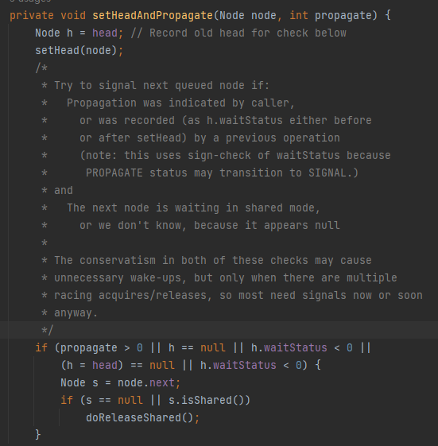
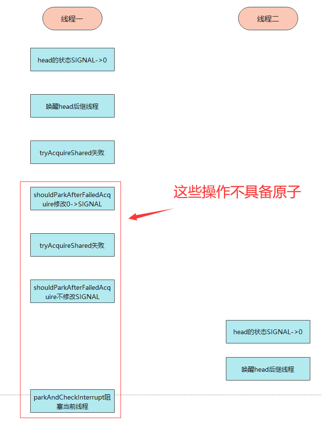

## 一、获取共享锁

```
    /**
     * 获取共享锁。会调用tryAcquireShared方法
     */
    public final void acquireShared(int arg) {
        if (tryAcquireShared(arg) < 0)
            doAcquireShared(arg);
    }
    /**
     * 共享锁获取
     */
    private void doAcquireShared(int arg) {
        final Node node = addWaiter(Node.SHARED);
        boolean failed = true;
        try {
            boolean interrupted = false;
            for (; ; ) {
                final Node p = node.predecessor();
                if (p == head) {
                    int r = tryAcquireShared(arg);
                    // 一旦共享获取成功，设置新的头结点，并且唤醒后继线程
                    if (r >= 0) {
                        setHeadAndPropagate(node, r);
                        p.next = null; // help GC
                        if (interrupted)
                            selfInterrupt();
                        failed = false;
                        return;
                    }
                }
                if (shouldParkAfterFailedAcquire(p, node) &&
                        parkAndCheckInterrupt())
                    interrupted = true;
            }
        } finally {
            if (failed)
                cancelAcquire(node);
        }
    }
   /**
     * 这个函数做的事情有两件:
     * 1. 在获取共享锁成功后，设置head节点
     * 2. 根据调用tryAcquireShared返回的状态以及节点本身的等待状态来判断是否要需要唤醒后继线程。
     */
    private void setHeadAndPropagate(Node node, int propagate) {
        Node h = head;  // 把当前的head封闭在方法栈上，用以下面的条件检查。
        setHead(node);
        /*
         * propagate是tryAcquireShared的返回值，这是决定是否传播唤醒的依据之一。
         * h.waitStatus为SIGNAL或者PROPAGATE时也根据node的下一个节点共享来决定是否传播唤醒，
         * 这里为什么不能只用propagate > 0来决定是否可以传播在本文下面的思考问题中有相关讲述。
         */
        if (propagate > 0 || h == null || h.waitStatus < 0 ||
                (h = head) == null || h.waitStatus < 0) {
            Node s = node.next;
            if (s == null || s.isShared())
                doReleaseShared();
        }
    }
    /**
     * 设置头node
     */
    private void setHead(Node node) {
        head = node;
        node.thread = null;
        node.prev = null;
    }
        /**
     * 根据前驱节点中的waitStatus来判断是否需要阻塞当前线程。
     */
    private static boolean shouldParkAfterFailedAcquire(Node pred, Node node) {
        int ws = pred.waitStatus;
        if (ws == Node.SIGNAL)
            //前驱节点设置为SIGNAL状态，在释放锁的时候会唤醒后继节点,所以后继节点（也就是当前节点）现在可以阻塞自己。
            return true;
        if (ws > 0) {
            //前驱节点状态为取消,向前遍历，更新当前节点的前驱为往前第一个非取消节点。 当前线程会之后会再次回到循环并尝试获取锁。
            do {
                node.prev = pred = pred.prev;
            } while (pred.waitStatus > 0);
        } else {
            pred.next = node;
            //等待状态为0或者PROPAGATE(-3)，设置前驱的等待状态为SIGNAL, 并且之后会回到循环再次重试获取锁。
            compareAndSetWaitStatus(pred, ws, Node.SIGNAL);
        }
        return false;
    }
   /**
     * 在队列中新增一个节点。 @param mode Node.EXCLUSIVE 独占锁, Node.SHARED 共享锁
     */
    private Node addWaiter(Node mode) {
        Node node = new Node(Thread.currentThread(), mode);
        Node pred = tail;
        if (pred != null) {
            node.prev = pred;
            //通过CAS在队尾插入当前节点
            if (compareAndSetTail(pred, node)) {
                pred.next = node;
                return node;
            }
        }
        //初始情况或者在快速尝试失败后插入节点
        enq(node);
        return node;
    }
        /**
     * 通过循环+CAS在队列中成功插入一个节点后返回。
     */
    private Node enq(final Node node) {
        for (; ; ) {
            Node t = tail;
            if (t == null) { // 初始化head和tail
                if (compareAndSetHead(new Node()))
                    tail = head;
            } else {
                /*
                 * AQS的精妙就是体现在很多细节的代码，比如需要用CAS往队尾里增加一个元素
                 * 此处的else分支是先在CAS的if前设置node.prev = t，而不是在CAS成功之后再设置。
                 * 一方面是基于CAS的双向链表插入目前没有完美的解决方案，另一方面这样子做的好处是：
                 * 保证每时每刻tail.prev都不会是一个null值，否则如果node.prev = t
                 * 放在下面if的里面，会导致一个瞬间tail.prev = null，这样会使得队列不完整。
                 */
                node.prev = t;
                // CAS设置tail为node，成功后把老的tail也就是t连接到node。
                if (compareAndSetTail(t, node)) {
                    t.next = node;
                    return t;
                }
            }
        }
    }

```

## 二、释放共享锁

```
    /**
     * 释放共享锁
     */
    public final boolean releaseShared(int arg) {
        if (tryReleaseShared(arg)) {
            doReleaseShared();
            return true;
        }
        return false;
    }
    /**
     * 这是共享锁中的核心唤醒函数，主要做的事情就是唤醒下一个线程或者设置传播状态。
     * 后继线程被唤醒后，会尝试获取共享锁，如果成功之后，则又会调用setHeadAndPropagate,将唤醒传播下去。
     * 这个函数的作用是保障在acquire和release存在竞争的情况下，保证队列中处于等待状态的节点能够有办法被唤醒。
     */
    private void doReleaseShared() {
        /*
         * 以下的循环做的事情就是，在队列存在后继线程的情况下，唤醒后继线程；
         * 或者由于多线程同时释放共享锁由于处在中间过程，读到head节点等待状态为0的情况下，
         * 虽然不能unparkSuccessor，但为了保证唤醒能够正确稳固传递下去，设置节点状态为PROPAGATE。
         * 这样的话获取锁的线程在执行setHeadAndPropagate时可以读到PROPAGATE，从而由获取锁的线程去释放后继等待线程。
         */
        for (; ; ) {
            Node h = head;
            // 如果队列中存在后继线程。
            if (h != null && h != tail) {
                int ws = h.waitStatus;
                if (ws == Node.SIGNAL) {
                    if (!compareAndSetWaitStatus(h, Node.SIGNAL, 0))
                        continue;            // loop to recheck cases
                    unparkSuccessor(h);
                } else if (ws == 0 &&// 如果h节点的状态为0，需要设置为PROPAGATE用以保证唤醒的传播。
                        !compareAndSetWaitStatus(h, 0, Node.PROPAGATE))
                    continue;                // loop on failed CAS
            }
            // 检查h是否仍然是head，如果不是的话需要再进行循环。
            if (h == head)                   // loop if head changed
                break;
        }
    }
	/**
     * 唤醒后继线程
     */
    private void unparkSuccessor(Node node) {
        //尝试将node的等待状态置为0,这样的话,后继争用线程可以有机会再尝试获取一次锁。
        int ws = node.waitStatus;
        if (ws < 0)
            compareAndSetWaitStatus(node, ws, 0);
        /*
         * 这里的逻辑就是如果node.next存在并且状态不为取消，则直接唤醒s即可
         * 否则需要从tail开始向前找到node之后最近的非取消节点。
         *
         * 这里为什么要从tail开始向前查找也是值得琢磨的:
         * 如果读到s == null，不代表node就为tail，参考addWaiter以及enq函数中的我的注释。
         * 不妨考虑到如下场景：
         * 1. node某时刻为tail
         * 2. 有新线程通过addWaiter中的if分支或者enq方法添加自己
         * 3. compareAndSetTail成功
         * 4. 此时这里的Node s = node.next读出来s == null，但事实上node已经不是tail，它有后继了!
         */
        Node s = node.next;
        if (s == null || s.waitStatus > 0) {
            s = null;
            for (Node t = tail; t != null && t != node; t = t.prev)
                if (t.waitStatus <= 0)
                    s = t;
        }
        if (s != null)
            LockSupport.unpark(s.thread);
    }
```

## 三、aqs共享锁问题

这里Node.PROPAGATE的作用：

（1）网友解说

为了避免线程无法会唤醒的窘境。,因为共享锁会有很多线程获取到锁或者释放锁，所以有些方法是并发执行的，就会产生很多中间状态，而PROPAGATE就是为了让这些中间状态不影响程序的正常运行。

（2）个人解说



上面时官方的注释：

```
尝试唤醒下一个排队节点，如果:
   传播由调用者指示，也可能是上一个操作。
   下一个节点是shared模式
上面的h.waitStatus<0这些条件是避免没有必要的唤醒下一个节点

这两种检查中的保守性可能会导致不必要的唤醒，但只有在有多个线程获得/释放的情况下，所以大多数现在或很快就需要信号。
```

```
if (propagate > 0 || h == null || h.waitStatus < 0 ||
            (h = head) == null || h.waitStatus < 0)
```

个人理解：

```
（1）propagate>0,表示还有资源可以申请，在多线程抢夺资源的情况下，会唤醒下一个共享节点，下一个节点可能会获得执行权
（2）两个head==null，就不明白了，看了整个aqs的源码，除了在第一次添加node的之前会出现head和tail为空，其它时候不会出现为空的情况
（3）这里有两次判断head.waitStatus<0,这里作用是尽量避免没有必要的唤醒下一个共享node执行
（4）为什么不head.waitStatus<=0，
情况一：当执行addWaiter但未进入doAcquireShared里的for循环的逻辑或者还没有执行完，不为0，可以避免不必要的唤醒。（比如信号量，有可以设置资源量，同时多个线程申请，当超过这个量是就会加入阻塞队列，当其它线程执行releaseshared时可能会出现这种情况）
情况二：doReleaseShared()会把Node.SIGNAL变为0，唤醒阻塞队列node获取执行权，如果node未tryAcquireShared到资源，则又会把状态从0转变SIGNAL，这么做可以避免在多线程情况下多次释放相同head的资源
```

下面看看release核心代码：

```
    private void doReleaseShared() {
        for (;;) {
            Node h = head;
            if (h != null && h != tail) {
                int ws = h.waitStatus;
                if (ws == Node.SIGNAL) {
                    if (!h.compareAndSetWaitStatus(Node.SIGNAL, 0))
                        continue;            // loop to recheck cases
                    unparkSuccessor(h);
                }
                else if (ws == 0 &&
                         !h.compareAndSetWaitStatus(0, Node.PROPAGATE))
                    continue;                // loop on failed CAS
            }
            if (h == head)                   // 如果head改变，再执行一次for循环
                break;
        }
    }
```

代码解析：

```
（1）这里的for循环是避免在多线程情况下，并且多个线程可以同时获取到资源的情况下，head发生改变
（2）如果head是尾节点则没有必要唤醒了，因为next为空，没有必要
```

为什么需要Node.PROPAGATE的图解？

这个问题必须要用多线程的思维去理解，不然很难理解到，如果可申请资源只有1，那么怎么也不会出现这个PROPAGATE这个情况。

从图中可以看出在共享锁的情况下，多线程可能会图中情况，因为在多线程情况下，下面情况是可能出现的，因为虽然waitStatus的修改具备原子性，但是下面一连串的操作不具备。

如果把SIGNAL->0，虽然可以避免没有必要的唤醒，但是可能出现下面图中的情况；并且如果出现申请资源失败的情况，就算后面调用releaseShared也不能释放共享锁了，所以PROPAGATE是必须的，这是一个保障。




从上面图可以看出，如果没有把head的waitStatus状态


这里又有问题了，既然已经是head，为啥会出现tryAcquireShared申请资源失败呢？

```java
private void doAcquireShared(int arg) {
...    
    try {
...
        for (; ; ) {
...
            if (p == head) {
                int r = tryAcquireShared(arg);
                //...
                if (r >= 0) {
                    setHeadAndPropagate(node, r);
                    ...
                    return;
                }
            }
            if (shouldParkAfterFailedAcquire(p, node) &&
                parkAndCheckInterrupt())
                interrupted = true;
        }
    } finally {
...
    }
}
private void setHeadAndPropagate(Node node, int propagate) {
    Node h = head;  // 把当前的head封闭在方法栈上，用以下面的条件检查。
    setHead(node);
    if (propagate > 0 || h == null || h.waitStatus < 0 ||
        (h = head) == null || h.waitStatus < 0) {
        Node s = node.next;
        if (s == null || s.isShared())
            doReleaseShared();
    }
}
```

看了上面的代码可以发现，虽然setHeadAndPropagate可以在共享锁模式下唤醒传播后续节点的执行，但是并没有释放资源，也就是说当我们锁定一段代码执行的时候，我们可以并行执行，但是执行过程中是占用资源的，releaseShared才会释放资源，才会调用tryReleaseShared方法。

共享锁的理念：

可以理解为只读锁类型的锁，表示可以同一时间多个线程都可以进入。虽然共享锁允许多个线程进入，但是它也占用资源，所以需要我们手动调用代码释放资源。