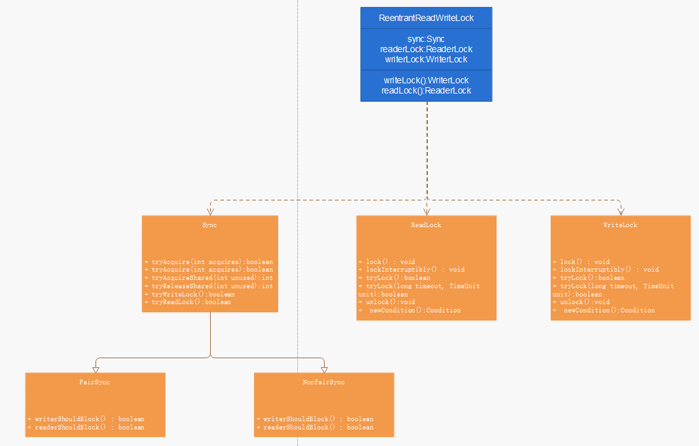

## 一、介绍

ReentrantReadWriteLock 可重入的读写锁。读写锁的特点读读之间不互斥，读写或写写之间是互斥的。

*ReentrantReadWriteLock* 中的读取锁是共享锁，写入锁是独占锁。写锁只有一个线程能获取到，而读锁可以多个线程同时获取

*ReentrantReadWriteLock* 利用一个低16位表示排他（写）锁定计数，高16位表示共享（读）锁计数的锁状态，来控制锁的读写顺序

当读锁全部释放时，写锁才能获取；当写锁释放，读锁才能获取。

官方案例：

```java
class CachedData {    
	Object data;    
    volatile boolean cacheValid;    
    final ReentrantReadWriteLock rwl = new ReentrantReadWriteLock();      
    void processCachedData() {      
        rwl.readLock().lock();      
        if (!cacheValid) {        // Must release read lock before acquiring write lock        
            rwl.readLock().unlock();        
            rwl.writeLock().lock();        
            try {          
                //重新检查状态，因为另一个线程可能在我们之前获得写锁并更改了状态。
                if (!cacheValid) {            
                    data = ...            
                        cacheValid = true;          
                }          
                //通过在释放写锁之前获取读锁来降级
                rwl.readLock().lock();        
            } finally {          
                rwl.writeLock().unlock(); 
                // Unlock write, still hold read        
            }      
        }        
        try {        
            use(data);      
        } finally {        
            rwl.readLock().unlock();      
        }    
    }  
}
```

官方案例：

```java
class RWDictionary {    
    private final Map<String, Data> m = new TreeMap<String, Data>();    
    private final ReentrantReadWriteLock rwl = new ReentrantReadWriteLock();    
    private final Lock r = rwl.readLock();    
    private final Lock w = rwl.writeLock();      
    public Data get(String key) {      
        r.lock();      
        try { 
            return m.get(key); 
        }finally { 
            r.unlock(); 
        }    
    }    
    public String[] allKeys() {      
        r.lock();      
        try { 
            return m.keySet().toArray(); 
        }finally { 
            r.unlock(); 
        }    
    }    
    public Data put(String key, Data value) {      
        w.lock();      
        try { 
            return m.put(key, value); 
        }finally { 
            w.unlock(); 
        }    
    }    
    public void clear() {      
        w.lock();      
        try { 
            m.clear(); 
        }finally { 
            w.unlock(); 
        }    
    }  
}
```



## 二、源码分析


```java
    abstract static class Sync extends AbstractQueuedSynchronizer {
        
        static final int SHARED_SHIFT   = 16;
        static final int SHARED_UNIT    = (1 << SHARED_SHIFT);
        static final int MAX_COUNT      = (1 << SHARED_SHIFT) - 1;
        static final int EXCLUSIVE_MASK = (1 << SHARED_SHIFT) - 1;

        /** 返回count中表示的共享持有数  */
        static int sharedCount(int c)    { return c >>> SHARED_SHIFT; }
        /** 返回count中表示的独占持有数 */
        static int exclusiveCount(int c) { return c & EXCLUSIVE_MASK; }
           /*
         * 试图释放资源
         */
        protected final boolean tryRelease(int releases) {
            if (!isHeldExclusively())
                throw new IllegalMonitorStateException();
            int nextc = getState() - releases;
            boolean free = exclusiveCount(nextc) == 0;
            if (free)
                setExclusiveOwnerThread(null);
            setState(nextc);
            return free;
        }

 protected final boolean tryAcquire(int acquires) {
    /*
    逻辑：
        1.如果读锁计数器不为0 或者 写锁计数器不为0 并且 当前线程不是持有锁的线程，则失败返回；
        2.如果计数器达到最大值则失败；
        3.第1和第2都不满足时，此时线程可以开始尝试获取锁并更新锁状态；
     */
            Thread current = Thread.currentThread();
            int c = getState();
            //当前独占锁数量
            int w = exclusiveCount(c);
            if (c != 0) {
                //（1）如果c!=0，独占锁数量w为0，则表示有共享节点，那么需要加入阻塞队列
                //（2）如果当前线程不是拥有线程则加入阻塞队列
                if (w == 0 || current != getExclusiveOwnerThread())
                    return false;
                //要执行下面的流程需要的条件：独占锁数量>0并且当前线程不是拥有线程
                //独占锁数量不能超过超过最大值，15位二进制
                if (w + exclusiveCount(acquires) > MAX_COUNT)
                    throw new Error("Maximum lock count exceeded");
                // 可重入申请
                setState(c + acquires);
                return true;
            }
            if (writerShouldBlock() ||
                !compareAndSetState(c, c + acquires))
                return false;
            setExclusiveOwnerThread(current);
            return true;
        }

       protected final boolean tryReleaseShared(int unused) {
            Thread current = Thread.currentThread();
            // 首个读线程直接更新特有的计数器即可
            if (firstReader == current) {
                // assert firstReaderHoldCount > 0;
                if (firstReaderHoldCount == 1)
                    firstReader = null;
                else
                    firstReaderHoldCount--;
            } else {
                // 非首读线程则需要更新它的重入次数减1
                HoldCounter rh = cachedHoldCounter;
                if (rh == null || rh.tid != getThreadId(current))
                    rh = readHolds.get();
                int count = rh.count;
                if (count <= 1) {
                    readHolds.remove();
                    if (count <= 0)
                        throw unmatchedUnlockException();
                }
                --rh.count;
            }
            // CAS方式更新锁状态
            for (;;) {
                int c = getState();
                int nextc = c - SHARED_UNIT;
                if (compareAndSetState(c, nextc))
                    // Releasing the read lock has no effect on readers,
                    // but it may allow waiting writers to proceed if
                    // both read and write locks are now free.
                    return nextc == 0;
            }
        }

protected final int tryAcquireShared(int unused) {
            // 获取当前线程
            Thread current = Thread.currentThread();
            // 获取锁状态
            int c = getState();
            // 如果独占锁数量不为0 并且 持有独占锁的线程不是当前线程，则直接失败返回
            if (exclusiveCount(c) != 0 &&
                getExclusiveOwnerThread() != current)
                return -1;
            // 获取共享锁的数量
            int r = sharedCount(c);
            // 检查是否需要因为队列策略而阻塞，若不需要则检查共享锁数量是否达到最大值，都没有则CAS更新锁状态
            if (!readerShouldBlock() &&
                r < MAX_COUNT &&
                compareAndSetState(c, c + SHARED_UNIT)) {
                // 共享锁数量为0表示当前线程是第一个获取读锁的线程
                if (r == 0) {
                    // 更新第一个读线程变量和数量
                    firstReader = current;
                    firstReaderHoldCount = 1;
                } else if (firstReader == current) {
                    // 如果首个获取读锁的线程重复获取读锁时，直接重入并将计数器累加
                    firstReaderHoldCount++;
                } else {
                    // 获取当前线程的计数器
                    HoldCounter rh = cachedHoldCounter;
                    // 如果计数器为空 或者 当前线程还没有创建计数器，则创建计数器并存放到readHolds中，即存放到ThreadLocal中
                    if (rh == null || rh.tid != getThreadId(current))
                        // 在ThreadLocal中创建
                        cachedHoldCounter = rh = readHolds.get();
                    // 如果当前线程的计数器已存在，且计数值为0，则将该计数器放到readHolds中
                    else if (rh.count == 0)
                        readHolds.set(rh);
                    // 锁重入次数累加
                    rh.count++;
                }
                return 1;
            }
            // 之前因为队列策略或更新锁失败后再通过下面方法进行完整地尝试获取锁
            return fullTryAcquireShared(current);
        }

        /**
         * 完整地获取共享锁方法
         */
        final int fullTryAcquireShared(Thread current) {
            HoldCounter rh = null;
            // 循环获取读锁
            for (;;) {
                int c = getState();
                // 当前存在独占锁
                if (exclusiveCount(c) != 0) {
                    // 并且非当前线程持有该独占锁，则直接返回-1
                    if (getExclusiveOwnerThread() != current)
                        return -1;
                    // else we hold the exclusive lock; blocking here
                    // would cause deadlock.
                } else if (readerShouldBlock()) {
                    // 确保没有重新获取读锁定
                    if (firstReader == current) {
                        // assert firstReaderHoldCount > 0;
                    } else {
                        if (rh == null) {
                            rh = cachedHoldCounter;
                            if (rh == null || rh.tid != getThreadId(current)) {
                                rh = readHolds.get();
                                if (rh.count == 0)
                                    readHolds.remove();
                            }
                        }
                        if (rh.count == 0)
                            return -1;
                    }
                }
                // 共享数量超过最大时抛出异常
                if (sharedCount(c) == MAX_COUNT)
                    throw new Error("Maximum lock count exceeded");
                // CAS更新锁状态，以下逻辑与tryAcquireShared类似
                if (compareAndSetState(c, c + SHARED_UNIT)) {
                    if (sharedCount(c) == 0) {
                        firstReader = current;
                        firstReaderHoldCount = 1;
                    } else if (firstReader == current) {
                        firstReaderHoldCount++;
                    } else {
                        if (rh == null)
                            rh = cachedHoldCounter;
                        if (rh == null || rh.tid != getThreadId(current))
                            rh = readHolds.get();
                        else if (rh.count == 0)
                            readHolds.set(rh);
                        rh.count++;
                        cachedHoldCounter = rh; // cache for release
                    }
                    return 1;
                }
            }
        }

        /**
         * 执行写锁
         */
        final boolean tryWriteLock() {
            Thread current = Thread.currentThread();
            int c = getState();
            if (c != 0) {
                int w = exclusiveCount(c);
                if (w == 0 || current != getExclusiveOwnerThread())
                    return false;
                if (w == MAX_COUNT)
                    throw new Error("Maximum lock count exceeded");
            }
            if (!compareAndSetState(c, c + 1))
                return false;
            setExclusiveOwnerThread(current);
            return true;
        }

        /**
         * 执行读锁
         */
        final boolean tryReadLock() {
            Thread current = Thread.currentThread();
            for (;;) {
                int c = getState();
                if (exclusiveCount(c) != 0 &&
                    getExclusiveOwnerThread() != current)
                    return false;
                int r = sharedCount(c);
                if (r == MAX_COUNT)
                    throw new Error("Maximum lock count exceeded");
                if (compareAndSetState(c, c + SHARED_UNIT)) {
                    if (r == 0) {
                        firstReader = current;
                        firstReaderHoldCount = 1;
                    } else if (firstReader == current) {
                        firstReaderHoldCount++;
                    } else {
                        HoldCounter rh = cachedHoldCounter;
                        if (rh == null || rh.tid != getThreadId(current))
                            cachedHoldCounter = rh = readHolds.get();
                        else if (rh.count == 0)
                            readHolds.set(rh);
                        rh.count++;
                    }
                    return true;
                }
            }
        }
    }
```


