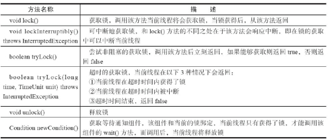
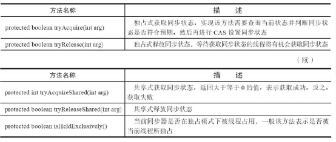
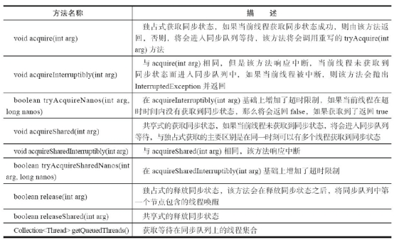
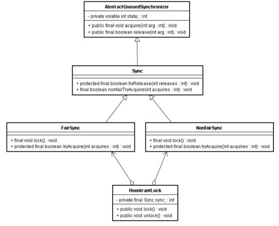

## 1、Lock接口

Java SE 5之后，并发包中新增了Lock接口（以及相关实现类）用来实现锁功能，它提供了与synchronized关键字类似的同步功能，只是在使用时需要显式地获取和释放锁。

使用synchronized关键字将会隐式地获取锁，但是它将锁的获取和释放固化了，也就是先获取再释放。

Lock 接口比同步方法和同步块提供了更具扩展性的锁操作。 它允许更灵活的结构，可以具有完全不同的性质，并且可以支持多个相关类的条件对象。

简单实现：

```java
Lock lock = new ReentrantLock();
lock.lock();
try {
} finally {
	lock.unlock();
}
```

Lock接口提供的synchronized关键字不具备的主要特性

| 特性                     | 描述                                                         |
| ------------------------ | ------------------------------------------------------------ |
| 尝试**非阻塞**地获取锁   | 当前线程尝试获取锁，如果这一时刻锁没有被其它线程获取到，则成功获取并持有锁 |
| 能被**中断地获取**锁     | 与synchronized不同，获取到锁的线程能够响应中断，当获取到锁的线程被中断时，中断异常将会被抛出，同事锁被释放 |
| **超时获取**锁           | 在指定的截至时间之前获取锁，如果截止时间到了仍然无法获取锁，则返回 |
| **公平锁**和**非公平锁** | 可以使锁更公平，比syncronized更加灵活，syncronized只有非公平锁，lock提供公平锁 |

Lock可以在不同的范围，以不同的顺序获取和释放锁。

整体上来说 Lock 是 synchronized 的扩展版，Lock 提供了无条件的、可轮询的 (tryLock 方法)、定时的(tryLock 带参方法)、可中断的(lockInterruptibly)、可多 

条件队列的(newCondition 方法)锁操作。另外 Lock 的实现类基本都支持非公平 锁(默认)和公平锁，synchronized 只支持非公平锁，当然，在大部分情况下，非 

公平锁是高效的选择。  

Lock的API：

 

## 2、队列同步器

队列同步器AbstractQueuedSynchronizer（以下简称同步器），是用来构建锁或者其他同步组件的基础框架，它使用了一个int成员变量表示同步状态，通过内置的FIFO队列来完成资源获取线程的排队工作

同步器是实现锁（也可以是任意同步组件）的关键，在锁的实现中聚合同步器，利用同步器实现锁的语义。

同步器可重写的方法

 

同步器提供的模板方法

 

同步器提供的模板方法基本上分为3类：独占式获取与释放同步状态、共享式获取与释放同步状态和查询同步队列中的等待线程情况。

## 3、锁内存语义的实现

以ReentrantLock分析：

```java
class ReentrantLockExample {
    int   a    = 0;
    ReentrantLock lock = new ReentrantLock();
    public void writer() {
        lock.lock(); //获取锁
        try {
            a++;
        } finally {
            lock.unlock(); //释放锁
        }
    }
    public void reader() {
        lock.lock(); //获取锁
        try {
            int i = a;
            //……
        } finally {
            lock.unlock(); //释放锁
        }
    }
}
```

## 4、AQS

ReentrantLock的实现依赖于Java同步器框架AbstractQueuedSynchronizer，AQS使用一个整型的volatile变量（命名为state）来维护同步状态，volatile变量是ReentrantLock内存语义实现的关键。

 

## 5、ReentrantLock分公平锁和非公平锁

​	编译器不会对volatile读与volatile读后面的任意内存操作重排序；编译器不会对volatile写与volatile写前面的任意内存操作重排序。组合这两个条件，意味着为了同时实现volatile读和volatile写的内存语义，编译器不能对CAS与CAS前面和后面的任意内存操作重排序。

​	公平锁和非公平锁释放时，最后都要写一个volatile变量state。公平锁获取时，首先会去读volatile变量。

非公平锁获取时，首先会用CAS更新volatile变量，这个操作同时具有volatile读和volatile写的内存语义。

### 公平锁路径

取锁：

1）ReentrantLock:lock()。

2）FairSync:lock()。

3）AbstractQueuedSynchronizer:acquire(int arg)。

4）ReentrantLock:tryAcquire(int acquires)。

解锁：

1）ReentrantLock:unlock()。

2）AbstractQueuedSynchronizer:release(int arg)。

3）Sync:tryRelease(int releases)。

​	公平锁在释放锁的最后写volatile变量state，在获取锁时首先读这个volatile变量。根据volatile的happens-before规则，释放锁的线程在写volatile变量之前可见的共享变量，在获取锁的线程读取同一个volatile变量后将立即变得对获取锁的线程可见。

### 非公平锁路径：

取锁：

1）ReentrantLock:lock()。

2）NonfairSync:lock()。

3）AbstractQueuedSynchronizer:compareAndSetState(int expect,int update)。

## 6、concurrent包的实现

Java的CAS同时具有volatile读和volatile写的内存语义：

1）A线程写volatile变量，随后B线程读这个volatile变量。

2）A线程写volatile变量，随后B线程用CAS更新这个volatile变量。

3）A线程用CAS更新一个volatile变量，随后B线程用CAS更新这个volatile变量。

4）A线程用CAS更新一个volatile变量，随后B线程读这个volatile变量。

 ## 7、Lock与synchronized 不同实现方式

**synchronized**

```java
class MonitorExample {
    int a = 0;

    public synchronized void writer() { //1
        a++; //2
    } //3

    public synchronized void reader() { //4
        int i = a; //5
        //……
    } //6
}
```

 **Lock**

```java
class ReentrantLockExample {
    int           a    = 0;
    ReentrantLock lock = new ReentrantLock();
    public void writer() {
        lock.lock(); //获取锁
        try {
            a++;
        } finally {
            lock.unlock(); //释放锁
        }
    }

    public void reader() {
        lock.lock(); //获取锁
        try {
            int i = a;
            //……
        } finally {
            lock.unlock(); //释放锁
        }
    }
}
```