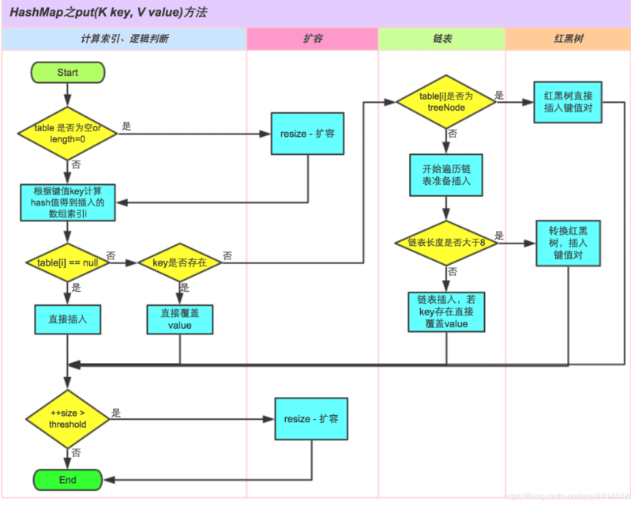

### 1、 影响HashMap性能的重要参数

初始容量：`创建哈希表(数组)时桶的数量，默认为 16` 

负载因子：哈希表在其容量自动增加之前可以达到多满的一种尺度，默认为 0.75 

### 2、HashMap工作原理

### 3 、`HashMap 的底层数组长度为何总是2的n次方`

HashMap根据用户传入的初始化容量，利用无符号右移和按位或运算等方式计算出第一个大于该数的2的幂。

- 使数据分布均匀，减少碰撞
- 当length为2的n次方时，h&(length - 1) 就相当于对length取模，而且在速度、效率上比直接取模要快得多

（1）当length为2的N次方的时候，h & (length-1) = h % length

为什么&效率更高呢？因为位运算直接对内存数据进行操作，不需要转成十进制，所以位运算要比取模运算的效率更高

（2）当length为2的N次方的时候，数据分布均匀，减少冲突

此时我们基于第一个原因进行分析，此时hash策略为h & (length-1)。

### 4、HashMap允许空键空值么

HashMap最多只允许一个键为Null(多条会覆盖)，但允许多个值为Null

HashTable不允许key和值为null

### 5、1.8中做了哪些优化优化？

- `数组+链表改成了数组+链表或红黑树`
- `链表的插入方式从头插法改成了尾插法`
- `扩容的时候1.7需要对原数组中的元素进行重新hash定位在新数组的位置，1.8采用更简单的判断逻辑，位置不变或索引+旧容量大小；`
- 在插入时，1.7先判断是否需要扩容，再插入，1.8先进行插入，插入完成再判断是否需要扩容；

### 6、`HashMap线程安全方面会出现什么问题`

- 在jdk1.7中，在多线程环境下，扩容时会造成环形链或数据丢失。
- 在jdk1.8中，在多线程环境下，会发生数据覆盖的情况