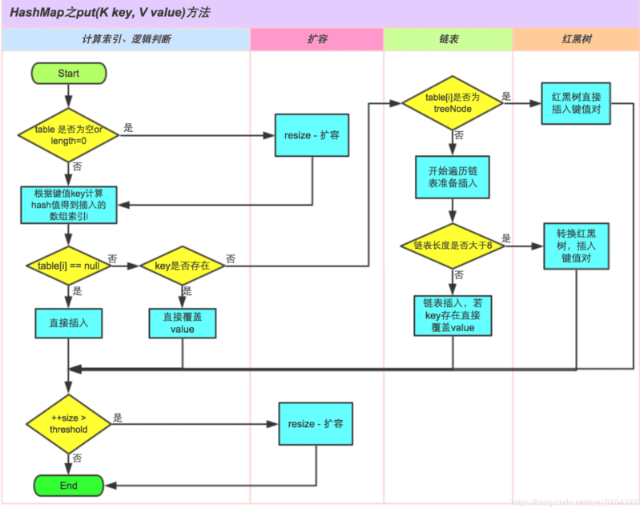
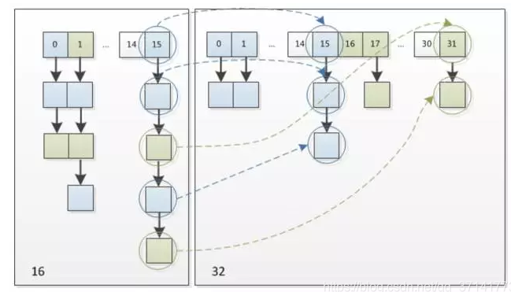
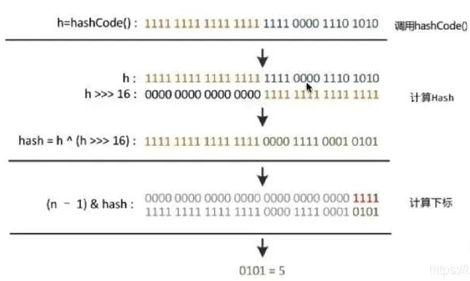

### 1、 影响HashMap性能的重要参数

初始容量：`创建哈希表(数组)时桶的数量，默认为 16` 

负载因子：哈希表在其容量自动增加之前可以达到多满的一种尺度，默认为 0.75 

### 2、HashMap工作原理



HashMap底层是hash数组和单向链表实现,数组中的每个元素都是链表,由Node内部类(实现Map.Entry<K,V>接口)实现,HashMap通过put&get方法存储和获取。

存储对象时,将K/V键值传给put()方法:

①、调用hash(K)方法计算K的hash值,然后结合数组长度,计算得数组下标;

②、调整数组大小(当容器中的元素个数大于capacity*loadfactor时,容器会进行扩容resize为2n);

③

i.如果K的hash值在HashMap中不存在,则执行插入,若存在,则发生碰撞;

ii.如果K的hash值在HashMap中存在,且它们两者equals返回true,则更新键值对;

iii.如果K的hash值在HashMap中存在,且它们两者equals返回false,则插入链表的尾部(尾插法)或者红黑树中(树的添加方式)。

### 3 、`HashMap 的底层数组长度为何总是2的n次方`

HashMap根据用户传入的初始化容量，利用无符号右移和按位或运算等方式计算出第一个大于该数的2的幂。

- 使数据分布均匀，减少碰撞
- 当length为2的n次方时，h&(length - 1) 就相当于对length取模，而且在速度、效率上比直接取模要快得多

（1）当length为2的N次方的时候，h & (length-1) = h % length

为什么&效率更高呢？因为位运算直接对内存数据进行操作，不需要转成十进制，所以位运算要比取模运算的效率更高

（2）当length为2的N次方的时候，数据分布均匀，减少冲突

此时我们基于第一个原因进行分析，此时hash策略为h & (length-1)。

### 4、HashMap允许空键空值么

HashMap最多只允许一个键为Null(多条会覆盖)，但允许多个值为Null

HashTable不允许key和值为null

### 5、1.8中做了哪些优化优化？

- `数组+链表改成了数组+链表或红黑树`
- `链表的插入方式从头插法改成了尾插法`
- `扩容的时候1.7需要对原数组中的元素进行重新hash定位在新数组的位置，1.8采用更简单的判断逻辑，位置不变或索引+旧容量大小；`
- 在插入时，1.7先判断是否需要扩容，再插入，1.8先进行插入，插入完成再判断是否需要扩容；

### 6、`HashMap线程安全方面会出现什么问题`

- 在jdk1.7中，在多线程环境下，扩容时会造成环形链或数据丢失。
- 在jdk1.8中，在多线程环境下，会发生数据覆盖的情况

### 7、为什么1.8改用红黑树

当过多hash冲突，让HashMap不断地产生碰撞，那么相同key位置的链表就会不断增长，当你需要对这个HashMap的相应位置进行查询的时候，就会去循环遍历这个超级大的链表，性能及其地下。java8使用红黑树来替代超过8个节点数的链表后，查询方式性能得到了很好的提升，从原来的是O(n)到O(logn) 

### 8、1.8中的扩容为什么逻辑判断更简单

元素在重新计算hash之后，因为n变为2倍，那么n-1的mask范围在高位多1bit(红色)，因此新的index就会发生这样的变化： 

单节点变化：

```
newTab[e.hash & (newCap - 1)] = e;
```

链表变化：

```
//通过比较hash和旧的容量的与值比较是否为0判定是否需要位置变化
if ((e.hash & oldCap) == 0) {
	newTab[j] = loHead;
}else{
	//(e.hash & oldCap) == 1 这里是需要重新更新位置变化，位置变化为 当前位置+旧的容量大小
    newTab[j + oldCap] = hiHead;
}
```

借用一张网上的图片：



可以看出hash&(oldCap-1)=15的节点上的链表经过resize后，转变为右图。左图位置15的链表上有5个数据节点，扩容后3个节点位置不变，2个节点的大小变为原来的索引位置15+原来的容量大小16=31

### 9 hash计算规则



为什么这里把key的hashcode取出来，然后把它右移16位，然后取异或？

因为int是4个字节，也就是32位，大概是有40亿的空间，如果哈希函数运用的比较松散，一般是很难出现哈希碰撞的。但是现实中一个长度为40亿的数组内存是放不下的并且HashMap在扩容前的数组的默认初始值为16，因此直接拿Hashcode值来用是不现实的。因此需要做一些运算。我们右移16位也即是把高位的数据右移到低位的16位，然后与自己做异或，那就是把高位和低位的数据进行混合，以此来加大低位的随机性，同时混合后的低位掺杂了高位的特征，这样高位的信息也被变相保存了下来。这么做主要是从速度，功效和质量来考虑的。

### 10 HashMap的主要参数都有哪些？

DEFAULT_INITIAL_CAPACITY：默认的初始化容量，1<<4位运算的结果是16，也就是默认的初始化容量为16。

MAXIMUM_CAPACITY：容量的最大值，1 << 30位，2的30次幂。
DEFAULT_LOAD_FACTOR：默认的加载因子。

TREEIFY_THRESHOLD：当链表长度大于这个参数时，链表就可能会转化为红黑树。

UNTREEIFY_THRESHOLD：元素数量等于这个值也就是6的时候变回来。

MIN_TREEIFY_CAPACITY：转变成树的table的最小容量，小于该值则不会进行树化。

### 11 哈希冲突及解决方法

开放定址法：开放定址法就是一旦发生了冲突，就去寻找下一个空的散列地址，只要散列表足够大，空的散列地址总能找到，并将记录存入。

链地址法：将哈希表的每个单元作为链表的头结点，所有哈希地址为i的元素构成一个同义词链表。

再哈希法：当哈希地址发生冲突用其他的函数计算另一个哈希函数地址，直到冲突不再产生为止。

建立公共溢出区：将哈希表分为基本表和溢出表两部分，发生冲突的元素都放入溢出表中。

### 12 HashMap如何有效减少碰撞？

1. 扰动函数：促使元素位置分布均匀，减少碰撞几率
2. 使用final对象，并采用合适的equals()和hashCode()方法

### 13 为啥我们重写equals方法的时候需要重写hashCode方法呢？

     hashmap中value的查找是通过 key 的 hashcode 来查找，所以对自己的对象必须重写 hashcode 方法通过 hashcode 找到对象地址后会用 equals 比较你传入的对象和 hashmap 中的 key 对象是否相同,因此还要重写 equals。

### 14 HashMap什么时候进行扩容？它是怎么扩容的呢？

HashMap进行扩容取决于以下两个元素：

Capacity：HashMap当前长度。

LoadFactor：负载因子，默认值0.75f。
     当Map中的元素个数（包括数组，链表和红黑树中）超过了16*0.75=12之后开始扩容。
     具体怎么进行扩容呢？将会创建原来HashMap大小的两倍的bucket数组，来重新调整map的大小，并将原来的对象放入新的bucket数组中。这个过程叫作rehashing ，因为它将会调用hash方法找到新的bucket位置。

### 15 JDK1.7扩容的时候为什么要重新Hash呢，为什么不直接复制过去？

    是因为长度扩大以后，Hash的规则也随之改变。比如原来长度（Length）是8，你位运算出来的值是2 ，新的长度是16你位运算出来的值明显不一样了。

### 16 和Hashtable的区别是什么？

     HashMap和Hashtable都实现了Map接口。主要的区别有：线程安全性，同步(synchronization)，以及速度。

     HashMap几乎可以等价于Hashtable，除了HashMap是非synchronized的，并可以接受null(HashMap可以接受为null的键值(key)和值(value)，而Hashtable则不行)。

     HashMap是非synchronized，而Hashtable是synchronized；Java 5提供了ConcurrentHashMap，它是HashTable的替代，比HashTable的扩展性更好。

     另一个区别是HashMap的迭代器(Iterator)是fail-fast迭代器，而Hashtable的enumerator迭代器不是fail-fast的。所以当有其它线程改变了HashMap的结构（增加或者移除元素），将会抛出ConcurrentModificationException，但迭代器本身的remove()方法移除元素则不会抛出ConcurrentModificationException异常。但这并不是一个一定发生的行为，要看JVM。这条同样也是Enumeration和Iterator的区别。

Fail-safe和iterator迭代器相关。如果某个集合对象创建了Iterator或者ListIterator，然后其它的线程试图“结构上”更改集合对象，将会抛出ConcurrentModificationException异常。但其它线程可以通过set()方法更改集合对象是允许的，因为这并没有从“结构上”更改集合。但是假如已经从结构上进行了更改，再调用set()方法，将会抛出IllegalArgumentException异常。

### 17 什么是Java集合中的快速失败（fast-fail）机制?

 快速失败是Java集合的一种错误检测机制，当多个线程对集合进行结构上的改变的操作时，有可能会产生fail-fast。 

那么快速失败机制底层是怎么实现的呢？

集合在被遍历期间如果内容发生变化，就会改变modCount的值。当迭代器使用hashNext()/next()遍历下一个元素之前，都会检测modCount变量是否为expectedModCount值，是的话就返回遍历；否则抛出异常，终止遍历。 

### 18 HashTable一定是线程安全吗？它会有快速失败的时候吗？

Hashtable线程安全是由于其内部实现在put和remove等方法上使用synchronized进行了同步，所以对单个方法的使用是线程安全的。但是对多个方法进行复合操作时，线程安全性无法保证。比如一个线程在进行get操作，一个线程在进行remove操作，往往会导致下标越界等异常。

Hashtable也会在迭代的时候抛出ConcurrentModificationException，可能发生快速失败

### 19 当两个对象的hashCode相同会发生什么?

因为`hashCode`相同,不一定就是相等的(`equals`方法比较),所以两个对象所在数组的下标相同,”碰撞”就此发生。又因为`HashMap`使用链表存储对象,这个`Node`会存储到链表中。

