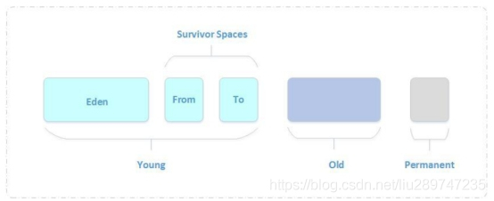
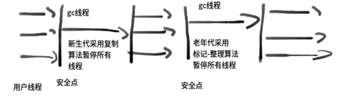
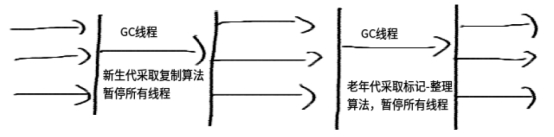
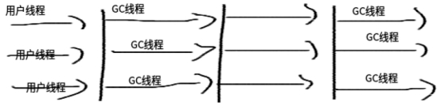
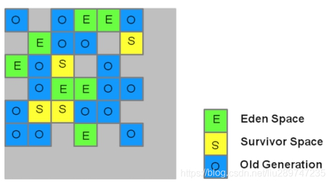
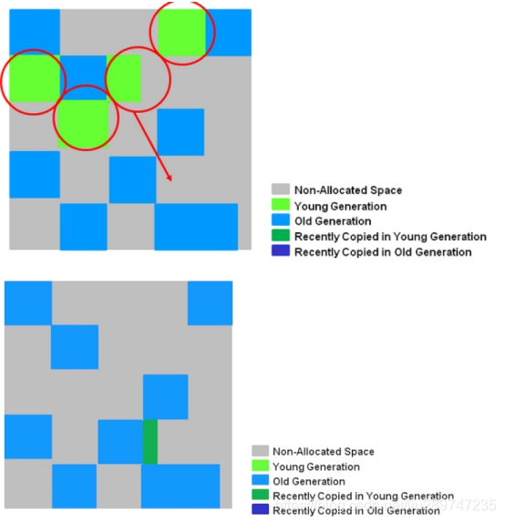

# 一、堆结构及对象分代

## 1.1 分代介绍及必要性

java堆完全自动化管理，通过垃圾回收机制自动清理垃圾对象

Java虚拟机根据对象存活的周期不同，把堆内存划分为几块，一般分为新生代、老年代和永久代（对HotSpot虚拟机而言），这就是JVM的内存分代策略。 

堆内存是虚拟机管理的内存中最大的一块，也是垃圾回收最频繁的一块区域，我们程序所有的对象实例都存放在堆内存中。给堆内存分代是为了提高对象内存分配和垃圾回收的效率。

新创建的对象会在新生代中分配内存，经过多次回收仍然存活下来的对象存放在老年代中，静态属性、类信息等存放在永久代中，新生代中的对象存活时间短，只需要在新生代区域中频繁进行GC，老年代中对象生命周期长，内存回收的频率相对较低，不需要频繁进行回收，永久代中回收效果太差，一般不进行垃圾回收，还可以根据不同年代的特点采用合适的垃圾收集算法来提升了收集效率。 

## 1.2 分代的划分

**Java**虚拟机将堆内存划分为新生代、老年代和永久代，永久代是**HotSpot**虚拟机特有的概念（**JDK1.8**之后为**metaspace**替代永久代），它采用永久代的方式来实现方法区，其他的虚拟机实现没有这一概念，而且**HotSpot**也有取消永久代的趋势，在**JDK 1.7**中**HotSpot**已经开始了**“**去永久化**”**，把原本放在永久代的字符串常量池移出。永久代主要存放常量、类信息、静态变量等数据，与垃圾回收关系不大，新生代和老年代是垃圾回收的主要区域。 

新生代分为Eden区、s0区、s1区，s0和s1也被称为from和to区域，s0、s1是两块大小相等并且可以互换的空间。

绝大数情况下，对象首先分配在eden区，经过一次回收后，如果对象还存在则进入s0或者s1，之后每经过一次新生代回收，如果对象存活则它的年龄+1，当对象年龄达到一定年龄后进入老年代.

| Eden区 | s0区 | S1区 | Tenured区 |
| ------ | ---- | ---- | --------- |
| 8      | 1    | 1    | 16        |

### 2.2.1 新生代

对象优先存放在新生代中，新生代对象朝生夕死，存活率很低，在新生代中，常规应用进行一次垃圾收集一般可以回收**70% ~ 95%** 的空间，回收效率很高。 

**HotSpot**将新生代划分为三块，一块较大的**Eden**空间和两块较小的**Survivor**空间，默认比例为**8**：**1**：**1**。新生成的对象在**Eden**区分配（大对象除外，大对象直接进入老年代），当**Eden**区没有足够的空间进行分配时，虚拟机将发起一次**Minor GC**。

**GC**开始时，对象只会存在于**Eden**区和**From Survivor**区，**To Survivor**区是空的（作为保留区域）。**GC**进行时，**Eden**区中所有存活的对象都会被复制到**To Survivor**区，而在**From Survivor**区中，仍存活的对象会根据它们的年龄值决定去向，年龄值达到年龄阀值（默认为**15**，新生代中的对象每熬过一轮垃圾回收，年龄值就加**1**，**GC**分代年龄存储在对象的**header**中）的对象会被移到老年代中，没有达到阀值的对象会被复制到**To Survivor**区。接着清空**Eden**区和**From Survivor**区，新生代中存活的对象都在**To Survivor**区。接着， **From Survivor**区和**To Survivor**区会交换它们的角色，也就是新的**To Survivor**区就是上次**GC**清空的**From Survivor**区，新的**From Survivor**区就是上次**GC**的**To Survivor**区，总之，不管怎样都会保证**To Survivor**区在一轮**GC**后是空的。**GC**时当**To Survivor**区没有足够的空间存放上一次新生代收集下来的存活对象时，需要依赖老年代进行分配担保，将这些对象存放在老年代中。 

### 2.2.2 老年代

在新生代中经历了多次**GC**后仍然存活下来的对象会进入老年代中。老年代中的对象生命周期较长，存活率比较高，在老年代中进行**GC**的频率相对而言较低，而且回收的速度也比较慢。 

什么样的对象会进入老年代：

（1）大对象

所谓的大对象是指需要大量连续内存空间的java对象，最典型的大对象就是那种很长的字符串以及数组，大对象对虚拟机的内存分配就是坏消息，尤其是一些朝生夕灭的短命大对象，写程序时应避免。

（2）长期存活的对象，默认年龄15

虚拟机给每个对象定义了一个对象年龄(Age)计数器，如果对象在Eden出生并经过第一次Minor GC后仍然存活，并且能被Survivor容纳的话，将被移动到Survivor空间中，并且对象年龄设为1。对象在Survivor区中每熬过一次Minor GC，年龄就增加1，当他的年龄增加到一定程度(默认是15岁)， 就将会被晋升到老年代中。对象晋升到老年代的年龄阈值，可以通过参数-XX：MaxTenuringThreshold设置。

（3）动态对象年龄判定：为了能更好地适应不同程度的内存状况，虚拟机并不是永远地要求对象的年龄必须达到了MaxTenuringThreshold才能晋升到老年代，**如果在Survivor空间中相同年龄的所有对象大小的总和大于Survivor空间的一半，年龄大于或等于该年龄的对象就可以直接进入老年代**，无须等到MaxTenuringThreshold中要求的年龄。

（4）在一次安全Minor GC 中，仍然存活的对象不能在另一个Survivor 完全容纳，则会通过担保机制进入老年代。

### 2.2.3 永久代

永久代存储类信息、常量、静态变量、即时编译器编译后的代码等数据，对这一区域而言，Java虚拟机规范指出可以不进行垃圾收集，一般而言不会进行垃圾回收。 永久代在java8以后移除jvm，类信息常量静态变量等信息存放到了metaspace中。

# 二、垃圾回收算法及分代垃圾收集器

## 2.1 垃圾收集器的分类

### 2.1.1 次收集器

**Scavenge GC**，指发生在新生代的**GC**，因为新生代的**Java**对象大多都是朝生夕死，所以**Scavenge GC**非常频繁，一般回收速度也比较快。当**Eden**空间不足以为对象分配内存时，会触发**Scavenge GC**。 

一般情况下，当新对象生成，并且在**Eden**申请空间失败时，就会触发**Scavenge GC**，对**Eden**区域进行**GC**，清除非存活对象，并且把尚且存活的对象移动到**Survivor**区。然后整理**Survivor**的两个区。这种方式的**GC**是对年轻代的**Eden**区进行，不会影响到年老代。因为大部分对象都是从**Eden**区开始的，同时**Eden**区不会分配的很大，所以**Eden**区的**GC**会频繁进行。因而，一般在这里需要使用速度快、效率高的算法，使**Eden**去能尽快空闲出来。 

当年轻代堆空间紧张时会被触发 

相对于全收集而言，收集间隔较短 

### 2.1.2 全收集器

**Full GC**，指发生在老年代的**GC**，出现了**Full GC**一般会伴随着至少一次的**Minor GC**（老年代的对象大部分是**Scavenge GC**过程中从新生代进入老年代），比如：分配担保失败。**Full GC**的速度一般会比**Scavenge GC**慢**10**倍以上。当老年代内存不足或者显式调用**System.gc()**方法时，会触发**Full GC**。 

当老年代或者持久代堆空间满了，会触发全收集操作 

可以使用**System.gc()**方法来显式的启动全收集 

全收集一般根据堆大小的不同，需要的时间不尽相同，但一般会比较长。 

### 2.1.3 垃圾回收器的常规匹配

jdk1.8下测试下，搭配和图中有些差别  

| Young             | Tenured      | JVM options                              |
| ----------------- | ------------ | ---------------------------------------- |
| Serial            | Serial Old   | -XX:+UseSerialGC                         |
| Parallel Scavenge | Serial Old   | -XX:+UseParallelGC                       |
| Parallel New      | Serial Old   | -XX:+UseParNewGC                         |
| Serial            | Parallel Old | N/A                                      |
| Parallel Scavenge | Parallel Old | -XX:+UseParallelGC -XX:+UseParallelOldGC |
| Parallel New      | Parallel Old | N/A                                      |
| Serial            | CMS          | -XX:-UseParNewGC -XX:+UseConcMarkSweepGC |
| Parallel Scavenge | CMS          | N/A                                      |
| Parallel New      | CMS          | -XX:+UseParNewGC -XX:+UseConcMarkSweepGC |
| G1                | G1           | -XX:+UseG1GC                             |

## 2.2 垃圾回收器算法

### 2.2.1 引用计数法(Reference Counting)

比较古老的回收算法。原理是此对象有一个引用，即增加一个计数，删除一个引用则减少一个计数。垃圾回收时，只用收集计数为**0**的对象。此算法最致命的是无法处理循环引用的问题。 

### 2.2.2 标记-清除算法(Mark-Sweep)

此算法执行分两阶段。第一阶段从引用根节点开始标记所有被引用的对象，第二阶段遍历整个堆，把未标记的对象清除。此算法需要暂停整个应用，同时，会产生内存碎片。垃圾回收后的空间不是连续的，不连续的内存空间的工作效率要低于连续的内存空间。

### 2.2.3 复制算法(Copying)

此算法把内存空间划为两个相等的区域，每次只使用其中一个区域。垃圾回收时，把正在使用中的对象复制到另外一个区域中，之后清楚之前正在使用的内存块中所有的对象。此算法每次只处理正在使用中的对象，因此复制成本比较小，同时复制过去以后还能进行相应的内存整理，反复去交换两个内存的角色，完成垃圾收集，不会出现“碎片”问题。当然，此算法的缺点也是很明显的，就是需要两倍内存空间。（java中新生代的from和to空间就是使用这个算法）

### 2.2.4 标记压缩/整理算法(Mark-Compact)

在标记算法基础上做了优化，把存活的对象压缩到内存一端，而后进行垃圾清理。（java中老年代默认使用的就是标记压缩算法）

### 2.2.5 分代算法

就是根据对象的特点把内存分成N块，而后根据每个内存的特点使用不同的算法

对于新生代和老年代，新生代回收频率很高，但是每次回收耗时都很短，而老年代回收频率很低，但是耗时会相对较长，所以应该尽量减少咯阿年代的GC。

### 2.2.6 分区算法

其主要就是讲整个内存分为N多个小的空间，每个小空间都可以独立使用，这样细粒度的控制一次回收少多少个小空间，而不是对整个空间进行GC，从而提升性能，并减少GC的停顿时间。

## 3.3 分代垃圾回收器

### 3.3.1 串行收集器（Serial）

**Serial**收集器是**Hotspot**运行在**Client**模式下的默认新生代收集器**，** 它的特点是：只用一个**CPU**（计算核心）**/**一条收集线程去完成**GC**工作**，** 且在进行垃圾收集时必须暂停其他所有的工作线程**(**“**Stop The World**” **-**后面简称**STW)**。可以使用**-XX：+UseSerialGC**打开。 

| 优点                                                         | 缺点                                                         | 应用场景                                                     |
| ------------------------------------------------------------ | ------------------------------------------------------------ | ------------------------------------------------------------ |
| 虽然是单线程收集**,** 但它却简单而高效**,** 在**VM**管理内存不大的情况下**(**收集几十**M~**一两百**M**的新生代**),** 停顿时间完全可以控制在几十毫秒**~**一百多毫秒内。没有线程交互（切换）开销 | 只用一个**CPU**（计算核心）**/**一条收集线程去完成**GC**工作**,** 且在进行垃圾收集时必须暂停其他所有的工作线程(STW) | 在用户的桌面应用场景中，可用内存一般不大（几十M至一两百M），可以在较短时间内完成垃圾收集（几十MS至一百多MS）,只要不频繁发生，这是可以接受的 |

### 3.3.2 并行收集器（ParNew）

ParNew收集器其实是前面Serial的多线程版本， 除使用多条线程进行GC外， 包括Serial可用的所有控制参数、收集算法、STW、对象分配规则、回收策略等都与Serial完全一样(也是VM启用CMS收集器-XX： +UseConcMarkSweepGC的默认新生代收集器)。 

由于存在线程切换的开销， ParNew在单CPU的环境中比不上Serial， 且在通过超线程技术实现的两个CPU的环境中也不能100%保证能超越Serial. 但随着可用的CPU数量的增加， 收集效率肯定也会大大增加(ParNew收集线程数与CPU的数量相同， 因此在CPU数量过大的环境中， 可用-XX：ParallelGCThreads=<N>参数控制GC线程数)。 

| 优点                                | 缺点                                                         | 应用场景                                                     |
| ----------------------------------- | ------------------------------------------------------------ | ------------------------------------------------------------ |
| 多CPU下, 收集效率会比Serial大大增加 | 存在线程切换的开销，在单CPU的环境中比不上Serial,且在通过超线程技术实现的两个CPU的环境中也不能100%保证能超越Serial | 在Server模式下，ParNew收集器是一个非常重要的收集器，因为除Serial外，目前只有它能与CMS收集器配合工作； |

### 3.3.3 Parallel Scavenge收集器

与ParNew类似， Parallel Scavenge也是使用复制算法， 也是并行多线程收集器. 但与其他收集器关注尽可能缩短垃圾收集时间不同， Parallel Scavenge更关注系统吞吐量： 

系统吞吐量=运行用户代码时间/(运行用户代码时间+垃圾收集时间) 

停顿时间越短就越适用于用户交互的程序-良好的响应速度能提升用户的体验;而高吞吐量则适用于后台运算而不需要太多交互的任务-可以最高效率地利用CPU时间，尽快地完成程序的运算任务. Parallel Scavenge提供了如下参数设置系统吞吐量： 

**参数：**

-XX：MaxGCPauseMillis (毫秒数) 收集器将尽力保证内存回收花费的时间不超过设定值， 但如果太小将会导致GC的频率增加

-XX：GCTimeRatio (整数：0 < GCTimeRatio < 100) 是垃圾收集时间占总时间的比率

XX：+UseAdaptiveSizePolicy 启用GC自适应的调节策略： 不再需要手工指定-Xmn、-XX：SurvivorRatio、-XX：PretenureSizeThreshold等细节参数， VM会根据当前系统的运行情况收集性能监控信息， 动态调整这些参数以提供最合适的停顿时间或最大的吞吐量

### 3.3.4 Serial Old收集器

Serial Old是Serial收集器的老年代版本， 同样是单线程收集器，使用“标记-整理”算法 

### 3.3.5 Parallel Old收集器

Parallel Old是Parallel Scavenge收集器的老年代版本， 使用多线程和“标记－整理”算法， 吞吐量优先， 主要与Parallel Scavenge配合在注重吞吐量及CPU资源敏感系统内使用

### 3.3.6 CMS收集器（Concurrent Mark Sweep）

CMS(Concurrent Mark Sweep)收集器是一款具有划时代意义的收集器， 一款真正意义上的并发收集器， 虽然现在已经有了理论意义上表现更好的G1收集器， 但现在主流互联网企业线上选用的仍是CMS(如Taobao、微店). 

CMS是一种以获取最短回收停顿时间为目标的收集器(CMS又称多并发低暂停的收集器)， 基于”标记-清除”算法实现， 整个GC过程分为以下4个步骤： 

1. 初始标记(CMS initial mark) 
2. 并发标记(CMS concurrent mark： GC Roots Tracing过程) 
3. 重新标记(CMS remark) 
4. 并发清除(CMS concurrent sweep： 已死对象将会就地释放， 注意：此处没有压缩) 

其中1，3两个步骤(初始标记、重新标记)仍需STW. 但初始标记仅只标记一下GC Roots能直接关联到的对象， 速度很快; 而重新标记则是为了修正并发标记期间因用户程序继续运行而导致标记产生变动的那一部分对象的标记记录， 虽然一般比初始标记阶段稍长， 但要远小于并发标记时间. 

**CMS**特点： 

1 CMS默认启动的回收线程数=(CPU数目+3)4 

当CPU数>4时， GC线程一般占用不超过25%的CPU资源， 但是当CPU数<=4时， GC线程可能就会过多的占用用户CPU资源， 从而导致应用程序变慢， 总吞吐量降低. 

2 无法处理浮动垃圾

可能出现Promotion Failure、Concurrent Mode Failure而导致另一次Full GC的产生： 浮动垃圾是指在CMS并发清理阶段用户线程运行而产生的新垃圾. 由于在GC阶段用户线程还需运行， 因此还需要预留足够的内存空间给用户线程使用， 导致CMS不能像其他收集器那样等到老年代几乎填满了再进行收集. 

-XX：CMSInitiatingOccupancyFraction参数来设置GC的触发百分比

-XX：+UseCMSInitiatingOccupancyOnly来启用该触发百分比

3 内存碎片整理

-XX：+UseCMSCompactAtFullCollection开关参数， 用于在Full GC后再执行一个碎片整理过程

-XX：CMSFullGCsBeforeCompaction用于设置在执行N次不进行内存整理的Full GC后， 跟着来一次带整理的(默认为0： 每次进入Full GC时都进行碎片整理). 

### 3.3.7 分区收集- G1收集器

G1(Garbage-First)是一款面向服务端应用的收集器**，** 主要目标用于配备多颗CPU的服务器治理大内存**.** 

-XX：+UseG1GC启用G1收集器**.** 

与其他基于分代的收集器不同， G1将整个Java堆划分为多个大小相等的独立区域(Region)， 虽然还保留有新生代和老年代的概念**，** 但新生代和老年代不再是物理隔离的了**，** 它们都是一部分Region(不需要连续**)**的集合

每块区域既有可能属于O区、也有可能是Y区， 因此不需要一次就对整个老年代/新生代回收. 而是当线程并发寻找可回收的对象时， 有些区块包含可回收的对象要比其他区块多很多. 虽然在清理这些区块时G1仍然需要暂停应用线程， 但可以用相对较少的时间优先回收垃圾较多的Region. 这种方式保证了G1可以在有限的时间内获取尽可能高的收集效率. 

G1的新生代收集跟ParNew类似： 存活的对象被转移到一个/多个Survivor Regions. 如果存活时间达到阀值， 这部分对象就会被提升到老年代.如图：  

**G1新生代特点：**

1 一整块堆内存被分为多个Regions. 

2 存活对象被拷贝到新的Survivor区或老年代.

3 年轻代内存由一组不连续的heap区组成**，** 这种方法使得可以动态调整各代区域尺寸**.** 

4 Young GC会有STW事件**，** 进行时所有应用程序线程都会被暂停**.** 

5 多线程并发GC.

**老年代GC特点如下：** 

并发标记阶段 

1 在与应用程序并发执行的过程中会计算活跃度信息**.** 

2 这些活跃度信息标识出那些regions最适合在STW期间回收(which regions will be best to reclaim during an evacuation pause).

3 不像CMS有清理阶段**.** 

再次标记阶段 

1 使用Snapshot-at-the-Beginning(SATB)算法比CMS快得多. 

2 空region直接被回收**.** 

拷贝**/**清理阶段(Copying/Cleanup Phase)*

1 年轻代与老年代同时回收**.** 

2 老年代内存回收会基于他的活跃度信息**.** 

### 3.3.8 ZGC回收器

ZGC（Z Garbage Collector） 是一款性能比 G1 更加优秀的垃圾收集器。ZGC 第一次出现是在  JDK 11 中以实验性的特性引入，这也是 JDK 11 中最大的亮点。在 JDK 15 中 ZGC 不再是实验功能，可以正式投入生产使用了，使用 –XX:+UseZGC 可以启用 ZGC。 

特性： 

1 暂停时间不会超过 10 ms。 

> JDK 16 发布后，GC 暂停时间已经缩小到 1 ms 以内，并且时间复杂度是 o(1)，这也就是说 GC 停顿时间是一个固定值了，并不会受堆内存大小影响。 

2 最大支持 16TB 的大堆，最小支持 8MB 的小堆。

3 跟 G1 相比，对应用程序吞吐量的影响小于 15 %。