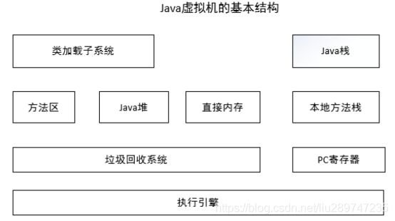
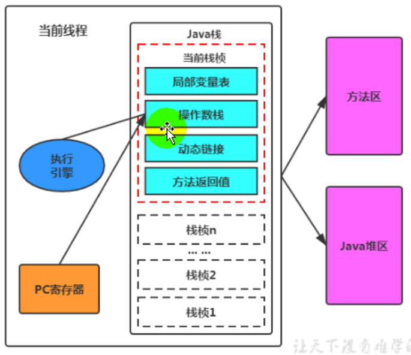

## 1 类加载子系统

类加载子系统负责从文件系统或者网络中加载Class信息，加载的类信息存放于一块称为方法区的内存空间。

## 2 方法区

就是存放类信息、常量信息、包括字符串字面量和数字常量(这部分常量信息是Class文件中常量池部分的内存映射)等。

方法区在java7和Java8以后有什么不同？

1 方法区是JVM规范的一个概念定义，并不是一个具体的实现，每一个JVM的实现都可以有各自的实现； 

2 Java8版本以后，是用元空间来实现的方法区；在Java8之前的版本，则是用永久代实现的方法区； 

3 “元空间” 和 “方法区”，一个是HotSpot 的具体实现技术，一个是JVM规范的抽象定义； 

## 3 Java堆

java堆在虚拟机启动的时候建立，它是java程序最主要的内存工作区域。几乎所有的java对象实例都存放在java堆中。堆空间是所有线程共享的，这是一块与java应用密切相关的内存空间。 

## 4 直接内存

**java**的**NIO**库允许**java**程序使用直接内存，从而提高性能，通常直接内存会优于Java堆。读写频繁的场合可能会优先考虑使用。

## 5 垃圾回收系统

垃圾回收(Garbage Collection，简称GC)系统是**java**虚拟机的重要组成部分，垃圾回收器可以对方法区、**java**堆和直接内存进行回收。其中，**java**堆是垃圾收集器的工作重点。对于不再使用的垃圾对象，垃圾回收系统会在后台默默工作，默默查找、标识并释放垃圾对象，完成包括**java**堆、方法区和直接内存中的全自动化管理。 

System.gc()请求系统进行垃圾回收。至于系统是否立刻回收，则取决于系统中垃圾回收算法的实现以及系统执行时的情况。直接调用 gc 方法暗示着 Java 虚拟机做了一些努力来回收未用对象或失去了所有引用的对象，以便能够快速地重用这些对象当前占用的内存。当控制权从方法调用中返回时，虚拟机已经尽最大努力从所有丢弃的对象中回收了空间。 gc()函数的作用只是提醒虚拟机，不能保证垃圾回收一定会进行。

## 6 Java栈

JVM 是基于栈的。Java 虚拟机的内存模型分为两部分：

（1）一部分是线程共享的，包括 Java 堆和方法区；

（2）另一部分是线程私有的，包括虚拟机栈和本地方法栈，以及程序计数器这一小部分内存。

虚拟机栈的栈元素是栈帧，当有一个方法被调用时，代表这个方法的栈帧入栈；当这个方法返回时，其栈帧出栈。因此，虚拟机栈中栈帧的入栈顺序就是方法调用顺序。

每一个java虚拟机线程都有一个私有的java栈，一个线程的java栈在线程创建的时候被创建，java栈中保存着帧信息，java栈中保存着局部变量、方法参数，同时和java方法的调用、返回密切相关。

### 6.1 局部变量表

方法中定义的局部变量以及方法的参数就存放在这张表中。局部变量表存放了编译期可知的各种基本数据类型（boolean、byte、char、short、int、float、long、double）、对象应用（reference类型——不同对象本身，可能是一个指向对象起始地址的引用指针，也可能是指向一个代表对象的句柄或其他与此对象相关的位置）和returnAddress类型(指向了一条字节码指令的地址)。

64位长度的long和double类型的数据会占用2个局部变量空间，其余的数据类型只占用1个。局部变量表所需要的内存空间在编译期间完成分配，当进入一个方法时，这个方法需要在帧中分配多大的局部变量空间是完全确定的，在方法运行期间不会改变局部变量表的大小。

### 6.2 操作数栈

用来存放操作数，Java 程序编译之后就变成了一条条字节码指令，其形式类似汇编，但和汇编有不同之处：汇编指令的操作数存放在数据段和寄存器中，可通过存储器或寄存器寻址找到需要的操作数；而 Java 字节码指令的操作数存放在操作数栈中，当执行某条带 n 个操作数的指令时，就从栈顶取 n 个操作数，然后把指令的计算结果（如果有的话）入栈。因此，当我们说 JVM 执行引擎是基于栈的时候，其中的“栈”指的就是操作数栈。

### 6.3 动态连接

每一个栈帧都包含指向运行时常量池中该栈帧所属方法的引用，持有这个引用是为了支持方法调用过程中的动态连接。在Class文件的常量池中存有大量的符号引用，字节码中的方法调用指令就以常量池中指向方法的符号引用为参数。这些符号引用一部分会在类加载阶段或第一次使用的时候转化为直接引用，这种转化称为静态解析。另外一部分将在每一次的运行期期间转化为直接引用，这部分称为动态连接。

### 6.4 方法返回地址

（1）存放调用该方法的PC寄存器的值。

（2）一个方法的结束，有两种方式：①、正常执行完成。②、出现未处理的异常，非正常退出。

（3）无论通过哪种方式退出，在方法退出后都返回到该方法被调用的位置。方法正常退出时，调用者的pc计数器的值作为返回地址，即调用该方法的指令的下一条指令地址。而是通过异常退出的，返回地址是要通过异常表来确定，栈帧中一般不会保存这部分信息。 

### 6.5 帧数据区

栈还需要一些数据来支持常量池的解析，这里的帧数据区保存着访问常量池的指针，方便程序访问常量池，另外，当函数返回或者出现异常时，虚拟机必须有一个异常处理表，方便发送异常的时候找到异常的代码，因此异常处理表也是帧数据区的一部分。

## 7 本地方法栈

本地方法栈和**java**栈非常类似，最大的不同在于**java**栈用于方法的调用，而本地方法栈则用于本地方法的调用，作为对**java**虚拟机的重要扩展，**java**虚拟机允许**java**直接调用本地方法（通常使用**C**编写） 

## 8 PC寄存器

**PC**（**Program Counter**）寄存器也是每一个**线程私有的空间**，**java**虚拟机会为每一个**java**线程创建**PC**寄存器。

PC寄存器用来存储指向下一条指令的地址，即即将要执行的指令代码，由执行引擎执行下一条指令。本地方法PC寄存器的值就是undefined。

例：

当pc寄存器指向偏位地址5的位置，执行引擎通过pc寄存器指向的下一条指令地址，获取操作指令存储到操作数栈，局部变量表，执行引擎将字节码翻译为机器指令执行。

pc寄存器存储字节码指令地址作用？为什么使用pc寄存器记录当前线程的执行地址？

> 因为cpu需要不停的切换各个线程，切换回来就得知道从哪里开始执行。

## 9 执行引擎

虚拟机最核心的组件就是执行引擎，负责执行虚拟机的字节码。一般会先进行编译成机器码后执行。现代虚拟机为了提高执行效率，会使用即时编译(just in time)技术将方法编译成机器码后再执行。 