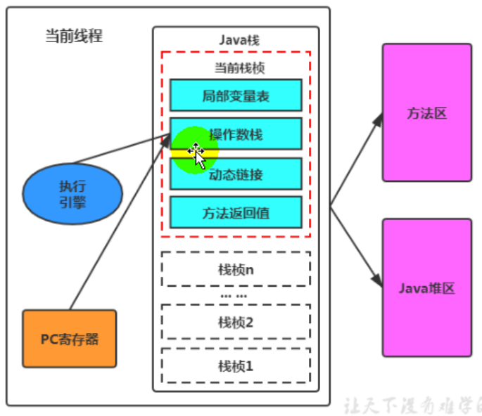
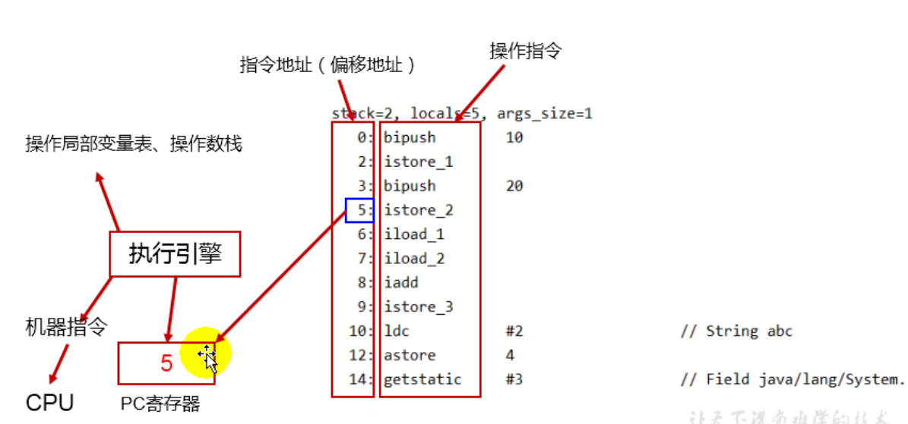

## 1 介绍

JVM中的程序计数寄存器(Program Couhter Relgister)中, Register的命名源于CPU的寄存器,寄存器存储指令相关的现场信息。

**CPU只有把数据装载到寄存器才能够运行**。这里并非是广义上所指的物理寄存器,或许将其翻译为Pc计数器(或指令计数器)会更加贴切(也称为程序钩子) ,并且也不容易引起一些不必要的误会。

JVM中的PC寄存器是对物理PC寄存器的一种抽象模拟。

## 2 PC寄存器作用

PC寄存器用来存储指向下一条指令的地址，也即将要执行的指令代码。由执行引擎读取下一条指令。



- 它是程序控制流的指示器，分支、循环、跳转、异常处理、线程恢复等基础功能都需要依赖这个计数器来完成。
- 字节码解释器工作时就是通过改变这个计数器的值来选取下一条需要执行的字节码指令。
- 它是唯一一个在Java虚拟机规范中没有规定任何outotMemoryError情况的区域。

## 3 案例

### 源程序

```
public class PCRegisterTest {
    private static int m = 0;
    private int n = 1;
    private int k = 1;

    public static void main(String[] args) {
        int i = 10;
        int j = 20;
        int k = i + j;

        String s = "abc";
        System.out.println(i);
        System.out.println(k);

    }
}
```

### class解析结构

```
public class com.atguigu.java.PCRegisterTest
  minor version: 0 当前次要版本
  major version: 52 当前编译版本
  flags: (0x0021) ACC_PUBLIC, ACC_SUPER 说明了当前类是public等说明
  this_class: #8                          // com/atguigu/java/PCRegisterTest class类 #8表示在常量池的位置
  super_class: #9                         // java/lang/Object 父类 #9表示在常量池的位置
  interfaces: 0, fields: 3, methods: 3, attributes: 1 //1 表示0接口 3字段（包括成员变量和静态变量）3方法 1个静态变量
Constant pool:
   #1 = Methodref          #9.#32         // java/lang/Object."<init>":()V
   #2 = Fieldref           #8.#33         // com/atguigu/java/PCRegisterTest.n:I
   #3 = Fieldref           #8.#34         // com/atguigu/java/PCRegisterTest.k:I
   #4 = String             #35            // abc
   #5 = Fieldref           #36.#37        // java/lang/System.out:Ljava/io/PrintStream;
   #6 = Methodref          #38.#39        // java/io/PrintStream.println:(I)V
   #7 = Fieldref           #8.#40         // com/atguigu/java/PCRegisterTest.m:I
   #8 = Class              #41            // com/atguigu/java/PCRegisterTest
   #9 = Class              #42            // java/lang/Object
  #10 = Utf8               m
  #11 = Utf8               I
  #12 = Utf8               n
  #13 = Utf8               k
  #14 = Utf8               <init>
  #15 = Utf8               ()V
  #16 = Utf8               Code
  #17 = Utf8               LineNumberTable
  #18 = Utf8               LocalVariableTable
  #19 = Utf8               this
  #20 = Utf8               Lcom/atguigu/java/PCRegisterTest;
  #21 = Utf8               main
  #22 = Utf8               ([Ljava/lang/String;)V
  #23 = Utf8               args
  #24 = Utf8               [Ljava/lang/String;
  #25 = Utf8               i
  #26 = Utf8               j
  #27 = Utf8               s
  #28 = Utf8               Ljava/lang/String;
  #29 = Utf8               <clinit>
  #30 = Utf8               SourceFile
  #31 = Utf8               PCRegisterTest.java
  #32 = NameAndType        #14:#15        // "<init>":()V
  #33 = NameAndType        #12:#11        // n:I
  #34 = NameAndType        #13:#11        // k:I
  #35 = Utf8               abc
  #36 = Class              #43            // java/lang/System
  #37 = NameAndType        #44:#45        // out:Ljava/io/PrintStream;
  #38 = Class              #46            // java/io/PrintStream
  #39 = NameAndType        #47:#48        // println:(I)V
  #40 = NameAndType        #10:#11        // m:I
  #41 = Utf8               com/atguigu/java/PCRegisterTest
  #42 = Utf8               java/lang/Object
  #43 = Utf8               java/lang/System
  #44 = Utf8               out
  #45 = Utf8               Ljava/io/PrintStream;
  #46 = Utf8               java/io/PrintStream
  #47 = Utf8               println
  #48 = Utf8               (I)V
{
  public com.atguigu.java.PCRegisterTest();
    descriptor: ()V
    flags: (0x0001) ACC_PUBLIC
    Code:
      stack=2, locals=1, args_size=1
         0: aload_0 //表示加载this
         1: invokespecial #1                  // Method java/lang/Object."<init>":()V 执行父类构造器
         4: aload_0  //表示对this的操作，在static 方法中，aload_0表示对方法的第一参数的操作。
         5: iconst_1
         6: putfield      #2                  // Field n:I
         9: aload_0
        10: iconst_1
        11: putfield      #3                  // Field k:I
        14: return
      LineNumberTable: //这个行号表是用来描述java源代码文件与java字节码文件之间的对应关系
        line 7: 0
        line 9: 4
        line 10: 9
      LocalVariableTable:
        Start  Length  Slot  Name   Signature
            0      15     0  this   Lcom/atguigu/java/PCRegisterTest;

  public static void main(java.lang.String[]);
    descriptor: ([Ljava/lang/String;)V //描述，差不多方法签名
    flags: (0x0009) ACC_PUBLIC, ACC_STATIC //方法标志，ACC_PUBLIC 公共方法
    Code:
      stack=2, locals=5, args_size=1
         0: bipush        10
         2: istore_1
         3: bipush        20
         5: istore_2
         6: iload_1
         7: iload_2
         8: iadd
         9: istore_3
        10: ldc           #4                  // String abc 表示从常量池中去一个常量
        12: astore        4
        14: getstatic     #5                  // Field java/lang/System.out:Ljava/io/PrintStream;
        17: iload_1
        18: invokevirtual #6                  // Method java/io/PrintStream.println:(I)V
        21: getstatic     #5                  // Field java/lang/System.out:Ljava/io/PrintStream;
        24: iload_3
        25: invokevirtual #6                  // Method java/io/PrintStream.println:(I)V
        28: return
      LineNumberTable: //这个行号表是用来描述java源代码文件与java字节码文件之间的对应关系
        line 13: 0
        line 14: 3
        line 15: 6
        line 17: 10
        line 18: 14
        line 19: 21
        line 21: 28
      LocalVariableTable: //局部变量表
        Start  Length  Slot  Name   Signature
            0      29     0  args   [Ljava/lang/String;
            3      26     1     i   I
            6      23     2     j   I
           10      19     3     k   I
           14      15     4     s   Ljava/lang/String;

  static {}; 
    descriptor: ()V
    flags: (0x0008) ACC_STATIC
    Code:
      stack=1, locals=0, args_size=0
         0: iconst_0
         1: putstatic     #7                  // Field m:I
         4: return
      LineNumberTable: //这个行号表是用来描述java源代码文件与java字节码文件之间的对应关系
        line 8: 0
}
```

- invokestatic：该指令用于调用静态方法，即使用 static 关键字修饰的方法；
- invokespecial：该指令用于三种场景：调用实例构造方法，调用私有方法（即private关键字修饰的方法）和父类方法（即super关键字调用的方法）；
- invokeinterface：该指令用于调用接口方法，在运行时再确定一个实现此接口的对象；
- invokevirtual：该指令用于调用虚方法（就是除了上述三种情况之外的方法）；
- invokedynamic：在运行时动态解析出调用点限定符所引用的方法之后，调用该方法；在JDK1.7中推出，主要用于支持JVM上的动态脚本语言。



## 4 pc寄存器意义

使用PC寄存器存储字节码指令地址有什么用呢？
为什么使用PC寄存器记录当前线程的执行地址呢？

因为CPU需要不停的切换各个线程,这时候切换回来以后，就得知道接着从哪开始继续执行。
JVM的字节码解释器就需要通过改变PC寄存器的值来明确下一条应该执行什么样的字节码指令。

## 5 PC寄存器为什么会被设定为线程私有？

> 为了能够准确地记录各个线程正在执行的当前字节码指令地址,最好的办法自然是为每一个线程都分配一个PC寄存器。

由于CPU时间片轮限制,众多线程在并发执行过程中,任何一个确定的时刻,一个处理器或者多核处理器中的一个内核,只会执行某个线程中的一条指令。

这样必然导致经常中断或恢复,如何保证分毫无差呢?每个线程在创建后,都会产生自己的程序计数器和栈帧,程序计数器在各个线程之间互不影响。

## 6 时间片

CPU时间片即CPU分配给各个程序的时间,每个线程被分配一个时间段，称作它的时间片。
在宏观上：可以同时打开多个应用程序，每个程序并行不悖，同时运行。
但在微观上：由于只有一个CPU,一次只能处理程序要求的一部分，如何处理公平，一种方法就是引入时间片，每个程序轮流执行。