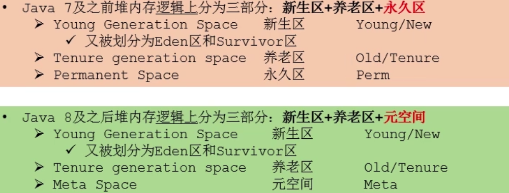
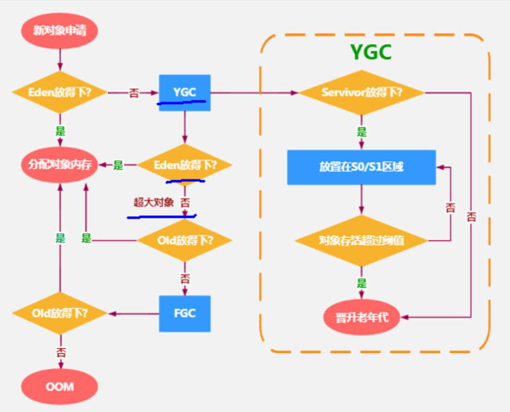
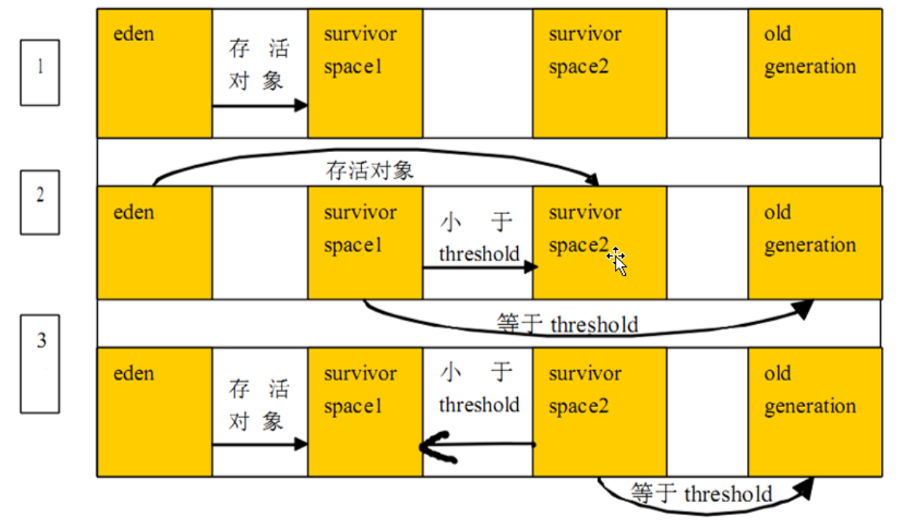
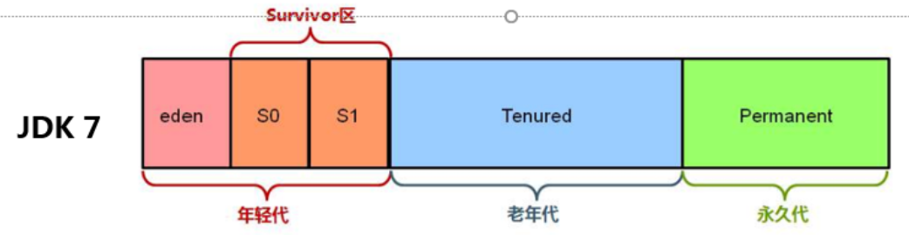
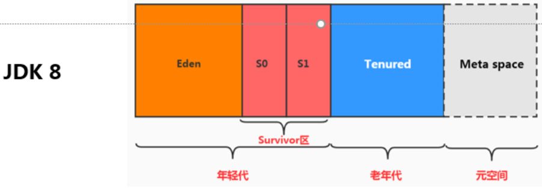
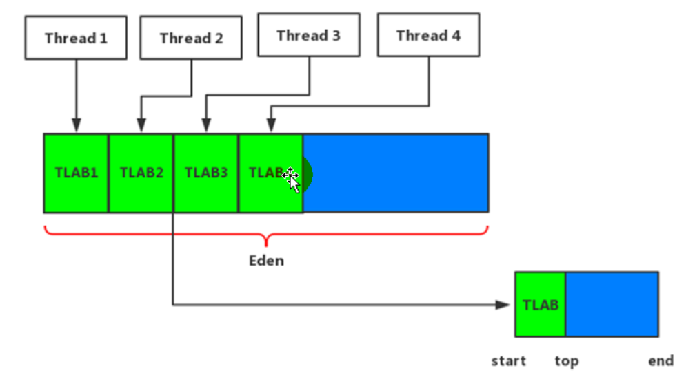
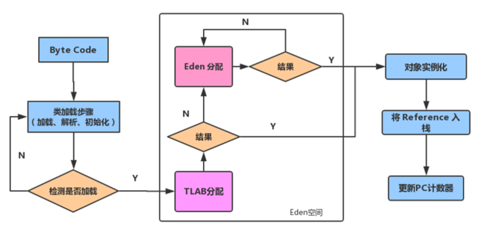

## 1 基本介绍

一个JVM实例只存在一个堆内存,堆也是Java内存管理的核心区域。Java堆区在JVM启动的时候即被创建,其空间大小也就确定了。是JVM管理的最大一块内存空间。堆内存的大小是可以调节的。

所有的线程共享Java堆,在这里还可以划分线程私有的缓冲区(ThreadLocal Allocation Buffer, TLAB)。

```
Heap
 PSYoungGen      total 153088K, used 10527K [0x0000000715a00000, 0x0000000720480000, 0x00000007c0000000)
  eden space 131584K, 8% used [0x0000000715a00000,0x0000000716447c98,0x000000071da80000)
  from space 21504K, 0% used [0x000000071ef80000,0x000000071ef80000,0x0000000720480000)
  to   space 21504K, 0% used [0x000000071da80000,0x000000071da80000,0x000000071ef80000)
 ParOldGen       total 349696K, used 0K [0x00000005c0e00000, 0x00000005d6380000, 0x0000000715a00000)
  object space 349696K, 0% used [0x00000005c0e00000,0x00000005c0e00000,0x00000005d6380000)
 Metaspace       used 3191K, capacity 4496K, committed 4864K, reserved 1056768K
  class space    used 344K, capacity 388K, committed 512K, reserved 1048576K
```



## 2 分类

存储在JVM中的Java对象可以被划分为两类：

一类是生命周期较短的瞬时对象,这类对象的创建和消亡都非常迅速；另外一类对象的生命周期却非常长,在某些极端的情况下还能够与JVM的生命周期
保持一致。

Java堆区进一步细分的话,可以划分为年轻代(YoungGen)和老年代(OldGen)
其中年轻代又可以划分为Eden空间、Survivor0空间和Survivor1空间(有时也叫做from区、to区）。

配置新生代与老年代在堆结构的占比。

- 默认-XXNewRatio=2，表示新生代占1，老年代占2，新生代占整个堆的1/3
- 可以修改-XXNewRatio=4,表示新生代占1，老年代占4,新生代占整个堆的1/5

## 3 对象分配过程

1. new的对象先放伊甸园区。此区有大小限制。
2. 当伊甸园的空间填满时,程序又需要创建对象, JVM的垃圾回收器将对伊甸园区进行垃圾回收(Minor GC),将伊甸园区中的不再被其他对象所引用的对象进行销毁。再加载新的对象放到伊甸园区
3. 然后将伊甸园中的剩余对象移动到幸存者0区。
4. 如果再次触发垃圾回收,此时上次幸存下来的放到幸存者0区的,如果没有回收,就会放到幸存者1区。
5. 如果再次经历垃圾回收,此时会重新放回幸存者0区,接着再去幸存者1区。
6. 啥时候能去养老区呢?可以设置次数。默认是15次。可以设置参数 -XXMaxTenuriingThreshold=<N>进行设置。



## 4 Young GC、Major GC、Full GC

JVM在进行GC时,并非每次都对上面三个内存区域一起回收的,大部分时候回收的都是指新生代。
针对HotSpot VM的实现,它里面的GC按照回收区域又分为两大种类型：一种是部分收集(Partial GC)，一种是整堆收集（Full GC)

部分收集：不是完整收集整个Java堆的垃圾收集。其中又分为：

1. 新生代收集(Minor GC / Young GC) ： 只是新生代的垃圾收集

2. 老年代收集（Major GC /old GC）：只是老年代的垃圾收集。

   目前，只有CMS GC会有单独收集老年代的行为。很多时候Major GC会和Full GC混淆使用，需要具体分辨是老年代回收还是整堆回收。

混合收集(Mixed GC)：收集整个新生代以及部分老年代的垃圾收集。
目前，只有G1 GC会有这种行为

整堆收集（Full GC）：收集整个java堆和方法区的垃圾收集。

### 4.1 触发机制

**年轻代GC(Minor GC)**

当年轻代空间不足时，就会触发Minor GC，这里的年轻代满指的是Eden代满, Survivor满不会引发GC。 (每次Minor GC会清理年轻代的内存。）
Minor GC非常频繁,一般回收速度也比较快。Minor GC会引发STW,暂停其它用户的线程,等垃圾回收结束,用户线程才恢复运行。



**老年代GC (Major GC/Full GC）**

出现了Major GC,经常会伴随至少一次的Minor GC (但非绝对的,在Parallel Scavenge收集器的收集策略里就有直接进行Major GC的策略选择过程)。也就是在老年代空间不足时,会先尝试触发Minor GC。如果之后空间还不足,则触发Major GC

Major GC的速度一般会比Minor GC慢10倍以上，STW的时间更长。如果Major GC 后，内存还不足，就报OOM了。

为什么要分为新生区和老年去？

因为大部分的对象都是朝生新死的。分了后可以优化gc性能。





什么样的对象会进入老年代？

（1）大对象

所谓的大对象是指需要大量连续内存空间的java对象，最典型的大对象就是那种很长的字符串以及数组，大对象对虚拟机的内存分配就是坏消息，尤其是一些朝生夕灭的短命大对象，写程序时应避免。

（2）长期存活的对象，默认年龄15

虚拟机给每个对象定义了一个对象年龄(Age)计数器，如果对象在Eden出生并经过第一次Minor GC后仍然存活，并且能被Survivor容纳的话，将被移动到Survivor空间中，并且对象年龄设为1。对象在Survivor区中每熬过一次Minor GC，年龄就增加1，当他的年龄增加到一定程度(默认是15岁)， 就将会被晋升到老年代中。对象晋升到老年代的年龄阈值，可以通过参数-XX：MaxTenuringThreshold设置。

（3）动态对象年龄判定：为了能更好地适应不同程度的内存状况，虚拟机并不是永远地要求对象的年龄必须达到了MaxTenuringThreshold才能晋升到老年代，**如果在Survivor空间中相同年龄的所有对象大小的总和大于Survivor空间的一半，年龄大于或等于该年龄的对象就可以直接进入老年代**，无须等到MaxTenuringThreshold中要求的年龄。

（4）在一次安全Minor GC 中，仍然存活的对象不能在另一个Survivor 完全容纳，则会通过担保机制进入老年代。

## 5 为什么有TLAB (Thread Local Allocation Buffer ) ?

堆区是线程共享区域，任何线程都可以访问到堆区中的共享数据。
由于对象实例的创建在JVM中非常频繁,因此在并发环境下从堆区中划分内存空间是线程不安全的为避免多个线程操作同一地址,需要使用加锁等机制,进而影响分配速度。

**什么是TLAB?**

从内存模型而不是垃圾收集的角度,对Eden区域继续进行划分,JVM为每个线程分配了一个私有缓存区域,它包含在Eden空间内。
多线程同时分配内存时,使用TLAB可以避免一系列的非线程安全问题,同时还能够提升内存分配的吞吐量,因此我们可以将这种内存分配方式称之为快速分配策略。



对象分配TLAB过程：



尽管不是所有的对象实例都能够在TLAB中成功分配内存,但JVM确实是将TLAB作为内存分配的首选。

默认情况下, TLAB空间的内存非常小,仅占有整个Eden空间的1%
一旦对象在TLAB空间分配内存失败时，JVM就会尝试着通过使用加锁机制确保数据操作的原子性,从而直接在Eden空间中分配内存。

## 6 逃逸分析：代码优化

- 栈上分配。将堆分配转化为栈分配。如果一个对象在子程序中被分配，要使指向该对象的指针永远不会逃逸,对象可能是栈分配的候选,而不是堆分配。
- 同步省略。如果一个对象被发现只能从一个线程被访问到,那么对于这个对象的操作可以不考虑同步。
- 分离对象或标量替换。有的对象可能不需要作为一个连续的内存结构存在也可以被访问到，那么对象的部分（或全部)可以不存储在内存，而是存储在CPU寄存器中。

## 7 常用参数配置

```
/**
 * 测试堆空间常用的jvm参数：
 * -XX+PrintFlagsInitial  查看所有的参数的默认初始值
 * -XX+PrintFlagsFinal  ：查看所有的参数的最终值（可能会存在修改，不再是初始值）
 *      具体查看某个参数的指令： jps：查看当前运行中的进程
 *                             jinfo -flag SurvivorRatio 进程id
 *
 * -Xms：初始堆空间内存 （默认为物理内存的1/64）
 * -Xmx：最大堆空间内存（默认为物理内存的1/4）
 * -Xmn：设置新生代的大小。(初始值及最大值)
 * -XXNewRatio：配置新生代与老年代在堆结构的占比
 * -XXSurvivorRatio：设置新生代中Eden和S0/S1空间的比例
 * -XXMaxTenuringThreshold：设置新生代垃圾的最大年龄
 * -XX+PrintGCDetails：输出详细的GC处理日志
 * 打印gc简要信息：① -XX+PrintGC   ② -verbosegc
 * -XXHandlePromotionFailure：是否设置空间分配担保
 */
```

