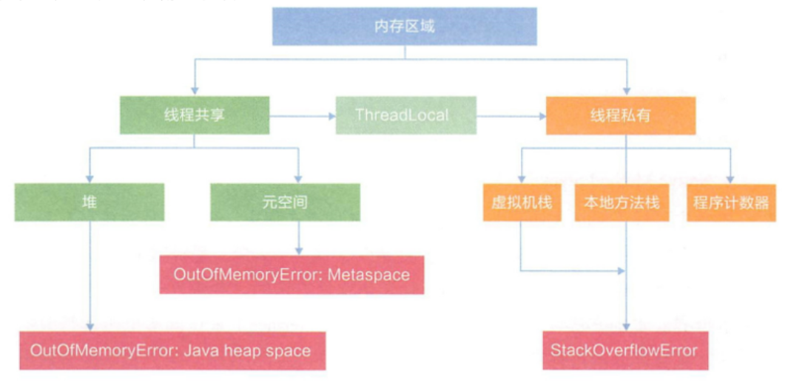
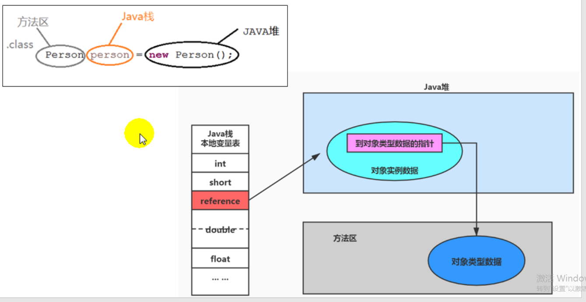
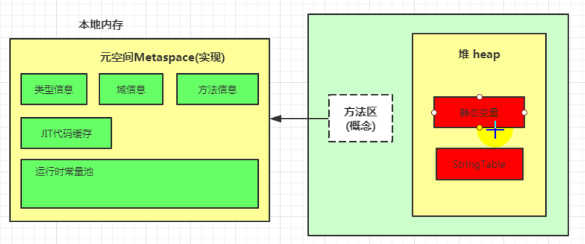

## 1 运行时数据区结构图



## 2 栈、堆、方法区关系



## 3 参数设置

jdk8及以后，元数据区大小可以使用参数-XX:MetaspaceSize和-XX:MaxMetaspaceSize指定。XX:MaxMetaspaceSize 的值是-1，即没有限制。

与永久代不同，如果不指定大小,默认情况下,虚拟机会耗尽所有的可用系统内存。如果元数据区发生溢出，虚拟机一样会抛出异常OutOfMemoryError。

为了避免频繁地GC ,建议将XX:MetaspaceSize设置为一个相对较高的值。

```
 *  jdk7及以前：
 *  -XX:PermSize=100m -XX:MaxPermSize=100m
 *
 *  jdk8及以后：
 *  -XX:MetaspaceSize=100m  -XX:MaxMetaspaceSize=100m
```

## 4 方法区内部结构

**类型信息**

对每个加载的类型（类class、接口interface、枚举enum、注解annotation），JVM必须在方法区中存储以下类型信息：
① 这个类型的完整有效名称（全名=包名.类名）
②这个类型直接父类的完整有效名(对于interface或是java.lang.Object,都没有父类)
③这个类型的修饰符(public,abstract, final的某个子集)
④这个类型直接接口的一个有序列表

**域（Field）信息**

JVM必须在方法区中保存类型的所有域的相关信息以及域的声明顺序。
域的相关信息包括: 域名称、域类型、域修饰符(public, private,protected, static,final,volatile,transient的某个子集)

**方法(Method)信息**

- JVM必须保存所有方法的以下信息，同域信息一样包括声明顺序：
- 方法名称
- 方法的返回类型(或void)
- 方法参数的数量和类型(按顺序)
- 方法的修饰符(public, private, protected, static, final,synchronized, native, abstract的一个子集）
- 方法的字节码(bytecodes)、操作数栈、局部变量表及大小 (abstract和native方法除外）
- 异常表
- 每个异常处理的开始位置、结束位置、代码处理在程序计数器中的偏移地址、被捕获的异常类的常量池索引



## 5 垃圾回收

方法区的垃圾收集主要回收两部分内容:常量池中废弃的常量和不再使用的类型。