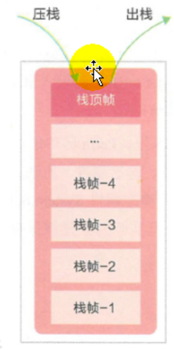
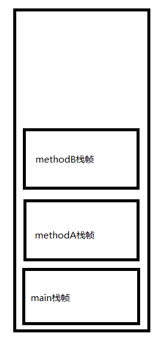
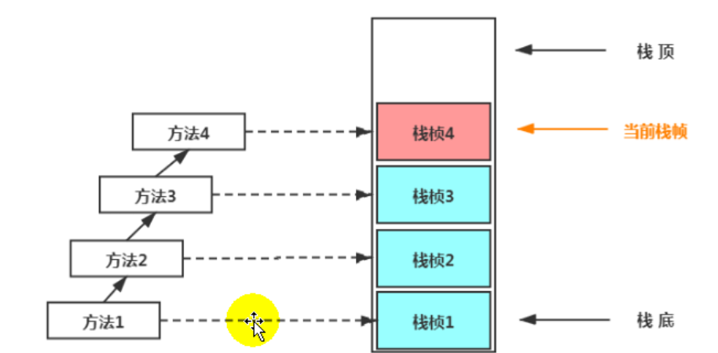
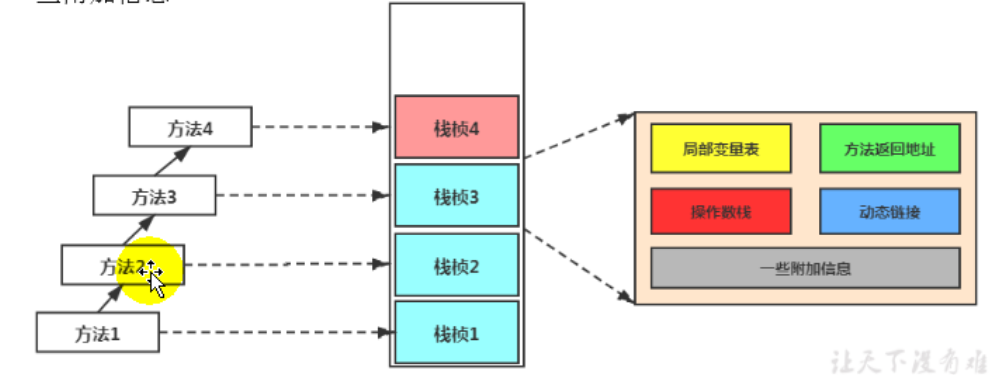
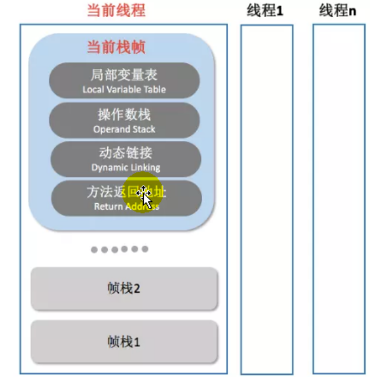
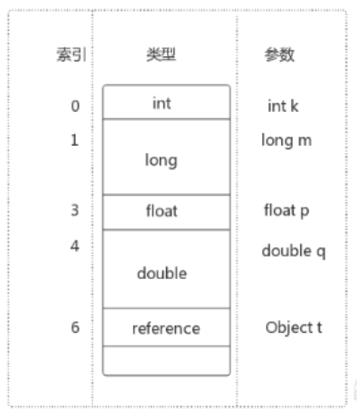
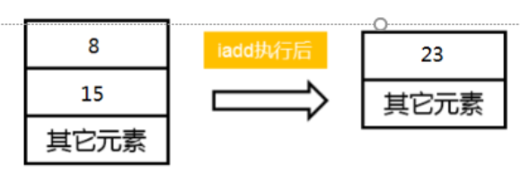

## 1 基本信息

### 1.1 背景

由于跨平台性的设计，Java的指令都是根据栈来设计的。不同平台CPU架构不同，所以不能设计为基于寄存器的。

优点是跨平台，指令集小，编译器容易实现，缺点是性能下降，实现同样的功能需要更多的指令。

### 1.2 栈介绍

Java虚拟机栈(Java Virtual Machine Stack) ，早期也叫Java栈。

每个线程在创建时都会创建一个虚拟机栈，其内部保存一个个的栈帧(Stack Frame) ，对应着一次次的Java方法调用。即Java虚拟机栈的基本单位是栈帧。

Java虚拟机栈是线程私有的，它的生命周期和线程一致。

栈的作用：主管Java程序的运行，它保存方法的局部变量、部分结果，并参与方法的调用和返回。

### 1.3 栈和堆的关系

栈是运行时的单位，而堆是存储的单位。

即：栈解决程序的运行问题，即程序如何执行，或者说如何处理数据。堆解决的是数据存储的问题，即数据怎么放、放在哪儿。

### 1.4 栈的特点

每个线程都有自己的栈，栈中的数据都是以栈帧（Stack Frame）的格式存在。己在这个线程上正在执行的每个方法都各自对应一个栈帧。
栈帧是一个内存区块，是一个数据集，维系着方法执行过程中的各种数据信息。

栈是一种快速有效的分配存储方式，访问速度仅次于程序计数器，JVM直接对Java栈的操作只有两个：

- 每个方法执行，伴随着进栈（入栈、压栈)
- 执行结束后的出栈工作

对于栈来说不存在垃圾回收问题，但存在OOM的问题。



```
public class StackTest {

    public static void main(String[] args) {
        StackTest test = new StackTest();
        test.methodA();
    }

    public void methodA() {
        int i = 10;
        int j = 20;

        methodB();
    }

    public void methodB(){
        int k = 30;
        int m = 40;
    }
}
```

当执行methodB时，Java虚拟机栈的图：



## 2  栈大小设置

**栈中可能出现的异常**

Java虚拟机规范允许Java栈的大小是动态的或者是固定不变的。如果采用固定大小的Java虚拟机栈，那每一个线程的Java虚拟机栈容量，可以在线程创建的时候独立选定。如果线程请求分配的栈容量超过Java虚拟机栈允许的最大容量，Java虚拟机将会抛出一个StackOverflowError 异常。

如果Java虚拟机栈可以动态扩展，并且在尝试扩展的时候无法申请到足够的内存，或者在创建新的线程时没有足够的内存去创建对应的虚拟机栈，那Java虚拟机将会抛出一个OutOfMemoryError 异常。

**设置栈内存大小**

使用参数-xss选项来设置线程的最大栈空间，栈的大小直接决定了函数调用的最大可达深度。

> 设置栈的大小： -Xss256k

## 3 栈原理

不同线程中所包含的栈帧是不允许存在相互引用的，即不可能在一个栈帧之中引用另外一个线程的栈帧。

如果当前方法调用了其他方法，方法返回之际，当前栈帧会传回此方法的执行结果给前一个栈帧，接着，虚拟机会丢弃当前栈帧，使得前一个栈帧重新成为当前栈帧。

Java方法有两种返回函数的方式，一种是正常的函数返回，使用return指令;另外一种是抛出异常。不管使用哪种方式，都会导致栈帧被弹出。



## 4 栈内部结构

- 局部变量表（Local Variables)
- 操作数栈(operand Stack) （或表达式栈）
- 动态链接(Dynamic Linking) (或指向运行时常量池的方法引用)
- 方法返回地址（Return Address） （或方法正常退出或者异常退出的定义）
- 一些附加信息





### 4.1 局部变量表

- 局部变量表也被称之为局部变量数组或本地变量表；
- 定义为一个数字数组，主要用于存储方法参数和定义在方法体内的局部变量这些数据类型包括各类基本数据类型、对象引用(reference) ，以及
  returnAddress类型。
- 由于局部变量表是建立在线程的栈上，是线程的私有数据，因此不存在数据局部变量表所需的容量大小是在编译期确定下来的，并保存在方法的Code
  属性的maximum local variables数据项中。在方法运行期间是不会改变局部变量表的大小的。
- 局部变量表所需的容量大小是在编译期确定下来的，并保存在方法的Code属性的maximum local variables数据项中。在方法运行期间是不会改变局部变量表的大小的。
- 方法嵌套调用的次数由栈的大小决定。一般来说，栈越大，方法嵌套调用次数越多。对一个函数而言，它的参数和局部变量越多，使得局部变量表膨胀，它的栈帧就越大，以满足方法调用所需传递的信息增大的需求。进而函数调用就会占用更多的栈空间，导致其嵌套调用次数就会减少。
- 局部变量表中的变量只在当前方法调用中有效。在方法执行时，虚拟机通过使用局部变量表完成参数值到参数变量列表的传递过程。当方法调用结束后，
  随着方法栈帧的销毁，局部变量表也会随之销毁。
- 局部变量表中的变量也是重要的垃圾回收根节点，只要被局部变量表中直接或间接引用的对象都不会被回收。

**slot**

参数值的存放总是在局部变量数组的index0开始，到数组长度-1的索引结局部变量表，最基本的存储单元是Slot (变量槽)

局部变量表中存放编译期可知的各种基本数据类型(8种)，引用类型(reference)， returnAddress类型。

在局部变量表里，32位以内的类型只占用一个slot（包括returnAddress类型) ， 64位的类型(long和double)占用两个slot。

byte 、short 、char 在存储前被转换为int， boolean 也被转换为int， 0 表示false ，非0表示true。



**局部变量表的重用**

```
public void test4() {
        int a = 0;
        {
            int b = 0;
            b = a + 1;
        }
        //变量c使用之前已经销毁的变量b占据的slot的位置
        int c = a + 1;
    }
```

```
 LineNumberTable:
        line 53: 0
        line 55: 2
        line 56: 4
        line 59: 8
        line 60: 12
 LocalVariableTable:
        Start  Length  Slot  Name   Signature
            4       4     2     b   I
            0      13     0  this   Lcom/atguigu/java1/LocalVariablesTest;
            2      11     1     a   I
           12       1     2     c   I
```

这里b的作用域开始4，结束4，start：4对应代码56行，length=4 代码作用域长度，即b的作用域就在内部代码块范围，所以c可以复用b的spot的位置

### 4.2 操作数栈

栈可以使用数组和链表来实现。

每一个独立的栈帧中除了包含局部变量表以外，还包含一个后进先出(Last-2n-First-Out)的操作数栈，也可以称之为表达式栈(Expression Stack) 。

操作数栈，在方法执行过程中，根据字节码指令，往栈中写入数据或提取数据，即入栈(push) /出栈(pop)。





某些字节码指令将值压入操作数栈，其余的字节码指令将操作数取出栈。使用它们后再把结果压入栈。比如:执行复制、交换、求和等操作

源码：

```
    public void test5Temp(){
        int a = 10;
        int b = a + 1;
        int c = a + 1;
    }
```

解析：

```
  public void test5Temp();
    descriptor: ()V
    flags: (0x0001) ACC_PUBLIC
    Code:
      stack=2, locals=4, args_size=1 //栈大小2  局部变量表大小4  
         0: bipush        10 //将常量压入栈中
         2: istore_1  //将一个数值从操作数栈存储到局部变量表中的第1位 
         3: iload_1 //第1个变量压入操作数栈
         4: iconst_1 //将1压入栈中
         5: iadd //执行求和指令
         6: istore_2 //将结果存储到局部变量表的第2位
         7: iload_1 //第1个变量压入操作数栈
         8: iconst_1 //将1压入栈中
         9: iadd //执行求和指令
        10: istore_3//将结果存储到局部变量表的第3位
        11: return //返回
      LineNumberTable: //行数对应表
        line 70: 0
        line 71: 3
        line 72: 7
        line 73: 11
      LocalVariableTable: //局部变量表
        Start  Length  Slot  Name   Signature
            0      12     0  this   Lcom/atguigu/java1/LocalVariablesTest;
            3       9     1     a   I
            7       5     2     b   I
           11       1     3     c   I
```


操作数栈，主要用于保存计算过程的中间结果，同时作为计算过程中变量临时的存储空间。

操作数栈就是JVM执行引擎的一个工作区，当一个方法刚开始执行的时候，一个新的栈帧也会随之被创建出来，这个方法的操作数栈是空的。
每一个操作数栈都会拥有一个明确的栈深度用于存储数值，其所需的最大深度在编译期就定义好了，保存在方法的Code属性中，为max_stack的
值。

栈中的任何一个元素都是可以任意的Java数据类型。

- 32bit的类型占用一个栈单位深度
- 64bit的类型占用两个栈单位深度

> 操作数栈并非采用访问索引的方式来进行数据访问的，而是只能通过标准的入栈(push)和出栈(pop)操作来完成一次数据访问。

如果被调用的方法带有返回值的话，其返回值将会被压入当前栈帧的操作数栈中，并更新PC寄存器中下一条需要执行的字节码指令。

操作数栈中元素的数据类型必须与字节码指令的序列严格匹配,这由编译器在编译器期间进行验证,同时在类加载过程中的类检验阶段的数据流分
析阶段要再次验证。

另外，我们说Java虚拟机的解释引擎是基于栈的执行引擎，其中的栈指的就是操作数栈。

**栈顶缓存**

由于操作数是存储在内存中的,因此频繁地执行内存读/写操作必然会影响执行速度。为了解决这个问题, HotSpot JVM的设计者们提出了栈顶
缓存(Tos, Top-of-Stack Cashing)技术,将栈顶元素全部缓存在物理CPU的寄存器中,以此降低对内存的读/写次数,提升执行引擎的执行效率。

### 4.3 动态链接

每一个栈帧内部都包含一个指向运行时常量池中该栈帧所属方法的引用。包含这个引用的目的就是为了支持当前方法的代码能够实现动态链接(Dynamic Linking)。比如：invokedynamic指令

在Java源文件被编译到字节码文件中时，所有的变量和方法引用都作为符号引用(Symbolic Reference)保存在class文件的常量池里。比如:描述一个方法调用了另外的其他方法时,就是通过常量池中指向方法的符号引用来表示的，那么动态链接的作用就是为了将这些符号引用转换为调用方法的直接引用。

```
    public static void testStatic(){
        System.out.println(11);
    }
```

javap解析System.out.println(11);

```
23: invokevirtual #7 
```

通过查找常量池：

```
Constant pool:
   #7 = Methodref          #65.#66        // java/io/PrintStream.println:(I)V
  #65 = Class              #80            // java/io/PrintStream
  #66 = NameAndType        #81:#82        // println:(I)V
  #80 = Utf8               java/io/PrintStream
  #81 = Utf8               println
  #82 = Utf8               (I)V
```

常量池的作用,就是为了提供一些符号和常量，便于脂令的识别。

**静态链接：**

当一个字节码文件被装载进JVM内部时,如果被调用的目标方法在编译期可知,且运行期保持不变时。这种情况下将调用方法的符号引用转换为直接引用的过程称之为静态链接。

**动态链接：**

如果被调用的方法在编译期无法被确定下来,也就是说,只能够在程序运行期将调用方法的符号引用转换为直接引用,由于这种引用转换过程具备动态性,因此也就被称之为动态链接。

### 4.4方法绑定

在JVM中,将符号引用转换为调用方法的直接引用与方法的绑定机制相关。

```
public Cat(){
   super();//表现为：早期绑定
}

public Cat(String name){
   this();//表现为：早期绑定
}
public void showAnimal(Animal animal){ //animal可能时接口，可能时抽象类，可能是父类，不能确定animal
   animal.eat();//表现为：晚期绑定
}
```

对应的方法的绑定机制为:早期绑定和晚期绑定。绑定是一个字段、方法或者类在符号引用被替换为直接引用的过程，这仅仅发生一次。

**早期绑定：**

早期绑定就是指被调用的目标方法如果在编译期可知,且运行期保持不变时,即可将这个方法与所属的类型进行绑定,这样一来,由于明确了被调用的目标方法究竟是哪一个,因此也就可以使用静态链接的方式将符号引用转换为直接引用。

**晚期绑定：**

如果被调用的方法在编译期无法被确定下来，只能够在程序运行期根据实际的类型绑定相关的方法,这种绑定方式也就被称之为晚期绑定。

抽象、封装、继承和多态等面向对象特性,既然这一类的编程语言具备多态特性,那么自然也就具备早期绑定和晚期绑定两种绑定方式。

#### 4.4.1 方法调用

- invokestatic：该指令用于调用静态方法，即使用 static 关键字修饰的方法；
- invokespecial：该指令用于三种场景：调用实例构造方法，调用私有方法（即private关键字修饰的方法）和父类方法（即super关键字调用的方法）；
- invokeinterface：该指令用于调用接口方法，在运行时再确定一个实现此接口的对象；
- invokevirtual：该指令用于调用虚方法（就是除了上述三种情况之外的方法）；
- invokedynamic：在运行时动态解析出调用点限定符所引用的方法之后，调用该方法；在JDK1.7中推出，主要用于支持JVM上的动态脚本语言。

### 4.5 方法返回地址

本质上，方法的退出就是当前栈帧出栈的过程。此时，需要恢复上层方法的局部变量表、操作数栈、将返回值压入调用者栈帧的操作数栈、设置PC寄存器值等,让调用者方法继续执行下去。
正常完成出口和异常完成出口的区别在于：通过异常完成出口退出的不会给他的上层调用老产生任何的返回值。

