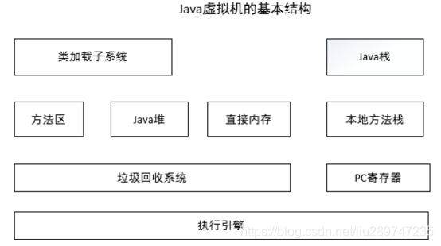
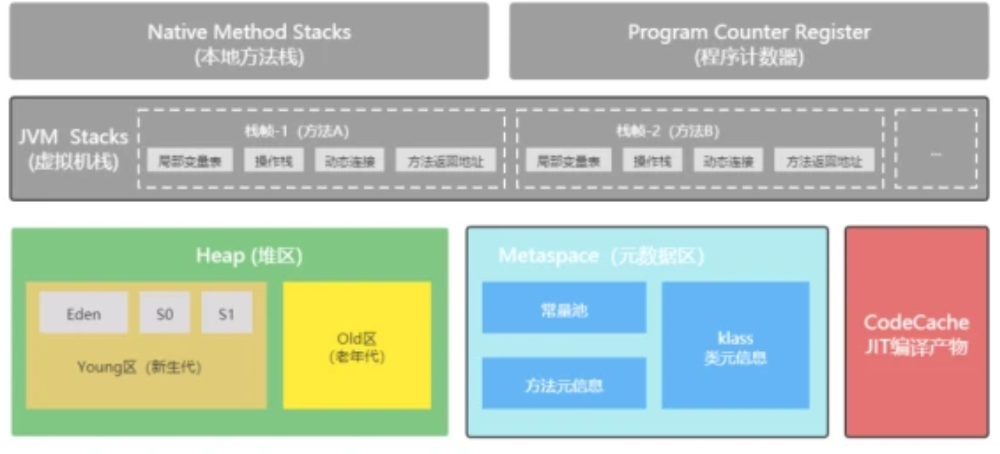
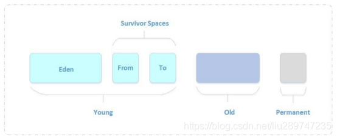
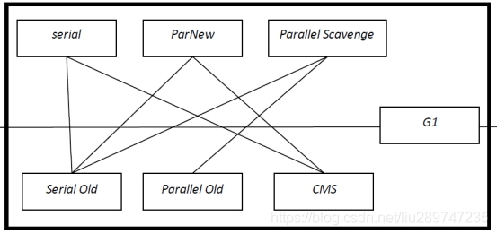
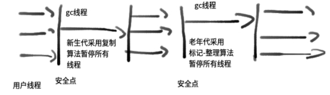
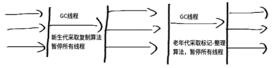
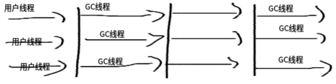
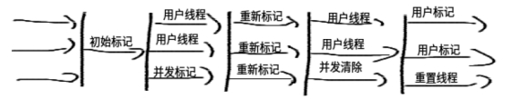
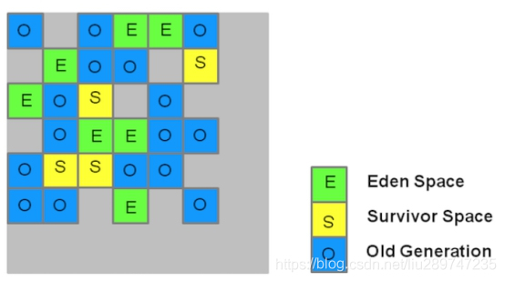
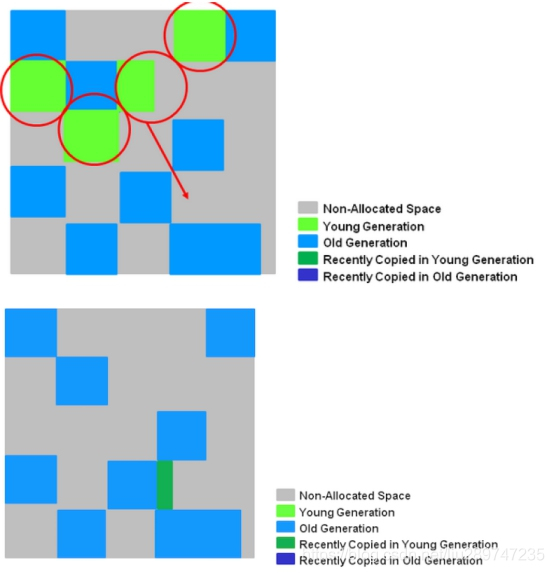

# 1 JVM虚拟机基本结构

## 类加载子系统

类加载子系统负责从文件系统或者网络中加载Class信息，加载的类信息存放于一块称为方法区的内存空间。

## 方法区

就是存放类信息、常量信息、包括字符串字面量和数字常量(这部分常量信息是Class文件中常量池部分的内存映射)等。

## Java堆

java堆在虚拟机启动的时候建立，它是java程序最主要的内存工作区域。几乎所有的java对象实例都存放在java堆中。堆空间是所有线程共享的，这是一块与java应用密切相关的内存空间。 

## 直接内存 

**java**的**NIO**库允许**java**程序使用直接内存，从而提高性能，通常直接内存会优于Java堆。读写频繁的场合可能会优先考虑使用。

## 垃圾回收系统

垃圾回收(Garbage Collection，简称GC)系统是**java**虚拟机的重要组成部分，垃圾回收器可以对方法区、**java**堆和直接内存进行回收。其中，**java**堆是垃圾收集器的工作重点。对于不再使用的垃圾对象，垃圾回收系统会在后台默默工作，默默查找、标识并释放垃圾对象，完成包括**java**堆、方法区和直接内存中的全自动化管理。 

System.gc()请求系统进行垃圾回收。至于系统是否立刻回收，则取决于系统中垃圾回收算法的实现以及系统执行时的情况。直接调用 gc 方法暗示着 Java 虚拟机做了一些努力来回收未用对象或失去了所有引用的对象，以便能够快速地重用这些对象当前占用的内存。当控制权从方法调用中返回时，虚拟机已经尽最大努力从所有丢弃的对象中回收了空间。 gc()函数的作用只是提醒虚拟机，不能保证垃圾回收一定会进行。

## Java栈 

JVM 是基于栈的。

Java 虚拟机的内存模型分为两部分：

（1）一部分是线程共享的，包括 Java 堆和方法区；

（2）另一部分是线程私有的，包括虚拟机栈和本地方法栈，以及程序计数器这一小部分内存。

虚拟机栈的栈元素是栈帧，当有一个方法被调用时，代表这个方法的栈帧入栈；当这个方法返回时，其栈帧出栈。因此，虚拟机栈中栈帧的入栈顺序就是方法调用顺序。

每一个java虚拟机线程都有一个私有的java栈，一个线程的java栈在线程创建的时候被创建，java栈中保存着帧信息，java栈中保存着局部变量、方法参数，同时和java方法的调用、返回密切相关。

### 局部变量表

方法中定义的局部变量以及方法的参数就存放在这张表中。局部变量表存放了编译期可知的各种基本数据类型（boolean、byte、char、short、int、float、long、double）、对象应用（reference类型——不同对象本身，可能是一个指向对象起始地址的引用指针，也可能是指向一个代表对象的句柄或其他与此对象相关的位置）和returnAddress类型(指向了一条字节码指令的地址)。

64位长度的long和double类型的数据会占用2个局部变量空间，其余的数据类型只占用1个。局部变量表所需要的内存空间在编译期间完成分配，当进入一个方法时，这个方法需要在帧中分配多大的局部变量空间是完全确定的，在方法运行期间不会改变局部变量表的大小。

### 操作数栈

用来存放操作数，Java 程序编译之后就变成了一条条字节码指令，其形式类似汇编，但和汇编有不同之处：汇编指令的操作数存放在数据段和寄存器中，可通过存储器或寄存器寻址找到需要的操作数；而 Java 字节码指令的操作数存放在操作数栈中，当执行某条带 n 个操作数的指令时，就从栈顶取 n 个操作数，然后把指令的计算结果（如果有的话）入栈。因此，当我们说 JVM 执行引擎是基于栈的时候，其中的“栈”指的就是操作数栈。

### 动态连接

每一个栈帧都包含指向运行时常量池中该栈帧所属方法的引用，持有这个引用是为了支持方法调用过程中的动态连接。在Class文件的常量池中存有大量的符号引用，字节码中的方法调用指令就以常量池中指向方法的符号引用为参数。这些符号引用一部分会在类加载阶段或第一次使用的时候转化为直接引用，这种转化称为静态解析。另外一部分将在每一次的运行期期间转化为直接引用，这部分称为动态连接。

### 方法返回地址

### 帧数据区

栈还需要一些数据来支持常量池的解析，这里的帧数据区保存着访问常量池的指针，方便程序访问常量池，另外，当函数返回或者出现异常时，虚拟机必须有一个异常处理表，方便发送异常的时候找到异常的代码，因此异常处理表也是帧数据区的一部分。

推荐：https：//blog.csdn.net/shen_ming/article/details/81712391

## 本地方法栈 

本地方法栈和**java**栈非常类似，最大的不同在于**java**栈用于方法的调用，而本地方法栈则用于本地方法的调用，作为对**java**虚拟机的重要扩展，**java**虚拟机允许**java**直接调用本地方法（通常使用**C**编写） 

## PC寄存器 

**PC**（**Program Counter**）寄存器也是每一个**线程私有的空间**，**java**虚拟机会为每一个**java**线程创建**PC**寄存器。如果当前方法不是本地方法，**PC**寄存器就会指向当前正在被执行的指令。如果当前方法是本地方法，那么**PC**寄存器的值就是**undefined** 

## 执行引擎 

虚拟机最核心的组件就是执行引擎，负责执行虚拟机的字节码。一般会先进行编译成机器码后执行。现代虚拟机为了提高执行效率，会使用即时编译(just in time)技术将方法编译成机器码后再执行。 

Java HotSpot Client VM(-client)，为在客户端环境中减少启动时间而优化的执行引擎；本地应用开发使用。（如：eclipse） 

Java HotSpot Server VM(-server)，为在服务器环境中最大化程序执行速度而设计的执行

引擎。应用在服务端程序。（如：tomcat） 

Java HotSpot Client模式和Server模式的区别：

当虚拟机运行在**-client**模式的时候**，**使用的是一个代号为**C1**的轻量级编译器**，** 而**-server**模式启动的虚拟机采用相对重量级**，**代号为**C2**的编译器**. C2**比**C1**编译器编译的相对彻底**，**服务起来之后**，**性能更高 

在jre/lib/jvm.cfg文件中可以设置  -server KNOWN -client IGNORE

# 2 堆、栈、方法区概念和联系

堆解决的是数据的存储的问题，即数据怎么放、放在哪

栈解决程序的运行问题，即程序如何执行，或者说如何处理数据。

方法区则是辅助堆栈的快永久区(Perm)，解决堆栈信息的产生，是先决条件。

例如：User user=new User()

new User()实例化出来的对象存储在java堆中。

User类信息、静态信息都存在于方法区中，而实例化的对象存储在java堆中

user 存放在java栈中，即User真实对象的一个引用。

# 3 堆结构及对象分代 

## 3.1 分代介绍及必要性

java堆完全自动化管理，通过垃圾回收机制自动清理垃圾对象

Java虚拟机根据对象存活的周期不同，把堆内存划分为几块，一般分为新生代、老年代和永久代（对HotSpot虚拟机而言），这就是JVM的内存分代策略。 

堆内存是虚拟机管理的内存中最大的一块，也是垃圾回收最频繁的一块区域，我们程序所有的对象实例都存放在堆内存中。给堆内存分代是为了提高对象内存分配和垃圾回收的效率。

新创建的对象会在新生代中分配内存，经过多次回收仍然存活下来的对象存放在老年代中，静态属性、类信息等存放在永久代中，新生代中的对象存活时间短，只需要在新生代区域中频繁进行GC，老年代中对象生命周期长，内存回收的频率相对较低，不需要频繁进行回收，永久代中回收效果太差，一般不进行垃圾回收，还可以根据不同年代的特点采用合适的垃圾收集算法来提升了收集效率。 

## 3.2 分代的划分

**Java**虚拟机将堆内存划分为新生代、老年代和永久代，永久代是**HotSpot**虚拟机特有的概念（**JDK1.8**之后为**metaspace**替代永久代），它采用永久代的方式来实现方法区，其他的虚拟机实现没有这一概念，而且**HotSpot**也有取消永久代的趋势，在**JDK 1.7**中**HotSpot**已经开始了**“**去永久化**”**，把原本放在永久代的字符串常量池移出。永久代主要存放常量、类信息、静态变量等数据，与垃圾回收关系不大，新生代和老年代是垃圾回收的主要区域。 

新生代分为Eden区、s0区、s1区，s0和s1也被称为from和to区域，s0、s1是两块大小相等并且可以互换的空间。

绝大数情况下，对象首先分配在eden区，经过一次回收后，如果对象还存在则进入s0或者s1，之后每经过一次新生代回收，如果对象存活则它的年龄+1，当对象年龄达到一定年龄后进入老年代

| Eden区 | s0区 | S1区 | Tenured区 |
| ------ | ---- | ---- | --------- |
|        |      |      |           |

### 3.2.1 新生代

对象优先存放在新生代中，新生代对象朝生夕死，存活率很低，在新生代中，常规应用进行一次垃圾收集一般可以回收**70% ~ 95%** 的空间，回收效率很高。 

**HotSpot**将新生代划分为三块，一块较大的**Eden**空间和两块较小的**Survivor**空间，默认比例为**8**：**1**：**1**。新生成的对象在**Eden**区分配（大对象除外，大对象直接进入老年代），当**Eden**区没有足够的空间进行分配时，虚拟机将发起一次**Minor GC**。

**GC**开始时，对象只会存在于**Eden**区和**From Survivor**区，**To Survivor**区是空的（作为保留区域）。**GC**进行时，**Eden**区中所有存活的对象都会被复制到**To Survivor**区，而在**From Survivor**区中，仍存活的对象会根据它们的年龄值决定去向，年龄值达到年龄阀值（默认为**15**，新生代中的对象每熬过一轮垃圾回收，年龄值就加**1**，**GC**分代年龄存储在对象的**header**中）的对象会被移到老年代中，没有达到阀值的对象会被复制到**To Survivor**区。接着清空**Eden**区和**From Survivor**区，新生代中存活的对象都在**To Survivor**区。接着， **From Survivor**区和**To Survivor**区会交换它们的角色，也就是新的**To Survivor**区就是上次**GC**清空的**From Survivor**区，新的**From Survivor**区就是上次**GC**的**To Survivor**区，总之，不管怎样都会保证**To Survivor**区在一轮**GC**后是空的。**GC**时当**To Survivor**区没有足够的空间存放上一次新生代收集下来的存活对象时，需要依赖老年代进行分配担保，将这些对象存放在老年代中。 

### 3.2.2 老年代

在新生代中经历了多次**GC**后仍然存活下来的对象会进入老年代中。老年代中的对象生命周期较长，存活率比较高，在老年代中进行**GC**的频率相对而言较低，而且回收的速度也比较慢。 

什么样的对象会进入老年代：

- （1）大对象

  所谓的大对象是指需要大量连续内存空间的java对象，最典型的大对象就是那种很长的字符串以及数组，大对象对虚拟机的内存分配就是坏消息，尤其是一些朝生夕灭的短命大对象，写程序时应避免。

- （2）长期存活的对象，默认年龄15

  虚拟机给每个对象定义了一个对象年龄(Age)计数器，如果对象在Eden出生并经过第一次Minor GC后仍然存活，并且能被Survivor容纳的话，将被移动到Survivor空间中，并且对象年龄设为1。对象在Survivor区中每熬过一次Minor GC，年龄就增加1，当他的年龄增加到一定程度(默认是15岁)， 就将会被晋升到老年代中。对象晋升到老年代的年龄阈值，可以通过参数-XX：MaxTenuringThreshold设置。

- （3）动态对象年龄判定：为了能更好地适应不同程度的内存状况，虚拟机并不是永远地要求对象的年龄必须达到了MaxTenuringThreshold才能晋升到老年代，**如果在Survivor空间中相同年龄的所有对象大小的总和大于Survivor空间的一半，年龄大于或等于该年龄的对象就可以直接进入老年代**，无须等到MaxTenuringThreshold中要求的年龄。

- （4）在一次安全Minor GC 中，仍然存活的对象不能在另一个Survivor 完全容纳，则会通过担保机制进入老年代。

### 3.2.3 永久代

永久代存储类信息、常量、静态变量、即时编译器编译后的代码等数据，对这一区域而

言，Java虚拟机规范指出可以不进行垃圾收集，一般而言不会进行垃圾回收。 

# 4 垃圾回收算法及分代垃圾收集器 

优缺点：https://blog.csdn.net/code_mzh/article/details/108609792

## 4.1 垃圾收集器的分类 

### 4.1.1 次收集器

**Scavenge GC**，指发生在新生代的**GC**，因为新生代的**Java**对象大多都是朝生夕死，所以**Scavenge GC**非常频繁，一般回收速度也比较快。当**Eden**空间不足以为对象分配内存时，会触发**Scavenge GC**。 

一般情况下，当新对象生成，并且在**Eden**申请空间失败时，就会触发**Scavenge GC**，对**Eden**区域进行**GC**，清除非存活对象，并且把尚且存活的对象移动到**Survivor**区。然后整理**Survivor**的两个区。这种方式的**GC**是对年轻代的**Eden**区进行，不会影响到年老代。因为大部分对象都是从**Eden**区开始的，同时**Eden**区不会分配的很大，所以**Eden**区的**GC**会频繁进行。因而，一般在这里需要使用速度快、效率高的算法，使**Eden**去能尽快空闲出来。 

当年轻代堆空间紧张时会被触发 

相对于全收集而言，收集间隔较短 

### 4.1.2 全收集器

**Full GC**，指发生在老年代的**GC**，出现了**Full GC**一般会伴随着至少一次的**Minor GC**（老年代的对象大部分是**Scavenge GC**过程中从新生代进入老年代），比如：分配担保失败。**Full GC**的速度一般会比**Scavenge GC**慢**10**倍以上。当老年代内存不足或者显式调用**System.gc()**方法时，会触发**Full GC**。 

当老年代或者持久代堆空间满了，会触发全收集操作 

可以使用**System.gc()**方法来显式的启动全收集 

全收集一般根据堆大小的不同，需要的时间不尽相同，但一般会比较长。 

### 4.1.3 垃圾回收器的常规匹配 

jdk1.8下测试下，搭配和图中有些差别  

默认收集器Parallel Scavenge  -XX：+UseParallelGC -XX：+UseParallelOldGC   PS Scavenge/PS MarkSweep
CMS垃圾收集器  -XX：+UseConcMarkSweepGC  ParNew/ConcurrentMarkSweep
Serial垃圾收集器  -XX：+UseSerialGC Copy/MarkSweepCompact
ParNew垃圾收集器 -XX：+UseParNewGC ParNew/MarkSweepCompact   jdk1.8已经弃用
G1垃圾收集器  -XX：+UseG1GC  G1 Young Generation/G1 Old Generation

| Young             | Tenured      | JVM options                              |
| ----------------- | ------------ | ---------------------------------------- |
| Serial            | Serial Old   | -XX:+UseSerialGC                         |
| Parallel Scavenge | Serial Old   | -XX:+UseParallelGC                       |
| Parallel New      | Serial Old   | -XX:+UseParNewGC                         |
| Serial            | Parallel Old | N/A                                      |
| Parallel Scavenge | Parallel Old | -XX:+UseParallelGC -XX:+UseParallelOldGC |
| Parallel New      | Parallel Old | N/A                                      |
| Serial            | CMS          | -XX:-UseParNewGC -XX:+UseConcMarkSweepGC |
| Parallel Scavenge | CMS          | N/A                                      |
| Parallel New      | CMS          | -XX:+UseParNewGC -XX:+UseConcMarkSweepGC |
| G1                | G1           | -XX:+UseG1GC                             |

总结：serial垃圾回收器能够搭配serial old

​      parnew能够搭配serial old和cms

​      parallel scavenge能够搭配parallel old

​      G1垃圾收集器能够同时处理新生代和老年代

## 4.2 垃圾回收器算法

### 引用计数法(Reference Counting)

比较古老的回收算法。原理是此对象有一个引用，即增加一个计数，删除一个引用则减少一个计数。垃圾回收时，只用收集计数为**0**的对象。此算法最致命的是无法处理循环引用的问题。 

### 标记-清除算法(Mark-Sweep)

此算法执行分两阶段。第一阶段从引用根节点开始标记所有被引用的对象，第二阶段遍历整个堆，把未标记的对象清除。此算法需要暂停整个应用，同时，会产生内存碎片。垃圾回收后的空间不是连续的，不连续的内存空间的工作效率要低于连续的内存空间。

### 复制算法(Copying)

此算法把内存空间划为两个相等的区域，每次只使用其中一个区域。垃圾回收时，把正在使用中的对象复制到另外一个区域中，之后清楚之前正在使用的内存块中所有的对象。此算法每次只处理正在使用中的对象，因此复制成本比较小，同时复制过去以后还能进行相应的内存整理，反复去交换两个内存的角色，完成垃圾收集，不会出现“碎片”问题。当然，此算法的缺点也是很明显的，就是需要两倍内存空间。（java中新生代的from和to空间就是使用这个算法）

### 标记压缩/整理算法(Mark-Compact)

在标记算法基础上做了优化，把存活的对象压缩到内存一端，而后进行垃圾清理。（java中老年代默认使用的就是标记压缩算法）

### 分代算法

就是根据对象的特点把内存分成N块，而后根据每个内存的特点使用不同的算法

对于新生代和老年代，新生代回收频率很高，但是每次回收耗时都很短，而老年代回收频率很低，但是耗时会相对较长，所以应该尽量减少咯阿年代的GC。

### 分区算法

其主要就是讲整个内存分为N多个小的空间，每个小空间都可以独立使用，这样细粒度的控制一次回收少多少个小空间，而不是对整个空间进行GC，从而提升性能，并减少GC的停顿时间。

## 4.3 分代垃圾回收器

### 4.3.1 串行收集器（Serial） 

**Serial**收集器是**Hotspot**运行在**Client**模式下的默认新生代收集器**，** 它的特点是：只用一个**CPU**（计算核心）**/**一条收集线程去完成**GC**工作**，** 且在进行垃圾收集时必须暂停其他所有的工作线程**(**“**Stop The World**” **-**后面简称**STW)**。可以使用**-XX：+UseSerialGC**打开。 

| 优点     |缺点                                                  | 应用场景                                                     |
| ------------------------------------------------------------ | ------------------------------------------------------------ | ------------------------------------------------------------ |
| 虽然是单线程收集**,** 但它却简单而高效**,** 在**VM**管理内存不大的情况下**(**收集几十**M~**一两百**M**的新生代**),** 停顿时间完全可以控制在几十毫秒**~**一百多毫秒内。没有线程交互（切换）开销 | 只用一个**CPU**（计算核心）**/**一条收集线程去完成**GC**工作**,** 且在进行垃圾收集时必须暂停其他所有的工作线程(STW) |在用户的桌面应用场景中，可用内存一般不大（几十M至一两百M），可以在较短时间内完成垃圾收集（几十MS至一百多MS）,只要不频繁发生，这是可以接受的|

### 4.3.2 并行收集器（ParNew） 

ParNew收集器其实是前面Serial的多线程版本， 除使用多条线程进行GC外， 包括Serial可用的所有控制参数、收集算法、STW、对象分配规则、回收策略等都与Serial完全一样(也是VM启用CMS收集器-XX： +UseConcMarkSweepGC的默认新生代收集器)。 

由于存在线程切换的开销， ParNew在单CPU的环境中比不上Serial， 且在通过超线程技术实现的两个CPU的环境中也不能100%保证能超越Serial. 但随着可用的CPU数量的增加， 收集效率肯定也会大大增加(ParNew收集线程数与CPU的数量相同， 因此在CPU数量过大的环境中， 可用-XX：ParallelGCThreads=<N>参数控制GC线程数)。 

| 优点                                | 缺点                                                         | 应用场景                                                     |
| ----------------------------------- | ------------------------------------------------------------ | ------------------------------------------------------------ |
| 多CPU下, 收集效率会比Serial大大增加 | 存在线程切换的开销，在单CPU的环境中比不上Serial,且在通过超线程技术实现的两个CPU的环境中也不能100%保证能超越Serial | 在Server模式下，ParNew收集器是一个非常重要的收集器，因为除Serial外，目前只有它能与CMS收集器配合工作； |

### 4.3.3 Parallel Scavenge收集器

与ParNew类似， Parallel Scavenge也是使用复制算法， 也是并行多线程收集器. 但与其他收集器关注尽可能缩短垃圾收集时间不同， Parallel Scavenge更关注系统吞吐量： 

系统吞吐量=运行用户代码时间/(运行用户代码时间+垃圾收集时间) 

停顿时间越短就越适用于用户交互的程序-良好的响应速度能提升用户的体验;而高吞吐量则适用于后台运算而不需要太多交互的任务-可以最高效率地利用CPU时间，尽快地完成程序的运算任务. Parallel Scavenge提供了如下参数设置系统吞吐量： 

**参数：**

-XX：MaxGCPauseMillis (毫秒数) 收集器将尽力保证内存回收花费的时间不超过设定值， 但如果太小将会导致GC的频率增加

-XX：GCTimeRatio (整数：0 < GCTimeRatio < 100) 是垃圾收集时间占总时间的比率

XX：+UseAdaptiveSizePolicy 启用GC自适应的调节策略： 不再需要手工指定-Xmn、-XX：SurvivorRatio、-XX：PretenureSizeThreshold等细节参数， VM会根据当前系统的运行情况收集性能监控信息， 动态调整这些参数以提供最合适的停顿时间或最大的吞吐量

### 4.3.4 Serial Old收集器 

Serial Old是Serial收集器的老年代版本， 同样是单线程收集器，使用“标记-整理”算法 

### 4.3.5 Parallel Old收集器 

Parallel Old是Parallel Scavenge收集器的老年代版本， 使用多线程和“标记－整理”算法， 吞吐量优先， 主要与Parallel Scavenge配合在注重吞吐量及CPU资源敏感系统内使用

### 4.3.6 CMS收集器（Concurrent Mark Sweep） 

CMS(Concurrent Mark Sweep)收集器是一款具有划时代意义的收集器， 一款真正意义上的并发收集器， 虽然现在已经有了理论意义上表现更好的G1收集器， 但现在主流互联网企业线上选用的仍是CMS(如Taobao、微店). 

CMS是一种以获取最短回收停顿时间为目标的收集器(CMS又称多并发低暂停的收集器)， 基于”标记-清除”算法实现， 整个GC过程分为以下4个步骤： 

1. 初始标记(CMS initial mark) 

2. 并发标记(CMS concurrent mark： GC Roots Tracing过程) 

3. 重新标记(CMS remark) 

4. 并发清除(CMS concurrent sweep： 已死对象将会就地释放， 注意：此处没有压缩) 

其中1，3两个步骤(初始标记、重新标记)仍需STW. 但初始标记仅只标记一下GC Roots能直接关联到的对象， 速度很快; 而重新标记则是为了修正并发标记期间因用户程序继续运行而导致标记产生变动的那一部分对象的标记记录， 虽然一般比初始标记阶段稍长， 但要远小于并发标记时间. 

**CMS**特点： 

1 CMS默认启动的回收线程数=(CPU数目+3)4 

当CPU数>4时， GC线程一般占用不超过25%的CPU资源， 但是当CPU数<=4时， GC线程可能就会过多的占用用户CPU资源， 从而导致应用程序变慢， 总吞吐量降低. 

2 无法处理浮动垃圾

可能出现Promotion Failure、Concurrent Mode Failure而导致另一次Full GC的产生： 浮动垃圾是指在CMS并发清理阶段用户线程运行而产生的新垃圾. 由于在GC阶段用户线程还需运行， 因此还需要预留足够的内存空间给用户线程使用， 导致CMS不能像其他收集器那样等到老年代几乎填满了再进行收集. 

-XX：CMSInitiatingOccupancyFraction参数来设置GC的触发百分比

-XX：+UseCMSInitiatingOccupancyOnly来启用该触发百分比

3 内存碎片整理

-XX：+UseCMSCompactAtFullCollection开关参数， 用于在Full GC后再执行一个碎片整理过程

-XX：CMSFullGCsBeforeCompaction用于设置在执行N次不进行内存整理的Full GC后， 跟着来一次带整理的(默认为0： 每次进入Full GC时都进行碎片整理). 

### 4.3.7 分区收集- G1收集器

G1(Garbage-First)是一款面向服务端应用的收集器**，** 主要目标用于配备多颗CPU的服务器治理大内存**.** 

-XX：+UseG1GC启用G1收集器**.** 

与其他基于分代的收集器不同， G1将整个Java堆划分为多个大小相等的独立区域(Region)， 虽然还保留有新生代和老年代的概念**，** 但新生代和老年代不再是物理隔离的了**，** 它们都是一部分Region(不需要连续**)**的集合

每块区域既有可能属于O区、也有可能是Y区， 因此不需要一次就对整个老年代/新生代回收. 而是当线程并发寻找可回收的对象时， 有些区块包含可回收的对象要比其他区块多很多. 虽然在清理这些区块时G1仍然需要暂停应用线程， 但可以用相对较少的时间优先回收垃圾较多的Region. 这种方式保证了G1可以在有限的时间内获取尽可能高的收集效率. 

G1的新生代收集跟ParNew类似： 存活的对象被转移到一个/多个Survivor Regions. 如果存活时间达到阀值， 这部分对象就会被提升到老年代.如图：  

G1新生代特点：

1 一整块堆内存被分为多个Regions. 

2 存活对象被拷贝到新的Survivor区或老年代.

3 年轻代内存由一组不连续的heap区组成**，** 这种方法使得可以动态调整各代区域尺寸**.** 

4 Young GC会有STW事件**，** 进行时所有应用程序线程都会被暂停**.** 

5 多线程并发GC.

G1\老年代GC\特点如下： 

并发标记阶段 

1 在与应用程序并发执行的过程中会计算活跃度信息**.** 

2 这些活跃度信息标识出那些regions最适合在STW期间回收(which regions will be best to reclaim during an evacuation pause).

3 不像CMS有清理阶段**.** 

再次标记阶段 

1 使用Snapshot-at-the-Beginning(SATB)算法比CMS快得多. 

2 空region直接被回收**.** 

拷贝**/**清理阶段(Copying/Cleanup Phase)*

1 年轻代与老年代同时回收**.** 

2 老年代内存回收会基于他的活跃度信息**.** 

