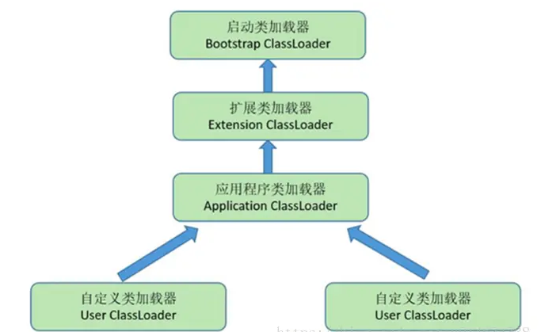
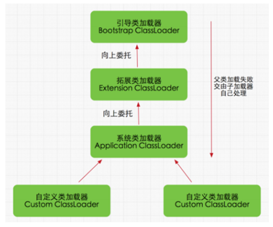

什么是双亲委派机制？介绍一些运作过程，双亲委派模型的好处； 

如果一个类加载器收到了类加载请求，它并不会自己先去加载，而是把这个请求委托给父类的加载器去执行，如果父类加载器还存在其父类加载器，则进一步向上委托，依次递归，请求最终将到达顶层的启动类加载器，如果父类加载器可以完成类加载任务，就成功返回，倘若父类加载器无法完成此加载任务，子加载器才会尝试自己去加载，这就是双亲委派模式，即每个儿子都不愿意干活，每次有活就丢给父亲去干，直到父亲说这件事我也干不了时，儿子自己想办法去完成，这不就是传说中的双亲委派模式。 



类加载时机与过程 :

类从被加载到虚拟机内存中开始，直到卸载出内存为止，它的整个生命周期包括了：加载、验证、准备、解析、初始化、使用和卸载这7个阶段。其中，验证、准备和解析这三个部分统称为连接（linking）。 

其中，加载、验证、准备、初始化和卸载这五个阶段的顺序是确定的，类的加载过程必须按照这种顺序按部就班的“开始”（仅仅指的是开始，而非执行或者结束，因为这些阶段通常都是互相交叉的混合进行，通常会在一个阶段执行的过程中调用或者激活另一个阶段），而解析阶段则不一定（它在某些情况下可以在初始化阶段之后再开始，这是为了支持Java语言的运行时绑定。 

```java
public class MyClassLoader extends ClassLoader {

    private String fileName;

    public MyClassLoader (String fileName) {
        this.fileName = fileName;
    }

    @Override
    protected Class<?> findClass(String className) throws ClassNotFoundException {
        Class clazz = this.findLoadedClass(className);
        if(null == clazz) {
            try {
                String classFile = getClassFile(className);
                FileInputStream fis = new FileInputStream(classFile);
                FileChannel fileC = fis.getChannel();
                ByteArrayOutputStream baos = new ByteArrayOutputStream();
                WritableByteChannel outC = Channels.newChannel(baos);
                ByteBuffer buffer = ByteBuffer.allocateDirect(1024);
                while (true) {
                    int i= fileC.read(buffer);
                    if(i == 0 || i == -1) {
                        break;
                    }
                    buffer.flip();
                    outC.write(buffer);
                    buffer.clear();
                }
                fis.close();
                byte[] bytes = baos.toByteArray();
                clazz = defineClass(className, bytes, 0, bytes.length);
            } catch (Exception e) {
                e.printStackTrace();
            }
        }

        return clazz;
    }

    private String getClassFile(String className) {
        return fileName + File.separator + className.replace(".", "/") + ".class";
    }

}
```

测试：

```java
    public static void main(String[] args) {
        while (true) {
            try {
//                HelloWorld helloWorld=new HelloWorld();
//                helloWorld.say();
                System.out.println(UninstallTest.class.getClassLoader());
                MyClassLoader loader = new MyClassLoader("D:/classes");
                Class cls = loader.loadClass("com.newland.test.HelloWorld");
                Object demo = cls.getDeclaredConstructor().newInstance();
                Method m = demo.getClass().getMethod("say");
                m.invoke(demo);

                Thread.sleep(10000);
            } catch (Exception e) {
                System.out.println("not find");
                try {
                    Thread.sleep(10000);
                } catch (Exception e2) {
                }
            }
        }

    }
```

