# 一、锁

锁是用来控制多个线程访问共享资源的方式，能够防止多个线程同时访问共享资源（但是有些锁可以允许多个线程并发的访问共享资源，比如读写锁）。

锁可以让临界区互斥执行

锁是Java并发编程中最重要的同步机制。锁除了让临界区互斥执行外，还可以让释放锁的线程向获取同一个锁的线程发送消息。

# 二、synchronized

普通同步方法：对于普通同步方法，锁是当前实例对象。

```java
public synchronized void hello() {
}
```

静态同步方法：对于静态同步方法，锁是当前类的Class对象。

```java
public static synchronized void  hello() {
}
```

同步方法块：对于同步方法块，锁是Synchonized括号里配置的对象。

```java
 synchronized (object) {
	System.out.println();
}
```

**Synchonized在JVM里的实现原理**

当一个线程试图访问同步代码块时，它首先必须得到锁，退出或抛出异常时必须释放锁。

JVM基于进入和退出Monitor对象来实现方法同步和代码块同步，但两者的实现细节不一样。代码块同步是使用monitorenter和monitorexit指令实现的，而方法同步是使用另外一种方式实现的(ACC_SYNCHRONIZED标志)。

JVM要保证每个monitorenter必须有对应的monitorexit与之配对。任何对象都有一个monitor与之关联，当且一个monitor被持有后，它将处于锁定状态。线程执行monitorenter指令时，将会尝试获取对象所对应的monitor的所有权，即尝试获得对象的锁

monitorenter指令是在编译后插入到同步代码块的开始位置，而monitorexit是插入到**方法结束处**和**异常**

例：

```java
public class Synchronized {
    public static void main(String[] args) {
        // 对Synchronized Class对象进行加锁
        synchronized (Synchronized.class) {

        }
        // 静态同步方法，对Synchronized Class对象进行加锁
        m();
    }

    public static synchronized void m() {
    }
}
```

**通过javap -v Synchronized.class**

 Java class文件分解器，可以反编译（即对javac编译的文件进行反编译），也可以查看java编译器生成的字节码。用于分解class文件。

*Java8分析情况：*

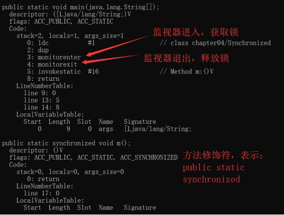 

*Java11分析情况：*

通过下面的分析可以看出Java11编译器做了不少改动，对Synchronized比较大的改动是对Synchronized代码块做了异常的逻辑处理，可以看出有两个monitorexit：

（1）针对如果代码块抛出异常则会通过第二个monitorexit释放对象锁

（2）如果没有抛出异常，则会通过go 15跳动到invokestatic Method m:()V执行方法m()

```
{
  public com.newland.demo02.sync.Synchronized();
    descriptor: ()V
    flags: (0x0001) ACC_PUBLIC
    Code:
      stack=1, locals=1, args_size=1
         0: aload_0
         1: invokespecial #1                  // Method java/lang/Object."<init>":()V
         4: return
      LineNumberTable:
        line 12: 0
      LocalVariableTable:
        Start  Length  Slot  Name   Signature
            0       5     0  this   Lcom/newland/demo02/sync/Synchronized;

  public static void main(java.lang.String[]);
    descriptor: ([Ljava/lang/String;)V
    flags: (0x0009) ACC_PUBLIC, ACC_STATIC
    Code:
      stack=2, locals=3, args_size=1
         0: ldc           #2                  // class com/newland/demo02/sync/Synchronized
         2: dup
         3: astore_1
         4: monitorenter  //进入同步代码块加锁指令
         5: aload_1
         6: monitorexit  //正常执行代码块释放锁指令
         7: goto          15   //代码块正常执行释放锁之后会通过goto 15跳到15行指令处继续执行
        10: astore_2
        11: aload_1
        12: monitorexit  //代码异常代码块释放锁的保证指令
        13: aload_2
        14: athrow
        15: invokestatic  #3                  // Method m:()V
        18: return
      Exception table:
         from    to  target type
             5     7    10   any
            10    13    10   any
      LineNumberTable:
        line 15: 0
        line 17: 5
        line 19: 15
        line 20: 18
      LocalVariableTable:
        Start  Length  Slot  Name   Signature
            0      19     0  args   [Ljava/lang/String;
      StackMapTable: number_of_entries = 2
        frame_type = 255 /* full_frame */
          offset_delta = 10
          locals = [ class "[Ljava/lang/String;", class java/lang/Object ]
          stack = [ class java/lang/Throwable ]
        frame_type = 250 /* chop */
          offset_delta = 4

  public static synchronized void m();
    descriptor: ()V
    flags: (0x0029) ACC_PUBLIC, ACC_STATIC, ACC_SYNCHRONIZED //同步方法与代码块的区别：通过ACC_SYNCHRONIZED falg标志锁
    Code:
      stack=0, locals=0, args_size=0
         0: return
      LineNumberTable:
        line 23: 0
}
```

对于同步块的实现使用了monitorenter和monitorexit指令，而同步方法则是依靠方法修饰符上的ACC_SYNCHRONIZED来完成的。

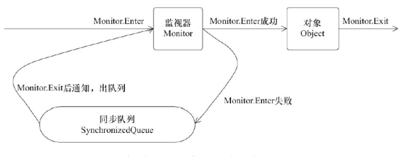 

# 三、Java对象头

synchronized用的锁是存在Java对象头里的。

如果对象是数组类型，则虚拟机用3个字宽（Word）存储对象头，如果对象是非数组类型，则用2字宽存储对象头。在32位虚拟机中，1字宽等于4字节，即32bit

| 长度     | 内容                   | 说明                             |
| -------- | ---------------------- | -------------------------------- |
| 32/64bit | Mark Word              | 存储对象的hashcode或锁信息等     |
| 32/64bit | Class Metadata Address | 存储对象类型数据的指针           |
| 32/64bit | Array length           | 数组的长度（如果当前对象是数组） |

32位虚拟机最大寻址空间4g（2的32次方）

空对象大小计算：

- 32位虚拟机：_mark:markOop(用来存储hashcode、锁、对象分代年龄等)+_klass:klassOop(存储对象类型指针)+_length(如果是数据则数组长度)
  即：普通空对象=4字节+4字节=8字节，数组空对象=4字节+4字节+4字节=12字节，因为Java内存分配最小单位8字节，所以数组空对象=16字节
- 64位虚拟机：
  开启压缩指针情况下：普通空对象=8字节+8字节=16字节   数组空对象=8字节+8字节+4字节=20字节=>24字节
  未开启情况下：普通空对象=8字节+4字节=12字节=>16字节   数组空对象=8字节+4字节+4字节=16字节

## 3.1 Java对象头长度

Java对象头里的Mark Word里默认存储对象的HashCode、分代年龄和锁标记位。

Java对象头存储结构(32位JVM Mark Word)

| 锁状态   | 25bit          | 4bit         | 1bit是否是偏向锁 | 2bit锁标志位 |
| -------- | -------------- | ------------ | ---------------- | ------------ |
| 无锁状态 | 对象的hashcode | 对象分代年龄 | 0                | 01           |

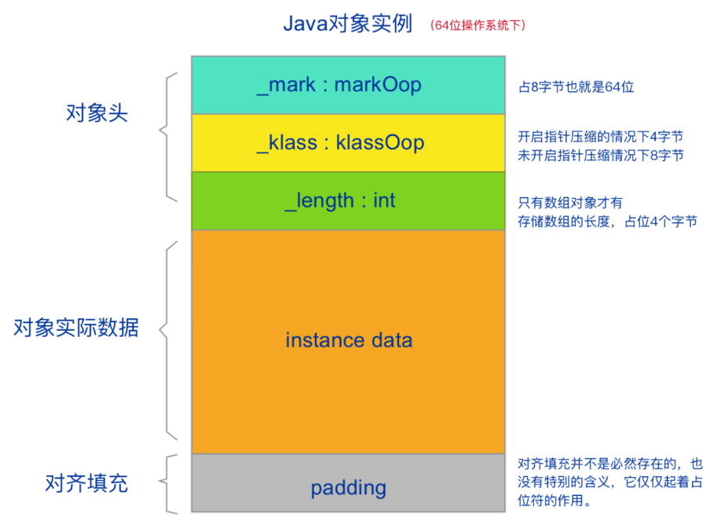

32位JVM Mark Word变化情况：

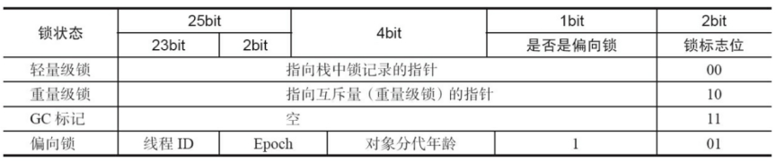

64位JVM Mark Word变化情况：

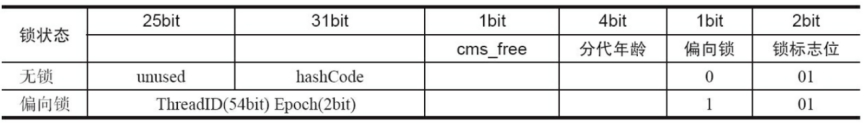

# 四、Java锁状态

锁一共有4种状态，级别从低到高依次是：无锁状态、偏向锁状态、轻量级锁状态和重量级锁状态，这几个状态会随着竞争情况逐渐升级。**锁可以升级但不能降级**，意味着偏向锁升级成轻量级锁后不能降级成偏向锁。**这种锁升级却不能降级的策略，目的是为了提高获得锁和释放锁的效率。**

## 4.1 偏向锁

（1）当一个线程访问同步块并获取锁时，会在对象头和栈帧中的锁记录里存储锁偏向的线程ID，以后该线程在进入和退出同步块时不需要进行CAS操作来加锁和解锁，只需简单地测试一下对象头的Mark Word里是否存储着指向当前线程的偏向锁。

（2）如果测试成功，表示线程已经获得了锁。如果测试失败，则需要再测试一下Mark Word中偏向锁的标识是否设置成1（表示当前是偏向锁）：如果没有设置，则使用CAS竞争锁；如果设置了，则尝试使用CAS将对象头的偏向锁指向当前线程。

（3）对于偏向锁撤销，偏向锁使用了一种等到竞争出现才释放锁的机制，所以当其他线程尝试竞争偏向锁时，持有偏向锁的线程才会释放锁。偏向锁的撤销，需要等待全局安全点（在这个时间点上没有正在执行的字节码）。
它会首先暂停拥有偏向锁的线程，然后检查持有偏向锁的线程是否活着
如果线程不处于活动状态，则将对象头设置成无锁状态；
如果线程仍然活着，拥有偏向锁的栈会被执行，遍历偏向对象的锁记录，栈中的锁记录和对象头的Mark Word要么重新偏向于其他线程，要么恢复到无锁或者标记对象不适合作为偏向锁，最后唤醒暂停的线程。

偏向锁在Java 6和Java 7里是默认启用的，但是它在应用程序启动几秒钟之后才激活，如有必要可以使用JVM参数来关闭延迟：-XX:BiasedLockingStartupDelay=0。如果你确定应用程序里所有的锁通常情况下处于竞争状态，可以通过JVM参数关闭偏向锁：-XX: -UseBiasedLocking=false，那么程序默认会进入轻量级锁状态。

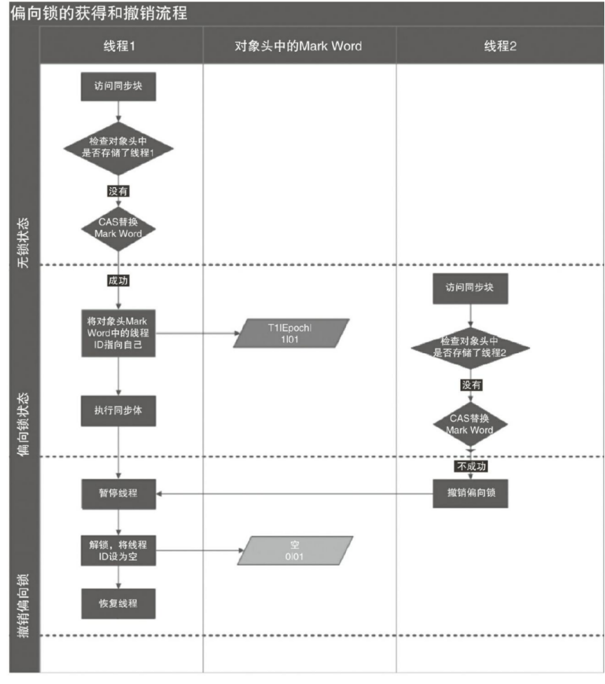 

## 4.2轻量级锁

（1）轻量级锁加锁

线程在执行同步块之前，JVM会先在当前线程的栈桢中创建用于存储锁记录的空间，并将对象头中的Mark Word复制到锁记录中，官方称为Displaced Mark Word。然后线程尝试使用CAS将对象头中的Mark Word替换为指向锁记录的指针。如果成功，当前线程获得锁，如果失败，表示其他线程竞争锁，当前线程便尝试使用自旋来获取锁。

（2）轻量级锁解锁

轻量级解锁时，会使用原子的CAS操作将Displaced Mark Word替换回到对象头，如果成功，则表示没有竞争发生。如果失败，表示当前锁存在竞争，锁就会膨胀成重量级锁。下图是两个线程同时争夺锁，导致锁膨胀的流程图。

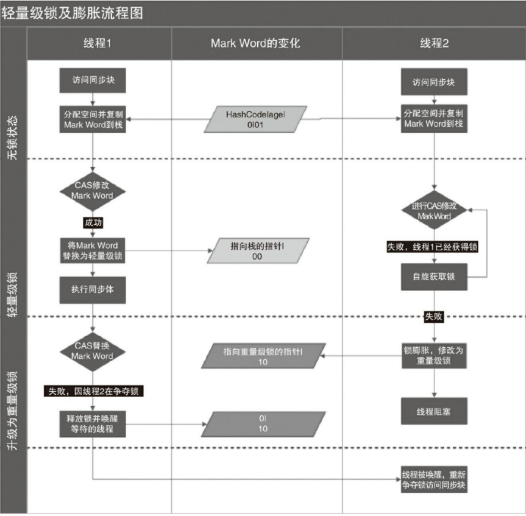 

## 4.3锁的优缺点对比

| 锁       | 优点                                                         | 缺点                                           | 适用场景                         |
| -------- | ------------------------------------------------------------ | ---------------------------------------------- | -------------------------------- |
| 偏向锁   | 加索和解锁不要额外的消耗，和执行非同步方法相比仅存在的纳秒级的差距 | 如果线程间存在锁竞争，会带来额外的锁撤销的消耗 | 适用于只有一个线程访问同步块场景 |
| 轻量级锁 | 竞争的线程不会阻塞，提高了程序的响应速度                     | 如果始终得不到锁竞争的线程，使用自旋会消耗CPU  | 追求响应时间同步块执行速度非常快 |
| 重量级锁 | 线程竞争不适用自旋，不会消耗CPU                              | 线程阻塞，响应时间缓慢                         | 追求吞吐量，同步快执行速度较长   |

双重检查锁定

```java
public class DoubleCheckedLocking { //1
    private static Instance instance; //2
    public static Instance getInstance() { //3
        if (instance == null) { //4:第一次检查
            synchronized (DoubleCheckedLocking.class) { //5:加锁
                if (instance == null) //6:第二次检查
                    instance = new Instance(); //7:问题的根源出在这里
            } //8
        } //9
        return instance; //10
    } //11
    static class Instance {
    }
}
```

相信现在还有不少人，在用这种单例获取方式。

在4操作过后再进行5加锁操作，这样可以降低**synchronized** 带来的性能消耗，然后进行6第二次检查操作，最后再进行7实例化单例对象。

双重检查锁定看起来似乎很完美，但这是一个错误的优化！在线程执行到第4行，代码读取到instance不为null时，instance引用的对象有可能还没有完成初始化。

分析原因：

```java
memory = allocate();　　// 1：分配对象的内存空间
ctorInstance(memory);　 // 2：初始化对象
instance = memory;　　 // 3：设置instance指向刚分配的内存地址
```

根据《The Java Language Specification,Java SE 7 Edition》（后文简称为Java语言规范），所有线程在执行Java程序时必须要遵守intra-thread semantics。intra-thread semantics保证重排序不会改变单线程内的程序执行结果。换句话说，intra-thread semantics允许那些在单线程内，不会改变单线程程序执行结果的重排序。上面3行伪代码的2和3之间虽然被重排序了，但这个重排序并不会违反intra-thread semantics。这个重排序在没有改变单线程程序执行结果的前提下，可以提高程序的执行性能。

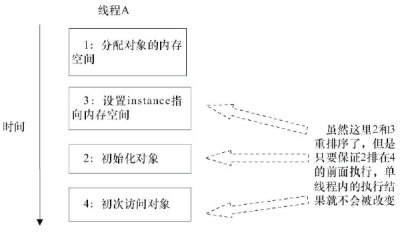 

# 五、锁的释放-获取建立的happens-before关系

```java
class MonitorExample {
    int a = 0;
    public synchronized void writer() { //1
        a++; //2
    } //3
    public synchronized void reader() { //4
        int i = a; //5
        //……
    } //6
}
```

假设线程A执行writer()方法，随后线程B执行reader()方法。则：

1）根据程序次序规则，1 happens-before 2,2 happens-before 3;4 happens-before 5,5 happensbefore 6。

2）根据监视器锁规则，3 happens-before 4。

3）根据happens-before的传递性，2 happens-before 5。

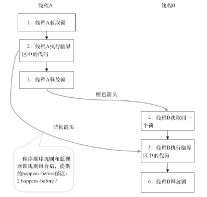 

当线程释放锁时，JMM会把该线程对应的本地内存中的共享变量刷新到主内存中。

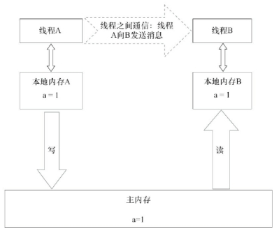 

对比锁释放-获取的内存语义与volatile写-读的内存语义可以看出：锁释放与volatile写有相同的内存语义；锁获取与volatile读有相同的内存语义。

总结：

线程A释放一个锁，实质上是线程A向接下来将要获取这个锁的某个线程发出了（线程A对共享变量所做修改的）消息。

线程B获取一个锁，实质上是线程B接收了之前某个线程发出的（在释放这个锁之前对共享变量所做修改的）消息。

线程A释放锁，随后线程B获取这个锁，这个过程实质上是线程A通过主内存向线程B发送消息。

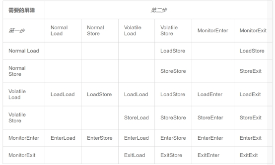 

# 六、重点

## 6.1 特点

- 可重入：可重入的原理，就和前面提到的 monitor 计数器类似。对象本身有一把锁， JVM 会跟踪对象被加锁的次数：避免死锁、提升封装性 
- 粒度是线程而不是调用
- 不可中断 
- 效率低 
  锁的释放情况少 
  试图获得锁时不能设定超时时间 
  不能中断一个正在试图获得锁的线程 
- 不够灵活 
  加锁和释放锁的时机单一 
  每个锁仅有单一的条件(某个对象)，可能不够 
  无法知道是否成功获取到锁

 

参阅书籍:
《Java并发编程艺术》
《Java多线程设计模式》