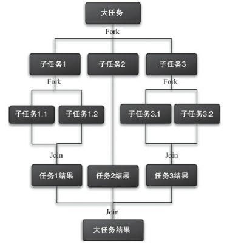

### 1 阻塞队列说明

一个支持两个附加操作的队列。这两个附加的操作支持阻塞的插入和移除方法。

1）支持阻塞的插入方法：当队列满时，队列会阻塞插入元素的线程，直到队列不满。

2）支持阻塞的移除方法：在队列为空时，获取元素的线程会等待队列变为非空。

阻塞队列常用于生产者和消费者的场景，生产者是向队列里添加元素的线程，消费者是从队列里取元素的线程。阻塞队列就是生产者用来存放元素、消费者用来获取元素的容器。

| 方法/处理方式 | 抛出异常 | 返回特殊值 | 一直阻塞 | 超时退出           |
| ------------- | -------- | ---------- | -------- | ------------------ |
| 插入          | add      | offer      | put      | offer(e,time,unit) |
| 移除          | remove   | poll       | take     | poll(time,unit)    |
| 检查          | element  | peek       | 不可用   | 不可用             |

### 2 常见阻塞队列

ArrayBlockingQueue ：一个由数组结构组成的有界阻塞队列。 

LinkedBlockingQueue ：一个由链表结构组成的有界阻塞队列。 

PriorityBlockingQueue ：一个支持优先级排序的无界阻塞队列。 

DelayQueue：一个使用优先级队列实现的无界阻塞队列。 队列使用PriorityQueue来实现。

SynchronousQueue：一个不存储元素的阻塞队列。 

LinkedTransferQueue：一个由链表结构组成的无界阻塞队列。 

LinkedBlockingDeque：一个由链表结构组成的双向阻塞队列。

### 3 源码说明

ArrayBlockingQueue 此队列按照先进先出（FIFO）的原则对元素进行排序。

```java
//不为空的通知
private final Condition notEmpty;
//不为full(队列塞满)的通知
private final Condition notFull;
    public ArrayBlockingQueue(int capacity, boolean fair) {
        notEmpty = lock.newCondition();
        notFull =  lock.newCondition();
}
//阻塞方式插入队列
    public void put(E e) throws InterruptedException {
        checkNotNull(e);
        final ReentrantLock lock = this.lock;
        lock.lockInterruptibly();
        try {
//当队列满员时，将等待入队，等待消费item
            while (count == items.length)
                notFull.await();
            enqueue(e);
        } finally {
            lock.unlock();
        }
}
    private void enqueue(E x) {
        final Object[] items = this.items;
        items[putIndex] = x;
        if (++putIndex == items.length)
            putIndex = 0;
        count++;
//当队列中插入item后，通知消费者继续获取item进行消费
        notEmpty.signal();
    }
//阻塞方式获取元素
    public E take() throws InterruptedException {
        final ReentrantLock lock = this.lock;
        lock.lockInterruptibly();
        try {
//当队列中没有元素时，等待生产者插入item元素
            while (count == 0)
                notEmpty.await();
            return dequeue();
        } finally {
            lock.unlock();
        }
    }
    private E dequeue() {
        final Object[] items = this.items;
        @SuppressWarnings("unchecked")
        E x = (E) items[takeIndex];
        items[takeIndex] = null;
        if (++takeIndex == items.length)
            takeIndex = 0;
        count--;
        if (itrs != null)
            itrs.elementDequeued();
//当队列中item出队时，通知生产者队列有空闲位置，可以继续插入元素
        notFull.signal();
        return x;
    }
```

通过源码，可以看出ArrayBlockQueue时通过Lock锁进行控制的一个并发容器。

### 4 Fork/Join框架

一个用于并行执行任务的框架，是一个把大任务分割成若干个小任务，最终汇总每个小任务结果后得到大任务结果的框架。

 

工作窃取（work-stealing）算法是指某个线程从其他队列里窃取任务来执行。

为了减少线程间的竞争，把这些子任务分别放到不同的队列里，并为每个队列创建一个单独的线程来执行队列里的任务，线程和队列一一对应。比如A线程负责处理A队列里的任务。但是，有的线程会先把自己队列里的任务干完，而其他线程对应的队列里还有任务等待处理。干完活的线程与其等着，不如去帮其他线程干活，于是它就去其他线程的队列里窃取一个任务来执行。而在这时它们会访问同一个队列，所以为了减少窃取任务线程和被

窃取任务线程之间的竞争，通常会使用双端队列，被窃取任务线程永远从双端队列的头部拿任务执行，而窃取任务的线程永远从双端队列的尾部拿任务执行。

 

**工作窃取算法的优点**：充分利用线程进行并行计算，减少了线程间的竞争。

**工作窃取算法的缺点：**在某些情况下还是存在竞争，比如双端队列里只有一个任务时。并且该算法会消耗了更多的系统资源，比如创建多个线程和多个双端队列。

#### **Fork/Join 步驟**

步骤1　分割任务。

步骤2　执行任务并合并结果。

Fork/Join執行

①ForkJoinTask任務創建

RecursiveAction：用于没有返回结果的任务。

RecursiveTask：用于有返回结果的任务。

②ForkJoinPool：ForkJoinTask需要通过ForkJoinPool来执行。

 

ForkJoinTask提供了isCompletedAbnormally()方法来检查任务是否已经抛出异常或已经被取消了，并且可以通过ForkJoinTask的getException方法获取异常。

```java
if(task.isCompletedAbnormally()){
	System.out.println(task.getException());
}
```

getException方法返回Throwable对象，如果任务被取消了则返回CancellationException。如果任务没有完成或者没有抛出异常则返回null。

ForkJoinPool由ForkJoinTask数组和ForkJoinWorkerThread数组组成，ForkJoinTask数组负责将存放程序提交给ForkJoinPool的任务，而ForkJoinWorkerThread数组负责执行这些任务

任务状态有4种：已完成（NORMAL）、被取消（CANCELLED）、信号（SIGNAL）和出现异常（EXCEPTIONAL）。

#### forkjoin两种任务分配方式

**RecursiveTask**

```java
public class CountTask extends RecursiveTask<Integer> {
 
    private static final int THRESHOLD = 2; // 阈值
    private int              start;
    private int              end;
 
    public CountTask(int start, int end) {
        this.start = start;
        this.end = end;
    }
 
    @Override
    protected Integer compute() {
        int sum = 0;
 
        // 如果任务足够小就计算任务
        boolean canCompute = (end - start) <= THRESHOLD;
        if (canCompute) {
            for (int i = start; i <= end; i++) {
                sum += i;
            }
        } else {
            // 如果任务大于阈值，就分裂成两个子任务计算
            int middle = (start + end) / 2;
            CountTask leftTask = new CountTask(start, middle);
            CountTask rightTask = new CountTask(middle + 1, end);
            //执行子任务
            leftTask.fork();
            rightTask.fork();
            //等待子任务执行完，并得到其结果
            int leftResult = leftTask.join();
            int rightResult = rightTask.join();
            //合并子任务
            sum = leftResult + rightResult;
        }
        return sum;
    }
 
    public static void main(String[] args) {
        ForkJoinPool forkJoinPool = new ForkJoinPool();
        // 生成一个计算任务，负责计算1+2+3+4
        CountTask task = new CountTask(1, 100);
        // 执行一个任务
        Future<Integer> result = forkJoinPool.submit(task);
        try {
            System.out.println(result.get());
        } catch (InterruptedException e) {
        } catch (ExecutionException e) {
        }
    }
 
}
```

**RecursiveAction**

```java
public class CountAction extends RecursiveAction {
	private static final int THRESHOLD = 2; // 阈值
	private int start;
	private int end;
	private static AtomicInteger atomicInteger=new AtomicInteger();
	public CountAction(int start, int end) {
		this.start = start;
		this.end = end;
	}
	@Override
	protected void compute() {
		int sum = 0;
		// 如果任务足够小就计算任务
		boolean canCompute = (end - start) <= THRESHOLD;
		if (canCompute) {
			for (int i = start; i <= end; i++) {
				sum += i;
			}
			atomicInteger.addAndGet(sum);
		} else {
			// 如果任务大于阈值，就分裂成两个子任务计算
			int middle = (start + end) / 2;
			CountAction leftAction = new CountAction(start, middle);
			CountAction rightAction = new CountAction(middle + 1, end);
			// 执行子任务
			leftAction.fork();
			rightAction.fork();
		}
	}
	public static void main(String[] args) {
		ForkJoinPool forkJoinPool = new ForkJoinPool();
		// 生成一个计算任务，负责计算1+2+3+4
		CountAction action = new CountAction(1, 100);
		// 执行一个任务
		forkJoinPool.execute(action);
		forkJoinPool.awaitQuiescence(50, TimeUnit.HOURS);
		System.out.println(action.atomicInteger);
	}
}
```

